***

# Gene expression and network analysis


## Import files


```r
exdata <- read.delim("C:/Users/bre227/Dropbox/eQTL/Data/AIBL_expression_set/AIBL_Gene_Expression.txt", sep = "", header = T)
dim(exdata)
```

```
## [1] 22011   218
```

```r
metadata <- read.delim("~/R/AD_project/Data/Expression/aibl-ids-6.0.0-201712010300.txt", sep = "\t", header = T)
dim(metadata)
```

```
## [1] 6863 1174
```

```r
ids2 <- read.delim("C:/Users/bre227/Dropbox/eQTL/Data/AIBL_expression_set/AIBL_Gene_Expression_IDs_UpdtdDec2017.txt", sep = " ")
colnames(exdata) <- as.vector(ids2$x) # replace colnames with ids2

# filter for those in ids2
metadata2 <- metadata[(metadata$AIBL.Id %in% ids2$x) & (metadata$Collection == "1"), ]
dim(metadata2)
```

```
## [1]  218 1174
```

***

## Tidy and combine data

Add age column


```r
metadata2$Age <- as.numeric((as.Date(metadata2$Progress.Summary.Date.of.NP.assessment,format=c("%d/%m/%Y")))-(as.Date(paste("15",substr(metadata2$Demographic.YearMonthOfBirth,start=5,stop=6),substr(metadata2$Demographic.YearMonthOfBirth,start=1,stop=4),sep="/"),format = c("%d/%m/%Y"))))/365.25
summary(metadata2$Age)
```

```
##    Min. 1st Qu.  Median    Mean 3rd Qu.    Max. 
##   55.15   65.86   72.34   72.44   78.54   91.79
```

Histogram of age


```r
hist(metadata2$Age)
```

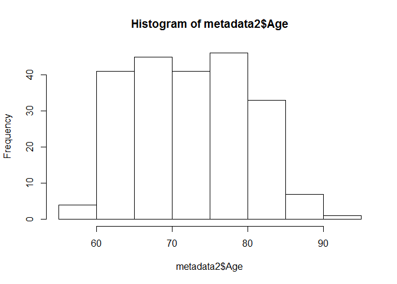<!-- -->

Add *apoe4* column


```r
unique(metadata2$Demographic.ApoE.genotype)
```

```
## [1] E3/E3 E4/E3 E4/E2 E3/E2 E4/E4 E2/E2
## Levels:  E2/E2 E3/E2 E3/E3 E4/E2 E4/E3 E4/E4
```

```r
metadata2$apoe4 <- as.factor(ifelse(metadata2$Demographic.ApoE.genotype=="E2/E2"|metadata2$Demographic.ApoE.genotype=="E3/E2"|metadata2$Demographic.ApoE.genotype=="E3/E3",0,ifelse(metadata2$Demographic.ApoE.genotype=="E4/E2"|metadata2$Demographic.ApoE.genotype=="E4/E3"|metadata2$Demographic.ApoE.genotype=="E4/E4",1,NA)))
metadata2 %>% 
  group_by(apoe4) %>% 
  summarise(no_rows = length(apoe4))
```

```
## # A tibble: 2 x 2
##   apoe4 no_rows
##   <fct>   <int>
## 1 0         115
## 2 1         103
```

Create binary PET status


```r
metadata2$PET <- as.factor(ifelse(metadata2$Image.PET.Amyloid.PIB_NAV.Status == "Positive" | metadata2$Image.PET.Amyloid.Florbetapir.Status== "Positive" | metadata2$Image.PET.Amyloid.Flutemetamol.Status == "Positive", "POS", ifelse(metadata2$Image.PET.Amyloid.PIB_NAV.Status == "Negative" | metadata2$Image.PET.Amyloid.Florbetapir.Status== "Negative" | metadata2$Image.PET.Amyloid.Flutemetamol.Status == "Negative", "NEG",NA)))
metadata2 %>% 
  group_by(PET) %>% 
  summarise(no_rows = length(PET))
```

```
## # A tibble: 3 x 2
##   PET   no_rows
##   <fct>   <int>
## 1 NEG        94
## 2 POS       102
## 3 <NA>       22
```

Extract metadata for columns of interest


```r
meta2 <- dplyr::select(metadata2, 
                AIBL.Id,
                Demographic.Sex,
                PET,
                apoe4,
                Age)
write.table(meta2, "C:/Users/bre227/Documents/R/AD_project/Working/key_metadata.txt", col.names = T, row.names = F, quote = F, sep = "\t")
```

***

## Create initial exploratory plots

Plot for whole dataset

```r
exdata1 <- as_tibble(exdata)
exdata1 <- as_tibble(t(exdata1)) # transpose to put samples in rows, genes in columns
colnames(exdata1) <- rownames(exdata) # add genes names
exdata1$AIBL.Id <- as.integer(colnames(exdata)) # add 'AIBL.Id' column
exdata2 <- left_join(meta2, exdata1, by = "AIBL.Id") %>% 
  na.omit # add metadata and remove PET and apoe4 columns with 'NA'
rownames(exdata2) <- exdata2$AIBL.Id # to ensure the labels in the plots reflect the AIBL.Ids
dim(exdata2)
```

```
## [1]   196 22016
```

Run PCA

```r
pca <- prcomp(exdata2[6:22016], center = T, scale. = T) # run PCA
# plot scree for PCA
library(factoextra)
fviz_eig(pca)
```

<!-- -->

PCA scatterplot for PET status 

```r
library(ggfortify)
autoplot(pca, data = exdata2, colour = "PET", label = T) +
  viridis::scale_colour_viridis(option = "viridis", discrete = T)
```

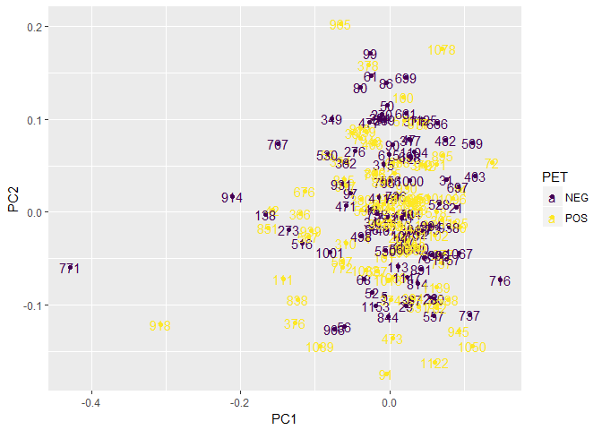<!-- -->

PET scatterplot for *apoe4* status

```r
library(ggfortify)
autoplot(pca, data = exdata2, colour = "apoe4", label = T)
```

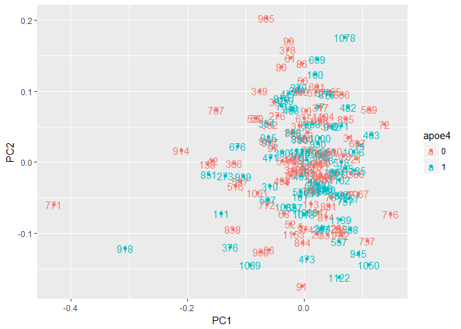<!-- -->


```r
qqnorm(pca$x[,2], pch = 20)
```

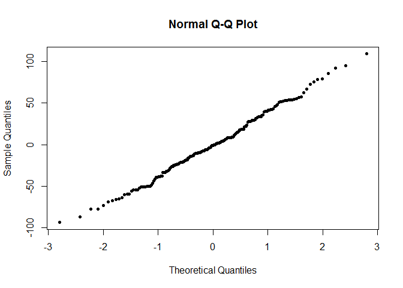<!-- -->

Exclude outliers and run PCA again


```r
exdata3 <- filter(exdata2, AIBL.Id != "771" & AIBL.Id != "914" & AIBL.Id != "918")
```

Run PCA

```r
pca2 <- prcomp(exdata3[6:22016], center = T, scale. = T) # run PCA
library(factoextra)
fviz_eig(pca2)
```

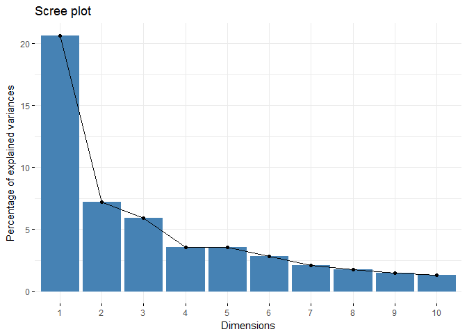<!-- -->

Plot without outliers (PET)


```r
library(ggfortify)
autoplot(pca2, data = exdata3, colour = "PET", label = T, label.label = "AIBL.Id") +
  viridis::scale_colour_viridis(option = "viridis", discrete = T)
```

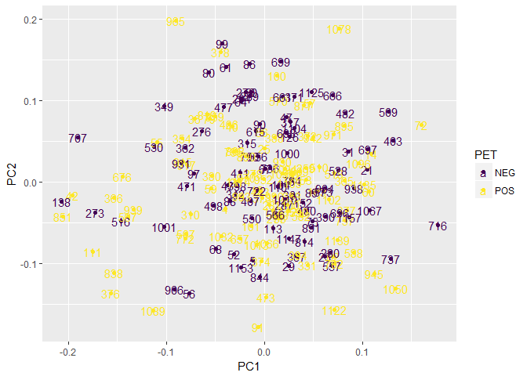<!-- -->

Plot without outliers (*apoe4*)


```r
library(ggfortify)
autoplot(pca2, data = exdata3, colour = "apoe4", label = T, label.label = "AIBL.Id")
```

<!-- -->

***

## Use `limma` to analyse expression data.

We first create an 'ExpressionSet' with genes on rows, and samples on columns, following the guide here: <https://www.bioconductor.org/packages/3.7/bioc/vignettes/Biobase/inst/doc/ExpressionSetIntroduction.pdf>


```r
library(Biobase)
```


```r
exprs <- as.matrix(t(exdata3[,6:22016])) # leaving behind the first 5 metadata columns
minimalSet <- ExpressionSet(assayData = exprs)
pData <- exdata3[,1:5]
summary(pData)
```

```
##     AIBL.Id       Demographic.Sex  PET      apoe4        Age       
##  Min.   :   4.0   Female:96       NEG: 92   0:105   Min.   :55.15  
##  1st Qu.: 110.0   Male  :97       POS:101   1: 88   1st Qu.:67.15  
##  Median : 480.0                                     Median :72.71  
##  Mean   : 506.2                                     Mean   :72.86  
##  3rd Qu.: 819.0                                     3rd Qu.:78.90  
##  Max.   :1174.0                                     Max.   :91.79
```


```r
library(limma)
```


```r
PET_apoe4 <- paste(pData$PET, pData$apoe4, sep = ".") # put PET/apoe4 combinations into a vector

PET_apoe4 <- factor(PET_apoe4, levels = c(unique(PET_apoe4))) # turn it into a factor
design <- model.matrix(~0 + PET_apoe4) # create factor table for four combinations
colnames(design) <- levels(PET_apoe4)
fit <- lmFit(exprs, design)
```

Set four pair-wise contrasts of interest and compute the contrasts and moderated t-tests.


```r
cont.matrix <- makeContrasts(apoe4_for_PET_yes = POS.1 - POS.0,
                             apoe4_for_PET_no = NEG.1 - NEG.0,
                             PET_for_apoe4_yes = POS.1 - NEG.1,
                             PET_for_apoe4_no = POS.0 - NEG.0,
                             levels = design)
fit2 <- contrasts.fit(fit, cont.matrix)
fit2 <- eBayes(fit2)
```

Get the genes differentially expressed in each comparison


```r
res1 <- topTable(fit2, coef = "apoe4_for_PET_yes", n = Inf)
res2 <- topTable(fit2, coef = "apoe4_for_PET_no", n = Inf)
res3 <- topTable(fit2, coef = "PET_for_apoe4_yes", n = Inf)
res4 <- topTable(fit2, coef = "PET_for_apoe4_no", n = Inf)

length(which(res1$P.Value < 0.05))
```

```
## [1] 653
```

```r
length(which(res2$P.Value < 0.05))
```

```
## [1] 684
```

```r
length(which(res3$P.Value < 0.05))
```

```
## [1] 924
```

```r
length(which(res4$P.Value < 0.05))
```

```
## [1] 769
```

Probe IDs are set in the 'res' data frames as rownames. Create separate column for rownames. Need to do it now, because when `filter()` is applied below, it removes the rownames.


```r
for (i in ls(pattern = "res")){
  x <- get(i)
  x$probe_id <- rownames(x)
  assign(i, x)
}
```

Get list of genes that show significantly different expression between contrasts

```r
signif_apoe4_for_PET_yes <- filter(res1, P.Value < 0.05)
signif_apoe4_for_PET_no <- filter(res2, P.Value < 0.05)
signif_PET_for_apoe4_yes <- filter(res3, P.Value < 0.05)
signif_PET_for_apoe4_no <- filter(res4, P.Value < 0.05)

rm(list = ls(pattern = "res")) # remove results to clear working memory
```

## Get gene identifiers for microarray probes and identify significant genes.

*Using JD's code from 'AIBL_Gene_Expression_SetUp_Dec82017.R'*


```r
library(pd.huex.1.0.st.v2)
library(huex10sttranscriptcluster.db)
  
### pull gene symbols and match to probe ids to replace rownames ###
x <- huex10sttranscriptclusterSYMBOL
# Get the probe identifiers that are mapped to a gene symbol
mapped_probes <- mappedkeys(x)
# Convert to a list
xx <- as.list(x[mapped_probes])
if(length(xx) > 0) {
# Get the SYMBOL for the first five probes
xx[1:5]
# Get the first one
xx[[1]]
}
```

```
## [1] "LOC102723600"
```

```r
xx1 <- as.matrix(unlist(xx))

# Get table of probes
gns <- rownames(exdata)
gnsl <- xx1[rownames(xx1) %in% gns]
length(gnsl)
```

```
## [1] 14825
```

```r
### Find ENSEMBL IDs ###
x3 <- huex10sttranscriptclusterENSEMBL
# Get the entrez gene IDs that are mapped to an Ensembl ID
mapped_genes <- mappedkeys(x3)
# Convert to a list
xx3 <- as.list(x3[mapped_genes])

xx3.1 <- as.matrix(unlist(xx3))
ens <- xx3.1[rownames(xx3.1) %in% gns]
length(ens)
```

```
## [1] 13991
```

```r
#[1] 14497

### Find Entrez IDs ###
x4 <- huex10sttranscriptclusterENTREZID
# Get the probe identifiers that are mapped to an ENTREZ Gene ID
mapped_probes <- mappedkeys(x4)
# Convert to a list
xx4 <- as.list(x4[mapped_probes])

xx4.1 <- as.matrix(unlist(xx4))
entz <- xx4.1[rownames(xx4.1) %in% gns]
length(entz)
```

```
## [1] 14825
```

## Match probes, gene symbols, Ensembl IDs, and Entrez IDs with the list of statistically significant genes.

Create data frame of all probe matches with identifiers


```r
pid_symb <- data.frame(xx1)
pid_symb$probe_id <- rownames(pid_symb)

pid_ens <- data.frame(xx3.1)
pid_ens$probe_id <- rownames(pid_ens)

pid_ent <- data.frame(xx4.1)
pid_ent$probe_id <- rownames(pid_ent)

pid_all <- dplyr::left_join(pid_symb, pid_ent, by = "probe_id") %>% 
  dplyr::left_join(y = pid_ens, by = "probe_id") %>% 
  dplyr::rename(gene_symbol = "xx1",
                entrez_id = "xx4.1",
                ensembl_id = "xx3.1") %>% 
  dplyr::select(probe_id, everything())

write.table(pid_all, "C:/Users/bre227/Documents/R/AD_project/Working/affy_probes_annotated.txt", row.names = F, col.names = T, quote = F, sep = "\t")

# find how many probes are annotated
length(which(pid_all$probe_id %in% rownames(exdata)))
```

```
## [1] 14825
```

Combine lists of significant genes for each contrast. Note that combined counts of significant genes for all four contrasts is 3030.


```r
signif_all <- full_join(signif_apoe4_for_PET_yes, signif_apoe4_for_PET_no, by = "probe_id") %>%
  full_join(signif_PET_for_apoe4_no, by = "probe_id") %>% 
  full_join(signif_apoe4_for_PET_yes, by = "probe_id")

signif_all <- dplyr::select(signif_apoe4_for_PET_yes, probe_id, P.Value) %>% 
  full_join(dplyr::select(signif_apoe4_for_PET_no, probe_id, P.Value), by = "probe_id") %>% 
  full_join(dplyr::select(signif_PET_for_apoe4_yes, probe_id, P.Value), by = "probe_id") %>% 
  full_join(dplyr::select(signif_PET_for_apoe4_no, probe_id, P.Value), by = "probe_id") %>% 
  dplyr::rename(P.Value.c1 = "P.Value.x", 
         P.Value.c2 = "P.Value.y", 
         P.Value.c3 = "P.Value.x.x", 
         P.Value.c4 = "P.Value.y.y")

nrow(signif_all)
```

```
## [1] 2438
```
Therefore 2438 genes are expressed differentially across at least two contrasts


Bind gene ids to 'signif_all'


```r
sig_all2 <- left_join(signif_all, pid_all, by = "probe_id")
```
There are many NAs in the 'gene_symbol' column, even though there are 34,127 unique probe_ids in 'pid_symb' - one would think they would all be accounted for.


```r
length(setdiff(signif_all$probe_id, pid_all$probe_id))
```

```
## [1] 1000
```
Shows that there are 1000 probe ids in 'signif_all' that are not in 'pid_all', i.e. they do not have any annotation data.

Confirmed by:

```r
length(which(signif_all$probe_id %in% pid_all$probe_id == "TRUE"))
```

```
## [1] 1438
```

So are all probe_ids in the expression data in 'pid_symb'?


```r
length(setdiff(rownames(exdata), pid_symb$probe_id))
```

```
## [1] 7186
```
7,186/22,011 probes are not accounted for in the annotation data?

Confirm this:


```r
length(which(rownames(exdata) %in% pid_all$probe_id == "TRUE"))
```

```
## [1] 14825
```

#### Venn diagram of overlapping genes


```r
library(VennDiagram)
grid.newpage()
venn <- draw.quad.venn(area1 = length(which(!is.na(sig_all2$P.Value.c1))),
               area2 = length(which(!is.na(sig_all2$P.Value.c2))),
               area3 = length(which(!is.na(sig_all2$P.Value.c3))),
               area4 = length(which(!is.na(sig_all2$P.Value.c4))),
               n12 = length(which(!is.na(sig_all2$P.Value.c1) & !is.na(sig_all2$P.Value.c2))),
               n13 = length(which(!is.na(sig_all2$P.Value.c1) & !is.na(sig_all2$P.Value.c3))),
               n14 = length(which(!is.na(sig_all2$P.Value.c1) & !is.na(sig_all2$P.Value.c4))),
               n23 = length(which(!is.na(sig_all2$P.Value.c2) & !is.na(sig_all2$P.Value.c3))),
               n24 = length(which(!is.na(sig_all2$P.Value.c2) & !is.na(sig_all2$P.Value.c4))),
               n34 = length(which(!is.na(sig_all2$P.Value.c3) & !is.na(sig_all2$P.Value.c4))),
               n123 = length(which(!is.na(sig_all2$P.Value.c1) & !is.na(sig_all2$P.Value.c2) & !is.na(sig_all2$P.Value.c3))),
               n124 = length(which(!is.na(sig_all2$P.Value.c1) & !is.na(sig_all2$P.Value.c2) & !is.na(sig_all2$P.Value.c4))),
               n134 = length(which(!is.na(sig_all2$P.Value.c1) & !is.na(sig_all2$P.Value.c3) & !is.na(sig_all2$P.Value.c4))),
               n234 = length(which(!is.na(sig_all2$P.Value.c2) & !is.na(sig_all2$P.Value.c3) & !is.na(sig_all2$P.Value.c4))), 
               n1234 = length(which(!is.na(sig_all2$P.Value.c1) & !is.na(sig_all2$P.Value.c2) & !is.na(sig_all2$P.Value.c3) & !is.na(sig_all2$P.Value.c4))),
               category = c("apoe4_for_PET_yes", "apoe4_for_PET_no", "PET_for_apoe4_yes", "PET_for_apoe4_no"),
               cat.pos = c(0, 0, 0, 0))
```

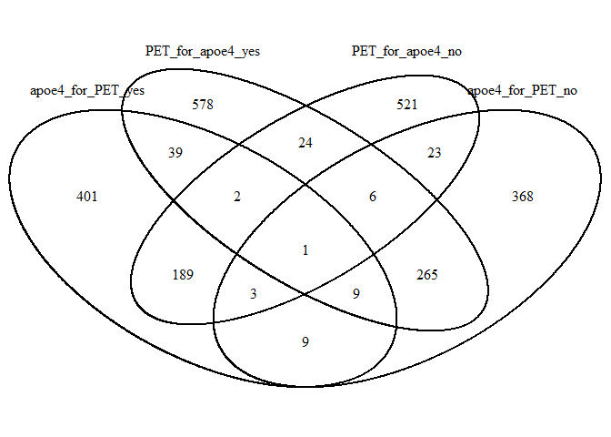<!-- -->

Many of the same genes (265) are differentially expressed between:
* PET pos/neg when they have the apoe4 allele; and
* apoe4 yes/no when they are negative for PET

These could be genes that can protect against AD.

Many of the same genes (189) are also differentially expressed between:
* PET pos/neg when they do not have the apoe4 allele; and
* apoe4 yes/no when they are positive for PET 

These latter genes must be acting independently of the apoe4 network to cause AD.

Find out how many people are in each group:


```r
test <- exdata3[,1:5]
length(which(test$PET == "POS" & test$apoe4 == "1"))
```

```
## [1] 65
```

```r
length(which(test$PET == "POS" & test$apoe4 == "0"))
```

```
## [1] 36
```

```r
length(which(test$PET == "NEG" & test$apoe4 == "1"))
```

```
## [1] 23
```

```r
length(which(test$PET == "NEG" & test$apoe4 == "0"))
```

```
## [1] 69
```

This suggests that more people tend to either have apoe4 and AD, or not have apoe4 and not have AD, than otherwise.

***

## Compare expression profiles between PET-pos and PET-neg groups

Create design matrix


```r
Group <- factor(exdata3$PET, levels = c("POS", "NEG"))
design2 <- model.matrix(~0 + Group)
colnames(design2) <- c("POS", "NEG")
```


Find differentially expressed genes

```r
fit3 <- lmFit(exprs, design2)
cont.matrix2 <- makeContrasts(POSvsNEG = POS - NEG, levels = design2)
fit4 <- contrasts.fit(fit3, cont.matrix2)
fit4 <- eBayes(fit4)
topTable(fit4, adjust = "BH")
```

```
##               logFC  AveExpr         t      P.Value adj.P.Val           B
## 2328611 -0.24349043 6.931149 -3.781354 0.0002074070 0.9997102  0.50013583
## 3997946  0.14334623 9.035701  3.648961 0.0003381087 0.9997102  0.07930919
## 2566383 -0.08138720 8.334744 -3.626837 0.0003664051 0.9997102  0.01024134
## 2694314  0.10608542 6.813847  3.553376 0.0004772006 0.9997102 -0.21648884
## 3707258  0.06258903 6.911761  3.470792 0.0006390722 0.9997102 -0.46656387
## 3957224  0.08050569 6.324961  3.469708 0.0006415049 0.9997102 -0.46981262
## 3934479  0.07847492 6.465840  3.468142 0.0006450341 0.9997102 -0.47450352
## 3819771  0.21167767 5.350143  3.463788 0.0006549411 0.9997102 -0.48753481
## 3462630 -0.07185294 3.382152 -3.439265 0.0007134666 0.9997102 -0.56067593
## 4038494  0.10130047 3.711608  3.427094 0.0007442989 0.9997102 -0.59680772
```


```r
results_PETposvneg <- topTable(fit4, n = Inf)
results_PETposvneg$probe_id <- rownames(results_PETposvneg)
signif_PET_pos_v_neg <- filter(results_PETposvneg, P.Value < 0.05)
dim(signif_PET_pos_v_neg)
```

```
## [1] 865   7
```

Now for apoe4

```r
Group <- factor(exdata3$apoe4, levels = c(0, 1))
design3 <- model.matrix(~0 + Group)
colnames(design3) <- c("NEG", "POS")
```


Find differentially expressed genes

```r
fit5 <- lmFit(exprs, design3)
cont.matrix3 <- makeContrasts(apoe4 = NEG - POS, levels = design3)
fit6 <- contrasts.fit(fit5, cont.matrix3)
fit6 <- eBayes(fit6)
topTable(fit6, adjust = "BH")
```

```
##               logFC  AveExpr         t      P.Value adj.P.Val           B
## 3360287  0.17135398 6.377782  4.107229 5.892379e-05 0.9997616  1.58861565
## 3453446  0.20354250 4.358425  3.702309 2.781176e-04 0.9997616  0.24693729
## 3275398  0.27781363 6.503623  3.643283 3.451692e-04 0.9997616  0.06124851
## 3749570  0.18071224 6.920419  3.505805 5.650003e-04 0.9997616 -0.36123353
## 3450180 -0.08479851 5.565530 -3.475845 6.278481e-04 0.9997616 -0.45142875
## 3719456  0.15291395 3.122911  3.416413 7.723809e-04 0.9997616 -0.62834664
## 3150579 -0.15573427 5.935585 -3.391778 8.409687e-04 0.9997616 -0.70089559
## 2777276  0.07471033 4.025781  3.335889 1.018232e-03 0.9997616 -0.86377471
## 2342904  0.09381612 5.328055  3.331353 1.034053e-03 0.9997616 -0.87689050
## 2432714 -0.20563079 6.724809 -3.232473 1.441337e-03 0.9997616 -1.15884979
```

```r
results_apoe4posvneg <- topTable(fit6, n = Inf)
results_apoe4posvneg$probe_id <- rownames(results_apoe4posvneg)
signif_apoe4_pos_v_neg <- filter(results_apoe4posvneg, P.Value < 0.05)
dim(signif_apoe4_pos_v_neg)
```

```
## [1] 554   7
```

Create table of all significant differentially expressed genes

```r
sig_direct_pairs <- full_join(
  dplyr::select(signif_PET_pos_v_neg, P.Value, probe_id),
  dplyr::select(signif_apoe4_pos_v_neg, P.Value, probe_id), 
  by = "probe_id") %>% 
  dplyr::select(probe_id, everything())
colnames(sig_direct_pairs)[2] <- "P.Value_PET"
colnames(sig_direct_pairs)[3] <- "P.Value_apoe4"
```


```r
library(VennDiagram)
grid.newpage()
venn2 <- draw.pairwise.venn(
  area1 = length(which(!is.na(sig_direct_pairs$P.Value_PET))),
  area2 = length(which(!is.na(sig_direct_pairs$P.Value_apoe4))),
  cross.area = length(which(!is.na(sig_direct_pairs$P.Value_PET) & !is.na(sig_direct_pairs$P.Value_apoe4))),
  category = c("PET_pos_v_neg", "apoe4_pos_v_neg"),
  ext.text = FALSE, cat.prompts = T, cat.pos = 0)
```

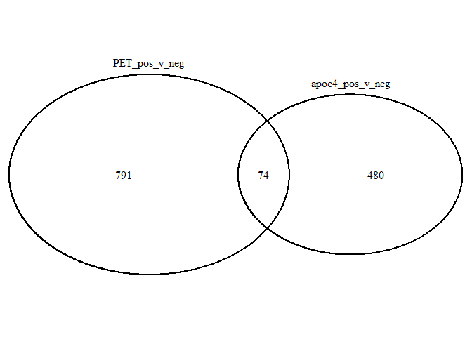<!-- -->

```
## INFO [2018-02-09 09:24:13] Placing category labels at default outer locations.  Use 'cat.pos' and 'cat.dist' to modify location.
## INFO [2018-02-09 09:24:13] Current 'cat.pos': 0 degrees, 0 degrees
## INFO [2018-02-09 09:24:13] Current 'cat.dist': 0.025 , 0.025
```

***

# SNP and eQTL analysis

Import IDs for genotyped SNPs and proxy SNPs (those in LD with the genotyped SNPs), and annotate them with gene names


```r
install.packages("tidyverse")
source("https://bioconductor.org/biocLite.R")
biocLite()
biocLite("biomaRt")
biocLite("GenomicRanges")
library(GenomicRanges)
biocLite("Homo.sapiens")
library(Homo.sapiens)
biocLite("snpStats")
install.packages("MatrixEQTL")
```

## Import files


```r
aibl_snps <- read.delim("C:/Users/bre227/Dropbox/eQTL/Data/Expanded SNP set/AIBLgene_SNP_LIST_04032015.tsv")
snap_edit <- read.delim("C:/Users/bre227/Dropbox/eQTL/Data/Expanded SNP set/snapResults_edit.txt")
snap <- read.delim("C:/Users/bre227/Dropbox/eQTL/Data/Expanded SNP set/snapResults.txt")
```

***

## Combine datasets

Note: 'snap_edit' has removed all SNPs from 'snap' that did not have proxies.


```r
# How many SNPs are there in snap_edit?
length(unique(snap_edit$SNP)) # Shows that 2084 - 1527 = 557 have been removed from aibl_snps. 
```

```
## [1] 1527
```

```r
# How many genes are there in aibl_snps?
length(unique(aibl_snps$GENE))
```

```
## [1] 298
```

```r
# How many aibl_snps don't have an associated gene?
which(aibl_snps$GENE == "")
```

```
##  [1]  116  464  511  512  668  675  788  856  877  896  897  960 1342 1409
## [15] 1612 1989
```

```r
# One entry has "-" in the gene column.
which(aibl_snps$GENE == "-") # shows that there is 1 additional SNP with no associated gene
```

```
## [1] 415
```

```r
length(setdiff(aibl_snps$SNP, snap_edit$SNP)) # same number as above - 557 removed.
```

```
## [1] 557
```

```r
# How many unique proxy SNPs?
length(unique(snap_edit$Proxy))
```

```
## [1] 18118
```


```r
library(tidyverse)
AIBLdummy <- dplyr::select(aibl_snps, SNP, GENE) # creates dummy data frame with just two variables
snap2 <- left_join(snap_edit, AIBLdummy, by = "SNP") # combine data frames
rm(AIBLdummy) # remove dummy
snap2 <- dplyr::select(snap2, SNP, SNP_gene = "GENE", dplyr::everything())# reorder columns
```

***

## Get gene names and locations for AIBL_snps

Get ensembl ids and loci from BioMart


```r
snps <- as.vector(aibl_snps$SNP) # Create vector of aibl_snps
library(biomaRt)
listMarts()
mart_snps <- useMart('ENSEMBL_MART_SNP')
listDatasets(mart_snps) # lists datasets available
mart_snps <- useMart('ENSEMBL_MART_SNP', 'hsapiens_snp')
```


```r
SNP_genes <- getBM(attributes = c("refsnp_id", "allele_1", "minor_allele", "minor_allele_freq", "chr_name", "chrom_start", "chrom_end", "ensembl_gene_stable_id"),
                     filters = "snp_filter",
                     values = snps,
                     mart = mart_snps)
```

See how many SNPs returned results

```r
length(unique(SNP_genes$refsnp_id))
```

```
## [1] 2075
```

Use 'ensembl_ids' to get loci and hgnc symbols for genes


```r
ensembl_ids <- unique(SNP_genes$ensembl_gene_stable_id) # Create `ensembl_ids' vector of unique ensembl gene ids from 'SNP_genes'
listMarts()
mart_genes <- useMart('ENSEMBL_MART_ENSEMBL')
listDatasets(mart_genes)
mart_genes <- useMart('ENSEMBL_MART_ENSEMBL', 'hsapiens_gene_ensembl')
```


```r
ensembl_genes <- getBM(attributes = c("ensembl_gene_id", "chromosome_name", "start_position", "end_position", "strand", "hgnc_symbol", "entrezgene"),
                       filters = "ensembl_gene_id",
                       values = ensembl_ids,
                       mart = mart_genes)
```

Bind both tables by ensembl_id to give full table of genes associated with the AIBL snps


```r
SNP_genes_full <- dplyr::left_join(SNP_genes, ensembl_genes, by = c("ensembl_gene_stable_id" = "ensembl_gene_id"))
```

Remove duplicate rows with "LRG..." in the 'ensembl_gene_stable_id' column


```r
SNP_genes_full <- SNP_genes_full[-grep("LRG", SNP_genes_full$ensembl_gene_stable_id), ]
dim(SNP_genes_full)
```

```
## [1] 3492   14
```

```r
length(unique(SNP_genes_full$refsnp_id))
```

```
## [1] 2075
```

```r
length(unique(SNP_genes_full$ensembl_gene_stable_id))
```

```
## [1] 621
```

```r
# SNP_genes_full$ensembl_gene_stable_id has blank entries - replace with 'NA'
SNP_genes_full$ensembl_gene_stable_id[SNP_genes_full$ensembl_gene_stable_id == ""] <- NA
length(unique(SNP_genes_full$refsnp_id[!is.na(SNP_genes_full$ensembl_gene_stable_id)]))
```

```
## [1] 1994
```

```r
# do the same for hgnc_symbol
SNP_genes_full$hgnc_symbol <- as.character(SNP_genes_full$hgnc_symbol) # convert to character
SNP_genes_full$hgnc_symbol[SNP_genes_full$hgnc_symbol == ""] <- NA # replace blank values with NA

# write table
write.table(SNP_genes_full, "C:/Users/bre227/Documents/R/AD_project/Working/aibl_snp_genes.txt", sep = "\t", col.names = T, row.names = F, quote = F)
```

***

## Get gene names and locations for proxy SNPs

Get ensembl ids and loci for proxies


```r
proxy_snps <- as.vector(unique(snap_edit$Proxy)) # Create vector of proxy snps
length(proxy_snps)
listMarts()
mart_snps <- useMart('ENSEMBL_MART_SNP')
listDatasets(mart_snps) # lists datasets available
mart_snps <- useMart('ENSEMBL_MART_SNP', 'hsapiens_snp')

proxy_genes <- getBM(attributes = c("refsnp_id", "chr_name", "chrom_start", "chrom_end", "ensembl_gene_stable_id"),
                     filters = "snp_filter",
                     values = proxy_snps,
                     mart = mart_snps)
```

See how many SNPs returned results loci information


```r
length(unique(proxy_genes$refsnp_id))
```

```
## [1] 17847
```

Remove rows with "LRG" in 'ensemble_gene_stable_id'


```r
proxy_genes <- proxy_genes[-grep("LRG", proxy_genes$ensembl_gene_stable_id), ]
dim(proxy_genes)
```

```
## [1] 24632     5
```

Create `ensembl_ids' vector of unique ensembl gene ids from 'proxy_genes'


```r
ensembl_ids_proxies <- unique(proxy_genes$ensembl_gene_stable_id)
length(ensembl_ids_proxies)
```

```
## [1] 1103
```

Use 'ensembl_ids' to get loci and hgnc symbols for genes


```r
listMarts()
mart_genes <- useMart('ENSEMBL_MART_ENSEMBL')
listDatasets(mart_genes)
mart_genes <- useMart('ENSEMBL_MART_ENSEMBL', 'hsapiens_gene_ensembl')
```


```r
ensembl_proxy_genes <- getBM(attributes = c("ensembl_gene_id", "chromosome_name", "start_position", "end_position", "strand", "hgnc_symbol"),
                       filters = "ensembl_gene_id",
                       values = ensembl_ids_proxies,
                       mart = mart_genes)
```

Bind both tables by ensembl_id to give full table of genes associated with the proxy SNPs


```r
proxy_genes_full <- left_join(proxy_genes, ensembl_proxy_genes, by = c("ensembl_gene_stable_id" = "ensembl_gene_id"))
dim(proxy_genes_full)
```

```
## [1] 24632    10
```

```r
# substitute blank values in hgnc_symbol column with NA
proxy_genes_full$hgnc_symbol <- as.character(proxy_genes_full$hgnc_symbol) # convert to character
proxy_genes_full$hgnc_symbol[proxy_genes_full$hgnc_symbol == ""] <- NA # replace blank values with NA
proxy_gns_uq <- proxy_genes_full[is.na(proxy_genes_full$hgnc_symbol) == F, ] # create new data frame with SNPs that have been annotated with gene symbols

# get unique values
length(unique(proxy_gns_uq$refsnp_id))
```

```
## [1] 15255
```

```r
length(unique(proxy_gns_uq$hgnc_symbol)) 
```

```
## [1] 795
```

```r
# write table
write.table(proxy_genes_full, "C:/Users/bre227/Documents/R/AD_project/Working/proxy_snp_gns.txt", row.names = F, col.names = T, quote = F, sep = "\t")
```

***

## Determine differences between genes in SNP and proxy lists

Find out how many unique genes there are in the SNP and proxy lists


```r
length(unique(SNP_genes_full$ensembl_gene_stable_id))
```

```
## [1] 621
```

```r
length(unique(proxy_genes_full$ensembl_gene_stable_id))
```

```
## [1] 1103
```

Find out how many proxy genes are different from the SNP genes, and vice versa


```r
length(setdiff(SNP_genes_full$ensembl_gene_stable_id, proxy_genes_full$ensembl_gene_stable_id))
```

```
## [1] 127
```

```r
length(setdiff(proxy_genes_full$ensembl_gene_stable_id, SNP_genes_full$ensembl_gene_stable_id))
```

```
## [1] 609
```

So 127/621 genes in the AIBL SNP list  are not in the proxy list, and 609/1103 genes in the proxy list are not in the SNP list.

***

## Read in genotype and expression data


```r
library(readxl)
gtypes <- read_excel("C:/Users/bre227/Dropbox/eQTL/Data/Expanded SNP set/AIBLgene_SNP_Data_by_Gene_Expression_IDs.xlsx",
                col_names = F)
exdata <- read.delim("C:/Users/bre227/Dropbox/eQTL/Data/AIBL_expression_set/AIBL_Gene_Expression.txt", sep = "", header = T)
```

Note that the AIBL IDs are incorrect in the excel file. We attach the correct IDs using the 'AIBL_Gene_Expression_IDs_UpdtdDec2017.txt' file.


```r
ids2 <- read.delim("C:/Users/bre227/Dropbox/eQTL/Data/AIBL_expression_set/AIBL_Gene_Expression_IDs_UpdtdDec2017.txt", sep = " ")

# bind colnames for exdata to new IDs
ids2$old_ids <- as.integer(gsub("X", "", colnames(exdata)))

# reorder to same order as the SNP genotype data
ids2 <- ids2[order(ids2$old_ids), ]

# merge with rownames of genotype data to ensure perfect match
ids3 <- data.frame(gtypes[5:nrow(gtypes), 1])# extract AIBL IDs from genotype data
ids3$X__1 <- as.integer(ids3$X__1)
ids3 <- merge(ids3, ids2, by.x = "X__1", by.y = "old_ids")

# add new column names to the genotype data
ids2 <- as.vector(ids3$x)
gtypes$AIBL_ID_new <- c(NA, NA, NA, "AIBL_ID_new", as.vector(ids2))
gtypes <- dplyr::select(gtypes, AIBL_ID_new, dplyr::everything()) # reorder to bring AIBL_ID_new to the front
```


```r
gts <- as.tibble(t(gtypes)) # transpose data frame
gts <- as.tibble(lapply(gts, function(x) { # convert all 'X_X' to NA
  gsub("X_X", NA, x)
}))
```

Because some individuals failed to record a result for some SNPs in addition to the few individuals for whom no results were recorded, we will manually remove the latter.

```r
colnames(gts) <- gts[3, ] # make the column names the (incorrect) AILB IDs

# some individuals have data missing for ~1,500 of the ~2,000 SNPs, e.g.

length(which(is.na(gts$`127`)) == TRUE)
```

```
## [1] 1515
```

```r
x <- sapply(gts, function(x) { # gets TRUE or FALSE for each column with data missing for more than 1000 SNPs
  length(which(is.na(x) == TRUE)) > 1000
})
y <- which(x == TRUE) # creates vector of column indexes for which it is true
gts[y] <- NULL # removes those columns

colnames(gts) <- c("chromosome", "position", "gene", "snp", gts[1, 5:ncol(gts)]) # replace column names with correct AIBL IDs

gts <- gts[-c(1:3), ] # remove extraneous first three rows
```

Write table to working folder


```r
write.table(gts, file = "C:/Users/bre227/Documents/R/AD_project/Working/genotype_data.txt", sep = "\t")
```

***

## Association analysis with PLINK (chi square)

### Reformat data to PED and MAP for analysis

In accordance with the guide here: <http://zzz.bwh.harvard.edu/plink/data.shtml>.

Create PED file


```r
ped <- read.table("C:/Users/bre227/Documents/R/AD_project/Working/genotype_data.txt", header = T)

# find unique values across genotype data
as.character(unique(unlist(ped[, 5:ncol(ped)])))
```

```
##  [1] "C_C"                          "G_G"                         
##  [3] "A_A"                          "T_T"                         
##  [5] "A_G"                          "T_G"                         
##  [7] "A_C"                          "T_C"                         
##  [9] "C_T"                          "A_T"                         
## [11] "G_A"                          NA                            
## [13] "G_T"                          "C_G"                         
## [15] "G_C"                          "C_A"                         
## [17] "T_A"                          "Homozygous Allele 2/Allele 2"
## [19] "II"                           "DI"                          
## [21] "DD"
```

```r
# shows that there are some with values "Homozygous Allele 2/Allele 2", II", "DI", and "DD". They must have caused the errors. Find out which rows they are in
df <- t(apply(ped, 1, function(x) grepl("II|DI|DD|Homozygous Allele 2/Allele 2", x[5:length(x)])))
df2 <- which(df == "TRUE", arr.ind = T)
unique(df2[, 1]) # to get the rows (genes) that contain the above strings
```

```
## [1] 1522 1720 1725
```

```r
ped <- ped[-unique(df2[, 1]), ]# remove those rows
# noticed that the row names are not re-adjusted, so we'll do that manually
rownames(ped) <- seq(1:nrow(ped))

# PLINK revealed another error - AIBL.Id 74 has a third allele for rs2247856 - convert to NA
a <- grep("rs2247856", ped$snp)
b <- grep("X74", colnames(ped))
ped[a, b] <- NA

# After trying to run it again, PLINK revealed a further error - we need to find which rows (SNPs) have all NA and remove
na_gns <- apply(ped[, 5:ncol(ped)], 1, function(x) length(which(is.na(x) == T)) == length(5:ncol(ped)))
length(which(na_gns == T)) # shows that 40 SNPs have no data
```

```
## [1] 40
```

```r
ped <- ped[-which(na_gns == T), ] # remove
```

Create map file


```r
map <- data.frame(ped[, 1:4], stringsAsFactors = F)
map <- dplyr::select(map, chromosome, snp, position)
map$chromosome <- as.character(map$chromosome)
map$snp <- as.character(map$snp)
# check that there are no unexpected values
unique(map$chromosome)
```

```
##  [1] "1"  "2"  "3"  "4"  "5"  "6"  "7"  "8"  "9"  "10" "11" "12" "13" "14"
## [15] "15" "16" "17" "18" "19" "20" "21" "22" "X"  NA
```

```r
# noticed that there is an empty row - remove from map and ped file
map <- map[-which(is.na(map$chromosome)), ]
ped <- ped[-which(is.na(ped$chromosome)), ]
# replace chr "X" with "23" as required by format
map$chromosome[map$chromosome == "X"] <- "23"
unique(map$chromosome)
```

```
##  [1] "1"  "2"  "3"  "4"  "5"  "6"  "7"  "8"  "9"  "10" "11" "12" "13" "14"
## [15] "15" "16" "17" "18" "19" "20" "21" "22" "23"
```

Find duplicated SNP entries in the PED and determine whether all the genotype data is also duplicated (in which case we can delete).

```r
# how many of the SNPs are unique?
length(unique(map$snp))
```

```
## [1] 2045
```


```r
# get duplicated rs IDs from MAP file
map$snp[which(duplicated(map$snp))]
# create new data frame with genotype data from PED file matching those rs IDs
dupe <- ped[ped$snp %in% map$snp[which(duplicated(map$snp))], ]

# By visualising them, we see that an individual's entries for the duplicated SNP can be different. JD suggested to remove them all.

map <- map[!map$snp %in% dupe$snp, ] # remove from map
ped <- ped[!ped$snp %in% dupe$snp, ] # remove from ped
```

Write map file

```r
map <- data.frame(lapply(map, function(x){
  gsub(" ", "", x)
}), stringsAsFactors = F)
write.table(map, "C:/Users/bre227/Documents/R/AD_project/Working/plink/snp_data.map", row.names = F, col.names = F, quote = F, sep = "\t")
```

Reformat ped into PED format

```r
ped2 <- ped[, -c(1:4)] # remove extraneous columns
meta <- read.table("C:/Users/bre227/Documents/R/AD_project/Working/key_metadata.txt", header = T) # read in metadata
colnames(ped2) <- gsub("X", "", colnames(ped2)) # remove "X" from colnames
ped2 <- data.frame(t(ped2), stringsAsFactors = F) # transpose ped2
ped2$AIBL.Id <- rownames(ped2) # make a new column with the row names (AIBL Ids) to use to bind with metadata
meta$AIBL.Id <- as.character(meta$AIBL.Id) # convert to characters to allow binding
library(dplyr)
ped2 <- left_join(ped2, meta, by = "AIBL.Id")
ped3 <- dplyr::select(ped2, AIBL.Id, Demographic.Sex, PET, everything())
ped3[, grep("Age|apoe4", colnames(ped3), ignore.case = T)] <- NULL # remove Age and apoe4 columns


# convert male/female to 1/2
ped3$Demographic.Sex <- as.character(ped3$Demographic.Sex)
ped3$Demographic.Sex[ped3$Demographic.Sex == "Male"] <- "1"
ped3$Demographic.Sex[ped3$Demographic.Sex == "Female"] <- "2"

# convert PET status from POS/NEG to 1/0
ped3$PET <- as.character(ped3$PET)
ped3$PET[ped3$PET == "POS"] <- "2"
ped3$PET[ped3$PET == "NEG"] <- "1"
ped3$PET[is.na(ped3$PET)] <- "0"

# clean data
ped4 <- data.frame(lapply(ped3, function(x){
  gsub(" ", "", x)
  gsub("_", " ", x)
}), stringsAsFactors = F)
ped4[is.na(ped4)] <- "0 0"

# write file
write.table(ped4, "C:/Users/bre227/Documents/R/AD_project/Working/plink/snp_data.ped", row.names = F, col.names = F, quote = F, sep = "\t")
```

Obtain reference allele from BioMart query, in accordance with: <http://zzz.bwh.harvard.edu/plink/dataman.shtml#refallele> 

```r
# read in table
snp_gns <- read.delim("C:/Users/bre227/Documents/R/AD_project/Working/aibl_snp_genes.txt", header = T)
ref_al <- dplyr::select(snp_gns, refsnp_id, minor_allele)
ref_al <- as.tibble(sapply(ref_al, as.character), stringsAsFactors = F)
ref_al <- ref_al[!duplicated(ref_al), ]

write.table(ref_al, "C:/Users/bre227/Documents/R/AD_project/Working/plink/ref_alleles.txt", row.names = F, col.names = F, quote = F, sep = "\t")
```

I fed the files to PLINK using the following code: `./plink --file snp_data --map3 --noweb --no-fid --no-parents --reference-allele ref_alleles.txt --assoc` and `./plink --file snp_data --map3 --noweb --no-fid --no-parents --reference-allele ref_alleles.txt --fisher`, which created the output files 'plink.assoc' and 'plink.assoc.fisher'. 

Take a look at the files.


```r
pk_ass <- read.table("C:/Users/bre227/Documents/R/AD_project/Working/plink/plink.assoc", na.strings = NA, header = T, fill = T)
pk_fsh <- read.table("C:/Users/bre227/Documents/R/AD_project/Working/plink/plink.assoc.fisher", na.strings = NA, header = T, fill = T)

length(which(pk_ass$P < 0.05))
```

```
## [1] 87
```

```r
length(which(pk_fsh$P < 0.05))
```

```
## [1] 72
```

Shows that the Fisher exact test output had fewer significant SNPs, so we'll prefer that output.


```r
#create table of significant SNPs
sig_pk <- pk_fsh[(pk_fsh$P < 0.05) == T &!is.na(pk_fsh$P), ]
dim(sig_pk)
```

```
## [1] 72  9
```

```r
# merge with gene ids from 'aible_snp_genes.txt' file
snp_gns <- read.delim("C:/Users/bre227/Documents/R/AD_project/Working/aibl_snp_genes.txt", sep = "\t", header = T, stringsAsFactors = F)
library(dplyr)
sig_pk <- left_join(sig_pk, snp_gns, by = c("SNP" = "refsnp_id"))
# note that some SNPs map to multiple genes

# how many unique genes?
length(unique(sig_pk$hgnc_symbol))
```

```
## [1] 59
```

```r
length(unique(sig_pk$ensembl_gene_stable_id))
```

```
## [1] 80
```

```r
length(unique(sig_pk$entrezgene))
```

```
## [1] 55
```

```r
# order by P value
sig_pk <- sig_pk[order(sig_pk$P), ]

# rename and reorder columns
sig_pk <- dplyr::select(sig_pk, 
                 SNP, 
                 minor_allele = "A1", 
                 freq_in_cases = "F_A", 
                 freq_in_controls = "F_U", 
                 major_allele = "A2", 
                 p_value = "P", 
                 odds_ratio_minor_allele = "OR", 
                 chr = "chr_name", 
                 snp_locus = "chrom_start", 
                 gene_start = "start_position", 
                 gene_end = "end_position", 
                 strand, ensembl_id = "ensembl_gene_stable_id", 
                 hgnc_symbol, entrez_id = "entrezgene")

# write table
write.table(sig_pk, "C:/Users/bre227/Documents/R/AD_project/Working/sig_PET_pos_v_neg_alleles_annotated.txt", col.names = T, row.names = F, quote = F, sep = "\t")
```

Combine data with probe id (by entrez id, which is the most annotated of gene ids)

```r
probes <- read.delim("C:/Users/bre227/Documents/R/AD_project/Working/affy_probes_annotated.txt", header = T, sep = "\t")
sig_pk <- left_join(sig_pk, probes, by = "entrez_id")
# remove second ensembl id and gene symbol columns (they have no additional information)
sig_pk <- dplyr::select(sig_pk, -ensembl_id.y, -gene_symbol, ensembl_id = "ensembl_id.x")

# add NAs to hgnc_symbol column
sig_pk$hgnc_symbol[sig_pk$hgnc_symbol == ""] <- NA
sig_pk$hgnc_symbol <- as.character(sig_pk$hgnc_symbol)

# how many genes?
length(unique(sig_pk$hgnc_symbol))
```

```
## [1] 59
```

## Association analysis with PLINK (logistic regression, incl. covariates)

Write covariate file, in accordance with: <http://zzz.bwh.harvard.edu/plink/data.shtml#covar>

```r
cov <- ped2[,(ncol(ped2) - 5 + 1):ncol(ped2)] # to obtain metadata bound to aibl IDs for which we have genotype data
cov$Demographic.Sex <- as.character(cov$Demographic.Sex)
cov$Demographic.Sex[cov$Demographic.Sex == "Male"] <- "1"
cov$Demographic.Sex[cov$Demographic.Sex == "Female"] <- "2"
colnames(cov)[colnames(cov) == "Demographic.Sex"] <- "Sex"
cov$PET <- NULL # because it's already in the PED file
cov$FID <- cov$AIBL.Id # to make a family ID column - see <http://zzz.bwh.harvard.edu/plink/data.shtml#ped>
cov <- dplyr::select(cov, FID, IID = "AIBL.Id", everything())
write.table(cov, "C:/Users/bre227/Documents/R/AD_project/Working/plink/cov.txt", row.names = F, col.names = T, quote = F, sep = "\t")
```

Ran files on PLINK with the following command: `./plink --file snp_data --map3 --no-fid --no-parents --logistic --beta --reference-allele ref_alleles.txt --noweb --adjust --covar cov.txt`

Read output


```r
log <- read.delim("C:/Users/bre227/Documents/R/AD_project/Working/plink/plink.assoc.logistic", header = T, sep = "")
log <- log[with(log, order(CHR, BP)), ] # sort by chromosome and bp

# Find SNPs that are significant indpendent of covariates
log2 <- dplyr::select(log[!is.na(log$P), ], -NMISS, -BETA, -STAT) %>% 
  tidyr::spread(key = TEST, value = P)

length(which(log2$ADD < 0.05)) # tells us how many SNPs were significant
```

```
## [1] 87
```

```r
length(which(log2$Age < 0.05)) # tells us for how many SNPs Age was a significant covariate
```

```
## [1] 1826
```

```r
length(which(log2$apoe4 < 0.05)) # tells us for how many SNPs the presence of the apoe4 allele was a significant covariate
```

```
## [1] 1826
```

```r
length(which(log2$Sex < 0.05)) # tells us for how many SNPs sex was a significant covariate
```

```
## [1] 0
```

This means there apoe4 and age were significant covariates in *all* but two SNPs.

Let's pull out the SNPs with ADD < 0.05 and annotate them.


```r
# pull out SNPs that are significant
sig_snps_log <- log[log$SNP %in% log2$SNP[which(log2$ADD < 0.05)] & log$TEST == "ADD", ]
# attach annotation data
sig_snps_log <- dplyr::left_join(sig_snps_log, snp_gns, by = c("SNP" = "refsnp_id"))

# how many significant SNPs have been annotated with gene symbols?
sig_snps_log$hgnc_symbol <- as.character(sig_snps_log$hgnc_symbol) # convert to character
sig_snps_log$hgnc_symbol[sig_snps_log$hgnc_symbol == ""] <- NA # replace blank values with NA
sig_snp_symb <- sig_snps_log[is.na(sig_snps_log$hgnc_symbol) == F, ] # create new data frame with SNPs that have been annotated with gene symbols

# get unique values
length(unique(sig_snp_symb$SNP))
```

```
## [1] 83
```

```r
length(unique(sig_snp_symb$hgnc_symbol)) 
```

```
## [1] 59
```

See which SNPs are significant below the FDR corrected p-value


```r
# read adjust file
log_adj <- read.delim("C:/Users/bre227/Documents/R/AD_project/Working/plink/plink.assoc.logistic.adjusted", header = T, sep = "")

nrow(log_adj[log_adj$FDR_BH < 0.05, ])
```

```
## [1] 0
```
Therefore there are no SNPs below the FDR corrected p-value.

Find which SNPs and genes are signficant in both the association and logistic regression analyses


```r
length(intersect(sig_snps_log$SNP, sig_pk$SNP))
```


```r
intersect(sig_snps_log$hgnc_symbol, sig_pk$hgnc_symbol) # genes
```

```
##  [1] "MTOR"       NA           "PPP3R1"     "BIN1"       "EPC2"      
##  [6] "FYCO1"      "CXCR6"      "TF"         "TFP1"       "HPS3"      
## [11] "CP"         "SKIV2L2"    "PLPP1"      "AK4P2"      "MTHFD1L"   
## [16] "ASAH1"      "GULOP"      "CLU"        "CDKN2B-AS1" "NTRK2"     
## [21] "NPY4R2"     "SGMS1"      "CALHM1"     "SORCS1"     "LDLRAD3"   
## [26] "GRIN2B"     "MTHFD1"     "AKAP5"      "ZBTB25"     "KLC1"      
## [31] "SLC30A4"    "HMGN2P46"   "MIR4713HG"  "CYP19A1"    "VPS35"     
## [36] "SMPD3"      "MAPT"       "ABCA7"      "ARHGAP45"   "FAM83E"    
## [41] "RPL18"      "SPHK2"      "CA11"       "SEC1P"      "DBP"       
## [46] "PLTP"       "DNMT3L"
```

See whether any genes cited in Apostolova et al. (2018) *Associations of the top 20 Alzheimer Disease risk variants with brain amyloidosis* are in our significant SNPs list.


```r
# first check how many hits we get with these genes from the original SNPs list
nrow(snp_gns[grep("PICALM|BIN1|CR1|ABCA7|MS4A6A|CLU|FERMT2|DSG2|EPHA1|SORL1|ZCWPW1", snp_gns$hgnc_symbol), ])
```

```
## [1] 148
```

```r
# now check how many hits we get with our significant SNPs list
sig_snps_log[grep("PICALM|BIN1|CR1|ABCA7|MS4A6A|CLU|FERMT2|DSG2|EPHA1|SORL1|ZCWPW1", sig_snps_log$hgnc_symbol), ]
```

```
##     CHR        SNP        BP A1 TEST NMISS    BETA   STAT        P
## 14    2  rs6709337 127844735  C  ADD   160  0.5654  1.968 0.049020
## 50    8 rs17057438  27450073  A  ADD   161 -0.7984 -2.796 0.005172
## 52    8 rs10101779  27450535  T  ADD   161  0.7990  2.800 0.005116
## 53    8  rs9331930  27458294  G  ADD   161 -0.8782 -3.006 0.002643
## 54    8  rs7812347  27460185  A  ADD   161 -0.9089 -3.063 0.002189
## 89   11   rs680119  85716032  C  ADD   161 -0.5757 -2.051 0.040240
## 130  19  rs4147937   1065677  A  ADD   162 -1.2890 -2.131 0.033050
##     allele_1 minor_allele minor_allele_freq chr_name chrom_start chrom_end
## 14         C            A          0.416733        2   127087159 127087159
## 50         A            A          0.416534        8    27592556  27592556
## 52         C                             NA        8    27593018  27593018
## 53         G            G          0.263578        8    27600777  27600777
## 54         A            A          0.263978        8    27602668  27602668
## 89         T            T          0.332268       11    86004989  86004989
## 130        G            A          0.091254       19     1065678   1065678
##     ensembl_gene_stable_id chromosome_name start_position end_position
## 14         ENSG00000136717               2      127048027    127107355
## 50         ENSG00000120885               8       27596917     27615031
## 52         ENSG00000120885               8       27596917     27615031
## 53         ENSG00000120885               8       27596917     27615031
## 54         ENSG00000120885               8       27596917     27615031
## 89         ENSG00000073921              11       85957684     86069882
## 130        ENSG00000064687              19        1040101      1065572
##     strand hgnc_symbol entrezgene
## 14      -1        BIN1        274
## 50      -1         CLU       1191
## 52      -1         CLU       1191
## 53      -1         CLU       1191
## 54      -1         CLU       1191
## 89      -1      PICALM       8301
## 130      1       ABCA7      10347
```

```r
# write file
write.table(sig_snps_log, "C:/Users/bre227/Documents/R/AD_project/Working/sig_PET_pos_v_neg_snps.txt", row.names = F, col.names = T, quote = F, sep = "\t")
```
**Four genes**: *BIN1*, *CLU*, *PICALM*, and *ABCA7*.

Ran PLINK again for association, but this time with 10,000 permutations and the reference allele file: `./plink --file snp_data --map3 --noweb --no-fid --no-parents --assoc --mperm 10000 --reference-allele ref_alleles.txt`. Output two files:

* plink.assoc
* plink.assoc.mperm (with the permutation results)

Take a look again, and compare to the logistic regression output


```r
ass <- read.table("C:/Users/bre227/Documents/R/AD_project/Working/plink/plink.assoc", na.strings = NA, header = T, fill = T)
sig_ass <- ass[ass$P < 0.05 & is.na(ass$P) == F, ]

perm <- read.table("C:/Users/bre227/Documents/R/AD_project/Working/plink/plink.assoc.mperm", na.strings = NA, header = T, fill = T)
perm[which(perm$EMP2 < 0.7), ] # see how many SNPs had an FDR-adjusted p-value of less than 0.7
```

```
##     CHR        SNP      EMP1   EMP2
## 237   2 rs16829119 0.0005999 0.6764
```

```r
nrow(perm[which(perm$EMP2 < 0.05), ])
```

```
## [1] 0
```

Only one SNP has a corrected p-value of less than 0.7! Therefore not persuasive evidence of an effect.

***

## eQTL analysis for whole cohort

Read in data.


```r
exdata <- read.delim("C:/Users/bre227/Dropbox/eQTL/Data/AIBL_expression_set/AIBL_Gene_Expression.txt", sep = "", header = T)
ids2 <- read.delim("C:/Users/bre227/Dropbox/eQTL/Data/AIBL_expression_set/AIBL_Gene_Expression_IDs_UpdtdDec2017.txt", sep = " ")
colnames(exdata) <- as.vector(ids2$x) # replace colnames with ids2
meta <- read.delim("C:/Users/bre227/Documents/R/AD_project/Working/key_metadata.txt", header = T, sep = "\t")
```

### Put into format required by the `MatrixEQTL` package.

#### Covariates file


```r
# create binary statuses for sex and PET
meta$Demographic.Sex <- ifelse(meta$Demographic.Sex == "Male", 0, 
                               ifelse(meta$Demographic.Sex == "Female", 1, NA))
meta$PET <- ifelse(meta$PET == "POS", 1,
                   ifelse(meta$PET == "NEG", 0, NA))

# tidy metadata
meta <- data.frame(t(meta), stringsAsFactors = F)
colnames(meta) <- meta[1, ]
meta$id <- rownames(meta)
rownames(meta) <- seq(1:nrow(meta))
meta <- dplyr::select(meta, id, dplyr::everything())
meta <- meta[-1, ]

# tidy probe data
exdata$probe_id <- rownames(exdata)
exdata <- dplyr::select(exdata, probe_id, dplyr::everything())
rownames(exdata) <- seq(1:nrow(exdata))
```

#### Genotype file


```r
# tidy genotype data
ped6 <- ped[, -c(1:3)]
ped6 <- left_join(ped6, dplyr::select(snp_gns[!duplicated(snp_gns$refsnp_id), ], refsnp_id, allele_1, minor_allele), by = c("snp" = "refsnp_id")) %>% 
  dplyr::select(snp, allele_1, minor_allele, everything())
ped6 <- data.frame(lapply(ped6, function(x) gsub("_", " ", x)),
                   stringsAsFactors = F)
```

Noticed that for some SNPs the alleles annotated with BioMart differ from the alleles present in our data (e.g. "rs1064261" is annotated as having A and G alleles, but our data shows T and C), and some SNPs are annotated as having the same major and minor alleles (e.g. "rs3753584" which has C for both its major and minor allele). 

We will therefore get another plink output to find calculate which alleles are major and minor when they differ from the BioMart annotations, or when the BioMart annotations seem incorrect. We used the code: `./plink --file snp_data --map3 --noweb --no-fid --no-parents --fisher --out allele_freq`


```r
# import plink data on allele frequencies
pk_frq <- read.table("C:/Users/bre227/Documents/R/AD_project/Working/plink/allele_freq.assoc.fisher", na.strings = NA, header = T, fill = T)
pk_frq <- dplyr::select(pk_frq, snp = SNP, pk_major_allele = A2, pk_minor_allele = A1)

# create comparison data frame
comp <- data.frame(left_join(dplyr::select(ped6, snp, allele_1, minor_allele), pk_frq, by = "snp") %>% 
  dplyr::select(snp, allele_1, pk_major_allele, minor_allele, pk_minor_allele), stringsAsFactors = F)
comp <- data.frame(sapply(comp, as.character), stringsAsFactors = F)

# create empty columns for correct allele calls
comp$cor_mj <- NA
comp$cor_mn <- NA

# substitute empty values with NA
comp[, 2:5] <- sapply(comp[, 2:5], function(x) gsub("0", NA, x))
comp[, 2:5] <- sapply(comp[, 2:5], function(x) gsub("^$|^ $", NA, x))

# add correct major allele column
comp$cor_mj <- unlist(apply(comp, 1, function(x){
  if (is.na(x[2]) == T & is.na(x[3]) == T){ # if both are NA, return NA
    x[6] <- NA
  } else if (x[2] == x[5] & x[4] == x[3] & is.na(x[2] == F) & is.na(x[3] == F)){ # if annotated and plink alleles are swapped around, prefer annotated alleles
    x[6] <- x[2]  
  } else if (is.na(x[2]) == T & is.na(x[3] == F)){ # if only plink output has an allele, use that
    x[6] <- x[3]
  } else if (is.na(x[2]) == F & is.na(x[3] == T)){ # if only the annotation has an allele, use that
    x[6] <- x[2]
  } else if (x[2] == x[3] & is.na(x[2] == F) & is.na(x[3] == F)) { # if the annotated and plink alleles are the same, just use the annotated allele
    x[6] <- x[2]
  } else { # otherwise use the plink allele
    x[6] <- x[3]
  }
}))

# add correct minor allele column
comp$cor_mn <- unlist(apply(comp, 1, function(x){
    if (is.na(x[4]) == T & is.na(x[5]) == T){
    x[7] <- NA
  } else if (x[2] == x[5] & x[4] == x[3] & is.na(x[2] == F) & is.na(x[3] == F)){
    x[7] <- x[4]
  } else if (is.na(x[4]) == T & is.na(x[5] == F)){
    x[7] <- x[5]
  } else if (is.na(x[4]) == F & is.na(x[5] == T)){
    x[7] <- x[4]
  } else if (x[4] == x[5] & is.na(x[4]) == F & is.na(x[5]) == F) {
    x[7] <- x[4]
  } else {
    x[7] <- x[5]
  }
}))
```

Incorporate adjusted major and minor allele into ped6 and create genotype where:
* 0 = homozygous major allele
* 1 = heterozygous
* 2 = homozygous minor allele

```r
ped6$allele_1 <- comp$cor_mj
ped6$minor_allele <- comp$cor_mn

out <- t(data.frame(apply(ped6, 1, function(x){ ## WORKS - need to change the second function from sapply to lapply
  a <- paste(x[2], x[2], sep = " ")
  b <- paste(x[2], x[3], sep = " ")
  c <- paste(x[3], x[2], sep = " ")
  d <- paste(x[3], x[3], sep = " ")
  results <- lapply(x[4:length(x)], function(y){
    if (is.na(y) == T){
      y <- NA
    }
    else if (y == a & is.na(y) == F){
      y <- 0
    }
    else if (y == b | y == c & is.na(y) == F){
      y <- 1
    } 
    else if (y == d & is.na(y) == F){
      y <- 2
    }
  })
  data.frame(do.call(rbind, results))
})))

# bind snp info to genotype coding
ped7 <- data.frame(cbind(ped6[, 1], out), stringsAsFactors = F)
rownames(ped7) <- seq(1:nrow(ped7))
ped7 <- dplyr::rename(ped7, snpid = V1)
colnames(ped7) <- gsub("X", "", colnames(ped7))
```

#### Expression file


```r
exdata <- read.delim("C:/Users/bre227/Dropbox/eQTL/Data/AIBL_expression_set/AIBL_Gene_Expression.txt", sep = "", header = T)
ids2 <- read.delim("C:/Users/bre227/Dropbox/eQTL/Data/AIBL_expression_set/AIBL_Gene_Expression_IDs_UpdtdDec2017.txt", sep = " ")
colnames(exdata) <- as.vector(ids2$x) # replace colnames with ids2

# extract only those columns (samples) for which we have genotype data
exdata <- exdata[, colnames(exdata) %in% colnames(ped7)]

# create column for probe ID and reorder
exdata$probe_id <- rownames(exdata)
exdata <- dplyr::select(exdata, probe_id, everything())
```

Finalise covariates file by extracting only those columns (samples) for which we have genotype data


```r
cns <- c("id", colnames(meta)[colnames(meta) %in% colnames(ped7)])
meta <- meta[, cns]
```

Write files


```r
write.table(ped7, "C:/Users/bre227/Documents/R/AD_project/Working/matrixeqtl/snps.txt", col.names = T, row.names = F, quote = F, sep = "\t")
write.table(meta, "C:/Users/bre227/Documents/R/AD_project/Working/matrixeqtl/covs.txt", col.names = T, row.names = F, quote = F, sep = "\t")
write.table(exdata, "C:/Users/bre227/Documents/R/AD_project/Working/matrixeqtl/expr.txt", col.names = T, row.names = F, quote = F, sep = "\t")
```

### Set up parameters for eQTL


```r
library(MatrixEQTL)
useModel = modelLINEAR
SNP_file_name = "C:/Users/bre227/Documents/R/AD_project/Working/matrixeqtl/snps.txt"
expression_file_name = "C:/Users/bre227/Documents/R/AD_project/Working/matrixeqtl/expr.txt"
covariates_file_name = "C:/Users/bre227/Documents/R/AD_project/Working/matrixeqtl/covs.txt"
output_file_name = tempfile()

pvOutputThreshold = 1e-2
errorCovariance = numeric()
```

Load snps data


```r
snps = SlicedData$new()
snps$fileDelimiter = "\t"
snps$fileOmitCharacters = "NA"
snps$fileSkipRows = 1
snps$fileSkipColumns = 1
snps$fileSliceSize = 2000
snps$LoadFile( SNP_file_name )
```

Load gene data


```r
gene = SlicedData$new()
gene$fileDelimiter = "\t"
gene$fileOmitCharacters = "NA"
gene$fileSkipRows = 1
gene$fileSkipColumns = 1
gene$fileSliceSize = 2000
gene$LoadFile( expression_file_name )
```

Load covariate data


```r
cvrt = SlicedData$new()
cvrt$fileDelimiter = "\t"
cvrt$fileOmitCharacters = "NA"
cvrt$fileSkipRows = 1
cvrt$fileSkipColumns = 1
cvrt$fileSliceSize = 2000
cvrt$LoadFile( covariates_file_name )
```

### Run Matrix eQTL analysis


```r
 me = Matrix_eQTL_engine(
    snps = snps,
    gene = gene,
    cvrt = cvrt,
    output_file_name = output_file_name,
    pvOutputThreshold = pvOutputThreshold,
    useModel = useModel, 
    errorCovariance = errorCovariance, 
    verbose = TRUE,
    pvalue.hist = TRUE,
    min.pv.by.genesnp = FALSE,
    noFDRsaveMemory = FALSE)
```

### Pull out significant SNP-gene relationships


```r
# create table of annotated significant genes (from original limma)
sig_PET_pos_v_neg <- left_join(signif_PET_pos_v_neg, pid_all, by = "probe_id")

# read in annotated probe table
pid_all <- read.delim("C:/Users/bre227/Documents/R/AD_project/Working/affy_probes_annotated.txt", header = T, sep = "\t", stringsAsFactors = F)

# pull out eQTLs from output
eqtls <- me[["all"]][["eqtls"]]

# pull out significant SNP-gene relationships (FDR < 0.05)
sig_eqtls <- eqtls[eqtls$FDR < 0.05, ]
dim(sig_eqtls)
```

```
## [1] 3055    6
```

```r
# number of unique SNPs
length(unique(sig_eqtls$snps))
```

```
## [1] 130
```

```r
# number of unique probes
length(unique(sig_eqtls$gene))
```

```
## [1] 2976
```

```r
# annotate
sig_eqtls$snps <- as.character(sig_eqtls$snps)
sig_eqtls$gene <- as.character(sig_eqtls$gene)
pid_all$probe_id <- as.character(pid_all$probe_id)
sig_eqtl_snps <- dplyr::left_join(sig_eqtls, snp_gns, by = c("snps" = "refsnp_id"))
sig_eqtl_gns <- dplyr::left_join(sig_eqtls, pid_all, by = c("gene" = "probe_id"))

# write files
write.table(sig_eqtl_snps, "C:/Users/bre227/Documents/R/AD_project/Working/eqtl_snps.txt", row.names = F, col.names = T, quote = F, sep = "\t")
write.table(sig_eqtl_gns, "C:/Users/bre227/Documents/R/AD_project/Working/eqtl_gns.txt", row.names = F, col.names = T, quote = F, sep = "\t")

# find any hits with the genes implicated in the 2018 study
nrow(sig_eqtl_snps[grep("PICALM|BIN1|CR1|ABCA7|MS4A6A|CLU|FERMT2|DSG2|EPHA1|SORL1|ZCWPW1", sig_eqtl_snps$hgnc_symbol), ])
```

```
## [1] 20
```

```r
nrow(sig_eqtl_gns[grep("PICALM|BIN1|CR1|ABCA7|MS4A6A|CLU|FERMT2|DSG2|EPHA1|SORL1|ZCWPW1", sig_eqtl_gns$hgnc_symbol), ])
```

```
## [1] 0
```

```r
# see whether any of the SNP genes intersect with the expression genes (i.e. are any of them acting cis?)
eqtl_snp_gns <- as.vector(na.omit(unique(sig_eqtl_snps$hgnc_symbol)))
length(eqtl_snp_gns)
```

```
## [1] 101
```

```r
eqtl_de_gns <- as.vector(na.omit(unique(sig_eqtl_gns$gene_symbol)))
length(eqtl_de_gns)
```

```
## [1] 2242
```

```r
intersect(eqtl_snp_gns, eqtl_de_gns)
```

```
## [1] "HSD11B2" "CYP21A2" "ACE"     "TXNL4B"  "ICAM5"   "IDE"     "SLC30A3"
## [8] "SGMS1"
```
130 significant AIBL SNPs in 101 annotated genes, affecting the expression levels of 2242 genes. Only eight of them are shared between the SNP genes and the differentially expressed genes, meaning that only those appear to be acting *cis*.

***

## eQTL analysis separately for PET-pos and -neg groups

### Find out which AIBL IDs match with PET pos and neg status and create covariates file for them


```r
# create covariates file for pos status
PET_pos_covs <- read.delim("C:/Users/bre227/Documents/R/AD_project/Working/matrixeqtl/covs.txt", sep = "\t", header = T)
PET_pos_covs <- data.frame(t(PET_pos_covs), stringsAsFactors = F)
colnames(PET_pos_covs) <- PET_pos_covs[1, ]
PET_pos_covs$aibl_id <- gsub("X", "", rownames(PET_pos_covs))
PET_pos_covs$PET <- as.integer((PET_pos_covs$PET))
PET_pos_covs <- dplyr::filter(PET_pos_covs, PET == 1)
PET_pos_covs <- data.frame(t(PET_pos_covs), stringsAsFactors = F)
colnames(PET_pos_covs) <- PET_pos_covs[nrow(PET_pos_covs), ]
PET_pos_covs <- PET_pos_covs[-c(2, nrow(PET_pos_covs)), ] # remove PET and id rows
PET_pos_covs$id <- rownames(PET_pos_covs)
PET_pos_covs <- dplyr::select(PET_pos_covs, id, everything())
rownames(PET_pos_covs) <- NULL
write.table(PET_pos_covs, "C:/Users/bre227/Documents/R/AD_project/Working/matrixeqtl/pet_pos_covs.txt", col.names = T, row.names = F, quote = F, sep = "\t")

# create covariates file for neg status
PET_neg_covs <- read.delim("C:/Users/bre227/Documents/R/AD_project/Working/matrixeqtl/covs.txt", sep = "\t", header = T)
PET_neg_covs <- data.frame(t(PET_neg_covs), stringsAsFactors = F)
colnames(PET_neg_covs) <- PET_neg_covs[1, ]
PET_neg_covs$aibl_id <- gsub("X", "", rownames(PET_neg_covs))
PET_neg_covs$PET <- as.integer((PET_neg_covs$PET))
PET_neg_covs <- dplyr::filter(PET_neg_covs, PET == 0)
PET_neg_covs <- data.frame(t(PET_neg_covs), stringsAsFactors = F)
colnames(PET_neg_covs) <- PET_neg_covs[nrow(PET_neg_covs), ]
PET_neg_covs <- PET_neg_covs[-c(2, nrow(PET_neg_covs)), ]
PET_neg_covs$id <- rownames(PET_neg_covs)
PET_neg_covs <- dplyr::select(PET_neg_covs, id, everything())
rownames(PET_neg_covs) <- NULL
write.table(PET_neg_covs, "C:/Users/bre227/Documents/R/AD_project/Working/matrixeqtl/pet_neg_covs.txt", col.names = T, row.names = F, quote = F, sep = "\t")
```

### Divide out expression data


```r
## Get expression data
exdata <- read.delim("C:/Users/bre227/Dropbox/eQTL/Data/AIBL_expression_set/AIBL_Gene_Expression.txt", sep = "", header = T)
ids2 <- read.delim("C:/Users/bre227/Dropbox/eQTL/Data/AIBL_expression_set/AIBL_Gene_Expression_IDs_UpdtdDec2017.txt", sep = " ")
colnames(exdata) <- as.vector(ids2$x) # replace colnames with ids2
exdata <- exdata[, colnames(exdata) %in% colnames(ped7)] # extract only those columns (samples) for which we have genotype data

# for POS group
pos_exdata <- exdata[, colnames(exdata) %in% colnames(PET_pos_covs)]
pos_exdata$probe_id <- rownames(pos_exdata) # create column for probe ID and reorder
pos_exdata <- dplyr::select(pos_exdata, probe_id, everything())
write.table(pos_exdata, "C:/Users/bre227/Documents/R/AD_project/Working/matrixeqtl/pet_pos_expr.txt", col.names = T, row.names = F, quote = F, sep = "\t")

# for NEG group
neg_exdata <- exdata[, colnames(exdata) %in% colnames(PET_neg_covs)]
neg_exdata$probe_id <- rownames(neg_exdata) # create column for probe ID and reorder
neg_exdata <- dplyr::select(neg_exdata, probe_id, everything())
write.table(neg_exdata, "C:/Users/bre227/Documents/R/AD_project/Working/matrixeqtl/pet_neg_expr.txt", col.names = T, row.names = F, quote = F, sep = "\t")
```

### Divide out genotype data


```r
# read in data
gtps <- read.delim("C:/Users/bre227/Documents/R/AD_project/Working/matrixeqtl/snps.txt", header = T, sep = "\t")
colnames(gtps) <- gsub("X", "", colnames(gtps))

# for POS group
pet_pos_gtps <- gtps[, colnames(gtps) %in% colnames(PET_pos_covs)]
pet_pos_gtps <- cbind(snpid = gtps[, 1], pet_pos_gtps)
write.table(pet_pos_gtps, "C:/Users/bre227/Documents/R/AD_project/Working/matrixeqtl/pet_pos_gtps.txt", col.names = T, row.names = F, quote = F, sep = "\t")

# for NEG group
pet_neg_gtps <- gtps[, colnames(gtps) %in% colnames(PET_neg_covs)]
pet_neg_gtps <- cbind(snpid = gtps[, 1], pet_neg_gtps)
write.table(pet_neg_gtps, "C:/Users/bre227/Documents/R/AD_project/Working/matrixeqtl/pet_neg_gtps.txt", col.names = T, row.names = F, quote = F, sep = "\t")
```

### eQTL for POS group

Set up parameters for eQTL


```r
library(MatrixEQTL)
useModel = modelLINEAR
SNP_file_name = "C:/Users/bre227/Documents/R/AD_project/Working/matrixeqtl/pet_pos_gtps.txt"
expression_file_name = "C:/Users/bre227/Documents/R/AD_project/Working/matrixeqtl/pet_pos_expr.txt"
covariates_file_name = "C:/Users/bre227/Documents/R/AD_project/Working/matrixeqtl/pet_pos_covs.txt"
output_file_name = tempfile()

pvOutputThreshold = 1e-2
errorCovariance = numeric()
```

Load snps data


```r
snps = SlicedData$new()
snps$fileDelimiter = "\t"
snps$fileOmitCharacters = "NA"
snps$fileSkipRows = 1
snps$fileSkipColumns = 1
snps$fileSliceSize = 2000
snps$LoadFile( SNP_file_name )
```

Load gene data


```r
gene = SlicedData$new()
gene$fileDelimiter = "\t"
gene$fileOmitCharacters = "NA"
gene$fileSkipRows = 1
gene$fileSkipColumns = 1
gene$fileSliceSize = 2000
gene$LoadFile( expression_file_name )
```

Load covariate data


```r
cvrt = SlicedData$new()
cvrt$fileDelimiter = "\t"
cvrt$fileOmitCharacters = "NA"
cvrt$fileSkipRows = 1
cvrt$fileSkipColumns = 1
cvrt$fileSliceSize = 2000
cvrt$LoadFile( covariates_file_name )
```

Run Matrix eQTL on PET-pos group


```r
 me_pos = Matrix_eQTL_engine(
    snps = snps,
    gene = gene,
    cvrt = cvrt,
    output_file_name = output_file_name,
    pvOutputThreshold = pvOutputThreshold,
    useModel = useModel, 
    errorCovariance = errorCovariance, 
    verbose = TRUE,
    pvalue.hist = TRUE,
    min.pv.by.genesnp = FALSE,
    noFDRsaveMemory = FALSE)
```

### eQTL for NEG group

Set up parameters for eQTL

```r
library(MatrixEQTL)
useModel = modelLINEAR
SNP_file_name = "C:/Users/bre227/Documents/R/AD_project/Working/matrixeqtl/pet_neg_gtps.txt"
expression_file_name = "C:/Users/bre227/Documents/R/AD_project/Working/matrixeqtl/pet_neg_expr.txt"
covariates_file_name = "C:/Users/bre227/Documents/R/AD_project/Working/matrixeqtl/pet_neg_covs.txt"
output_file_name = tempfile()

pvOutputThreshold = 1e-2
errorCovariance = numeric()
```

Load snps data


```r
snps = SlicedData$new()
snps$fileDelimiter = "\t"
snps$fileOmitCharacters = "NA"
snps$fileSkipRows = 1
snps$fileSkipColumns = 1
snps$fileSliceSize = 2000
snps$LoadFile( SNP_file_name )
```

Load gene data


```r
gene = SlicedData$new()
gene$fileDelimiter = "\t"
gene$fileOmitCharacters = "NA"
gene$fileSkipRows = 1
gene$fileSkipColumns = 1
gene$fileSliceSize = 2000
gene$LoadFile( expression_file_name )
```

Load covariate data


```r
cvrt = SlicedData$new()
cvrt$fileDelimiter = "\t"
cvrt$fileOmitCharacters = "NA"
cvrt$fileSkipRows = 1
cvrt$fileSkipColumns = 1
cvrt$fileSliceSize = 2000
cvrt$LoadFile( covariates_file_name )
```

Run Matrix eQTL on PET-neg group


```r
 me_neg = Matrix_eQTL_engine(
    snps = snps,
    gene = gene,
    cvrt = cvrt,
    output_file_name = output_file_name,
    pvOutputThreshold = pvOutputThreshold,
    useModel = useModel, 
    errorCovariance = errorCovariance, 
    verbose = TRUE,
    pvalue.hist = TRUE,
    min.pv.by.genesnp = FALSE,
    noFDRsaveMemory = FALSE)
```

### Pull out significant SNP-gene relationships for POS group


```r
# pull out eQTLs from output
pos_eqtls <- me_pos[["all"]][["eqtls"]]

# pull out significant SNP-gene relationships (FDR < 0.05)
pos_sig_eqtls <- pos_eqtls[pos_eqtls$FDR < 0.05, ]
dim(pos_sig_eqtls)
```

```
## [1] 121   6
```

```r
# annotate
pos_sig_eqtl_snps <- left_join(pos_sig_eqtls, snp_gns, by = c("snps" = "refsnp_id"))
pos_sig_eqtl_gns <- left_join(pos_sig_eqtls, pid_all, by = c("gene" = "probe_id"))

# write files
write.table(pos_sig_eqtl_snps, "C:/Users/bre227/Documents/R/AD_project/Working/pos_eqtl_snps.txt", row.names = F, col.names = T, quote = F, sep = "\t")
write.table(pos_sig_eqtl_gns, "C:/Users/bre227/Documents/R/AD_project/Working/pos_eqtl_gns.txt", row.names = F, col.names = T, quote = F, sep = "\t")

# number of unique SNPs
length(unique(pos_sig_eqtl_snps$snps))
```

```
## [1] 28
```

```r
# number of unique genes the SNPs sit within (note that it includes one NA)
length(unique(as.character(pos_sig_eqtl_snps$hgnc_symbol)))
```

```
## [1] 32
```

```r
# number of unique differentially expressed genes (note that it includes one NA)
length(unique(pos_sig_eqtl_gns$gene_symbol))
```

```
## [1] 49
```

```r
# create vectors of gene names for snps and differentially expressed genes
pos_eqtl_snp_gns <- as.vector(na.omit(unique(pos_sig_eqtl_snps$hgnc_symbol)))
pos_eqtl_snp_gns
```

```
##  [1] "MIR6796"  "PLD3"     "FYCO1"    "MIR6165"  "NGFR"     "NEDD9"   
##  [7] "CLU"      "TRDMT1"   "SGMS1"    "HP"       "HPR"      "TXNL4B"  
## [13] "NPY4R2"   "APOC1"    "OTC"      "XRCC3"    "KLC1"     "ATAT1"   
## [19] "C6orf136" "LRP8"     "DNMT3B"   "DNMT1"    "CYP11B2"  "GML"     
## [25] "MEI1"     "AKR1C3"   "CD33"     "PPARA"    "TFRC"     "NPC1"    
## [31] "C18orf8"
```

```r
pos_eqtl_de_gns <- as.vector(na.omit(unique(pos_sig_eqtl_gns$gene_symbol)))
pos_eqtl_de_gns
```

```
##  [1] "ADGRG7"  "RBM46"   "DLGAP5"  "TTK"     "HMMR"    "FST"     "KIF15"  
##  [8] "BUB1"    "ASPM"    "PBK"     "MCM10"   "KIF14"   "POLQ"    "MND1"   
## [15] "CDC6"    "CEP55"   "CLSPN"   "DTL"     "CCNB2"   "CCNA2"   "PCLAF"  
## [22] "CCNB1"   "KIF11"   "CENPF"   "MCM4"    "MKI67"   "EXO1"    "GLYATL2"
## [29] "NUF2"    "ANLN"    "KIF23"   "CA1"     "STIL"    "CDCA2"   "APOD"   
## [36] "PLK1"    "TRIP13"  "GTF3C3"  "GFM2"    "BIRC5"   "CDC45"   "NCAPH"  
## [43] "AHSP"    "NCAPG"   "RRM2"    "E2F8"    "OR1E2"   "ART1"
```

```r
# find which ones are shared
intersect(pos_eqtl_snp_gns, pos_eqtl_de_gns)
```

```
## character(0)
```
28 SNPs in 31 unique genes (32 less NA) affecting 48 unique genes (49 less NA). None of those genes are shared.

### Pull out significant SNP-gene relationships for NEG group


```r
# pull out eQTLs from output
neg_eqtls <- me_neg[["all"]][["eqtls"]]

# pull out significant SNP-gene relationships (FDR < 0.05)
neg_sig_eqtls <- neg_eqtls[neg_eqtls$FDR < 0.05, ]
dim(neg_sig_eqtls)
```

```
## [1] 160   6
```

```r
head(neg_sig_eqtls)
```

```
##        snps    gene statistic       pvalue          FDR     beta
## 1 rs5030400 2633737  30.58395 9.851831e-44 4.302277e-36 3.793769
## 2    rs1937 3343900  17.69020 2.686827e-28 5.866663e-21 1.995096
## 3    rs1937 3514711  16.75808 6.696144e-27 9.747314e-20 2.041898
## 4    rs1937 3475130  14.92243 5.167194e-24 5.641261e-17 1.259226
## 5    rs1937 2557585  14.17949 8.604028e-23 7.514728e-16 1.884516
## 6    rs1937 3712197  11.93355 6.458826e-19 4.700930e-12 1.313909
```

```r
# number of unique SNPs
length(unique(neg_sig_eqtls$snps))
```

```
## [1] 35
```

```r
# annotate
neg_sig_eqtl_snps <- left_join(neg_sig_eqtls, snp_gns, by = c("snps" = "refsnp_id"))
neg_sig_eqtl_gns <- left_join(neg_sig_eqtls, pid_all, by = c("gene" = "probe_id"))

# write files
write.table(neg_sig_eqtl_snps, "C:/Users/bre227/Documents/R/AD_project/Working/neg_eqtl_snps.txt", row.names = F, col.names = T, quote = F, sep = "\t")
write.table(neg_sig_eqtl_gns, "C:/Users/bre227/Documents/R/AD_project/Working/neg_eqtl_gns.txt", row.names = F, col.names = T, quote = F, sep = "\t")

# create vectors of gene names for snps and differentially expressed genes
neg_eqtl_snp_gns <- as.vector(na.omit(unique(neg_sig_eqtl_snps$hgnc_symbol)))
length(neg_eqtl_snp_gns)
```

```
## [1] 34
```

```r
neg_eqtl_snp_gns
```

```
##  [1] "ICAM5"       "ICAM1"       "ICAM4"       "TFAM"        "PPP3CB"     
##  [6] "EPHA1"       "MME"         "PPARA"       "NPC1"        "MRPS18B"    
## [11] "PTMAP1"      "ATAT1"       "MTHFD1L"     "DNAJC5G"     "SLC30A3"    
## [16] "BIN1"        "MICAL1"      "PYY"         "BEST1"       "FTH1"       
## [21] "CR1"         "CDKN2B-AS1"  "CLU"         "IL6"         "CYP11B2"    
## [26] "GML"         "HSD17B3-AS1" "HSD17B3"     "PSAP"        "EPC2"       
## [31] "ACO1"        "UCP3"        "MTHFR"       "C1orf167"
```

```r
neg_eqtl_de_gns <- as.vector(na.omit(unique(neg_sig_eqtl_gns$gene_symbol)))
length(neg_eqtl_de_gns)
```

```
## [1] 74
```

```r
neg_eqtl_de_gns
```

```
##  [1] "ADGRG7"    "CTAGE3P"   "EFHC1"     "UTS2"      "L1TD1"    
##  [6] "TBRG1"     "ATP5L"     "CHRDL2"    "FAM20A"    "SLTM"     
## [11] "TUG1"      "SNRPA1"    "ERP27"     "IL31RA"    "HCLS1"    
## [16] "RBM25"     "PRRG1"     "PPP6R3"    "RUNDC3B"   "ENTPD4"   
## [21] "ZFC3H1"    "DPP10"     "CDK12"     "MED4"      "MYSM1"    
## [26] "HOXA1"     "R3HDM2"    "SECISBP2"  "EZH1"      "HINT1"    
## [31] "NEK1"      "OR1C1"     "ZMYM2"     "RB1CC1"    "RSRC2"    
## [36] "KIAA1468"  "GSN"       "ZBTB1"     "SLC26A5"   "TBC1D15"  
## [41] "SRSF5"     "RPS15A"    "CNTRL"     "DUSP19"    "MDM4"     
## [46] "LUC7L3"    "PDE3B"     "FN1"       "NAPG"      "IFNAR2"   
## [51] "ILF3-AS1"  "POLI"      "PDCD4"     "MGEA5"     "ZFP1"     
## [56] "NSD3"      "PNISR"     "TRA2A"     "SERPINI2"  "STN1"     
## [61] "TIGD7"     "PAN3"      "ESM1"      "GGNBP2"    "XPOT"     
## [66] "NEMF"      "AADACL2"   "HIST1H2BE" "LYAR"      "ACAT2"    
## [71] "NAP1L2"    "NKTR"      "RFC1"      "TTC17"
```

```r
# find which ones are shared
intersect(neg_eqtl_snp_gns, neg_eqtl_de_gns)
```

```
## character(0)
```
35 SNPs in 34 unique genes affecting the expression of 74 unique genes. None of those genes are shared (i.e. all the SNPs are acting *cis*.

### Compare which genes are differentially expressed eQTL genes between the two groups


```r
setdiff(pos_eqtl_de_gns, neg_eqtl_de_gns)
```

```
##  [1] "RBM46"   "DLGAP5"  "TTK"     "HMMR"    "FST"     "KIF15"   "BUB1"   
##  [8] "ASPM"    "PBK"     "MCM10"   "KIF14"   "POLQ"    "MND1"    "CDC6"   
## [15] "CEP55"   "CLSPN"   "DTL"     "CCNB2"   "CCNA2"   "PCLAF"   "CCNB1"  
## [22] "KIF11"   "CENPF"   "MCM4"    "MKI67"   "EXO1"    "GLYATL2" "NUF2"   
## [29] "ANLN"    "KIF23"   "CA1"     "STIL"    "CDCA2"   "APOD"    "PLK1"   
## [36] "TRIP13"  "GTF3C3"  "GFM2"    "BIRC5"   "CDC45"   "NCAPH"   "AHSP"   
## [43] "NCAPG"   "RRM2"    "E2F8"    "OR1E2"   "ART1"
```

```r
length(setdiff(pos_eqtl_de_gns, neg_eqtl_de_gns))
```

```
## [1] 47
```

```r
setdiff(neg_eqtl_de_gns, pos_eqtl_de_gns)
```

```
##  [1] "CTAGE3P"   "EFHC1"     "UTS2"      "L1TD1"     "TBRG1"    
##  [6] "ATP5L"     "CHRDL2"    "FAM20A"    "SLTM"      "TUG1"     
## [11] "SNRPA1"    "ERP27"     "IL31RA"    "HCLS1"     "RBM25"    
## [16] "PRRG1"     "PPP6R3"    "RUNDC3B"   "ENTPD4"    "ZFC3H1"   
## [21] "DPP10"     "CDK12"     "MED4"      "MYSM1"     "HOXA1"    
## [26] "R3HDM2"    "SECISBP2"  "EZH1"      "HINT1"     "NEK1"     
## [31] "OR1C1"     "ZMYM2"     "RB1CC1"    "RSRC2"     "KIAA1468" 
## [36] "GSN"       "ZBTB1"     "SLC26A5"   "TBC1D15"   "SRSF5"    
## [41] "RPS15A"    "CNTRL"     "DUSP19"    "MDM4"      "LUC7L3"   
## [46] "PDE3B"     "FN1"       "NAPG"      "IFNAR2"    "ILF3-AS1" 
## [51] "POLI"      "PDCD4"     "MGEA5"     "ZFP1"      "NSD3"     
## [56] "PNISR"     "TRA2A"     "SERPINI2"  "STN1"      "TIGD7"    
## [61] "PAN3"      "ESM1"      "GGNBP2"    "XPOT"      "NEMF"     
## [66] "AADACL2"   "HIST1H2BE" "LYAR"      "ACAT2"     "NAP1L2"   
## [71] "NKTR"      "RFC1"      "TTC17"
```

```r
length(setdiff(neg_eqtl_de_gns, pos_eqtl_de_gns))
```

```
## [1] 73
```

```r
intersect(pos_eqtl_de_gns, neg_eqtl_de_gns)
```

```
## [1] "ADGRG7"
```
So all differentially expressed genes in each group are unique to that group other than *ADGRG7*.

***

## Summary tables

: SNP annotation

|                           | AIBL SNPs | Proxy SNPs |
|:--------------------------|:---------:|:----------:|
|Total genotyped            | 2084     |            |
|No. in LD                  | 1,527     |   18,118   |
|Loci identified            | 2075     | 17,847     |
|Genes                      | 621       |  1,103     |
|Unique genes (shared genes)| 127 (494) | 609 (494)|

: PLINK association analysis

|       | No. significant SNPs (p < 0.05) | Adjusted for multiple testing | No. genes mapped to the significant SNPs|
|:--------------------------|:----------------:|:---------------------:|:---------------:|
|Association (chi square, Fisher exact)| 72| 0 (from 10,000 permutations) | 58|
|Logistic regression with covariates | 83| 0 (< 0.05 FDR-adjusted) | 59 |
|Intersection between above analyses | 43 | N/A | 47 |

: eQTL analysis

|   | No. significant SNPs (p < 0.05 FDR-adjusted) | No. differentially expressed genes| No. of SNPs acting in *cis*|
|:----------------|:--------------------:|:---------------------------------:|:----------------------------:|
|Total cohort     | 130 SNPs mapped to 101 genes | 2242| 8|
|AB-pos only      | 28 SNPs mapped to 31 genes | 48| 0|
|AB-neg only      | 35 SNPs mapped to 34 genes | 74| 0|

All differentially expressed genes in the AB-pos and -neg groups were unique to that group other than *ADGRG7*. 

***

# Enriched network decomposition (END) analysis

## END using just the differentially expressed genes in networks

Load data


```r
require(limma)
load("C:/Users/bre227/Dropbox/eQTL/Results/cluster_data/gene_clusters_expression.RData")
```

Get END eigenvalues from 'cluster_genexp'


```r
require(limma)
load("C:/Users/bre227/Dropbox/eQTL/Results/cluster_data/gene_clusters_expression.RData")
ll <- lapply(cluster_genexp, function (x) {
  xm <- as.matrix(log(x[,-1])) # creates a matrix, using log to standardise
  svd.decomp2 <- svd(xm) # applies singular value decomposition
  svd.v <- svd.decomp2$v # pulls out the matrix whose columns contain the right singular vectors of xm
  X.pca <- xm %*% svd.v # multiplies the original 'xm' matrix by the right singular vectors matrix
  xout <-  X.pca[,1] # takes the first eigemvalue for each individual
  return(xout)
})
```

Now each of the elements in the 'll' list is a vector of 218 eigenvalues (one for each individual). Each element corresponds to one of the 244 networks.

Turn it into a data frame


```r
lld <- do.call(rbind.data.frame,ll) # creates a data frame of eigenvalues
lld2 <- t(lld) # transpose so that individuals are rows
rownames(lld2) <- cluster_genexp[[1]][,1]
colnames(lld2) <- names(cluster_genexp)
```

Add metadata and gene/cluster annotation info

```r
genemap <- read.csv("C:/Users/bre227/Dropbox/eQTL/Results/cluster_data/gene_clusters_hsa_map.csv") # note that 5 networks are missing from 'cluster_genexp' - why?
keymeta <- read.table("C:/Users/bre227/Documents/R/AD_project/Working/key_metadata.txt", header = T)
kp <- ifelse(is.na(keymeta$PET)==T,FALSE,TRUE) # create vector of TRUE/FALSE for recorded PET status, to determine which ones are missing
keymeta1 <- keymeta[kp,] # restrict metadata for just those with recorded PET status
keymeta1 <- keymeta1[-c(grep(c("771|914|918"), keymeta1$AIBL.Id)), ] # remove outliers idenfitied with PCA on expression data

# number of unique networks
length(unique(genemap$ID))
```

```
## [1] 0
```

```r
# nubmer of unique root probe IDs
length(unique(genemap$root_gene_probe_id))
```

```
## [1] 104
```


```r
lld3 <- lld2[as.character(keymeta$AIBL.Id),] # put eigenvalue data in same order as keymeta
kp <- ifelse(is.na(keymeta$PET)==T,FALSE,TRUE) # create vector of TRUE/FALSE for recorded PET status, to determine which ones are missing
keymeta1 <- keymeta[kp,] # restrict metadata for just those with recorded PET status
keymeta1 <- keymeta1[-c(grep(c("771|914|918"), keymeta1$AIBL.Id)), ] # remove outliers idenfitied with PCA on expression data

Y1 <- factor(as.character(keymeta1$PET)) # create factor vector, where NEG = 1, POS = 2
lld4 <- lld3[kp,] # remove individuals that do not have PET status recorded
lld4 <- lld4[-c(grep(c("771|914|918"), rownames(lld4))), ] # remove outliers identified with PCA on expression data
treat1<-factor(c(Y1), labels=c("Normal","Alzheimers")) # create vector of factors
design_treat1<-model.matrix(~0+treat1) # create model matrix
colnames(design_treat1) <- c("Normal","Alzheimers")
contrast.matrix_treat1<-makeContrasts(Normal-Alzheimers, levels=design_treat1) # create contrast
```

Visualise eigenvalues to see if they separate the groups


```r
require(tidyverse)
lld4.1 <- data.frame(lld4)
lld4.1$AIBL.Id <- as.integer(rownames(lld4.1))
vis <- left_join(lld4.1, keymeta1, by = "AIBL.Id")
vis <- gather(vis, key = "network", value = "eigenvalue", 1:244)
ggplot(vis, aes(network, eigenvalue, colour = PET)) +
  geom_jitter() # most networks seeem to have a pretty even distribution between POS and NEG groups
```

<!-- -->

Run limma


```r
# Transpose data into matrix for limma fit
x1 <- t(lld4)
fit.lm1<-lmFit(x1,design_treat1) # fit a linear model using the matrix x1 from above
fit1.c <-contrasts.fit(fit.lm1,contrast.matrix_treat1) # use contrasts made above
fit.eb1<- eBayes(fit1.c) # compute Bayes statistics

## comparison treated - untreated
topALL1<-toptable(fit=fit1.c, eb=fit.eb1, adjust="fdr", n=244, genelist=colnames(lld4))
topALL.1 <- topALL1[,c("ID","P.Value", "adj.P.Val")]
```


Many of the genes in the cluster_genexp data set weren't differentially expressed in the inital limma. Let's filter these and then run the END on that reduced set.

Create vector of unique significant genes in 'cluster_genexp' and annotate with p-values from original limma


```r
# create vector of all probe IDs that sit within clusters
clst_gns <- lapply(cluster_genexp, function (x) {
  names(x)[-1]
})

# take only unique probe IDs and remove "X" prefix
clst_gns_1 <- unique(as.character(unlist(clst_gns)))
clst_gns_1 <- gsub("X", "", clst_gns_1)
length(clst_gns_1)
```

```
## [1] 3434
```

```r
# create data frame of probe IDs that sit within clusters, with their associated outputs from the original limma
lim1_out <- results_PETposvneg[results_PETposvneg$probe_id %in% clst_gns_1, ]
nrow(lim1_out)
```

```
## [1] 3434
```
So 3434 unique probe IDs sit within the clusters.

Get p-values from original limma for all root genes

```r
root_lim <- results_PETposvneg[results_PETposvneg$probe_id %in% genemap$root_gene_probe_id, ] # take the expression data for root genes
root_lim <- dplyr::select(root_lim, root_probe_id = "probe_id", root_de_p.value = "P.Value", root_de_p.value_adj = "adj.P.Val") # select and rename columns of interest

# convert root_gene_probe_id to character for merging
genemap$root_gene_probe_id <- as.character(genemap$root_gene_probe_id)

# create consolidated table with initial limma results ("root_de_p.value"), cluster info, and END cluster limma results ("end_cluster_p.value")
root_lim <- dplyr::left_join(root_lim, 
                             dplyr::select(genemap, 
                                           root_probe_id = "root_gene_probe_id", 
                                           root_gene_symbol, 
                                           cluster_id = "hsa", 
                                           cluster_name = "name"),
                             by = "root_probe_id") %>% 
  left_join(dplyr::select(topALL1,
                          cluster_id = "ID",
                          end_cluster_p.value = "P.Value",
                          end_cluster_p.value_adj = "adj.P.Val"),
            by = "cluster_id")
```

```
## Warning: Column `cluster_id` joining factor and character vector, coercing
## into character vector
```

```r
# for how many networks does the END limma have a lower p-value than the limma on the root gene?
length(which(root_lim$end_cluster_p.value < root_lim$root_de_p.value))
```

```
## [1] 24
```
So for 24 networks, the p-value from the limma on the END was lower than the p-value for the differential expression of the network's root gene alone.


```r
lim1_out_sig <- dplyr::filter(lim1_out, P.Value < 0.05) # filter for p-values < 0.05
sig_lim <- unlist(lim1_out_sig$probe_id) # create vector of significant probes
length(sig_lim)
```

```
## [1] 168
```

```r
# remove the "X" from before all the probe names in the 'cluster_genexp' list
clst_tidy <- lapply(cluster_genexp, function (x) {
  a <- c(names(x)[1], gsub("X", "", names(x)[-1]))
  names(x) <- a
  return(x)
})

# shows how many genes in each network were found to be differentially expressed in the initial limma
clst_tidy_1 <- lapply(clst_tidy, function(x) {
  length(which(names(x) %in% sig_lim) == T)
})

# take all clusters with more than one gene that was found to be differentially expressed in the initial limma
clst_tidy_2 <- lapply(clst_tidy, function(x) {
  if (length(which(names(x) %in% sig_lim) == T) > 1){
    a <- which(names(x) %in% sig_lim)
    x[, c(1, a)]
  }
})

# remove NULL entries
clst_tidy_3 <- clst_tidy_2[-which(sapply(clst_tidy_2, is.null))]

# how many clusters?
length(clst_tidy_3)
```

```
## [1] 149
```

```r
# how many unique genes in those clusters?
clst_de_gns <- lapply(clst_tidy_3, function (x) {
  names(x)[-1]
})
clst_de_gns_1 <- unique(as.character(unlist(clst_de_gns))) # take only unique probe IDs and remove "X" prefix
length(clst_de_gns_1)
```

```
## [1] 154
```

Before running END on this new filtered set, we'll extract a few of the clusters with the most differentially expressed genes in them to see if the PET-pos and -neg groups separate with PCA.


```r
tail(sort(sapply(clst_tidy_2, length)), 6) # get names of six clusters with the most DE genes
```

```
## hsa04151 hsa04510 hsa05225 hsa05165 hsa05205 hsa05200 
##       10       10       10       12       12       25
```

```r
t <- attr(tail(sort(sapply(clst_tidy_2, length)), 6), "names") # create vector of cluster names

# create list of just those six
clst_test <- clst_tidy_3[t]

# run loop over list to create plots for each
cluster_plots <- lapply(names(clst_test), function(namex) {
  df <- data.frame(clst_test[[namex]], stringsAsFactors = F)
  colnames(df)[1] <- "X"
  df1 <- left_join(keymeta1, df, by = c("AIBL.Id" = "X"))
  
  pca1 <- prcomp(df1[6:ncol(df1)], center = T, scale. = T)
  library(ggfortify)
  plot <- autoplot(pca1, data = df1, colour = "PET", label = T, label.label = "AIBL.Id") +
    viridis::scale_colour_viridis(option = "viridis", discrete = T) +
    ggtitle(namex)
  print(plot)
})
```

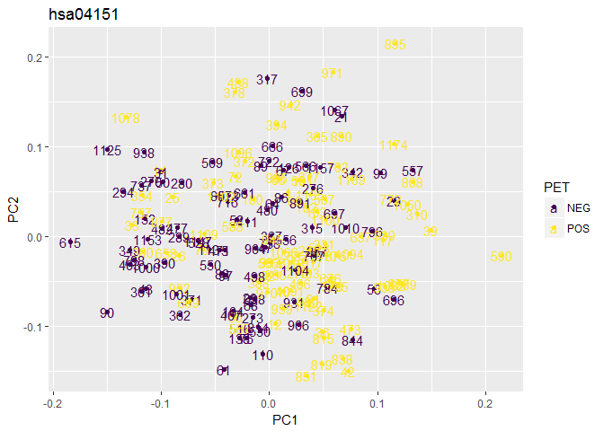<!-- -->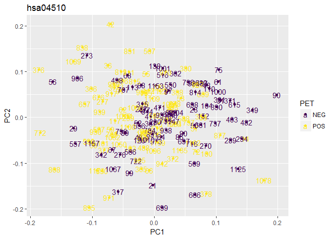<!-- -->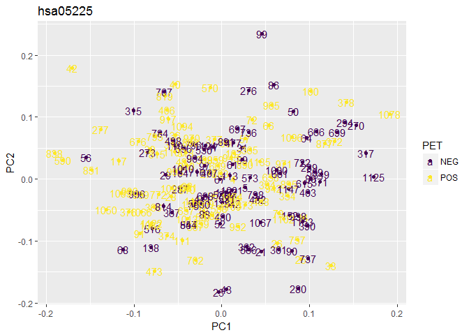<!-- -->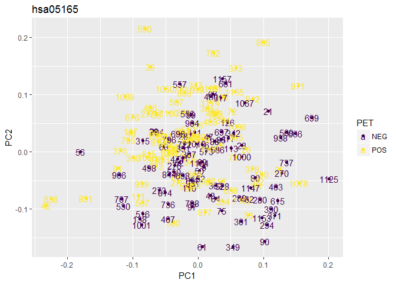<!-- -->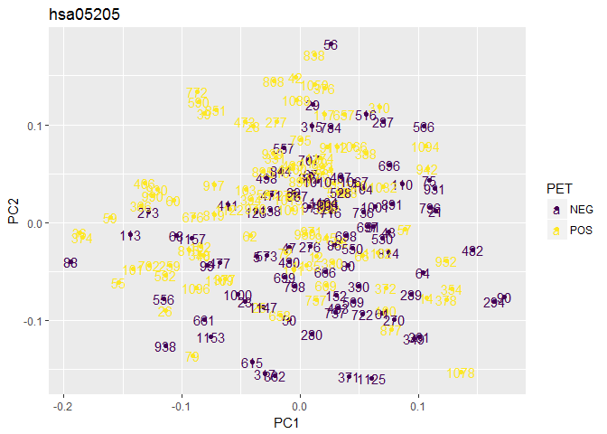<!-- -->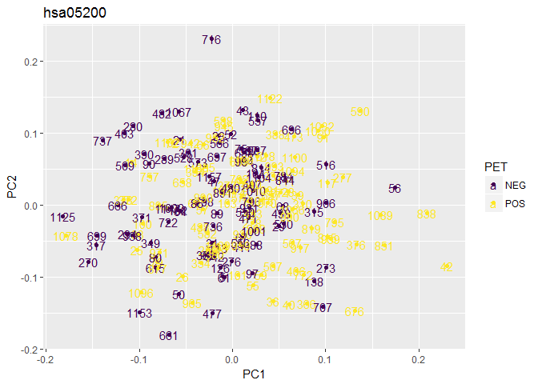<!-- -->
There's some separation, but not a lot. What if we combine them? That is, we take all the differentially expressed genes that also fell within networks.


```r
# get expression data for the 168 DE genes that fell within the networks
test2 <- cbind(exdata3[, 1:5], exdata3[, sig_lim])
pca2 <- prcomp(test2[6:ncol(test2)], center = T, scale. = T)
autoplot(pca2, data = test2, colour = "PET", label = T, label.label = "AIBL.Id") +
  viridis::scale_colour_viridis(option = "viridis", discrete = T)
```

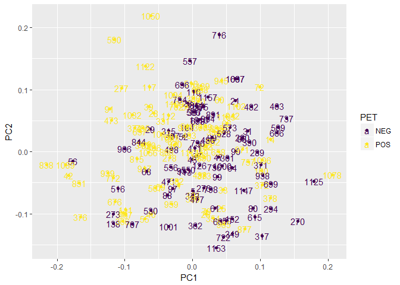<!-- -->

Seems to be a bit of a dead end.


```r
ll2 <- lapply(clst_tidy_3, function (x) {
  xm <- as.matrix(log(x[,-1])) # creates a matrix, using log to standardise
  svd.decomp2 <- svd(xm) # applies singular value decomposition
  svd.v <- svd.decomp2$v # pulls out the matrix whose columns contain the right singular vectors of xm
  X.pca <- xm %*% svd.v # multiplies the original 'xm' matrix by the right singular vectors matrix
  xout <-  X.pca[,1] # takes the first eigemvalue for each individual
  return(xout)
})
```

Turn it into a data frame


```r
ll2d <- do.call(rbind.data.frame,ll2) # creates a data frame of eigenvalues
ll2d2 <- t(ll2d) # transpose so that individuals are rows
rownames(ll2d2) <- clst_tidy_3[[1]][,1]
colnames(ll2d2) <- names(clst_tidy_3)
```


```r
ll2d3 <- ll2d2[as.character(keymeta$AIBL.Id),] # put eigenvalue data in same order as keymeta
kp <- ifelse(is.na(keymeta$PET)==T,FALSE,TRUE) # create vector of TRUE/FALSE for recorded PET status, to determine which ones are missing
keymeta1 <- keymeta[kp,] # restrict metadata for just those with recorded PET status
keymeta1 <- keymeta1[-c(grep(c("771|914|918"), keymeta1$AIBL.Id)), ] # remove outliers idenfitied with PCA on expression data

Y1 <- factor(as.character(keymeta1$PET)) # create factor vector, where NEG = 1, POS = 2
ll2d4 <- ll2d3[kp,] # remove individuals that do not have PET status recorded
ll2d4 <- ll2d4[-c(grep(c("771|914|918"), rownames(ll2d4))), ] # remove outliers identified with PCA on expression data
treat1<-factor(c(Y1), labels=c("Normal","Alzheimers")) # create vector of factors
design_treat1<-model.matrix(~0+treat1) # create model matrix
colnames(design_treat1) <- c("Normal","Alzheimers")
contrast.matrix_treat1<-makeContrasts(Normal-Alzheimers, levels=design_treat1) # create contrast
```

Visualise eigenvalues to see if they separate the groups


```r
require(tidyverse)
ll2d4.1 <- data.frame(ll2d4)
ll2d4.1$AIBL.Id <- as.integer(rownames(ll2d4.1))
vis2 <- left_join(ll2d4.1, keymeta1, by = "AIBL.Id")
vis2 <- gather(vis2, key = "network", value = "eigenvalue", 1:(ncol(vis2) - 5))
ggplot(vis2, aes(network, eigenvalue, colour = PET)) +
  geom_jitter() # most networks seeem to have a pretty even distribution between POS and NEG groups
```

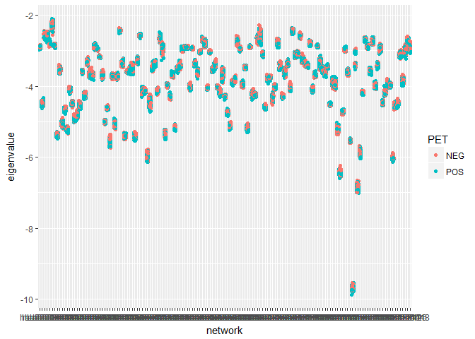<!-- -->

Run limma


```r
# Transpose data into matrix for limma fit
x1 <- t(ll2d4)
fit.lm1<-lmFit(x1,design_treat1) # fit a linear model using the matrix x1 from above
fit1.c <-contrasts.fit(fit.lm1,contrast.matrix_treat1) # use contrasts made above
fit.eb1<- eBayes(fit1.c) # compute Bayes statistics

## comparison treated - untreated
topALL2<-toptable(fit=fit1.c, eb=fit.eb1, adjust="fdr", n=244, genelist=colnames(ll2d4))
topALL.2 <- topALL2[,c("ID","P.Value", "adj.P.Val")]

# number of significantly differentiated networks 
length(which(topALL.2$P.Value < 0.05))
```

```
## [1] 80
```

```r
# number of significantly differentiated networks (FDR-adjusted)
length(which(topALL.2$adj.P.Val < 0.05))
```

```
## [1] 66
```

Join results to 'root_lim' table


```r
root_lim <- dplyr::left_join(root_lim,
                      dplyr::select(topALL.2,
                                    cluster_id = "ID",
                                    end_cluster_de_p.value = "P.Value",
                                    end_cluster_de_p.value_adj = "adj.P.Val"),
                      by = "cluster_id")
```

### Carry out PCA on networks that are significantly differentiated at the FDR adjusted level


```r
# create data frame with attached metadata
fdr_sig <- topALL.2$ID[topALL.2$adj.P.Val < 0.05]# create vector of significant network IDs 
ll2d4.2 <- ll2d4.1[, colnames(ll2d4.1) %in% fdr_sig] # restrict to just those networks that are significant at the FDR-adjusted level
ll2d4.2$AIBL.Id <- as.integer(rownames(ll2d4.2))
ll2d4.2 <- left_join(ll2d4.2, keymeta1, by = "AIBL.Id")
ll2d4.2 <- dplyr::select(ll2d4.2, AIBL.Id, Demographic.Sex, PET, apoe4, Age, everything())

# carry out PCA
pca3 <- prcomp(ll2d4.2[6:ncol(ll2d4.2)], center = T, scale. = T)

autoplot(pca3, data = ll2d4.2, colour = "PET", label = T, label.label = "AIBL.Id") +
    viridis::scale_colour_viridis(option = "viridis", discrete = T) +
    ggtitle("PCA with significant clusters (FDR-adjusted)")
```

<!-- -->

How about if we just take the top 10 clusters?

```r
# create data frame with attached metadata
fdr_sig_10 <- topALL.2$ID[1:10]# create vector of significant network IDs 
ll2d4.3 <- ll2d4.1[, colnames(ll2d4.1) %in% fdr_sig_10] # restrict to just those networks that are significant at the FDR-adjusted level
ll2d4.3$AIBL.Id <- as.integer(rownames(ll2d4.3))
ll2d4.3 <- left_join(ll2d4.3, keymeta1, by = "AIBL.Id")
ll2d4.3 <- dplyr::select(ll2d4.3, AIBL.Id, Demographic.Sex, PET, apoe4, Age, everything())

# carry out PCA
pca3 <- prcomp(ll2d4.3[6:ncol(ll2d4.3)], center = T, scale. = T)

autoplot(pca3, data = ll2d4.3, colour = "PET", label = T, label.label = "AIBL.Id") +
    viridis::scale_colour_viridis(option = "viridis", discrete = T) +
    ggtitle("PCA with top 10 significant clusters (FDR-adjusted)")
```

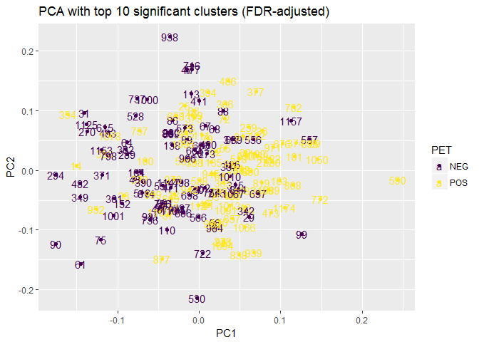<!-- -->

How about if we just take the top 5 clusters?

```r
# create data frame with attached metadata
fdr_sig_5 <- topALL.2$ID[1:5]# create vector of significant network IDs 
ll2d4.4 <- ll2d4.1[, colnames(ll2d4.1) %in% fdr_sig_5] # restrict to just those networks that are significant at the FDR-adjusted level
ll2d4.4$AIBL.Id <- as.integer(rownames(ll2d4.4))
ll2d4.4 <- left_join(ll2d4.4, keymeta1, by = "AIBL.Id")
ll2d4.4 <- dplyr::select(ll2d4.4, AIBL.Id, Demographic.Sex, PET, apoe4, Age, everything())

# carry out PCA
pca4 <- prcomp(ll2d4.4[6:ncol(ll2d4.4)], center = T, scale. = T)

autoplot(pca4, data = ll2d4.4, colour = "PET", label = T, label.label = "AIBL.Id") +
    viridis::scale_colour_viridis(option = "viridis", discrete = T) +
    ggtitle("PCA with top 5 significant clusters (FDR-adjusted)")
```

<!-- -->

How about if we just take the top 2 clusters?

```r
# create data frame with attached metadata
fdr_sig_2 <- topALL.2$ID[1:2]# create vector of significant network IDs 
ll2d4.5 <- ll2d4.1[, colnames(ll2d4.1) %in% fdr_sig_2] # restrict to just those networks that are significant at the FDR-adjusted level
ll2d4.5$AIBL.Id <- as.integer(rownames(ll2d4.5))
ll2d4.5 <- left_join(ll2d4.5, keymeta1, by = "AIBL.Id")
ll2d4.5 <- dplyr::select(ll2d4.5, AIBL.Id, Demographic.Sex, PET, apoe4, Age, everything())

# carry out PCA
pca5 <- prcomp(ll2d4.5[6:ncol(ll2d4.5)], center = T, scale. = T)

autoplot(pca5, data = ll2d4.5, colour = "PET", label = T, label.label = "AIBL.Id") +
    viridis::scale_colour_viridis(option = "viridis", discrete = T) +
    ggtitle("PCA with top 2 significant clusters (FDR-adjusted)")
```

<!-- -->

How about with all clusters at the nominal p-value?

```r
# create data frame with attached metadata
fdr_sig_all <- topALL.2$ID[topALL.2$P.Value < 0.05]# create vector of significant network IDs 
ll2d4.6 <- ll2d4.1[, colnames(ll2d4.1) %in% fdr_sig_all] # restrict to just those networks that are significant at the FDR-adjusted level
ll2d4.6$AIBL.Id <- as.integer(rownames(ll2d4.6))
ll2d4.6 <- left_join(ll2d4.6, keymeta1, by = "AIBL.Id")
ll2d4.6 <- dplyr::select(ll2d4.6, AIBL.Id, Demographic.Sex, PET, apoe4, Age, everything())

# carry out PCA
pca6 <- prcomp(ll2d4.6[6:ncol(ll2d4.6)], center = T, scale. = T)

autoplot(pca6, data = ll2d4.6, colour = "PET", label = T, label.label = "AIBL.Id") +
    viridis::scale_colour_viridis(option = "viridis", discrete = T) +
    ggtitle("PCA with all significant clusters (nominal p-value)")
```

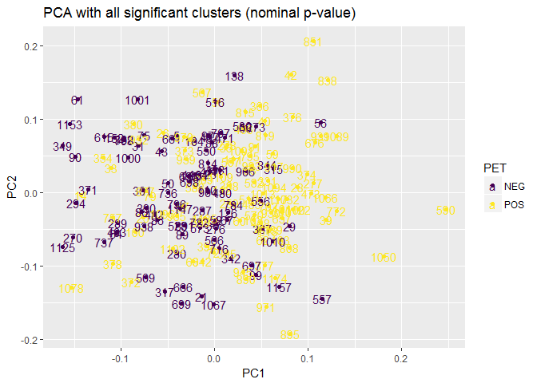<!-- -->

## Enrich for genes significant eQTL genes

Find which of the significant DE genes from the initial limma were also significant from the eQTL analysis of the PET-pos group

```r
which(lim1_out_sig$probe_id %in% pos_sig_eqtl_gns$gene)
```

```
## integer(0)
```
None!

How about the eQTL analysis from the group as a whole?


```r
which(lim1_out_sig$probe_id %in% sig_eqtl_gns$gene)
```

```
##  [1]  29  53  70  80  82  85  91 104 105 112 130 131 135 141 145 166
```

```r
# get probe IDs for the DE eQTL genes
eqtl_sig_probes <- lim1_out_sig$probe_id[lim1_out_sig$probe_id %in% sig_eqtl_gns$gene]

# create list of cluster IDs that contain genes that were DE in the eQTL analysis
test <- lapply(clst_tidy, function(x){
  if (length(which(names(x) %in% eqtl_sig_probes) >= 1)){
    return(x)
  }
})
test <- test[-which(sapply(test, is.null))] # remove NULL entries

# create vector of cluster IDs
eqtl_cluster_ids <- names(test)

ll2d4.7 <- ll2d4.1[, colnames(ll2d4.1) %in% eqtl_cluster_ids]  # restrict to just those networks that hold genes that were DE in the eQTL analysis
ll2d4.7$AIBL.Id <- as.integer(rownames(ll2d4.7))
ll2d4.7 <- left_join(ll2d4.7, keymeta1, by = "AIBL.Id")
ll2d4.7 <- dplyr::select(ll2d4.7, AIBL.Id, Demographic.Sex, PET, apoe4, Age, everything())

# carry out PCA
pca7 <- prcomp(ll2d4.7[6:ncol(ll2d4.7)], center = T, scale. = T)

autoplot(pca7, data = ll2d4.7, colour = "PET", label = T, label.label = "AIBL.Id") +
    viridis::scale_colour_viridis(option = "viridis", discrete = T) +
    ggtitle("PCA differentially expressed eQTL genes")
```

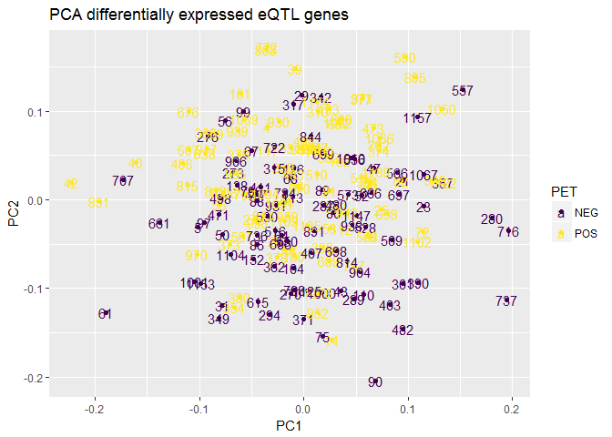<!-- -->

## Get filtered gene list


```r
load("C:/Users/bre227/Documents/R/AD_project/Data/Networks/filtered_clusters.RData")
load("C:/Users/bre227/Documents/R/AD_project/Data/Networks/dingo_filtered_probes.RData")

# how many unique probes are there in the filtered iDINGO output?
length(dingo_filtered_probes)
```

```
## [1] 3434
```

*9 February 2018*

## Summary tables

: Counts of genes and networks comparing PET-pos v PET-neg groups

|    | No. unique genes (probes) sig. at p < 0.05 (annotated)| No. genes (probes) sig. FDR-adjusted level (annotated) | No. networks|
|:--------------------|:-------------------:|:-------------------:|:------------------:|
|DE in limma (1) |865 (530)| 0| 244|
|Sig. diff. correlation from iDINGO | 3434 (3434) | ? | 249|
|No. sig. genes from (1) in networks | 154 (154)| NA |149| 

***

For Monday:

* Increase the threshold for the number of DE genes in each cluster from 1 to say, 5, create eigenvalues, for those, and then see how much better the PCA gets. Or just take the top 10 clusters. 

* Find which differentially expressed eQTL genes are within the FDR-adjusted significant networks of the limma run on the above.

* Create boxplots for those genes by genotype, APOE-e4, and PET status.

***

*13 February 2018*

## PCA for clusters with most DE genes in them

### Create function to create eigenvalues and run limma

```r
# create function for PCA analysis

end_pca_plot <- function(cluster_list, title){
  
# create eigenvalues
  ll <- lapply(cluster_list, function (x) {
    xm <- as.matrix(log(x[,-1])) # creates a matrix, using log to standardise
    svd.decomp2 <- svd(xm) # applies singular value decomposition
    svd.v <- svd.decomp2$v # pulls out the matrix whose columns contain the right singular vectors of xm
    X.pca <- xm %*% svd.v # multiplies the original 'xm' matrix by the right singular vectors matrix
    xout <-  X.pca[,1] # takes the first eigemvalue for each individual
    return(xout)
  })
  
  # turn it into a data frame
  lld <- do.call(rbind.data.frame,ll) # creates a data frame of eigenvalues
  lld2 <- t(lld) # transpose so that individuals are rows
  rownames(lld2) <- cluster_list[[1]][,1]
  colnames(lld2) <- names(cluster_list)

  # filter data and create contrasts
  keymeta <- read.table("C:/Users/bre227/Documents/R/AD_project/Working/key_metadata.txt", header = T) # read key metadata
  lld3 <- lld2[as.character(keymeta$AIBL.Id),] # put eigenvalue data in same order as keymeta
  kp <- ifelse(is.na(keymeta$PET)==T,FALSE,TRUE) # create vector of TRUE/FALSE for recorded PET status, to determine which ones are missing
  keymeta1 <- keymeta[kp,] # restrict metadata for just those with recorded PET status
  keymeta1 <- keymeta1[-c(grep(c("771|914|918"), keymeta1$AIBL.Id)), ] # remove outliers idenfitied with PCA on expression data
  Y1 <- factor(as.character(keymeta1$PET)) # create factor vector, where NEG = 1, POS = 2
  lld4 <- lld3[kp,] # remove individuals that do not have PET status recorded
  lld4 <- lld4[-c(grep(c("771|914|918"), rownames(lld4))), ] # remove outliers identified with PCA on expression data
  treat1<-factor(c(Y1), labels=c("Normal","Alzheimers")) # create vector of factors
  design_treat1<-model.matrix(~0+treat1) # create model matrix
  colnames(design_treat1) <- c("Normal","Alzheimers")
  contrast.matrix_treat1<-makeContrasts(Normal-Alzheimers, levels=design_treat1) # create contrast

  # run limma
  x1 <- t(lld4) # Transpose data into matrix for limma fit
  fit.lm1<-lmFit(x1,design_treat1) # fit a linear model using the matrix x1 from above
  fit1.c <-contrasts.fit(fit.lm1,contrast.matrix_treat1) # use contrasts made above
  fit.eb1<- eBayes(fit1.c) # compute Bayes statistics
  topALL1<-toptable(fit=fit1.c, eb=fit.eb1, adjust="fdr", n=length(cluster_list), genelist=colnames(lld4))## comparison treated - untreated
  
  # create data frame with attached metadata
  if (length(topALL1$ID[topALL1$adj.P.Val < 0.05]) > 0){
    fdr_sig <- topALL1$ID[topALL1$adj.P.Val < 0.05]# create vector of significant network IDs
  } else {
    fdr_sig <- topALL1$ID[topALL1$P.Value < 0.05]
  }
  lld4.1 <- data.frame(lld4)
  lld4.2 <- lld4.1[, colnames(lld4.1) %in% fdr_sig] # restrict to just those networks that are significant at the FDR-adjusted level
  lld4.2$AIBL.Id <- as.integer(rownames(lld4.2))
  require(dplyr)
  lld4.2 <- left_join(lld4.2, keymeta1, by = "AIBL.Id")
  lld4.2 <- dplyr::select(lld4.2, AIBL.Id, Demographic.Sex, PET, apoe4, Age, everything())

  # run PCA
  pca <- prcomp(lld4.2[6:ncol(lld4.2)], center = T, scale. = T)

  # plot
  require(ggplot2)
  require(ggfortify)
  plot <- autoplot(pca, data = lld4.2, colour = "PET", label = T, label.label = "AIBL.Id") +
      viridis::scale_colour_viridis(option = "viridis", discrete = T) +
      ggtitle(title)
  return(plot)
}
```

### Top 10 clusters with most DE genes

```r
tail(sort(sapply(clst_tidy_2, length)), 10) # get names of six clusters with the most DE genes
```

```
## hsa05169 hsa04360 hsa04740 hsa05206 hsa04151 hsa04510 hsa05225 hsa05165 
##        8        9        9        9       10       10       10       12 
## hsa05205 hsa05200 
##       12       25
```

```r
t <- attr(tail(sort(sapply(clst_tidy_2, length)), 10), "names") # create vector of cluster names

# create list of just those six
clst_top_10 <- clst_tidy_3[t]
```

Run function on 'clst_top_10'

```r
end_pca_plot(clst_top_10, "PCA using 10 clusters with the most DE genes")
```

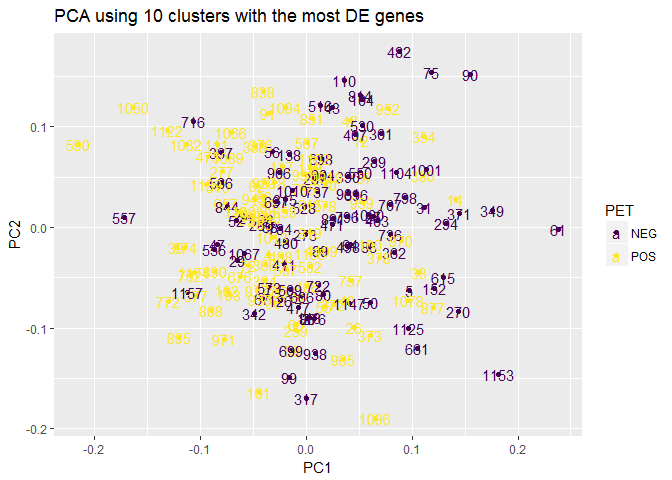<!-- -->

### Top 5 clusters with most DE genes

```r
tail(sort(sapply(clst_tidy_2, length)), 5) # get names of six clusters with the most DE genes
```

```
## hsa04510 hsa05225 hsa05165 hsa05205 hsa05200 
##       10       10       12       12       25
```

```r
t <- attr(tail(sort(sapply(clst_tidy_2, length)), 5), "names") # create vector of cluster names

# create list of just those six
clst_top_5 <- clst_tidy_3[t]
```

Run function on 'clst_top_5'

```r
end_pca_plot(clst_top_5, "PCA using 5 clusters with the most DE genes")
```

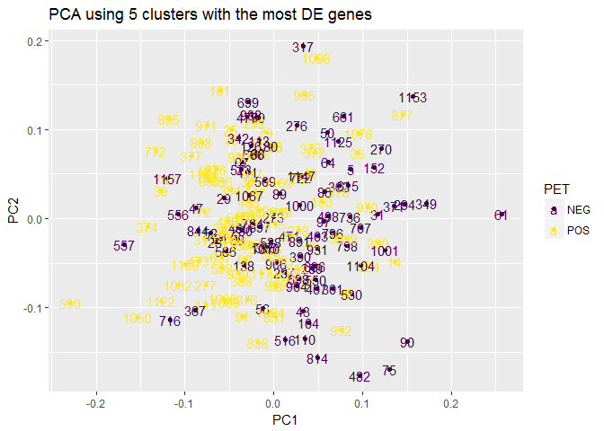<!-- -->

## Analyse filtered clusters from iDINGO

Meeting with JD:

*Take average of absolute z-scores.
*Take 5th percentile from either end.
*Get mean, median, SD
  -This will let us know which clusters separate the two groups the best
*Dingo
  -Take the average of the bootstrap replications (the difference). The better that does, the smaller the error around the bootstrap average.

Load files

```r
# load files from dropbox
load("C:/Users/bre227/Dropbox/eQTL/Results/cluster_data/iDINGO_results/RData/All_clusters.RData")
# create list
dingo_clstrs <- mget(ls(pattern = "hsa"))
# remove indidivual cluster lists
rm(list = ls(pattern = "hsa"))
```

Get the mean of each gene pair's bootstrap


```r
dingo_clstrs_2 <- lapply(dingo_clstrs, function(x){
  apply(x[["bootdiff"]], 1, mean)
})
```

Find the indexes for the gene pairs that sit in the extreme tails (<2.5%, >97.5%)


```r
dingo_clstrs_3 <- lapply(dingo_clstrs_2, function(x){
  which(x < quantile(x, 0.025) | x > quantile(x, 0.975))
})
```

Get gene pairs corresponding to indexes


```r
# create function to extract gene pairs
ind_match <- function(x, y){
  list(x[["genepairs"]][y, ])
}

# run over both lists
dingo_clstrs_4 <- mapply(ind_match, dingo_clstrs, dingo_clstrs_3)
```

Get unique genes in each network


```r
dingo_clstrs_5 <- lapply(dingo_clstrs_4, function(x){
  a <- unique(x[["gene1"]])
  b <- unique(x[["gene2"]])
  union(a, b)
})
```

Pull out expression data for those genes


```r
# find which clusters in 'dingo_clstrs_5 aren't in 'cluster_genexp' and remove
dingo_clstrs_6 <- dingo_clstrs_5[which(names(dingo_clstrs_5) %in% names(cluster_genexp))]

# test
# names(cluster_genexp[[2]])[names(cluster_genexp[[2]]) %in% dingo_clstrs_5[[2]]]

# create function to find which genes in 'cluster_genexp' that are in 'dingo_clstrs_6' 
gene_match <- function(x, y){
  cbind(x[1], x[names(x) %in% y])
}

# extract expression data for genes in 'cluster_genexp' that are in 'dingo_clstrs_6'
dingo_clstrs_7 <- mapply(gene_match, cluster_genexp, dingo_clstrs_6)
```


```r
end_pca_plot(dingo_clstrs_7, "PCA using END genes (5% threshold)")
```

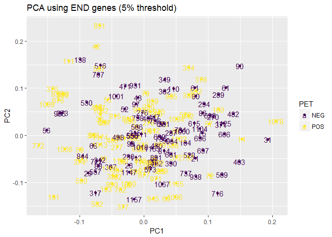<!-- -->

Not great clustering. Try higher threshold?

### PCA with END at 1 percentile threshold

Create function to END dingo analysis


```r
end_filter <- function(list, lower, upper){
  
  # get list of means for the bootstrapped difference
  dingo_clstrs_2 <- lapply(list, function(x){
    apply(x[["bootdiff"]], 1, mean)
  })
  
  # Find the indexes for the gene pairs that sit in the extreme tails
  dingo_clstrs_3 <- lapply(dingo_clstrs_2, function(x){
    which(x < quantile(x, upper) | x > quantile(x, lower))
  })
  
  # get gene pairs corresponding to indexes
  ind_match <- function(x, y){ # create function to extract gene pairs
    list(x[["genepairs"]][y, ])
  }
  
  dingo_clstrs_4 <- mapply(ind_match, dingo_clstrs, dingo_clstrs_3) # run over both lists
  
  # get unique genes in each network
  dingo_clstrs_5 <- lapply(dingo_clstrs_4, function(x){
    a <- unique(x[["gene1"]])
    b <- unique(x[["gene2"]])
    union(a, b)
  })
  
  # pull out expression data for those genes
  dingo_clstrs_6 <- dingo_clstrs_5[which(names(dingo_clstrs_5) %in% names(cluster_genexp))] # find which clusters in 'dingo_clstrs_5 aren't in 'cluster_genexp' and remove
  
  gene_match <- function(x, y){ # create function to find which genes in 'cluster_genexp' that are in 'dingo_clstrs_6' 
    cbind(x[1], x[names(x) %in% y])
  }
  
  dingo_clstrs_7 <- mapply(gene_match, cluster_genexp, dingo_clstrs_6) # extract expression data for genes in 'cluster_genexp' that are in 'dingo_clstrs_6'
  
  # remove clusters with 0 genes
  if (any(sapply(dingo_clstrs_7, function(x) length(x) < 2))){
    dingo_clstrs_8 <- lapply(dingo_clstrs_7, function(x) { # create NULL entries
    if (length(x) < 2){
      x <- NULL
    } else {
      x
    }
    })
    dingo_clstrs_8 <- dingo_clstrs_8[-which(sapply(dingo_clstrs_8, is.null))]
    dingo_clstrs_8
  } else {
    dingo_clstrs_7
  }
}
```

Run with 1% on either side

```r
one_percentile <- end_filter(dingo_clstrs, 0.01, 0.99)
end_pca_plot(one_percentile, "PCA using END genes (1% threshold)")
```

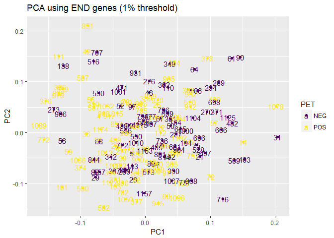<!-- -->

### PCA with END at 0.5 percentile threshold


```r
half_percentile <- end_filter(dingo_clstrs, 0.005, 0.995)
end_pca_plot(half_percentile, "PCA using END genes (0.5% threshold)")
```

<!-- -->

### PCA with END at 0.25 percentile threshold


```r
quarter_percentile <- end_filter(dingo_clstrs, 0.0025, 0.9975)
end_pca_plot(quarter_percentile, "PCA using END genes (0.25% threshold)")
```

<!-- -->

### PCA with END at 0.1 percentile threshold


```r
point1_percentile <- end_filter(dingo_clstrs, 0.001, 0.999)
end_pca_plot(point1_percentile, "PCA using END genes (0.1% threshold)")
```

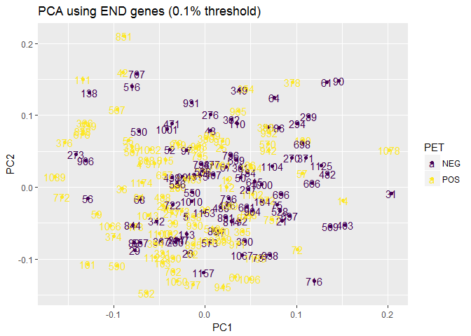<!-- -->
