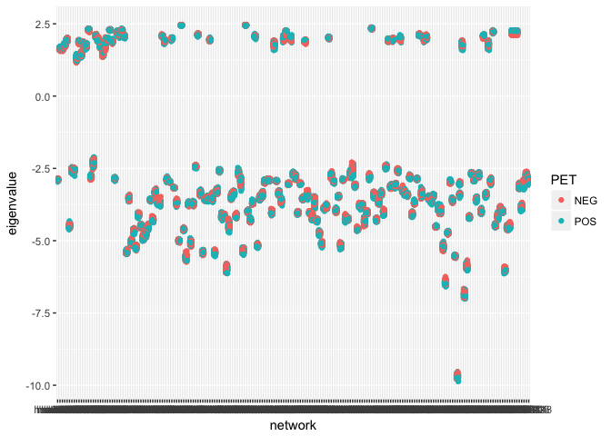
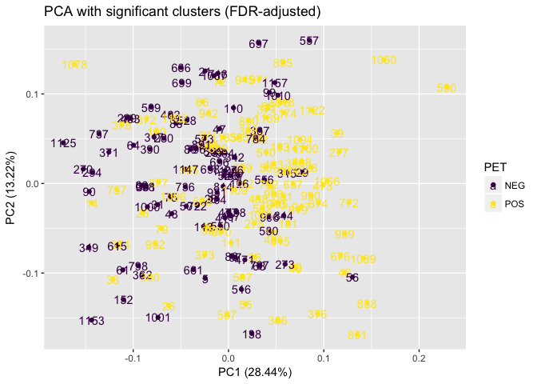
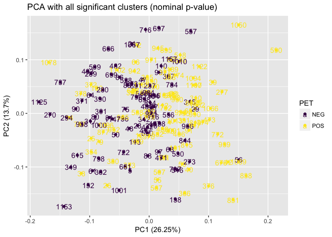

***

# Gene expression and network analysis

## Load data


```r
require(RCurl)
```

```
## Loading required package: RCurl
```

```
## Loading required package: bitops
```

```r
# expression data 
exdata <- read.delim("~/Dropbox/eQTL/Data/AIBL_expression_set/AIBL_Gene_Expression.txt", sep = "", header = T)
ids2 <- read.delim("~/Dropbox/eQTL/Data/AIBL_expression_set/AIBL_Gene_Expression_IDs_UpdtdDec2017.txt", sep = " ")
colnames(exdata) <- as.vector(ids2$x) # replace colnames with ids2

# metadata
meta2 <- read.delim(text = getURL("https://raw.githubusercontent.com/IanBrettell/AD_project/master/Working/key_metadata.txt"), header = T)
```


## Create initial exploratory plots

Histogram of cohort's age


```r
hist(meta2$Age)
```

<!-- -->


Plot for whole dataset

```r
library(tidyverse)
```

```
## ── Attaching packages ────────────────────────────────────────────────────────────────────────────────────────────── tidyverse 1.2.1 ──
```

```
## ✔ ggplot2 2.2.1     ✔ purrr   0.2.4
## ✔ tibble  1.4.2     ✔ dplyr   0.7.4
## ✔ tidyr   0.8.0     ✔ stringr 1.3.0
## ✔ readr   1.1.1     ✔ forcats 0.3.0
```

```
## ── Conflicts ───────────────────────────────────────────────────────────────────────────────────────────────── tidyverse_conflicts() ──
## ✖ tidyr::complete() masks RCurl::complete()
## ✖ dplyr::filter()   masks stats::filter()
## ✖ dplyr::lag()      masks stats::lag()
```

```r
exdata1 <- as_tibble(exdata)
exdata1 <- as_tibble(t(exdata1)) # transpose to put samples in rows, genes in columns
colnames(exdata1) <- rownames(exdata) # add genes names
exdata1$AIBL.Id <- as.integer(colnames(exdata)) # add 'AIBL.Id' column
exdata2 <- left_join(meta2, exdata1, by = "AIBL.Id") %>% 
  na.omit # add metadata and remove PET and apoe4 columns with 'NA'
rownames(exdata2) <- exdata2$AIBL.Id # to ensure the labels in the plots reflect the AIBL.Ids
dim(exdata2)
```

```
## [1]   196 22016
```

Run PCA

```r
pca <- prcomp(exdata2[6:22016], center = T, scale. = T) # run PCA
# plot scree for PCA
library(factoextra)
fviz_eig(pca)
```

<!-- -->

PCA scatterplot for PET status 

```r
library(ggfortify)
autoplot(pca, data = exdata2, colour = "PET", label = T) +
  viridis::scale_colour_viridis(option = "viridis", discrete = T)
```

<!-- -->

PET scatterplot for *apoe4* status

```r
library(ggfortify)
autoplot(pca, data = exdata2, colour = "apoe4", label = T)
```

<!-- -->


```r
qqnorm(pca$x[,2], pch = 20)
```

<!-- -->

Exclude outliers and run PCA again


```r
exdata3 <- filter(exdata2, AIBL.Id != "771" & AIBL.Id != "914" & AIBL.Id != "918")
```

Run PCA

```r
pca2 <- prcomp(exdata3[6:22016], center = T, scale. = T) # run PCA
library(factoextra)
fviz_eig(pca2)
```

<!-- -->

Plot without outliers (PET)


```r
library(ggfortify)
autoplot(pca2, data = exdata3, colour = "PET", label = T, label.label = "AIBL.Id") +
  viridis::scale_colour_viridis(option = "viridis", discrete = T)
```

<!-- -->

Plot without outliers (*apoe4*)


```r
library(ggfortify)
autoplot(pca2, data = exdata3, colour = "apoe4", label = T, label.label = "AIBL.Id")
```

<!-- -->

***

## Use `limma` to analyse expression data.

We first create an 'ExpressionSet' with genes on rows, and samples on columns, following the guide here: <https://www.bioconductor.org/packages/3.7/bioc/vignettes/Biobase/inst/doc/ExpressionSetIntroduction.pdf>


```r
library(Biobase)
```


```r
exprs <- as.matrix(t(exdata3[,6:22016])) # leaving behind the first 5 metadata columns
minimalSet <- ExpressionSet(assayData = exprs)
pData <- exdata3[,1:5]
summary(pData)
```

```
##     AIBL.Id       Demographic.Sex  PET          apoe4      
##  Min.   :   4.0   Female:96       NEG: 92   Min.   :0.000  
##  1st Qu.: 110.0   Male  :97       POS:101   1st Qu.:0.000  
##  Median : 480.0                             Median :0.000  
##  Mean   : 506.2                             Mean   :0.456  
##  3rd Qu.: 819.0                             3rd Qu.:1.000  
##  Max.   :1174.0                             Max.   :1.000  
##       Age       
##  Min.   :55.15  
##  1st Qu.:67.15  
##  Median :72.71  
##  Mean   :72.86  
##  3rd Qu.:78.90  
##  Max.   :91.79
```


```r
library(limma)
```


```r
PET_apoe4 <- paste(pData$PET, pData$apoe4, sep = ".") # put PET/apoe4 combinations into a vector

PET_apoe4 <- factor(PET_apoe4, levels = c(unique(PET_apoe4))) # turn it into a factor
design <- model.matrix(~0 + PET_apoe4) # create factor table for four combinations
colnames(design) <- levels(PET_apoe4)
fit <- lmFit(exprs, design)
```

Set four pair-wise contrasts of interest and compute the contrasts and moderated t-tests.


```r
cont.matrix <- makeContrasts(apoe4_for_PET_yes = POS.1 - POS.0,
                             apoe4_for_PET_no = NEG.1 - NEG.0,
                             PET_for_apoe4_yes = POS.1 - NEG.1,
                             PET_for_apoe4_no = POS.0 - NEG.0,
                             levels = design)
fit2 <- contrasts.fit(fit, cont.matrix)
fit2 <- eBayes(fit2)
```

Get the genes differentially expressed in each comparison


```r
res1 <- topTable(fit2, coef = "apoe4_for_PET_yes", n = Inf)
res2 <- topTable(fit2, coef = "apoe4_for_PET_no", n = Inf)
res3 <- topTable(fit2, coef = "PET_for_apoe4_yes", n = Inf)
res4 <- topTable(fit2, coef = "PET_for_apoe4_no", n = Inf)

length(which(res1$P.Value < 0.05))
```

```
## [1] 653
```

```r
length(which(res2$P.Value < 0.05))
```

```
## [1] 684
```

```r
length(which(res3$P.Value < 0.05))
```

```
## [1] 924
```

```r
length(which(res4$P.Value < 0.05))
```

```
## [1] 769
```

Probe IDs are set in the 'res' data frames as rownames. Create separate column for rownames. Need to do it now, because when `filter()` is applied below, it removes the rownames.


```r
for (i in ls(pattern = "res")){
  x <- get(i)
  x$probe_id <- rownames(x)
  assign(i, x)
}
```

Get list of genes that show significantly different expression between contrasts

```r
signif_apoe4_for_PET_yes <- filter(res1, P.Value < 0.05)
signif_apoe4_for_PET_no <- filter(res2, P.Value < 0.05)
signif_PET_for_apoe4_yes <- filter(res3, P.Value < 0.05)
signif_PET_for_apoe4_no <- filter(res4, P.Value < 0.05)

rm(list = ls(pattern = "res")) # remove results to clear working memory
```

## Get gene identifiers for microarray probes and identify significant genes.

*Using JD's code from 'AIBL_Gene_Expression_SetUp_Dec82017.R'*


```r
library(pd.huex.1.0.st.v2)
library(huex10sttranscriptcluster.db)
  
### pull gene symbols and match to probe ids to replace rownames ###
x <- huex10sttranscriptclusterSYMBOL
# Get the probe identifiers that are mapped to a gene symbol
mapped_probes <- mappedkeys(x)
# Convert to a list
xx <- as.list(x[mapped_probes])
if(length(xx) > 0) {
# Get the SYMBOL for the first five probes
xx[1:5]
# Get the first one
xx[[1]]
}
```

```
## [1] "LOC102723600"
```

```r
xx1 <- as.matrix(unlist(xx))

# Get table of probes
gns <- rownames(exdata)
gnsl <- xx1[rownames(xx1) %in% gns]
length(gnsl)
```

```
## [1] 14902
```

```r
### Find ENSEMBL IDs ###
x3 <- huex10sttranscriptclusterENSEMBL
# Get the entrez gene IDs that are mapped to an Ensembl ID
mapped_genes <- mappedkeys(x3)
# Convert to a list
xx3 <- as.list(x3[mapped_genes])

xx3.1 <- as.matrix(unlist(xx3))
ens <- xx3.1[rownames(xx3.1) %in% gns]
length(ens)
```

```
## [1] 13954
```

```r
#[1] 14497

### Find Entrez IDs ###
x4 <- huex10sttranscriptclusterENTREZID
# Get the probe identifiers that are mapped to an ENTREZ Gene ID
mapped_probes <- mappedkeys(x4)
# Convert to a list
xx4 <- as.list(x4[mapped_probes])

xx4.1 <- as.matrix(unlist(xx4))
entz <- xx4.1[rownames(xx4.1) %in% gns]
length(entz)
```

```
## [1] 14902
```

## Match probes, gene symbols, Ensembl IDs, and Entrez IDs with the list of statistically significant genes.

Create data frame of all probe matches with identifiers


```r
pid_symb <- data.frame(xx1)
pid_symb$probe_id <- rownames(pid_symb)

pid_ens <- data.frame(xx3.1)
pid_ens$probe_id <- rownames(pid_ens)

pid_ent <- data.frame(xx4.1)
pid_ent$probe_id <- rownames(pid_ent)

pid_all <- dplyr::left_join(pid_symb, pid_ent, by = "probe_id") %>% 
  dplyr::left_join(y = pid_ens, by = "probe_id") %>% 
  dplyr::rename(gene_symbol = "xx1",
                entrez_id = "xx4.1",
                ensembl_id = "xx3.1") %>% 
  dplyr::select(probe_id, everything())

write.table(pid_all, "~/Desktop/Uni Air/CSIRO/AD_project/Working/affy_probes_annotated.txt", row.names = F, col.names = T, quote = F, sep = "\t")

# find how many probes are annotated
length(which(pid_all$probe_id %in% rownames(exdata)))
```

```
## [1] 14902
```

Combine lists of significant genes for each contrast. Note that combined counts of significant genes for all four contrasts is 3030.


```r
signif_all <- full_join(signif_apoe4_for_PET_yes, signif_apoe4_for_PET_no, by = "probe_id") %>%
  full_join(signif_PET_for_apoe4_no, by = "probe_id") %>% 
  full_join(signif_apoe4_for_PET_yes, by = "probe_id")

signif_all <- dplyr::select(signif_apoe4_for_PET_yes, probe_id, P.Value) %>% 
  full_join(dplyr::select(signif_apoe4_for_PET_no, probe_id, P.Value), by = "probe_id") %>% 
  full_join(dplyr::select(signif_PET_for_apoe4_yes, probe_id, P.Value), by = "probe_id") %>% 
  full_join(dplyr::select(signif_PET_for_apoe4_no, probe_id, P.Value), by = "probe_id") %>% 
  dplyr::rename(P.Value.c1 = "P.Value.x", 
         P.Value.c2 = "P.Value.y", 
         P.Value.c3 = "P.Value.x.x", 
         P.Value.c4 = "P.Value.y.y")

nrow(signif_all)
```

```
## [1] 2438
```
Therefore 2438 genes are expressed differentially across at least two contrasts


Bind gene ids to 'signif_all'


```r
sig_all2 <- left_join(signif_all, pid_all, by = "probe_id")
```
There are many NAs in the 'gene_symbol' column, even though there are 34,127 unique probe_ids in 'pid_symb' - one would think they would all be accounted for.


```r
length(setdiff(signif_all$probe_id, pid_all$probe_id))
```

```
## [1] 989
```
Shows that there are 1000 probe ids in 'signif_all' that are not in 'pid_all', i.e. they do not have any annotation data.

Confirmed by:

```r
length(which(signif_all$probe_id %in% pid_all$probe_id == "TRUE"))
```

```
## [1] 1449
```

So are all probe_ids in the expression data in 'pid_symb'?


```r
length(setdiff(rownames(exdata), pid_symb$probe_id))
```

```
## [1] 7109
```
7,186/22,011 probes are not accounted for in the annotation data?

Confirm this:


```r
length(which(rownames(exdata) %in% pid_all$probe_id == "TRUE"))
```

```
## [1] 14902
```

#### Venn diagram of overlapping genes


```r
library(VennDiagram)
grid.newpage()
venn <- draw.quad.venn(area1 = length(which(!is.na(sig_all2$P.Value.c1))),
               area2 = length(which(!is.na(sig_all2$P.Value.c2))),
               area3 = length(which(!is.na(sig_all2$P.Value.c3))),
               area4 = length(which(!is.na(sig_all2$P.Value.c4))),
               n12 = length(which(!is.na(sig_all2$P.Value.c1) & !is.na(sig_all2$P.Value.c2))),
               n13 = length(which(!is.na(sig_all2$P.Value.c1) & !is.na(sig_all2$P.Value.c3))),
               n14 = length(which(!is.na(sig_all2$P.Value.c1) & !is.na(sig_all2$P.Value.c4))),
               n23 = length(which(!is.na(sig_all2$P.Value.c2) & !is.na(sig_all2$P.Value.c3))),
               n24 = length(which(!is.na(sig_all2$P.Value.c2) & !is.na(sig_all2$P.Value.c4))),
               n34 = length(which(!is.na(sig_all2$P.Value.c3) & !is.na(sig_all2$P.Value.c4))),
               n123 = length(which(!is.na(sig_all2$P.Value.c1) & !is.na(sig_all2$P.Value.c2) & !is.na(sig_all2$P.Value.c3))),
               n124 = length(which(!is.na(sig_all2$P.Value.c1) & !is.na(sig_all2$P.Value.c2) & !is.na(sig_all2$P.Value.c4))),
               n134 = length(which(!is.na(sig_all2$P.Value.c1) & !is.na(sig_all2$P.Value.c3) & !is.na(sig_all2$P.Value.c4))),
               n234 = length(which(!is.na(sig_all2$P.Value.c2) & !is.na(sig_all2$P.Value.c3) & !is.na(sig_all2$P.Value.c4))), 
               n1234 = length(which(!is.na(sig_all2$P.Value.c1) & !is.na(sig_all2$P.Value.c2) & !is.na(sig_all2$P.Value.c3) & !is.na(sig_all2$P.Value.c4))),
               category = c("apoe4_for_PET_yes", "apoe4_for_PET_no", "PET_for_apoe4_yes", "PET_for_apoe4_no"),
               cat.pos = c(0, 0, 0, 0))
```

<!-- -->

Many of the same genes (265) are differentially expressed between:
* PET pos/neg when they have the apoe4 allele; and
* apoe4 yes/no when they are negative for PET

These could be genes that can protect against AD.

Many of the same genes (189) are also differentially expressed between:
* PET pos/neg when they do not have the apoe4 allele; and
* apoe4 yes/no when they are positive for PET 

These latter genes must be acting independently of the apoe4 network to cause AD.

Find out how many people are in each group:


```r
test <- exdata3[,1:5]
length(which(test$PET == "POS" & test$apoe4 == "1"))
```

```
## [1] 65
```

```r
length(which(test$PET == "POS" & test$apoe4 == "0"))
```

```
## [1] 36
```

```r
length(which(test$PET == "NEG" & test$apoe4 == "1"))
```

```
## [1] 23
```

```r
length(which(test$PET == "NEG" & test$apoe4 == "0"))
```

```
## [1] 69
```

This suggests that more people tend to either have apoe4 and AD, or not have apoe4 and not have AD, than otherwise.

***

## Compare expression profiles between PET-pos and PET-neg groups

Create design matrix


```r
Group <- factor(exdata3$PET, levels = c("POS", "NEG"))
design2 <- model.matrix(~0 + Group)
colnames(design2) <- c("POS", "NEG")
```


Find differentially expressed genes

```r
fit3 <- lmFit(exprs, design2)
cont.matrix2 <- makeContrasts(POSvsNEG = POS - NEG, levels = design2)
fit4 <- contrasts.fit(fit3, cont.matrix2)
fit4 <- eBayes(fit4)
topTable(fit4, adjust = "BH")
```

```
##               logFC  AveExpr         t      P.Value adj.P.Val           B
## 2328611 -0.24349043 6.931149 -3.781354 0.0002074070 0.9997102  0.50013583
## 3997946  0.14334623 9.035701  3.648961 0.0003381087 0.9997102  0.07930919
## 2566383 -0.08138720 8.334744 -3.626837 0.0003664051 0.9997102  0.01024134
## 2694314  0.10608542 6.813847  3.553376 0.0004772006 0.9997102 -0.21648884
## 3707258  0.06258903 6.911761  3.470792 0.0006390722 0.9997102 -0.46656387
## 3957224  0.08050569 6.324961  3.469708 0.0006415049 0.9997102 -0.46981262
## 3934479  0.07847492 6.465840  3.468142 0.0006450341 0.9997102 -0.47450352
## 3819771  0.21167767 5.350143  3.463788 0.0006549411 0.9997102 -0.48753481
## 3462630 -0.07185294 3.382152 -3.439265 0.0007134666 0.9997102 -0.56067593
## 4038494  0.10130047 3.711608  3.427094 0.0007442989 0.9997102 -0.59680772
```


```r
results_PETposvneg <- topTable(fit4, n = Inf)
results_PETposvneg$probe_id <- rownames(results_PETposvneg)
signif_PET_pos_v_neg <- filter(results_PETposvneg, P.Value < 0.05)
dim(signif_PET_pos_v_neg)
```

```
## [1] 865   7
```

Now for apoe4

```r
Group <- factor(exdata3$apoe4, levels = c(0, 1))
design3 <- model.matrix(~0 + Group)
colnames(design3) <- c("NEG", "POS")
```


Find differentially expressed genes

```r
fit5 <- lmFit(exprs, design3)
cont.matrix3 <- makeContrasts(apoe4 = NEG - POS, levels = design3)
fit6 <- contrasts.fit(fit5, cont.matrix3)
fit6 <- eBayes(fit6)
topTable(fit6, adjust = "BH")
```

```
##               logFC  AveExpr         t      P.Value adj.P.Val           B
## 3360287  0.17135398 6.377782  4.107229 5.892379e-05 0.9997616  1.58861565
## 3453446  0.20354250 4.358425  3.702309 2.781176e-04 0.9997616  0.24693729
## 3275398  0.27781363 6.503623  3.643283 3.451692e-04 0.9997616  0.06124851
## 3749570  0.18071224 6.920419  3.505805 5.650003e-04 0.9997616 -0.36123353
## 3450180 -0.08479851 5.565530 -3.475845 6.278481e-04 0.9997616 -0.45142875
## 3719456  0.15291395 3.122911  3.416413 7.723809e-04 0.9997616 -0.62834664
## 3150579 -0.15573427 5.935585 -3.391778 8.409687e-04 0.9997616 -0.70089559
## 2777276  0.07471033 4.025781  3.335889 1.018232e-03 0.9997616 -0.86377471
## 2342904  0.09381612 5.328055  3.331353 1.034053e-03 0.9997616 -0.87689050
## 2432714 -0.20563079 6.724809 -3.232473 1.441337e-03 0.9997616 -1.15884979
```

```r
results_apoe4posvneg <- topTable(fit6, n = Inf)
results_apoe4posvneg$probe_id <- rownames(results_apoe4posvneg)
signif_apoe4_pos_v_neg <- filter(results_apoe4posvneg, P.Value < 0.05)
dim(signif_apoe4_pos_v_neg)
```

```
## [1] 554   7
```

Create table of all significant differentially expressed genes

```r
sig_direct_pairs <- full_join(
  dplyr::select(signif_PET_pos_v_neg, P.Value, probe_id),
  dplyr::select(signif_apoe4_pos_v_neg, P.Value, probe_id), 
  by = "probe_id") %>% 
  dplyr::select(probe_id, everything())
colnames(sig_direct_pairs)[2] <- "P.Value_PET"
colnames(sig_direct_pairs)[3] <- "P.Value_apoe4"
```


```r
library(VennDiagram)
grid.newpage()
venn2 <- draw.pairwise.venn(
  area1 = length(which(!is.na(sig_direct_pairs$P.Value_PET))),
  area2 = length(which(!is.na(sig_direct_pairs$P.Value_apoe4))),
  cross.area = length(which(!is.na(sig_direct_pairs$P.Value_PET) & !is.na(sig_direct_pairs$P.Value_apoe4))),
  category = c("PET_pos_v_neg", "apoe4_pos_v_neg"),
  ext.text = FALSE, cat.prompts = T, cat.pos = 0)
```

<!-- -->

```
## INFO [2018-02-28 15:49:55] Placing category labels at default outer locations.  Use 'cat.pos' and 'cat.dist' to modify location.
## INFO [2018-02-28 15:49:55] Current 'cat.pos': 0 degrees, 0 degrees
## INFO [2018-02-28 15:49:55] Current 'cat.dist': 0.025 , 0.025
```

***

# SNP and eQTL analysis

Import IDs for genotyped SNPs and proxy SNPs (those in LD with the genotyped SNPs), and annotate them with gene names


```r
install.packages("tidyverse")
source("https://bioconductor.org/biocLite.R")
biocLite()
biocLite("biomaRt")
biocLite("GenomicRanges")
library(GenomicRanges)
biocLite("Homo.sapiens")
library(Homo.sapiens)
biocLite("snpStats")
install.packages("MatrixEQTL")
```

## Import files


```r
aibl_snps <- read.delim("~/Dropbox/eQTL/Data/Expanded SNP set/AIBLgene_SNP_LIST_04032015.tsv")
snap_edit <- read.delim("~/Dropbox/eQTL/Data/Expanded SNP set/snapResults_edit.txt")
snap <- read.delim("~/Dropbox/eQTL/Data/Expanded SNP set/snapResults.txt")
```

***

## Combine datasets

Note: 'snap_edit' has removed all SNPs from 'snap' that did not have proxies.


```r
# How many SNPs are there in snap_edit?
length(unique(snap_edit$SNP)) # Shows that 2084 - 1527 = 557 have been removed from aibl_snps. 
```

```
## [1] 1527
```

```r
# How many genes are there in aibl_snps?
length(unique(aibl_snps$GENE))
```

```
## [1] 298
```

```r
# How many aibl_snps don't have an associated gene?
which(aibl_snps$GENE == "")
```

```
##  [1]  116  464  511  512  668  675  788  856  877  896  897  960 1342 1409
## [15] 1612 1989
```

```r
# One entry has "-" in the gene column.
which(aibl_snps$GENE == "-") # shows that there is 1 additional SNP with no associated gene
```

```
## [1] 415
```

```r
length(setdiff(aibl_snps$SNP, snap_edit$SNP)) # same number as above - 557 removed.
```

```
## [1] 557
```

```r
# How many unique proxy SNPs?
length(unique(snap_edit$Proxy))
```

```
## [1] 18118
```


```r
library(tidyverse)
AIBLdummy <- dplyr::select(aibl_snps, SNP, GENE) # creates dummy data frame with just two variables
snap2 <- left_join(snap_edit, AIBLdummy, by = "SNP") # combine data frames
rm(AIBLdummy) # remove dummy
snap2 <- dplyr::select(snap2, SNP, SNP_gene = "GENE", dplyr::everything())# reorder columns
```

***

## Get gene names and locations for AIBL_snps

Get ensembl ids and loci from BioMart


```r
snps <- as.vector(aibl_snps$SNP) # Create vector of aibl_snps
library(biomaRt)
listMarts()
mart_snps <- useMart('ENSEMBL_MART_SNP')
listDatasets(mart_snps) # lists datasets available
mart_snps <- useMart('ENSEMBL_MART_SNP', 'hsapiens_snp')
```


```r
SNP_genes <- getBM(attributes = c("refsnp_id", "allele_1", "minor_allele", "minor_allele_freq", "chr_name", "chrom_start", "chrom_end", "ensembl_gene_stable_id"),
                     filters = "snp_filter",
                     values = snps,
                     mart = mart_snps)
```

See how many SNPs returned results

```r
length(unique(SNP_genes$refsnp_id))
```

```
## [1] 2075
```

Use 'ensembl_ids' to get loci and hgnc symbols for genes


```r
ensembl_ids <- unique(SNP_genes$ensembl_gene_stable_id) # Create `ensembl_ids' vector of unique ensembl gene ids from 'SNP_genes'
listMarts()
mart_genes <- useMart('ENSEMBL_MART_ENSEMBL')
listDatasets(mart_genes)
mart_genes <- useMart('ENSEMBL_MART_ENSEMBL', 'hsapiens_gene_ensembl')
```


```r
ensembl_genes <- getBM(attributes = c("ensembl_gene_id", "chromosome_name", "start_position", "end_position", "strand", "hgnc_symbol", "entrezgene"),
                       filters = "ensembl_gene_id",
                       values = ensembl_ids,
                       mart = mart_genes)
```

Bind both tables by ensembl_id to give full table of genes associated with the AIBL snps


```r
SNP_genes_full <- dplyr::left_join(SNP_genes, ensembl_genes, by = c("ensembl_gene_stable_id" = "ensembl_gene_id"))
```

Remove duplicate rows with "LRG..." in the 'ensembl_gene_stable_id' column


```r
SNP_genes_full <- SNP_genes_full[-grep("LRG", SNP_genes_full$ensembl_gene_stable_id), ]
dim(SNP_genes_full)
```

```
## [1] 3492   14
```

```r
length(unique(SNP_genes_full$refsnp_id))
```

```
## [1] 2075
```

```r
length(unique(SNP_genes_full$ensembl_gene_stable_id))
```

```
## [1] 621
```

```r
# SNP_genes_full$ensembl_gene_stable_id has blank entries - replace with 'NA'
SNP_genes_full$ensembl_gene_stable_id[SNP_genes_full$ensembl_gene_stable_id == ""] <- NA
length(unique(SNP_genes_full$refsnp_id[!is.na(SNP_genes_full$ensembl_gene_stable_id)]))
```

```
## [1] 1994
```

```r
# do the same for hgnc_symbol
SNP_genes_full$hgnc_symbol <- as.character(SNP_genes_full$hgnc_symbol) # convert to character
SNP_genes_full$hgnc_symbol[SNP_genes_full$hgnc_symbol == ""] <- NA # replace blank values with NA

# write table
write.table(SNP_genes_full, "~/Desktop/Uni Air/CSIRO/AD_project/Working/aibl_snp_genes.txt", sep = "\t", col.names = T, row.names = F, quote = F)
```

***

## Get gene names and locations for proxy SNPs

Get ensembl ids and loci for proxies


```r
proxy_snps <- as.vector(unique(snap_edit$Proxy)) # Create vector of proxy snps
length(proxy_snps)
listMarts()
mart_snps <- useMart('ENSEMBL_MART_SNP')
listDatasets(mart_snps) # lists datasets available
mart_snps <- useMart('ENSEMBL_MART_SNP', 'hsapiens_snp')

proxy_genes <- getBM(attributes = c("refsnp_id", "chr_name", "chrom_start", "chrom_end", "ensembl_gene_stable_id"),
                     filters = "snp_filter",
                     values = proxy_snps,
                     mart = mart_snps)
```

See how many SNPs returned results loci information


```r
length(unique(proxy_genes$refsnp_id))
```

```
## [1] 17847
```

Remove rows with "LRG" in 'ensemble_gene_stable_id'


```r
proxy_genes <- proxy_genes[-grep("LRG", proxy_genes$ensembl_gene_stable_id), ]
dim(proxy_genes)
```

```
## [1] 24632     5
```

Create `ensembl_ids' vector of unique ensembl gene ids from 'proxy_genes'


```r
ensembl_ids_proxies <- unique(proxy_genes$ensembl_gene_stable_id)
length(ensembl_ids_proxies)
```

```
## [1] 1103
```

Use 'ensembl_ids' to get loci and hgnc symbols for genes


```r
listMarts()
mart_genes <- useMart('ENSEMBL_MART_ENSEMBL')
listDatasets(mart_genes)
mart_genes <- useMart('ENSEMBL_MART_ENSEMBL', 'hsapiens_gene_ensembl')
```


```r
ensembl_proxy_genes <- getBM(attributes = c("ensembl_gene_id", "chromosome_name", "start_position", "end_position", "strand", "hgnc_symbol"),
                       filters = "ensembl_gene_id",
                       values = ensembl_ids_proxies,
                       mart = mart_genes)
```

Bind both tables by ensembl_id to give full table of genes associated with the proxy SNPs


```r
proxy_genes_full <- left_join(proxy_genes, ensembl_proxy_genes, by = c("ensembl_gene_stable_id" = "ensembl_gene_id"))
dim(proxy_genes_full)
```

```
## [1] 24632    10
```

```r
# substitute blank values in hgnc_symbol column with NA
proxy_genes_full$hgnc_symbol <- as.character(proxy_genes_full$hgnc_symbol) # convert to character
proxy_genes_full$hgnc_symbol[proxy_genes_full$hgnc_symbol == ""] <- NA # replace blank values with NA
proxy_gns_uq <- proxy_genes_full[is.na(proxy_genes_full$hgnc_symbol) == F, ] # create new data frame with SNPs that have been annotated with gene symbols

# get unique values
length(unique(proxy_gns_uq$refsnp_id))
```

```
## [1] 15255
```

```r
length(unique(proxy_gns_uq$hgnc_symbol)) 
```

```
## [1] 795
```

```r
# write table
write.table(proxy_genes_full, "~/Desktop/Uni Air/CSIRO/AD_project/Working/proxy_snp_gns.txt", row.names = F, col.names = T, quote = F, sep = "\t")
```

***

## Determine differences between genes in SNP and proxy lists

Find out how many unique genes there are in the SNP and proxy lists


```r
length(unique(SNP_genes_full$ensembl_gene_stable_id))
```

```
## [1] 621
```

```r
length(unique(proxy_genes_full$ensembl_gene_stable_id))
```

```
## [1] 1103
```

Find out how many proxy genes are different from the SNP genes, and vice versa


```r
length(setdiff(SNP_genes_full$ensembl_gene_stable_id, proxy_genes_full$ensembl_gene_stable_id))
```

```
## [1] 127
```

```r
length(setdiff(proxy_genes_full$ensembl_gene_stable_id, SNP_genes_full$ensembl_gene_stable_id))
```

```
## [1] 609
```

So 127/621 genes in the AIBL SNP list  are not in the proxy list, and 609/1103 genes in the proxy list are not in the SNP list.

***

## Read in genotype and expression data


```r
library(readxl)
gtypes <- read_excel("~/Dropbox/eQTL/Data/Expanded SNP set/AIBLgene_SNP_Data_by_Gene_Expression_IDs.xlsx",
                col_names = F)
exdata <- read.delim("~/Dropbox/eQTL/Data/AIBL_expression_set/AIBL_Gene_Expression.txt", sep = "", header = T)
```

Note that the AIBL IDs are incorrect in the excel file. We attach the correct IDs using the 'AIBL_Gene_Expression_IDs_UpdtdDec2017.txt' file.


```r
ids2 <- read.delim("~/Dropbox/eQTL/Data/AIBL_expression_set/AIBL_Gene_Expression_IDs_UpdtdDec2017.txt", sep = " ")

# bind colnames for exdata to new IDs
ids2$old_ids <- as.integer(gsub("X", "", colnames(exdata)))

# reorder to same order as the SNP genotype data
ids2 <- ids2[order(ids2$old_ids), ]

# merge with rownames of genotype data to ensure perfect match
ids3 <- data.frame(gtypes[5:nrow(gtypes), 1])# extract AIBL IDs from genotype data
ids3$X__1 <- as.integer(ids3$X__1)
ids3 <- merge(ids3, ids2, by.x = "X__1", by.y = "old_ids")

# add new column names to the genotype data
ids2 <- as.vector(ids3$x)
gtypes$AIBL_ID_new <- c(NA, NA, NA, "AIBL_ID_new", as.vector(ids2))
gtypes <- dplyr::select(gtypes, AIBL_ID_new, dplyr::everything()) # reorder to bring AIBL_ID_new to the front
```


```r
gts <- as.tibble(t(gtypes)) # transpose data frame
gts <- as.tibble(lapply(gts, function(x) { # convert all 'X_X' to NA
  gsub("X_X", NA, x)
}))
```

Because some individuals failed to record a result for some SNPs in addition to the few individuals for whom no results were recorded, we will manually remove the latter.

```r
colnames(gts) <- gts[3, ] # make the column names the (incorrect) AILB IDs

# some individuals have data missing for ~1,500 of the ~2,000 SNPs, e.g.

length(which(is.na(gts$`127`)) == TRUE)
```

```
## [1] 1515
```

```r
x <- sapply(gts, function(x) { # gets TRUE or FALSE for each column with data missing for more than 1000 SNPs
  length(which(is.na(x) == TRUE)) > 1000
})
y <- which(x == TRUE) # creates vector of column indexes for which it is true
gts[y] <- NULL # removes those columns

colnames(gts) <- c("chromosome", "position", "gene", "snp", gts[1, 5:ncol(gts)]) # replace column names with correct AIBL IDs

gts <- gts[-c(1:3), ] # remove extraneous first three rows
```

Write table to working folder


```r
write.table(gts, file = "~/Desktop/Uni Air/CSIRO/AD_project/Working/genotype_data.txt", sep = "\t")
```

***

## Association analysis with PLINK (chi square)

### Reformat data to PED and MAP for analysis

In accordance with the guide here: <http://zzz.bwh.harvard.edu/plink/data.shtml>.

Create PED file


```r
ped <- read.table("~/Desktop/Uni Air/CSIRO/AD_project/Working/genotype_data.txt", header = T)

# find unique values across genotype data
as.character(unique(unlist(ped[, 5:ncol(ped)])))
```

```
##  [1] "C_C"                          "G_G"                         
##  [3] "A_A"                          "T_T"                         
##  [5] "A_G"                          "T_G"                         
##  [7] "A_C"                          "T_C"                         
##  [9] "C_T"                          "A_T"                         
## [11] "G_A"                          NA                            
## [13] "G_T"                          "C_G"                         
## [15] "G_C"                          "C_A"                         
## [17] "T_A"                          "Homozygous Allele 2/Allele 2"
## [19] "II"                           "DI"                          
## [21] "DD"
```

```r
# shows that there are some with values "Homozygous Allele 2/Allele 2", II", "DI", and "DD". They must have caused the errors. Find out which rows they are in
df <- t(apply(ped, 1, function(x) grepl("II|DI|DD|Homozygous Allele 2/Allele 2", x[5:length(x)])))
df2 <- which(df == "TRUE", arr.ind = T)
unique(df2[, 1]) # to get the rows (genes) that contain the above strings
```

```
## [1] 1522 1720 1725
```

```r
ped <- ped[-unique(df2[, 1]), ]# remove those rows
# noticed that the row names are not re-adjusted, so we'll do that manually
rownames(ped) <- seq(1:nrow(ped))

# PLINK revealed another error - AIBL.Id 74 has a third allele for rs2247856 - convert to NA
a <- grep("rs2247856", ped$snp)
b <- grep("X74", colnames(ped))
ped[a, b] <- NA

# After trying to run it again, PLINK revealed a further error - we need to find which rows (SNPs) have all NA and remove
na_gns <- apply(ped[, 5:ncol(ped)], 1, function(x) length(which(is.na(x) == T)) == length(5:ncol(ped)))
length(which(na_gns == T)) # shows that 40 SNPs have no data
```

```
## [1] 40
```

```r
ped <- ped[-which(na_gns == T), ] # remove
```

Create map file


```r
map <- data.frame(ped[, 1:4], stringsAsFactors = F)
map <- dplyr::select(map, chromosome, snp, position)
map$chromosome <- as.character(map$chromosome)
map$snp <- as.character(map$snp)
# check that there are no unexpected values
unique(map$chromosome)
```

```
##  [1] "1"  "2"  "3"  "4"  "5"  "6"  "7"  "8"  "9"  "10" "11" "12" "13" "14"
## [15] "15" "16" "17" "18" "19" "20" "21" "22" "X"  NA
```

```r
# noticed that there is an empty row - remove from map and ped file
map <- map[-which(is.na(map$chromosome)), ]
ped <- ped[-which(is.na(ped$chromosome)), ]
# replace chr "X" with "23" as required by format
map$chromosome[map$chromosome == "X"] <- "23"
unique(map$chromosome)
```

```
##  [1] "1"  "2"  "3"  "4"  "5"  "6"  "7"  "8"  "9"  "10" "11" "12" "13" "14"
## [15] "15" "16" "17" "18" "19" "20" "21" "22" "23"
```

Find duplicated SNP entries in the PED and determine whether all the genotype data is also duplicated (in which case we can delete).

```r
# how many of the SNPs are unique?
length(unique(map$snp))
```

```
## [1] 2045
```


```r
# get duplicated rs IDs from MAP file
map$snp[which(duplicated(map$snp))]
# create new data frame with genotype data from PED file matching those rs IDs
dupe <- ped[ped$snp %in% map$snp[which(duplicated(map$snp))], ]

# By visualising them, we see that an individual's entries for the duplicated SNP can be different. JD suggested to remove them all.

map <- map[!map$snp %in% dupe$snp, ] # remove from map
ped <- ped[!ped$snp %in% dupe$snp, ] # remove from ped
```

Write map file

```r
map <- data.frame(lapply(map, function(x){
  gsub(" ", "", x)
}), stringsAsFactors = F)
write.table(map, "~/Desktop/Uni Air/CSIRO/AD_project/Working/plink/snp_data.map", row.names = F, col.names = F, quote = F, sep = "\t")
```

Reformat ped into PED format

```r
ped2 <- ped[, -c(1:4)] # remove extraneous columns
meta <- read.table("~/Desktop/Uni Air/CSIRO/AD_project/Working/key_metadata.txt", header = T) # read in metadata
colnames(ped2) <- gsub("X", "", colnames(ped2)) # remove "X" from colnames
ped2 <- data.frame(t(ped2), stringsAsFactors = F) # transpose ped2
ped2$AIBL.Id <- rownames(ped2) # make a new column with the row names (AIBL Ids) to use to bind with metadata
meta$AIBL.Id <- as.character(meta$AIBL.Id) # convert to characters to allow binding
library(dplyr)
ped2 <- left_join(ped2, meta, by = "AIBL.Id")
ped3 <- dplyr::select(ped2, AIBL.Id, Demographic.Sex, PET, everything())
ped3[, grep("Age|apoe4", colnames(ped3), ignore.case = T)] <- NULL # remove Age and apoe4 columns


# convert male/female to 1/2
ped3$Demographic.Sex <- as.character(ped3$Demographic.Sex)
ped3$Demographic.Sex[ped3$Demographic.Sex == "Male"] <- "1"
ped3$Demographic.Sex[ped3$Demographic.Sex == "Female"] <- "2"

# convert PET status from POS/NEG to 1/0
ped3$PET <- as.character(ped3$PET)
ped3$PET[ped3$PET == "POS"] <- "2"
ped3$PET[ped3$PET == "NEG"] <- "1"
ped3$PET[is.na(ped3$PET)] <- "0"

# clean data
ped4 <- data.frame(lapply(ped3, function(x){
  gsub(" ", "", x)
  gsub("_", " ", x)
}), stringsAsFactors = F)
ped4[is.na(ped4)] <- "0 0"

# write file
write.table(ped4, "~/Desktop/Uni Air/CSIRO/AD_project/Working/plink/snp_data.ped", row.names = F, col.names = F, quote = F, sep = "\t")
```

Obtain reference allele from BioMart query, in accordance with: <http://zzz.bwh.harvard.edu/plink/dataman.shtml#refallele> 

```r
# read in table
snp_gns <- read.delim("~/Desktop/Uni Air/CSIRO/AD_project/Working/aibl_snp_genes.txt", header = T)
ref_al <- dplyr::select(snp_gns, refsnp_id, minor_allele)
ref_al <- as.tibble(sapply(ref_al, as.character), stringsAsFactors = F)
ref_al <- ref_al[!duplicated(ref_al), ]

write.table(ref_al, "~/Desktop/Uni Air/CSIRO/AD_project/Working/plink/ref_alleles.txt", row.names = F, col.names = F, quote = F, sep = "\t")
```

I fed the files to PLINK using the following code: `./plink --file snp_data --map3 --noweb --no-fid --no-parents --reference-allele ref_alleles.txt --assoc` and `./plink --file snp_data --map3 --noweb --no-fid --no-parents --reference-allele ref_alleles.txt --fisher`, which created the output files 'plink.assoc' and 'plink.assoc.fisher'. 

Take a look at the files.


```r
pk_ass <- read.table("~/Desktop/Uni Air/CSIRO/AD_project/Working/plink/plink.assoc", na.strings = NA, header = T, fill = T)
pk_fsh <- read.table("~/Desktop/Uni Air/CSIRO/AD_project/Working/plink/plink.assoc.fisher", na.strings = NA, header = T, fill = T)

length(which(pk_ass$P < 0.05))
```

```
## [1] 87
```

```r
length(which(pk_fsh$P < 0.05))
```

```
## [1] 72
```

Shows that the Fisher exact test output had fewer significant SNPs, so we'll prefer that output.


```r
#create table of significant SNPs
sig_pk <- pk_fsh[(pk_fsh$P < 0.05) == T &!is.na(pk_fsh$P), ]
dim(sig_pk)
```

```
## [1] 72  9
```

```r
# merge with gene ids from 'aible_snp_genes.txt' file
snp_gns <- read.delim("~/Desktop/Uni Air/CSIRO/AD_project/Working/aibl_snp_genes.txt", sep = "\t", header = T, stringsAsFactors = F)
library(dplyr)
sig_pk <- left_join(sig_pk, snp_gns, by = c("SNP" = "refsnp_id"))
# note that some SNPs map to multiple genes

# how many unique genes?
length(unique(sig_pk$hgnc_symbol))
```

```
## [1] 59
```

```r
length(unique(sig_pk$ensembl_gene_stable_id))
```

```
## [1] 80
```

```r
length(unique(sig_pk$entrezgene))
```

```
## [1] 55
```

```r
# order by P value
sig_pk <- sig_pk[order(sig_pk$P), ]

# rename and reorder columns
sig_pk <- dplyr::select(sig_pk, 
                 SNP, 
                 minor_allele = "A1", 
                 freq_in_cases = "F_A", 
                 freq_in_controls = "F_U", 
                 major_allele = "A2", 
                 p_value = "P", 
                 odds_ratio_minor_allele = "OR", 
                 chr = "chr_name", 
                 snp_locus = "chrom_start", 
                 gene_start = "start_position", 
                 gene_end = "end_position", 
                 strand, ensembl_id = "ensembl_gene_stable_id", 
                 hgnc_symbol, entrez_id = "entrezgene")

# write table
write.table(sig_pk, "~/Desktop/Uni Air/CSIRO/AD_project/Working/sig_PET_pos_v_neg_alleles_annotated.txt", col.names = T, row.names = F, quote = F, sep = "\t")
```

Combine data with probe id (by entrez id, which is the most annotated of gene ids)

```r
probes <- read.delim("~/Desktop/Uni Air/CSIRO/AD_project/Working/affy_probes_annotated.txt", header = T, sep = "\t")
sig_pk <- left_join(sig_pk, probes, by = "entrez_id")
# remove second ensembl id and gene symbol columns (they have no additional information)
sig_pk <- dplyr::select(sig_pk, -ensembl_id.y, -gene_symbol, ensembl_id = "ensembl_id.x")

# add NAs to hgnc_symbol column
sig_pk$hgnc_symbol[sig_pk$hgnc_symbol == ""] <- NA
sig_pk$hgnc_symbol <- as.character(sig_pk$hgnc_symbol)

# how many genes?
length(unique(sig_pk$hgnc_symbol))
```

```
## [1] 59
```

## Association analysis with PLINK (logistic regression, incl. covariates)

Write covariate file, in accordance with: <http://zzz.bwh.harvard.edu/plink/data.shtml#covar>

```r
cov <- ped2[,(ncol(ped2) - 5 + 1):ncol(ped2)] # to obtain metadata bound to aibl IDs for which we have genotype data
cov$Demographic.Sex <- as.character(cov$Demographic.Sex)
cov$Demographic.Sex[cov$Demographic.Sex == "Male"] <- "1"
cov$Demographic.Sex[cov$Demographic.Sex == "Female"] <- "2"
colnames(cov)[colnames(cov) == "Demographic.Sex"] <- "Sex"
cov$PET <- NULL # because it's already in the PED file
cov$FID <- cov$AIBL.Id # to make a family ID column - see <http://zzz.bwh.harvard.edu/plink/data.shtml#ped>
cov <- dplyr::select(cov, FID, IID = "AIBL.Id", everything())
write.table(cov, "~/Desktop/Uni Air/CSIRO/AD_project/Working/plink/cov.txt", row.names = F, col.names = T, quote = F, sep = "\t")
```

Ran files on PLINK with the following command: `./plink --file snp_data --map3 --no-fid --no-parents --logistic --beta --reference-allele ref_alleles.txt --noweb --adjust --covar cov.txt`

Read output


```r
log <- read.delim("~/Desktop/Uni Air/CSIRO/AD_project/Working/plink/plink.assoc.logistic", header = T, sep = "")
log <- log[with(log, order(CHR, BP)), ] # sort by chromosome and bp

# Find SNPs that are significant indpendent of covariates
log2 <- dplyr::select(log[!is.na(log$P), ], -NMISS, -BETA, -STAT) %>% 
  tidyr::spread(key = TEST, value = P)

length(which(log2$ADD < 0.05)) # tells us how many SNPs were significant
```

```
## [1] 87
```

```r
length(which(log2$Age < 0.05)) # tells us for how many SNPs Age was a significant covariate
```

```
## [1] 1826
```

```r
length(which(log2$apoe4 < 0.05)) # tells us for how many SNPs the presence of the apoe4 allele was a significant covariate
```

```
## [1] 1826
```

```r
length(which(log2$Sex < 0.05)) # tells us for how many SNPs sex was a significant covariate
```

```
## [1] 0
```

This means there apoe4 and age were significant covariates in *all* but two SNPs.

Let's pull out the SNPs with ADD < 0.05 and annotate them.


```r
# pull out SNPs that are significant
sig_snps_log <- log[log$SNP %in% log2$SNP[which(log2$ADD < 0.05)] & log$TEST == "ADD", ]
# attach annotation data
sig_snps_log <- dplyr::left_join(sig_snps_log, snp_gns, by = c("SNP" = "refsnp_id"))

# how many significant SNPs have been annotated with gene symbols?
sig_snps_log$hgnc_symbol <- as.character(sig_snps_log$hgnc_symbol) # convert to character
sig_snps_log$hgnc_symbol[sig_snps_log$hgnc_symbol == ""] <- NA # replace blank values with NA
sig_snp_symb <- sig_snps_log[is.na(sig_snps_log$hgnc_symbol) == F, ] # create new data frame with SNPs that have been annotated with gene symbols

# get unique values
length(unique(sig_snp_symb$SNP))
```

```
## [1] 83
```

```r
length(unique(sig_snp_symb$hgnc_symbol)) 
```

```
## [1] 59
```

See which SNPs are significant below the FDR corrected p-value


```r
# read adjust file
log_adj <- read.delim("~/Desktop/Uni Air/CSIRO/AD_project/Working/plink/plink.assoc.logistic.adjusted", header = T, sep = "")

nrow(log_adj[log_adj$FDR_BH < 0.05, ])
```

```
## [1] 0
```
Therefore there are no SNPs below the FDR corrected p-value.

Find which SNPs and genes are signficant in both the association and logistic regression analyses


```r
length(intersect(sig_snps_log$SNP, sig_pk$SNP))
```


```r
intersect(sig_snps_log$hgnc_symbol, sig_pk$hgnc_symbol) # genes
```

```
##  [1] "MTOR"       NA           "PPP3R1"     "BIN1"       "EPC2"      
##  [6] "FYCO1"      "CXCR6"      "TF"         "TFP1"       "HPS3"      
## [11] "CP"         "SKIV2L2"    "PLPP1"      "AK4P2"      "MTHFD1L"   
## [16] "ASAH1"      "GULOP"      "CLU"        "CDKN2B-AS1" "NTRK2"     
## [21] "NPY4R2"     "SGMS1"      "CALHM1"     "SORCS1"     "LDLRAD3"   
## [26] "GRIN2B"     "MTHFD1"     "AKAP5"      "ZBTB25"     "KLC1"      
## [31] "SLC30A4"    "HMGN2P46"   "MIR4713HG"  "CYP19A1"    "VPS35"     
## [36] "SMPD3"      "MAPT"       "ABCA7"      "ARHGAP45"   "FAM83E"    
## [41] "RPL18"      "SPHK2"      "CA11"       "SEC1P"      "DBP"       
## [46] "PLTP"       "DNMT3L"
```

See whether any genes cited in Apostolova et al. (2018) *Associations of the top 20 Alzheimer Disease risk variants with brain amyloidosis* are in our significant SNPs list.


```r
# first check how many hits we get with these genes from the original SNPs list
nrow(snp_gns[grep("PICALM|BIN1|CR1|ABCA7|MS4A6A|CLU|FERMT2|DSG2|EPHA1|SORL1|ZCWPW1", snp_gns$hgnc_symbol), ])
```

```
## [1] 148
```

```r
# now check how many hits we get with our significant SNPs list
sig_snps_log[grep("PICALM|BIN1|CR1|ABCA7|MS4A6A|CLU|FERMT2|DSG2|EPHA1|SORL1|ZCWPW1", sig_snps_log$hgnc_symbol), ]
```

```
##     CHR        SNP        BP A1 TEST NMISS    BETA   STAT        P
## 14    2  rs6709337 127844735  C  ADD   160  0.5654  1.968 0.049020
## 50    8 rs17057438  27450073  A  ADD   161 -0.7984 -2.796 0.005172
## 52    8 rs10101779  27450535  T  ADD   161  0.7990  2.800 0.005116
## 53    8  rs9331930  27458294  G  ADD   161 -0.8782 -3.006 0.002643
## 54    8  rs7812347  27460185  A  ADD   161 -0.9089 -3.063 0.002189
## 89   11   rs680119  85716032  C  ADD   161 -0.5757 -2.051 0.040240
## 130  19  rs4147937   1065677  A  ADD   162 -1.2890 -2.131 0.033050
##     allele_1 minor_allele minor_allele_freq chr_name chrom_start chrom_end
## 14         C            A          0.416733        2   127087159 127087159
## 50         A            A          0.416534        8    27592556  27592556
## 52         C                             NA        8    27593018  27593018
## 53         G            G          0.263578        8    27600777  27600777
## 54         A            A          0.263978        8    27602668  27602668
## 89         T            T          0.332268       11    86004989  86004989
## 130        G            A          0.091254       19     1065678   1065678
##     ensembl_gene_stable_id chromosome_name start_position end_position
## 14         ENSG00000136717               2      127048027    127107355
## 50         ENSG00000120885               8       27596917     27615031
## 52         ENSG00000120885               8       27596917     27615031
## 53         ENSG00000120885               8       27596917     27615031
## 54         ENSG00000120885               8       27596917     27615031
## 89         ENSG00000073921              11       85957684     86069882
## 130        ENSG00000064687              19        1040101      1065572
##     strand hgnc_symbol entrezgene
## 14      -1        BIN1        274
## 50      -1         CLU       1191
## 52      -1         CLU       1191
## 53      -1         CLU       1191
## 54      -1         CLU       1191
## 89      -1      PICALM       8301
## 130      1       ABCA7      10347
```

```r
# write file
write.table(sig_snps_log, "~/Desktop/Uni Air/CSIRO/AD_project/Working/sig_PET_pos_v_neg_snps.txt", row.names = F, col.names = T, quote = F, sep = "\t")
```
**Four genes**: *BIN1*, *CLU*, *PICALM*, and *ABCA7*.

Ran PLINK again for association, but this time with 10,000 permutations and the reference allele file: `./plink --file snp_data --map3 --noweb --no-fid --no-parents --assoc --mperm 10000 --reference-allele ref_alleles.txt`. Output two files:

* plink.assoc
* plink.assoc.mperm (with the permutation results)

Take a look again, and compare to the logistic regression output


```r
ass <- read.table("~/Desktop/Uni Air/CSIRO/AD_project/Working/plink/plink.assoc", na.strings = NA, header = T, fill = T)
sig_ass <- ass[ass$P < 0.05 & is.na(ass$P) == F, ]

perm <- read.table("~/Desktop/Uni Air/CSIRO/AD_project/Working/plink/plink.assoc.mperm", na.strings = NA, header = T, fill = T)
perm[which(perm$EMP2 < 0.7), ] # see how many SNPs had an FDR-adjusted p-value of less than 0.7
```

```
##     CHR        SNP      EMP1   EMP2
## 237   2 rs16829119 0.0005999 0.6764
```

```r
nrow(perm[which(perm$EMP2 < 0.05), ])
```

```
## [1] 0
```

Only one SNP has a corrected p-value of less than 0.7! Therefore not persuasive evidence of an effect.

***

## eQTL analysis for whole cohort

Read in data.


```r
exdata <- read.delim("~/Dropbox/eQTL/Data/AIBL_expression_set/AIBL_Gene_Expression.txt", sep = "", header = T)
ids2 <- read.delim("~/Dropbox/eQTL/Data/AIBL_expression_set/AIBL_Gene_Expression_IDs_UpdtdDec2017.txt", sep = " ")
colnames(exdata) <- as.vector(ids2$x) # replace colnames with ids2
meta <- read.delim("~/Desktop/Uni Air/CSIRO/AD_project/Working/key_metadata.txt", header = T, sep = "\t")
```

### Put into format required by the `MatrixEQTL` package.

#### Covariates file


```r
# create binary statuses for sex and PET
meta$Demographic.Sex <- ifelse(meta$Demographic.Sex == "Male", 0, 
                               ifelse(meta$Demographic.Sex == "Female", 1, NA))
meta$PET <- ifelse(meta$PET == "POS", 1,
                   ifelse(meta$PET == "NEG", 0, NA))

# tidy metadata
meta <- data.frame(t(meta), stringsAsFactors = F)
colnames(meta) <- meta[1, ]
meta$id <- rownames(meta)
rownames(meta) <- seq(1:nrow(meta))
meta <- dplyr::select(meta, id, dplyr::everything())
meta <- meta[-1, ]

# tidy probe data
exdata$probe_id <- rownames(exdata)
exdata <- dplyr::select(exdata, probe_id, dplyr::everything())
rownames(exdata) <- seq(1:nrow(exdata))
```

#### Genotype file


```r
# tidy genotype data
ped6 <- ped[, -c(1:3)]
ped6 <- left_join(ped6, dplyr::select(snp_gns[!duplicated(snp_gns$refsnp_id), ], refsnp_id, allele_1, minor_allele), by = c("snp" = "refsnp_id")) %>% 
  dplyr::select(snp, allele_1, minor_allele, everything())
ped6 <- data.frame(lapply(ped6, function(x) gsub("_", " ", x)),
                   stringsAsFactors = F)
```

Noticed that for some SNPs the alleles annotated with BioMart differ from the alleles present in our data (e.g. "rs1064261" is annotated as having A and G alleles, but our data shows T and C), and some SNPs are annotated as having the same major and minor alleles (e.g. "rs3753584" which has C for both its major and minor allele). 

We will therefore get another plink output to find calculate which alleles are major and minor when they differ from the BioMart annotations, or when the BioMart annotations seem incorrect. We used the code: `./plink --file snp_data --map3 --noweb --no-fid --no-parents --fisher --out allele_freq`


```r
# import plink data on allele frequencies
pk_frq <- read.table("~/Desktop/Uni Air/CSIRO/AD_project/Working/plink/allele_freq.assoc.fisher", na.strings = NA, header = T, fill = T)
pk_frq <- dplyr::select(pk_frq, snp = SNP, pk_major_allele = A2, pk_minor_allele = A1)

# create comparison data frame
comp <- data.frame(left_join(dplyr::select(ped6, snp, allele_1, minor_allele), pk_frq, by = "snp") %>% 
  dplyr::select(snp, allele_1, pk_major_allele, minor_allele, pk_minor_allele), stringsAsFactors = F)
comp <- data.frame(sapply(comp, as.character), stringsAsFactors = F)

# create empty columns for correct allele calls
comp$cor_mj <- NA
comp$cor_mn <- NA

# substitute empty values with NA
comp[, 2:5] <- sapply(comp[, 2:5], function(x) gsub("0", NA, x))
comp[, 2:5] <- sapply(comp[, 2:5], function(x) gsub("^$|^ $", NA, x))

# add correct major allele column
comp$cor_mj <- unlist(apply(comp, 1, function(x){
  if (is.na(x[2]) == T & is.na(x[3]) == T){ # if both are NA, return NA
    x[6] <- NA
  } else if (x[2] == x[5] & x[4] == x[3] & is.na(x[2] == F) & is.na(x[3] == F)){ # if annotated and plink alleles are swapped around, prefer annotated alleles
    x[6] <- x[2]  
  } else if (is.na(x[2]) == T & is.na(x[3] == F)){ # if only plink output has an allele, use that
    x[6] <- x[3]
  } else if (is.na(x[2]) == F & is.na(x[3] == T)){ # if only the annotation has an allele, use that
    x[6] <- x[2]
  } else if (x[2] == x[3] & is.na(x[2] == F) & is.na(x[3] == F)) { # if the annotated and plink alleles are the same, just use the annotated allele
    x[6] <- x[2]
  } else { # otherwise use the plink allele
    x[6] <- x[3]
  }
}))

# add correct minor allele column
comp$cor_mn <- unlist(apply(comp, 1, function(x){
    if (is.na(x[4]) == T & is.na(x[5]) == T){
    x[7] <- NA
  } else if (x[2] == x[5] & x[4] == x[3] & is.na(x[2] == F) & is.na(x[3] == F)){
    x[7] <- x[4]
  } else if (is.na(x[4]) == T & is.na(x[5] == F)){
    x[7] <- x[5]
  } else if (is.na(x[4]) == F & is.na(x[5] == T)){
    x[7] <- x[4]
  } else if (x[4] == x[5] & is.na(x[4]) == F & is.na(x[5]) == F) {
    x[7] <- x[4]
  } else {
    x[7] <- x[5]
  }
}))
```

Incorporate adjusted major and minor allele into ped6 and create genotype where:
* 0 = homozygous major allele
* 1 = heterozygous
* 2 = homozygous minor allele

```r
ped6$allele_1 <- comp$cor_mj
ped6$minor_allele <- comp$cor_mn

out <- t(data.frame(apply(ped6, 1, function(x){ ## WORKS - need to change the second function from sapply to lapply
  a <- paste(x[2], x[2], sep = " ")
  b <- paste(x[2], x[3], sep = " ")
  c <- paste(x[3], x[2], sep = " ")
  d <- paste(x[3], x[3], sep = " ")
  results <- lapply(x[4:length(x)], function(y){
    if (is.na(y) == T){
      y <- NA
    }
    else if (y == a & is.na(y) == F){
      y <- 0
    }
    else if (y == b | y == c & is.na(y) == F){
      y <- 1
    } 
    else if (y == d & is.na(y) == F){
      y <- 2
    }
  })
  data.frame(do.call(rbind, results))
})))

# bind snp info to genotype coding
ped7 <- data.frame(cbind(ped6[, 1], out), stringsAsFactors = F)
rownames(ped7) <- seq(1:nrow(ped7))
ped7 <- dplyr::rename(ped7, snpid = V1)
colnames(ped7) <- gsub("X", "", colnames(ped7))
```

#### Expression file


```r
exdata <- read.delim("~/Dropbox/eQTL/Data/AIBL_expression_set/AIBL_Gene_Expression.txt", sep = "", header = T)
ids2 <- read.delim("~/Dropbox/eQTL/Data/AIBL_expression_set/AIBL_Gene_Expression_IDs_UpdtdDec2017.txt", sep = " ")
colnames(exdata) <- as.vector(ids2$x) # replace colnames with ids2

# extract only those columns (samples) for which we have genotype data
exdata <- exdata[, colnames(exdata) %in% colnames(ped7)]

# create column for probe ID and reorder
exdata$probe_id <- rownames(exdata)
exdata <- dplyr::select(exdata, probe_id, everything())
```

Finalise covariates file by extracting only those columns (samples) for which we have genotype data


```r
cns <- c("id", colnames(meta)[colnames(meta) %in% colnames(ped7)])
meta <- meta[, cns]
```

Write files


```r
write.table(ped7, "~/Desktop/Uni Air/CSIRO/AD_project/Working/matrixeqtl/snps.txt", col.names = T, row.names = F, quote = F, sep = "\t")
write.table(meta, "~/Desktop/Uni Air/CSIRO/AD_project/Working/matrixeqtl/covs.txt", col.names = T, row.names = F, quote = F, sep = "\t")
write.table(exdata, "~/Desktop/Uni Air/CSIRO/AD_project/Working/matrixeqtl/expr.txt", col.names = T, row.names = F, quote = F, sep = "\t")
```

### Set up parameters for eQTL


```r
library(MatrixEQTL)
useModel = modelLINEAR
SNP_file_name = "~/Desktop/Uni Air/CSIRO/AD_project/Working/matrixeqtl/snps.txt"
expression_file_name = "~/Desktop/Uni Air/CSIRO/AD_project/Working/matrixeqtl/expr.txt"
covariates_file_name = "~/Desktop/Uni Air/CSIRO/AD_project/Working/matrixeqtl/covs.txt"
output_file_name = tempfile()

pvOutputThreshold = 1e-2
errorCovariance = numeric()
```

Load snps data


```r
snps = SlicedData$new()
snps$fileDelimiter = "\t"
snps$fileOmitCharacters = "NA"
snps$fileSkipRows = 1
snps$fileSkipColumns = 1
snps$fileSliceSize = 2000
snps$LoadFile( SNP_file_name )
```

Load gene data


```r
gene = SlicedData$new()
gene$fileDelimiter = "\t"
gene$fileOmitCharacters = "NA"
gene$fileSkipRows = 1
gene$fileSkipColumns = 1
gene$fileSliceSize = 2000
gene$LoadFile( expression_file_name )
```

Load covariate data


```r
cvrt = SlicedData$new()
cvrt$fileDelimiter = "\t"
cvrt$fileOmitCharacters = "NA"
cvrt$fileSkipRows = 1
cvrt$fileSkipColumns = 1
cvrt$fileSliceSize = 2000
cvrt$LoadFile( covariates_file_name )
```

### Run Matrix eQTL analysis


```r
 me = Matrix_eQTL_engine(
    snps = snps,
    gene = gene,
    cvrt = cvrt,
    output_file_name = output_file_name,
    pvOutputThreshold = pvOutputThreshold,
    useModel = useModel, 
    errorCovariance = errorCovariance, 
    verbose = TRUE,
    pvalue.hist = TRUE,
    min.pv.by.genesnp = FALSE,
    noFDRsaveMemory = FALSE)
```

### Pull out significant SNP-gene relationships


```r
# create table of annotated significant genes (from original limma)
sig_PET_pos_v_neg <- left_join(signif_PET_pos_v_neg, pid_all, by = "probe_id")

# read in annotated probe table
pid_all <- read.delim("~/Desktop/Uni Air/CSIRO/AD_project/Working/affy_probes_annotated.txt", header = T, sep = "\t", stringsAsFactors = F)

# pull out eQTLs from output
eqtls <- me[["all"]][["eqtls"]]

# pull out significant SNP-gene relationships (FDR < 0.05)
sig_eqtls <- eqtls[eqtls$FDR < 0.05, ]
dim(sig_eqtls)
```

```
## [1] 3055    6
```

```r
# number of unique SNPs
length(unique(sig_eqtls$snps))
```

```
## [1] 130
```

```r
# number of unique probes
length(unique(sig_eqtls$gene))
```

```
## [1] 2976
```

```r
# annotate
sig_eqtls$snps <- as.character(sig_eqtls$snps)
sig_eqtls$gene <- as.character(sig_eqtls$gene)
pid_all$probe_id <- as.character(pid_all$probe_id)
sig_eqtl_snps <- dplyr::left_join(sig_eqtls, snp_gns, by = c("snps" = "refsnp_id"))
sig_eqtl_gns <- dplyr::left_join(sig_eqtls, pid_all, by = c("gene" = "probe_id"))

# write files
write.table(sig_eqtl_snps, "~/Desktop/Uni Air/CSIRO/AD_project/Working/eqtl_snps.txt", row.names = F, col.names = T, quote = F, sep = "\t")
write.table(sig_eqtl_gns, "~/Desktop/Uni Air/CSIRO/AD_project/Working/eqtl_gns.txt", row.names = F, col.names = T, quote = F, sep = "\t")

# find any hits with the genes implicated in the 2018 study
nrow(sig_eqtl_snps[grep("PICALM|BIN1|CR1|ABCA7|MS4A6A|CLU|FERMT2|DSG2|EPHA1|SORL1|ZCWPW1", sig_eqtl_snps$hgnc_symbol), ])
```

```
## [1] 20
```

```r
nrow(sig_eqtl_gns[grep("PICALM|BIN1|CR1|ABCA7|MS4A6A|CLU|FERMT2|DSG2|EPHA1|SORL1|ZCWPW1", sig_eqtl_gns$hgnc_symbol), ])
```

```
## [1] 0
```

```r
# see whether any of the SNP genes intersect with the expression genes (i.e. are any of them acting cis?)
eqtl_snp_gns <- as.vector(na.omit(unique(sig_eqtl_snps$hgnc_symbol)))
length(eqtl_snp_gns)
```

```
## [1] 101
```

```r
eqtl_de_gns <- as.vector(na.omit(unique(sig_eqtl_gns$gene_symbol)))
length(eqtl_de_gns)
```

```
## [1] 2246
```

```r
intersect(eqtl_snp_gns, eqtl_de_gns)
```

```
## [1] "HSD11B2" "CYP21A2" "ACE"     "TXNL4B"  "ICAM5"   "IDE"     "SLC30A3"
## [8] "SGMS1"
```
130 significant AIBL SNPs in 101 annotated genes, affecting the expression levels of 2242 genes. Only eight of them are shared between the SNP genes and the differentially expressed genes, meaning that only those appear to be acting *cis*.

***

## eQTL analysis separately for PET-pos and -neg groups

### Find out which AIBL IDs match with PET pos and neg status and create covariates file for them


```r
# create covariates file for pos status
PET_pos_covs <- read.delim("~/Desktop/Uni Air/CSIRO/AD_project/Working/matrixeqtl/covs.txt", sep = "\t", header = T)
PET_pos_covs <- data.frame(t(PET_pos_covs), stringsAsFactors = F)
colnames(PET_pos_covs) <- PET_pos_covs[1, ]
PET_pos_covs$aibl_id <- gsub("X", "", rownames(PET_pos_covs))
PET_pos_covs$PET <- as.integer((PET_pos_covs$PET))
PET_pos_covs <- dplyr::filter(PET_pos_covs, PET == 1)
PET_pos_covs <- data.frame(t(PET_pos_covs), stringsAsFactors = F)
colnames(PET_pos_covs) <- PET_pos_covs[nrow(PET_pos_covs), ]
PET_pos_covs <- PET_pos_covs[-c(2, nrow(PET_pos_covs)), ] # remove PET and id rows
PET_pos_covs$id <- rownames(PET_pos_covs)
PET_pos_covs <- dplyr::select(PET_pos_covs, id, everything())
rownames(PET_pos_covs) <- NULL
write.table(PET_pos_covs, "~/Desktop/Uni Air/CSIRO/AD_project/Working/matrixeqtl/pet_pos_covs.txt", col.names = T, row.names = F, quote = F, sep = "\t")

# create covariates file for neg status
PET_neg_covs <- read.delim("~/Desktop/Uni Air/CSIRO/AD_project/Working/matrixeqtl/covs.txt", sep = "\t", header = T)
PET_neg_covs <- data.frame(t(PET_neg_covs), stringsAsFactors = F)
colnames(PET_neg_covs) <- PET_neg_covs[1, ]
PET_neg_covs$aibl_id <- gsub("X", "", rownames(PET_neg_covs))
PET_neg_covs$PET <- as.integer((PET_neg_covs$PET))
PET_neg_covs <- dplyr::filter(PET_neg_covs, PET == 0)
PET_neg_covs <- data.frame(t(PET_neg_covs), stringsAsFactors = F)
colnames(PET_neg_covs) <- PET_neg_covs[nrow(PET_neg_covs), ]
PET_neg_covs <- PET_neg_covs[-c(2, nrow(PET_neg_covs)), ]
PET_neg_covs$id <- rownames(PET_neg_covs)
PET_neg_covs <- dplyr::select(PET_neg_covs, id, everything())
rownames(PET_neg_covs) <- NULL
write.table(PET_neg_covs, "~/Desktop/Uni Air/CSIRO/AD_project/Working/matrixeqtl/pet_neg_covs.txt", col.names = T, row.names = F, quote = F, sep = "\t")
```

### Divide out expression data


```r
## Get expression data
exdata <- read.delim("~/Dropbox/eQTL/Data/AIBL_expression_set/AIBL_Gene_Expression.txt", sep = "", header = T)
ids2 <- read.delim("~/Dropbox/eQTL/Data/AIBL_expression_set/AIBL_Gene_Expression_IDs_UpdtdDec2017.txt", sep = " ")
colnames(exdata) <- as.vector(ids2$x) # replace colnames with ids2
exdata <- exdata[, colnames(exdata) %in% colnames(ped7)] # extract only those columns (samples) for which we have genotype data

# for POS group
pos_exdata <- exdata[, colnames(exdata) %in% colnames(PET_pos_covs)]
pos_exdata$probe_id <- rownames(pos_exdata) # create column for probe ID and reorder
pos_exdata <- dplyr::select(pos_exdata, probe_id, everything())
write.table(pos_exdata, "~/Desktop/Uni Air/CSIRO/AD_project/Working/matrixeqtl/pet_pos_expr.txt", col.names = T, row.names = F, quote = F, sep = "\t")

# for NEG group
neg_exdata <- exdata[, colnames(exdata) %in% colnames(PET_neg_covs)]
neg_exdata$probe_id <- rownames(neg_exdata) # create column for probe ID and reorder
neg_exdata <- dplyr::select(neg_exdata, probe_id, everything())
write.table(neg_exdata, "~/Desktop/Uni Air/CSIRO/AD_project/Working/matrixeqtl/pet_neg_expr.txt", col.names = T, row.names = F, quote = F, sep = "\t")
```

### Divide out genotype data


```r
# read in data
gtps <- read.delim("~/Desktop/Uni Air/CSIRO/AD_project/Working/matrixeqtl/snps.txt", header = T, sep = "\t")
colnames(gtps) <- gsub("X", "", colnames(gtps))

# for POS group
pet_pos_gtps <- gtps[, colnames(gtps) %in% colnames(PET_pos_covs)]
pet_pos_gtps <- cbind(snpid = gtps[, 1], pet_pos_gtps)
write.table(pet_pos_gtps, "~/Desktop/Uni Air/CSIRO/AD_project/Working/matrixeqtl/pet_pos_gtps.txt", col.names = T, row.names = F, quote = F, sep = "\t")

# for NEG group
pet_neg_gtps <- gtps[, colnames(gtps) %in% colnames(PET_neg_covs)]
pet_neg_gtps <- cbind(snpid = gtps[, 1], pet_neg_gtps)
write.table(pet_neg_gtps, "~/Desktop/Uni Air/CSIRO/AD_project/Working/matrixeqtl/pet_neg_gtps.txt", col.names = T, row.names = F, quote = F, sep = "\t")
```

### eQTL for POS group

Set up parameters for eQTL


```r
library(MatrixEQTL)
useModel = modelLINEAR
SNP_file_name = "~/Desktop/Uni Air/CSIRO/AD_project/Working/matrixeqtl/pet_pos_gtps.txt"
expression_file_name = "~/Desktop/Uni Air/CSIRO/AD_project/Working/matrixeqtl/pet_pos_expr.txt"
covariates_file_name = "~/Desktop/Uni Air/CSIRO/AD_project/Working/matrixeqtl/pet_pos_covs.txt"
output_file_name = tempfile()

pvOutputThreshold = 1e-2
errorCovariance = numeric()
```

Load snps data


```r
snps = SlicedData$new()
snps$fileDelimiter = "\t"
snps$fileOmitCharacters = "NA"
snps$fileSkipRows = 1
snps$fileSkipColumns = 1
snps$fileSliceSize = 2000
snps$LoadFile( SNP_file_name )
```

Load gene data


```r
gene = SlicedData$new()
gene$fileDelimiter = "\t"
gene$fileOmitCharacters = "NA"
gene$fileSkipRows = 1
gene$fileSkipColumns = 1
gene$fileSliceSize = 2000
gene$LoadFile( expression_file_name )
```

Load covariate data


```r
cvrt = SlicedData$new()
cvrt$fileDelimiter = "\t"
cvrt$fileOmitCharacters = "NA"
cvrt$fileSkipRows = 1
cvrt$fileSkipColumns = 1
cvrt$fileSliceSize = 2000
cvrt$LoadFile( covariates_file_name )
```

Run Matrix eQTL on PET-pos group


```r
 me_pos = Matrix_eQTL_engine(
    snps = snps,
    gene = gene,
    cvrt = cvrt,
    output_file_name = output_file_name,
    pvOutputThreshold = pvOutputThreshold,
    useModel = useModel, 
    errorCovariance = errorCovariance, 
    verbose = TRUE,
    pvalue.hist = TRUE,
    min.pv.by.genesnp = FALSE,
    noFDRsaveMemory = FALSE)
```

### eQTL for NEG group

Set up parameters for eQTL

```r
library(MatrixEQTL)
useModel = modelLINEAR
SNP_file_name = "~/Desktop/Uni Air/CSIRO/AD_project/Working/matrixeqtl/pet_neg_gtps.txt"
expression_file_name = "~/Desktop/Uni Air/CSIRO/AD_project/Working/matrixeqtl/pet_neg_expr.txt"
covariates_file_name = "~/Desktop/Uni Air/CSIRO/AD_project/Working/matrixeqtl/pet_neg_covs.txt"
output_file_name = tempfile()

pvOutputThreshold = 1e-2
errorCovariance = numeric()
```

Load snps data


```r
snps = SlicedData$new()
snps$fileDelimiter = "\t"
snps$fileOmitCharacters = "NA"
snps$fileSkipRows = 1
snps$fileSkipColumns = 1
snps$fileSliceSize = 2000
snps$LoadFile( SNP_file_name )
```

Load gene data


```r
gene = SlicedData$new()
gene$fileDelimiter = "\t"
gene$fileOmitCharacters = "NA"
gene$fileSkipRows = 1
gene$fileSkipColumns = 1
gene$fileSliceSize = 2000
gene$LoadFile( expression_file_name )
```

Load covariate data


```r
cvrt = SlicedData$new()
cvrt$fileDelimiter = "\t"
cvrt$fileOmitCharacters = "NA"
cvrt$fileSkipRows = 1
cvrt$fileSkipColumns = 1
cvrt$fileSliceSize = 2000
cvrt$LoadFile( covariates_file_name )
```

Run Matrix eQTL on PET-neg group


```r
 me_neg = Matrix_eQTL_engine(
    snps = snps,
    gene = gene,
    cvrt = cvrt,
    output_file_name = output_file_name,
    pvOutputThreshold = pvOutputThreshold,
    useModel = useModel, 
    errorCovariance = errorCovariance, 
    verbose = TRUE,
    pvalue.hist = TRUE,
    min.pv.by.genesnp = FALSE,
    noFDRsaveMemory = FALSE)
```

### Pull out significant SNP-gene relationships for POS group


```r
# pull out eQTLs from output
pos_eqtls <- me_pos[["all"]][["eqtls"]]

# pull out significant SNP-gene relationships (FDR < 0.05)
pos_sig_eqtls <- pos_eqtls[pos_eqtls$FDR < 0.05, ]
dim(pos_sig_eqtls)
```

```
## [1] 121   6
```

```r
# annotate
pos_sig_eqtl_snps <- left_join(pos_sig_eqtls, snp_gns, by = c("snps" = "refsnp_id"))
pos_sig_eqtl_gns <- left_join(pos_sig_eqtls, pid_all, by = c("gene" = "probe_id"))

# write files
write.table(pos_sig_eqtl_snps, "~/Desktop/Uni Air/CSIRO/AD_project/Working/pos_eqtl_snps.txt", row.names = F, col.names = T, quote = F, sep = "\t")
write.table(pos_sig_eqtl_gns, "~/Desktop/Uni Air/CSIRO/AD_project/Working/pos_eqtl_gns.txt", row.names = F, col.names = T, quote = F, sep = "\t")

# number of unique SNPs
length(unique(pos_sig_eqtl_snps$snps))
```

```
## [1] 28
```

```r
# number of unique genes the SNPs sit within (note that it includes one NA)
length(unique(as.character(pos_sig_eqtl_snps$hgnc_symbol)))
```

```
## [1] 32
```

```r
# number of unique differentially expressed genes (note that it includes one NA)
length(unique(pos_sig_eqtl_gns$gene_symbol))
```

```
## [1] 49
```

```r
# create vectors of gene names for snps and differentially expressed genes
pos_eqtl_snp_gns <- as.vector(na.omit(unique(pos_sig_eqtl_snps$hgnc_symbol)))
pos_eqtl_snp_gns
```

```
##  [1] "MIR6796"  "PLD3"     "FYCO1"    "MIR6165"  "NGFR"     "NEDD9"   
##  [7] "CLU"      "TRDMT1"   "SGMS1"    "HP"       "HPR"      "TXNL4B"  
## [13] "NPY4R2"   "APOC1"    "OTC"      "XRCC3"    "KLC1"     "ATAT1"   
## [19] "C6orf136" "LRP8"     "DNMT3B"   "DNMT1"    "CYP11B2"  "GML"     
## [25] "MEI1"     "AKR1C3"   "CD33"     "PPARA"    "TFRC"     "NPC1"    
## [31] "C18orf8"
```

```r
pos_eqtl_de_gns <- as.vector(na.omit(unique(pos_sig_eqtl_gns$gene_symbol)))
pos_eqtl_de_gns
```

```
##  [1] "ADGRG7"  "RBM46"   "DLGAP5"  "TTK"     "HMMR"    "FST"     "KIF15"  
##  [8] "BUB1"    "ASPM"    "PBK"     "MCM10"   "KIF14"   "POLQ"    "MND1"   
## [15] "CDC6"    "CEP55"   "CLSPN"   "DTL"     "CCNB2"   "CCNA2"   "PCLAF"  
## [22] "CCNB1"   "KIF11"   "CENPF"   "MCM4"    "MKI67"   "EXO1"    "GLYATL2"
## [29] "NUF2"    "ANLN"    "KIF23"   "CA1"     "STIL"    "CDCA2"   "APOD"   
## [36] "PLK1"    "TRIP13"  "GTF3C3"  "GFM2"    "BIRC5"   "CDC45"   "NCAPH"  
## [43] "AHSP"    "NCAPG"   "RRM2"    "E2F8"    "OR1E2"   "ART1"
```

```r
# find which ones are shared
intersect(pos_eqtl_snp_gns, pos_eqtl_de_gns)
```

```
## character(0)
```
28 SNPs in 31 unique genes (32 less NA) affecting 48 unique genes (49 less NA). None of those genes are shared.

### Pull out significant SNP-gene relationships for NEG group


```r
# pull out eQTLs from output
neg_eqtls <- me_neg[["all"]][["eqtls"]]

# pull out significant SNP-gene relationships (FDR < 0.05)
neg_sig_eqtls <- neg_eqtls[neg_eqtls$FDR < 0.05, ]
dim(neg_sig_eqtls)
```

```
## [1] 160   6
```

```r
head(neg_sig_eqtls)
```

```
##        snps    gene statistic       pvalue          FDR     beta
## 1 rs5030400 2633737  30.58395 9.851831e-44 4.302277e-36 3.793769
## 2    rs1937 3343900  17.69020 2.686827e-28 5.866663e-21 1.995096
## 3    rs1937 3514711  16.75808 6.696144e-27 9.747314e-20 2.041898
## 4    rs1937 3475130  14.92243 5.167194e-24 5.641261e-17 1.259226
## 5    rs1937 2557585  14.17949 8.604028e-23 7.514728e-16 1.884516
## 6    rs1937 3712197  11.93355 6.458826e-19 4.700930e-12 1.313909
```

```r
# number of unique SNPs
length(unique(neg_sig_eqtls$snps))
```

```
## [1] 35
```

```r
# annotate
neg_sig_eqtl_snps <- left_join(neg_sig_eqtls, snp_gns, by = c("snps" = "refsnp_id"))
neg_sig_eqtl_gns <- left_join(neg_sig_eqtls, pid_all, by = c("gene" = "probe_id"))

# write files
write.table(neg_sig_eqtl_snps, "~/Desktop/Uni Air/CSIRO/AD_project/Working/neg_eqtl_snps.txt", row.names = F, col.names = T, quote = F, sep = "\t")
write.table(neg_sig_eqtl_gns, "~/Desktop/Uni Air/CSIRO/AD_project/Working/neg_eqtl_gns.txt", row.names = F, col.names = T, quote = F, sep = "\t")

# create vectors of gene names for snps and differentially expressed genes
neg_eqtl_snp_gns <- as.vector(na.omit(unique(neg_sig_eqtl_snps$hgnc_symbol)))
length(neg_eqtl_snp_gns)
```

```
## [1] 34
```

```r
neg_eqtl_snp_gns
```

```
##  [1] "ICAM5"       "ICAM1"       "ICAM4"       "TFAM"        "PPP3CB"     
##  [6] "EPHA1"       "MME"         "PPARA"       "NPC1"        "MRPS18B"    
## [11] "PTMAP1"      "ATAT1"       "MTHFD1L"     "DNAJC5G"     "SLC30A3"    
## [16] "BIN1"        "MICAL1"      "PYY"         "BEST1"       "FTH1"       
## [21] "CR1"         "CDKN2B-AS1"  "CLU"         "IL6"         "CYP11B2"    
## [26] "GML"         "HSD17B3-AS1" "HSD17B3"     "PSAP"        "EPC2"       
## [31] "ACO1"        "UCP3"        "MTHFR"       "C1orf167"
```

```r
neg_eqtl_de_gns <- as.vector(na.omit(unique(neg_sig_eqtl_gns$gene_symbol)))
length(neg_eqtl_de_gns)
```

```
## [1] 74
```

```r
neg_eqtl_de_gns
```

```
##  [1] "ADGRG7"    "CTAGE3P"   "EFHC1"     "UTS2"      "L1TD1"    
##  [6] "TBRG1"     "ATP5L"     "CHRDL2"    "FAM20A"    "SLTM"     
## [11] "TUG1"      "SNRPA1"    "ERP27"     "IL31RA"    "HCLS1"    
## [16] "RBM25"     "PRRG1"     "PPP6R3"    "RUNDC3B"   "ENTPD4"   
## [21] "ZFC3H1"    "DPP10"     "CDK12"     "MED4"      "MYSM1"    
## [26] "HOXA1"     "R3HDM2"    "SECISBP2"  "EZH1"      "HINT1"    
## [31] "NEK1"      "OR1C1"     "ZMYM2"     "RB1CC1"    "RSRC2"    
## [36] "KIAA1468"  "GSN"       "ZBTB1"     "SLC26A5"   "TBC1D15"  
## [41] "SRSF5"     "RPS15A"    "CNTRL"     "DUSP19"    "MDM4"     
## [46] "LUC7L3"    "PDE3B"     "FN1"       "NAPG"      "IFNAR2"   
## [51] "ILF3-AS1"  "POLI"      "PDCD4"     "MGEA5"     "ZFP1"     
## [56] "NSD3"      "PNISR"     "TRA2A"     "SERPINI2"  "STN1"     
## [61] "TIGD7"     "PAN3"      "ESM1"      "GGNBP2"    "XPOT"     
## [66] "NEMF"      "AADACL2"   "HIST1H2BE" "LYAR"      "ACAT2"    
## [71] "NAP1L2"    "NKTR"      "RFC1"      "TTC17"
```

```r
# find which ones are shared
intersect(neg_eqtl_snp_gns, neg_eqtl_de_gns)
```

```
## character(0)
```
35 SNPs in 34 unique genes affecting the expression of 74 unique genes. None of those genes are shared (i.e. all the SNPs are acting *cis*.

### Compare which genes are differentially expressed eQTL genes between the two groups


```r
setdiff(pos_eqtl_de_gns, neg_eqtl_de_gns)
```

```
##  [1] "RBM46"   "DLGAP5"  "TTK"     "HMMR"    "FST"     "KIF15"   "BUB1"   
##  [8] "ASPM"    "PBK"     "MCM10"   "KIF14"   "POLQ"    "MND1"    "CDC6"   
## [15] "CEP55"   "CLSPN"   "DTL"     "CCNB2"   "CCNA2"   "PCLAF"   "CCNB1"  
## [22] "KIF11"   "CENPF"   "MCM4"    "MKI67"   "EXO1"    "GLYATL2" "NUF2"   
## [29] "ANLN"    "KIF23"   "CA1"     "STIL"    "CDCA2"   "APOD"    "PLK1"   
## [36] "TRIP13"  "GTF3C3"  "GFM2"    "BIRC5"   "CDC45"   "NCAPH"   "AHSP"   
## [43] "NCAPG"   "RRM2"    "E2F8"    "OR1E2"   "ART1"
```

```r
length(setdiff(pos_eqtl_de_gns, neg_eqtl_de_gns))
```

```
## [1] 47
```

```r
setdiff(neg_eqtl_de_gns, pos_eqtl_de_gns)
```

```
##  [1] "CTAGE3P"   "EFHC1"     "UTS2"      "L1TD1"     "TBRG1"    
##  [6] "ATP5L"     "CHRDL2"    "FAM20A"    "SLTM"      "TUG1"     
## [11] "SNRPA1"    "ERP27"     "IL31RA"    "HCLS1"     "RBM25"    
## [16] "PRRG1"     "PPP6R3"    "RUNDC3B"   "ENTPD4"    "ZFC3H1"   
## [21] "DPP10"     "CDK12"     "MED4"      "MYSM1"     "HOXA1"    
## [26] "R3HDM2"    "SECISBP2"  "EZH1"      "HINT1"     "NEK1"     
## [31] "OR1C1"     "ZMYM2"     "RB1CC1"    "RSRC2"     "KIAA1468" 
## [36] "GSN"       "ZBTB1"     "SLC26A5"   "TBC1D15"   "SRSF5"    
## [41] "RPS15A"    "CNTRL"     "DUSP19"    "MDM4"      "LUC7L3"   
## [46] "PDE3B"     "FN1"       "NAPG"      "IFNAR2"    "ILF3-AS1" 
## [51] "POLI"      "PDCD4"     "MGEA5"     "ZFP1"      "NSD3"     
## [56] "PNISR"     "TRA2A"     "SERPINI2"  "STN1"      "TIGD7"    
## [61] "PAN3"      "ESM1"      "GGNBP2"    "XPOT"      "NEMF"     
## [66] "AADACL2"   "HIST1H2BE" "LYAR"      "ACAT2"     "NAP1L2"   
## [71] "NKTR"      "RFC1"      "TTC17"
```

```r
length(setdiff(neg_eqtl_de_gns, pos_eqtl_de_gns))
```

```
## [1] 73
```

```r
intersect(pos_eqtl_de_gns, neg_eqtl_de_gns)
```

```
## [1] "ADGRG7"
```
So all differentially expressed genes in each group are unique to that group other than *ADGRG7*.

***

## Summary tables

: SNP annotation

|                           | AIBL SNPs | Proxy SNPs |
|:--------------------------|:---------:|:----------:|
|Total genotyped            | 2084     |            |
|No. in LD                  | 1,527     |   18,118   |
|Loci identified            | 2075     | 17,847     |
|Genes                      | 621       |  1,103     |
|Unique genes (shared genes)| 127 (494) | 609 (494)|

: PLINK association analysis

|       | No. significant SNPs (p < 0.05) | Adjusted for multiple testing | No. genes mapped to the significant SNPs|
|:--------------------------|:----------------:|:---------------------:|:---------------:|
|Association (chi square, Fisher exact)| 72| 0 (from 10,000 permutations) | 58|
|Logistic regression with covariates | 83| 0 (< 0.05 FDR-adjusted) | 59 |
|Intersection between above analyses | 43 | N/A | 47 |

: eQTL analysis

|   | No. significant SNPs (p < 0.05 FDR-adjusted) | No. differentially expressed genes| No. of SNPs acting in *cis*|
|:----------------|:--------------------:|:---------------------------------:|:----------------------------:|
|Total cohort     | 130 SNPs mapped to 101 genes | 2246| 8|
|AB-pos only      | 28 SNPs mapped to 31 genes | 48| 0|
|AB-neg only      | 35 SNPs mapped to 34 genes | 74| 0|

All differentially expressed genes in the AB-pos and -neg groups were unique to that group other than *ADGRG7*. 

***

# Enriched network decomposition (END) analysis

## END using just the differentially expressed genes in networks

Load data


```r
require(limma)
load("~/Dropbox/eQTL/Results/cluster_data/gene_clusters_expression.RData")
```

Get END eigenvalues from 'cluster_genexp'


```r
require(limma)
load("~/Dropbox/eQTL/Results/cluster_data/gene_clusters_expression.RData")
ll <- lapply(cluster_genexp, function (x) {
  xm <- as.matrix(log(x[,-1])) # creates a matrix, using log to standardise
  svd.decomp2 <- svd(xm) # applies singular value decomposition
  svd.v <- svd.decomp2$v # pulls out the matrix whose columns contain the right singular vectors of xm
  X.pca <- xm %*% svd.v # multiplies the original 'xm' matrix by the right singular vectors matrix
  xout <-  X.pca[,1] # takes the first eigemvalue for each individual
  return(xout)
})
```

Now each of the elements in the 'll' list is a vector of 218 eigenvalues (one for each individual). Each element corresponds to one of the 244 networks.

Turn it into a data frame


```r
lld <- do.call(rbind.data.frame,ll) # creates a data frame of eigenvalues
lld2 <- t(lld) # transpose so that individuals are rows
rownames(lld2) <- cluster_genexp[[1]][,1]
colnames(lld2) <- names(cluster_genexp)
```

Add metadata and gene/cluster annotation info

```r
genemap <- read.csv("~/Dropbox/eQTL/Results/cluster_data/gene_clusters_hsa_map.csv") # note that 5 networks are missing from 'cluster_genexp' - why?
keymeta <- read.table("~/Desktop/Uni Air/CSIRO/AD_project/Working/key_metadata.txt", header = T)
kp <- ifelse(is.na(keymeta$PET)==T,FALSE,TRUE) # create vector of TRUE/FALSE for recorded PET status, to determine which ones are missing
keymeta1 <- keymeta[kp,] # restrict metadata for just those with recorded PET status
keymeta1 <- keymeta1[-c(grep(c("771|914|918"), keymeta1$AIBL.Id)), ] # remove outliers idenfitied with PCA on expression data

# number of unique networks
length(unique(genemap$hsa))
```

```
## [1] 249
```

```r
# nubmer of unique root probe IDs
length(unique(genemap$root_gene_probe_id))
```

```
## [1] 104
```


```r
lld3 <- lld2[as.character(keymeta$AIBL.Id),] # put eigenvalue data in same order as keymeta
kp <- ifelse(is.na(keymeta$PET)==T,FALSE,TRUE) # create vector of TRUE/FALSE for recorded PET status, to determine which ones are missing
keymeta1 <- keymeta[kp,] # restrict metadata for just those with recorded PET status
keymeta1 <- keymeta1[-c(grep(c("771|914|918"), keymeta1$AIBL.Id)), ] # remove outliers idenfitied with PCA on expression data

Y1 <- factor(as.character(keymeta1$PET)) # create factor vector, where NEG = 1, POS = 2
lld4 <- lld3[kp,] # remove individuals that do not have PET status recorded
lld4 <- lld4[-c(grep(c("771|914|918"), rownames(lld4))), ] # remove outliers identified with PCA on expression data
treat1<-factor(c(Y1), labels=c("Normal","Alzheimers")) # create vector of factors
design_treat1<-model.matrix(~0+treat1) # create model matrix
colnames(design_treat1) <- c("Normal","Alzheimers")
contrast.matrix_treat1<-makeContrasts(Normal-Alzheimers, levels=design_treat1) # create contrast
```

Visualise eigenvalues to see if they separate the groups


```r
require(tidyverse)
lld4.1 <- data.frame(lld4)
lld4.1$AIBL.Id <- as.integer(rownames(lld4.1))
vis <- left_join(lld4.1, keymeta1, by = "AIBL.Id")
vis <- gather(vis, key = "network", value = "eigenvalue", 1:244)
ggplot(vis, aes(network, eigenvalue, colour = PET)) +
  geom_jitter() # most networks seeem to have a pretty even distribution between POS and NEG groups
```

<!-- -->

Run limma


```r
# Transpose data into matrix for limma fit
x1 <- t(lld4)
fit.lm1<-lmFit(x1,design_treat1) # fit a linear model using the matrix x1 from above
fit1.c <-contrasts.fit(fit.lm1,contrast.matrix_treat1) # use contrasts made above
fit.eb1<- eBayes(fit1.c) # compute Bayes statistics

## comparison treated - untreated
topALL1<-toptable(fit=fit1.c, eb=fit.eb1, adjust="fdr", n=244, genelist=colnames(lld4))
topALL.1 <- topALL1[,c("ID","P.Value", "adj.P.Val")]
```


Many of the genes in the cluster_genexp data set weren't differentially expressed in the inital limma. Let's filter these and then run the END on that reduced set.

Create vector of unique significant genes in 'cluster_genexp' and annotate with p-values from original limma


```r
# create vector of all probe IDs that sit within clusters
clst_gns <- lapply(cluster_genexp, function (x) {
  names(x)[-1]
})

# take only unique probe IDs and remove "X" prefix
clst_gns_1 <- unique(as.character(unlist(clst_gns)))
clst_gns_1 <- gsub("X", "", clst_gns_1)
length(clst_gns_1)
```

```
## [1] 3434
```

```r
# create data frame of probe IDs that sit within clusters, with their associated outputs from the original limma
lim1_out <- results_PETposvneg[results_PETposvneg$probe_id %in% clst_gns_1, ]
nrow(lim1_out)
```

```
## [1] 3434
```
So 3434 unique probe IDs sit within the clusters.

Get p-values from original limma for all root genes

```r
root_lim <- results_PETposvneg[results_PETposvneg$probe_id %in% genemap$root_gene_probe_id, ] # take the expression data for root genes
root_lim <- dplyr::select(root_lim, root_probe_id = "probe_id", root_de_p.value = "P.Value", root_de_p.value_adj = "adj.P.Val") # select and rename columns of interest

# convert root_gene_probe_id to character for merging
genemap$root_gene_probe_id <- as.character(genemap$root_gene_probe_id)

# create consolidated table with initial limma results ("root_de_p.value"), cluster info, and END cluster limma results ("end_cluster_p.value")
root_lim <- dplyr::left_join(root_lim, 
                             dplyr::select(genemap, 
                                           root_probe_id = "root_gene_probe_id", 
                                           root_gene_symbol, 
                                           cluster_id = "hsa", 
                                           cluster_name = "name"),
                             by = "root_probe_id") %>% 
  left_join(dplyr::select(topALL1,
                          cluster_id = "ID",
                          end_cluster_p.value = "P.Value",
                          end_cluster_p.value_adj = "adj.P.Val"),
            by = "cluster_id")
```

```
## Warning: Column `cluster_id` joining factor and character vector, coercing
## into character vector
```

```r
# for how many networks does the END limma have a lower p-value than the limma on the root gene?
length(which(root_lim$end_cluster_p.value < root_lim$root_de_p.value))
```

```
## [1] 24
```
So for 24 networks, the p-value from the limma on the END was lower than the p-value for the differential expression of the network's root gene alone.


```r
lim1_out_sig <- dplyr::filter(lim1_out, P.Value < 0.05) # filter for p-values < 0.05
sig_lim <- unlist(lim1_out_sig$probe_id) # create vector of significant probes
length(sig_lim)
```

```
## [1] 168
```

```r
# remove the "X" from before all the probe names in the 'cluster_genexp' list
clst_tidy <- lapply(cluster_genexp, function (x) {
  a <- c(names(x)[1], gsub("X", "", names(x)[-1]))
  names(x) <- a
  return(x)
})

# shows how many genes in each network were found to be differentially expressed in the initial limma
clst_tidy_1 <- lapply(clst_tidy, function(x) {
  length(which(names(x) %in% sig_lim) == T)
})

# take all clusters with more than one gene that was found to be differentially expressed in the initial limma
clst_tidy_2 <- lapply(clst_tidy, function(x) {
  if (length(which(names(x) %in% sig_lim) == T) > 1){
    a <- which(names(x) %in% sig_lim)
    x[, c(1, a)]
  }
})

# remove NULL entries
clst_tidy_3 <- clst_tidy_2[-which(sapply(clst_tidy_2, is.null))]

# how many clusters?
length(clst_tidy_3)
```

```
## [1] 149
```

```r
# how many unique genes in those clusters?
clst_de_gns <- lapply(clst_tidy_3, function (x) {
  names(x)[-1]
})
clst_de_gns_1 <- unique(as.character(unlist(clst_de_gns))) # take only unique probe IDs and remove "X" prefix
length(clst_de_gns_1)
```

```
## [1] 154
```

Before running END on this new filtered set, we'll extract a few of the clusters with the most differentially expressed genes in them to see if the PET-pos and -neg groups separate with PCA.


```r
tail(sort(sapply(clst_tidy_2, length)), 6) # get names of six clusters with the most DE genes
```

```
## hsa04151 hsa04510 hsa05225 hsa05165 hsa05205 hsa05200 
##       10       10       10       12       12       25
```

```r
t <- attr(tail(sort(sapply(clst_tidy_2, length)), 6), "names") # create vector of cluster names

# create list of just those six
clst_test <- clst_tidy_3[t]

# run loop over list to create plots for each
cluster_plots <- lapply(names(clst_test), function(namex) {
  df <- data.frame(clst_test[[namex]], stringsAsFactors = F)
  colnames(df)[1] <- "X"
  df1 <- left_join(keymeta1, df, by = c("AIBL.Id" = "X"))
  
  pca1 <- prcomp(df1[6:ncol(df1)], center = T, scale. = T)
  library(ggfortify)
  plot <- autoplot(pca1, data = df1, colour = "PET", label = T, label.label = "AIBL.Id") +
    viridis::scale_colour_viridis(option = "viridis", discrete = T) +
    ggtitle(namex)
  print(plot)
})
```

<!-- --><!-- --><!-- --><!-- --><!-- --><!-- -->
There's some separation, but not a lot. What if we combine them? That is, we take all the differentially expressed genes that also fell within networks.


```r
# get expression data for the 168 DE genes that fell within the networks
test2 <- cbind(exdata3[, 1:5], exdata3[, sig_lim])
pca2 <- prcomp(test2[6:ncol(test2)], center = T, scale. = T)
autoplot(pca2, data = test2, colour = "PET", label = T, label.label = "AIBL.Id") +
  viridis::scale_colour_viridis(option = "viridis", discrete = T)
```

<!-- -->

Seems to be a bit of a dead end.


```r
ll2 <- lapply(clst_tidy_3, function (x) {
  xm <- as.matrix(log(x[,-1])) # creates a matrix, using log to standardise
  svd.decomp2 <- svd(xm) # applies singular value decomposition
  svd.v <- svd.decomp2$v # pulls out the matrix whose columns contain the right singular vectors of xm
  X.pca <- xm %*% svd.v # multiplies the original 'xm' matrix by the right singular vectors matrix
  xout <-  X.pca[,1] # takes the first eigemvalue for each individual
  return(xout)
})
```

Turn it into a data frame


```r
ll2d <- do.call(rbind.data.frame,ll2) # creates a data frame of eigenvalues
ll2d2 <- t(ll2d) # transpose so that individuals are rows
rownames(ll2d2) <- clst_tidy_3[[1]][,1]
colnames(ll2d2) <- names(clst_tidy_3)
```


```r
ll2d3 <- ll2d2[as.character(keymeta$AIBL.Id),] # put eigenvalue data in same order as keymeta
kp <- ifelse(is.na(keymeta$PET)==T,FALSE,TRUE) # create vector of TRUE/FALSE for recorded PET status, to determine which ones are missing
keymeta1 <- keymeta[kp,] # restrict metadata for just those with recorded PET status
keymeta1 <- keymeta1[-c(grep(c("771|914|918"), keymeta1$AIBL.Id)), ] # remove outliers idenfitied with PCA on expression data

Y1 <- factor(as.character(keymeta1$PET)) # create factor vector, where NEG = 1, POS = 2
ll2d4 <- ll2d3[kp,] # remove individuals that do not have PET status recorded
ll2d4 <- ll2d4[-c(grep(c("771|914|918"), rownames(ll2d4))), ] # remove outliers identified with PCA on expression data
treat1<-factor(c(Y1), labels=c("Normal","Alzheimers")) # create vector of factors
design_treat1<-model.matrix(~0+treat1) # create model matrix
colnames(design_treat1) <- c("Normal","Alzheimers")
contrast.matrix_treat1<-makeContrasts(Normal-Alzheimers, levels=design_treat1) # create contrast
```

Visualise eigenvalues to see if they separate the groups


```r
require(tidyverse)
ll2d4.1 <- data.frame(ll2d4)
ll2d4.1$AIBL.Id <- as.integer(rownames(ll2d4.1))
vis2 <- left_join(ll2d4.1, keymeta1, by = "AIBL.Id")
vis2 <- gather(vis2, key = "network", value = "eigenvalue", 1:(ncol(vis2) - 5))
ggplot(vis2, aes(network, eigenvalue, colour = PET)) +
  geom_jitter() # most networks seeem to have a pretty even distribution between POS and NEG groups
```

<!-- -->

Run limma


```r
# Transpose data into matrix for limma fit
x1 <- t(ll2d4)
fit.lm1<-lmFit(x1,design_treat1) # fit a linear model using the matrix x1 from above
fit1.c <-contrasts.fit(fit.lm1,contrast.matrix_treat1) # use contrasts made above
fit.eb1<- eBayes(fit1.c) # compute Bayes statistics

## comparison treated - untreated
topALL2<-toptable(fit=fit1.c, eb=fit.eb1, adjust="fdr", n=244, genelist=colnames(ll2d4))
topALL.2 <- topALL2[,c("ID","P.Value", "adj.P.Val")]

# number of significantly differentiated networks 
length(which(topALL.2$P.Value < 0.05))
```

```
## [1] 80
```

```r
# number of significantly differentiated networks (FDR-adjusted)
length(which(topALL.2$adj.P.Val < 0.05))
```

```
## [1] 66
```

Join results to 'root_lim' table


```r
root_lim <- dplyr::left_join(root_lim,
                      dplyr::select(topALL.2,
                                    cluster_id = "ID",
                                    end_cluster_de_p.value = "P.Value",
                                    end_cluster_de_p.value_adj = "adj.P.Val"),
                      by = "cluster_id")
```

### Carry out PCA on networks that are significantly differentiated at the FDR adjusted level


```r
# create data frame with attached metadata
fdr_sig <- topALL.2$ID[topALL.2$adj.P.Val < 0.05]# create vector of significant network IDs 
ll2d4.2 <- ll2d4.1[, colnames(ll2d4.1) %in% fdr_sig] # restrict to just those networks that are significant at the FDR-adjusted level
ll2d4.2$AIBL.Id <- as.integer(rownames(ll2d4.2))
ll2d4.2 <- left_join(ll2d4.2, keymeta1, by = "AIBL.Id")
ll2d4.2 <- dplyr::select(ll2d4.2, AIBL.Id, Demographic.Sex, PET, apoe4, Age, everything())

# carry out PCA
pca3 <- prcomp(ll2d4.2[6:ncol(ll2d4.2)], center = T, scale. = T)

autoplot(pca3, data = ll2d4.2, colour = "PET", label = T, label.label = "AIBL.Id") +
    viridis::scale_colour_viridis(option = "viridis", discrete = T) +
    ggtitle("PCA with significant clusters (FDR-adjusted)")
```

<!-- -->

How about if we just take the top 10 clusters?

```r
# create data frame with attached metadata
fdr_sig_10 <- topALL.2$ID[1:10]# create vector of significant network IDs 
ll2d4.3 <- ll2d4.1[, colnames(ll2d4.1) %in% fdr_sig_10] # restrict to just those networks that are significant at the FDR-adjusted level
ll2d4.3$AIBL.Id <- as.integer(rownames(ll2d4.3))
ll2d4.3 <- left_join(ll2d4.3, keymeta1, by = "AIBL.Id")
ll2d4.3 <- dplyr::select(ll2d4.3, AIBL.Id, Demographic.Sex, PET, apoe4, Age, everything())

# carry out PCA
pca3 <- prcomp(ll2d4.3[6:ncol(ll2d4.3)], center = T, scale. = T)

autoplot(pca3, data = ll2d4.3, colour = "PET", label = T, label.label = "AIBL.Id") +
    viridis::scale_colour_viridis(option = "viridis", discrete = T) +
    ggtitle("PCA with top 10 significant clusters (FDR-adjusted)")
```

<!-- -->

How about if we just take the top 5 clusters?

```r
# create data frame with attached metadata
fdr_sig_5 <- topALL.2$ID[1:5]# create vector of significant network IDs 
ll2d4.4 <- ll2d4.1[, colnames(ll2d4.1) %in% fdr_sig_5] # restrict to just those networks that are significant at the FDR-adjusted level
ll2d4.4$AIBL.Id <- as.integer(rownames(ll2d4.4))
ll2d4.4 <- left_join(ll2d4.4, keymeta1, by = "AIBL.Id")
ll2d4.4 <- dplyr::select(ll2d4.4, AIBL.Id, Demographic.Sex, PET, apoe4, Age, everything())

# carry out PCA
pca4 <- prcomp(ll2d4.4[6:ncol(ll2d4.4)], center = T, scale. = T)

autoplot(pca4, data = ll2d4.4, colour = "PET", label = T, label.label = "AIBL.Id") +
    viridis::scale_colour_viridis(option = "viridis", discrete = T) +
    ggtitle("PCA with top 5 significant clusters (FDR-adjusted)")
```

<!-- -->

How about if we just take the top 2 clusters?

```r
# create data frame with attached metadata
fdr_sig_2 <- topALL.2$ID[1:2]# create vector of significant network IDs 
ll2d4.5 <- ll2d4.1[, colnames(ll2d4.1) %in% fdr_sig_2] # restrict to just those networks that are significant at the FDR-adjusted level
ll2d4.5$AIBL.Id <- as.integer(rownames(ll2d4.5))
ll2d4.5 <- left_join(ll2d4.5, keymeta1, by = "AIBL.Id")
ll2d4.5 <- dplyr::select(ll2d4.5, AIBL.Id, Demographic.Sex, PET, apoe4, Age, everything())

# carry out PCA
pca5 <- prcomp(ll2d4.5[6:ncol(ll2d4.5)], center = T, scale. = T)

autoplot(pca5, data = ll2d4.5, colour = "PET", label = T, label.label = "AIBL.Id") +
    viridis::scale_colour_viridis(option = "viridis", discrete = T) +
    ggtitle("PCA with top 2 significant clusters (FDR-adjusted)")
```

<!-- -->

How about with all clusters at the nominal p-value?

```r
# create data frame with attached metadata
fdr_sig_all <- topALL.2$ID[topALL.2$P.Value < 0.05]# create vector of significant network IDs 
ll2d4.6 <- ll2d4.1[, colnames(ll2d4.1) %in% fdr_sig_all] # restrict to just those networks that are significant at the FDR-adjusted level
ll2d4.6$AIBL.Id <- as.integer(rownames(ll2d4.6))
ll2d4.6 <- left_join(ll2d4.6, keymeta1, by = "AIBL.Id")
ll2d4.6 <- dplyr::select(ll2d4.6, AIBL.Id, Demographic.Sex, PET, apoe4, Age, everything())

# carry out PCA
pca6 <- prcomp(ll2d4.6[6:ncol(ll2d4.6)], center = T, scale. = T)

autoplot(pca6, data = ll2d4.6, colour = "PET", label = T, label.label = "AIBL.Id") +
    viridis::scale_colour_viridis(option = "viridis", discrete = T) +
    ggtitle("PCA with all significant clusters (nominal p-value)")
```

<!-- -->

## Enrich for genes significant eQTL genes

Find which of the significant DE genes from the initial limma were also significant from the eQTL analysis of the PET-pos group

```r
which(lim1_out_sig$probe_id %in% pos_sig_eqtl_gns$gene)
```

```
## integer(0)
```
None!

How about the eQTL analysis from the group as a whole?


```r
which(lim1_out_sig$probe_id %in% sig_eqtl_gns$gene)
```

```
##  [1]  29  53  70  80  82  85  91 104 105 112 130 131 135 141 145 166
```

```r
# get probe IDs for the DE eQTL genes
eqtl_sig_probes <- lim1_out_sig$probe_id[lim1_out_sig$probe_id %in% sig_eqtl_gns$gene]

# create list of cluster IDs that contain genes that were DE in the eQTL analysis
test <- lapply(clst_tidy, function(x){
  if (length(which(names(x) %in% eqtl_sig_probes) >= 1)){
    return(x)
  }
})
test <- test[-which(sapply(test, is.null))] # remove NULL entries

# create vector of cluster IDs
eqtl_cluster_ids <- names(test)

ll2d4.7 <- ll2d4.1[, colnames(ll2d4.1) %in% eqtl_cluster_ids]  # restrict to just those networks that hold genes that were DE in the eQTL analysis
ll2d4.7$AIBL.Id <- as.integer(rownames(ll2d4.7))
ll2d4.7 <- left_join(ll2d4.7, keymeta1, by = "AIBL.Id")
ll2d4.7 <- dplyr::select(ll2d4.7, AIBL.Id, Demographic.Sex, PET, apoe4, Age, everything())

# carry out PCA
pca7 <- prcomp(ll2d4.7[6:ncol(ll2d4.7)], center = T, scale. = T)

autoplot(pca7, data = ll2d4.7, colour = "PET", label = T, label.label = "AIBL.Id") +
    viridis::scale_colour_viridis(option = "viridis", discrete = T) +
    ggtitle("PCA differentially expressed eQTL genes")
```

<!-- -->

## Get filtered gene list


```r
load(url("https://github.com/IanBrettell/AD_project/raw/master/Working/networks/dingo_filtered_probes.RData"))
load(url("https://github.com/IanBrettell/AD_project/raw/master/Working/networks/filtered_clusters.RData"))

# how many unique probes are there in the filtered iDINGO output?
length(dingo_filtered_probes)
```

```
## [1] 3434
```

*9 February 2018*

## Summary tables

: Counts of genes and networks comparing PET-pos v PET-neg groups

|    | No. unique genes (probes) sig. at p < 0.05 (annotated)| No. genes (probes) sig. FDR-adjusted level (annotated) | No. networks|
|:--------------------|:-------------------:|:-------------------:|:------------------:|
|DE in limma (1) |865 (533)| 0| 244|
|Sig. diff. correlation from iDINGO | 3434 (3434) | ? | 249|
|No. sig. genes from (1) in networks | 154 (154)| NA |149| 

***

For Monday:

* Increase the threshold for the number of DE genes in each cluster from 1 to say, 5, create eigenvalues, for those, and then see how much better the PCA gets. Or just take the top 10 clusters. 

* Find which differentially expressed eQTL genes are within the FDR-adjusted significant networks of the limma run on the above.

* Create boxplots for those genes by genotype, APOE-e4, and PET status.

***

*13 February 2018*

## PCA for clusters with most DE genes in them

### Create function to create eigenvalues and run limma

```r
end_eigen <- function(cluster_list){
  # create eigenvalues
  ll <- lapply(cluster_list, function (x) {
    xm <- as.matrix(log(x[,-1])) # creates a matrix, using log to standardise
    svd.decomp2 <- svd(xm) # applies singular value decomposition
    svd.v <- svd.decomp2$v # pulls out the matrix whose columns contain the right singular vectors of xm
    X.pca <- xm %*% svd.v # multiplies the original 'xm' matrix by the right singular vectors matrix
    xout <-  X.pca[,1] # takes the first eigemvalue for each individual
    return(xout)
  })
  
  # turn it into a data frame
  lld <- do.call(rbind.data.frame,ll) # creates a data frame of eigenvalues
  lld2 <- t(lld) # transpose so that individuals are rows
  rownames(lld2) <- cluster_list[[1]][,1]
  colnames(lld2) <- names(cluster_list)

  # filter data and create contrasts
  require(RCurl)
  keymeta <- read.delim(text = getURL("https://raw.githubusercontent.com/IanBrettell/AD_project/master/Working/key_metadata.txt"), header = T) # read key metadata
  lld3 <- lld2[as.character(keymeta$AIBL.Id),] # put eigenvalue data in same order as keymeta
  kp <- ifelse(is.na(keymeta$PET)==T,FALSE,TRUE) # create vector of TRUE/FALSE for recorded PET status, to determine which ones are missing
  keymeta1 <- keymeta[kp,] # restrict metadata for just those with recorded PET status
  keymeta1 <- keymeta1[-c(grep(c("771|914|918"), keymeta1$AIBL.Id)), ] # remove outliers idenfitied with PCA on expression data
  Y1 <- factor(as.character(keymeta1$PET)) # create factor vector, where NEG = 1, POS = 2
  lld4 <- lld3[kp,] # remove individuals that do not have PET status recorded
  lld4 <- lld4[-c(grep(c("771|914|918"), rownames(lld4))), ] # remove outliers identified with PCA on expression data
  treat1<-factor(c(Y1), labels=c("Normal","Alzheimers")) # create vector of factors
  design_treat1<-model.matrix(~0+treat1) # create model matrix
  colnames(design_treat1) <- c("Normal","Alzheimers")
  contrast.matrix_treat1<-makeContrasts(Normal-Alzheimers, levels=design_treat1) # create contrast

  # run limma
  x1 <- t(lld4) # Transpose data into matrix for limma fit
  fit.lm1<-lmFit(x1,design_treat1) # fit a linear model using the matrix x1 from above
  fit1.c <-contrasts.fit(fit.lm1,contrast.matrix_treat1) # use contrasts made above
  fit.eb1<- eBayes(fit1.c) # compute Bayes statistics
  topALL1<-toptable(fit=fit1.c, eb=fit.eb1, adjust="fdr", n=length(cluster_list), genelist=colnames(lld4))## comparison treated - untreated
}
```


### Create function to create eigenvalues, run limma and plot

```r
# create function for PCA analysis

end_pca_plot <- function(cluster_list, title){
  
# create eigenvalues
  ll <- lapply(cluster_list, function (x) {
    xm <- as.matrix(log(x[,-1])) # creates a matrix, using log to standardise
    svd.decomp2 <- svd(xm) # applies singular value decomposition
    svd.v <- svd.decomp2$v # pulls out the matrix whose columns contain the right singular vectors of xm
    X.pca <- xm %*% svd.v # multiplies the original 'xm' matrix by the right singular vectors matrix
    xout <-  X.pca[,1] # takes the first eigemvalue for each individual
    return(xout)
  })
  
  # turn it into a data frame
  lld <- do.call(rbind.data.frame,ll) # creates a data frame of eigenvalues
  lld2 <- t(lld) # transpose so that individuals are rows
  rownames(lld2) <- cluster_list[[1]][,1]
  colnames(lld2) <- names(cluster_list)

  # filter data and create contrasts
  keymeta <- read.table("~/Desktop/Uni Air/CSIRO/AD_project/Working/key_metadata.txt", header = T) # read key metadata
  lld3 <- lld2[as.character(keymeta$AIBL.Id),] # put eigenvalue data in same order as keymeta
  kp <- ifelse(is.na(keymeta$PET)==T,FALSE,TRUE) # create vector of TRUE/FALSE for recorded PET status, to determine which ones are missing
  keymeta1 <- keymeta[kp,] # restrict metadata for just those with recorded PET status
  keymeta1 <- keymeta1[-c(grep(c("771|914|918"), keymeta1$AIBL.Id)), ] # remove outliers idenfitied with PCA on expression data
  Y1 <- factor(as.character(keymeta1$PET)) # create factor vector, where NEG = 1, POS = 2
  lld4 <- lld3[kp,] # remove individuals that do not have PET status recorded
  lld4 <- lld4[-c(grep(c("771|914|918"), rownames(lld4))), ] # remove outliers identified with PCA on expression data
  treat1<-factor(c(Y1), labels=c("Normal","Alzheimers")) # create vector of factors
  design_treat1<-model.matrix(~0+treat1) # create model matrix
  colnames(design_treat1) <- c("Normal","Alzheimers")
  contrast.matrix_treat1<-makeContrasts(Normal-Alzheimers, levels=design_treat1) # create contrast

  # run limma
  x1 <- t(lld4) # Transpose data into matrix for limma fit
  fit.lm1<-lmFit(x1,design_treat1) # fit a linear model using the matrix x1 from above
  fit1.c <-contrasts.fit(fit.lm1,contrast.matrix_treat1) # use contrasts made above
  fit.eb1<- eBayes(fit1.c) # compute Bayes statistics
  topALL1<-toptable(fit=fit1.c, eb=fit.eb1, adjust="fdr", n=length(cluster_list), genelist=colnames(lld4))## comparison treated - untreated
  
  # create data frame with attached metadata
  if (length(topALL1$ID[topALL1$adj.P.Val < 0.05]) > 0){
    fdr_sig <- topALL1$ID[topALL1$adj.P.Val < 0.05]# create vector of significant network IDs
  } else {
    fdr_sig <- topALL1$ID[topALL1$P.Value < 0.05]
  }
  lld4.1 <- data.frame(lld4)
  lld4.2 <- lld4.1[, colnames(lld4.1) %in% fdr_sig] # restrict to just those networks that are significant at the FDR-adjusted level
  lld4.2$AIBL.Id <- as.integer(rownames(lld4.2))
  require(dplyr)
  lld4.2 <- left_join(lld4.2, keymeta1, by = "AIBL.Id")
  lld4.2 <- dplyr::select(lld4.2, AIBL.Id, Demographic.Sex, PET, apoe4, Age, everything())

  # run PCA
  pca <- prcomp(lld4.2[6:ncol(lld4.2)], center = T, scale. = T)

  # plot
  require(ggplot2)
  require(ggfortify)
  plot <- autoplot(pca, data = lld4.2, colour = "PET", label = T, label.label = "AIBL.Id") +
      viridis::scale_colour_viridis(option = "viridis", discrete = T) +
      ggtitle(title)
  return(plot)
}
```

### Top 10 clusters with most DE genes

```r
tail(sort(sapply(clst_tidy_2, length)), 10) # get names of six clusters with the most DE genes
```

```
## hsa05169 hsa04360 hsa04740 hsa05206 hsa04151 hsa04510 hsa05225 hsa05165 
##        8        9        9        9       10       10       10       12 
## hsa05205 hsa05200 
##       12       25
```

```r
t <- attr(tail(sort(sapply(clst_tidy_2, length)), 10), "names") # create vector of cluster names

# create list of just those six
clst_top_10 <- clst_tidy_3[t]
```

Run function on 'clst_top_10'

```r
end_pca_plot(clst_top_10, "PCA using 10 clusters with the most DE genes")
```

<!-- -->

### Top 5 clusters with most DE genes

```r
tail(sort(sapply(clst_tidy_2, length)), 5) # get names of six clusters with the most DE genes
```

```
## hsa04510 hsa05225 hsa05165 hsa05205 hsa05200 
##       10       10       12       12       25
```

```r
t <- attr(tail(sort(sapply(clst_tidy_2, length)), 5), "names") # create vector of cluster names

# create list of just those six
clst_top_5 <- clst_tidy_3[t]
```

Run function on 'clst_top_5'

```r
end_pca_plot(clst_top_5, "PCA using 5 clusters with the most DE genes")
```

<!-- -->

## Analyse filtered clusters from iDINGO

Meeting with JD:

*Take average of absolute z-scores.
*Take 5th percentile from either end.
*Get mean, median, SD
  -This will let us know which clusters separate the two groups the best
*Dingo
  -Take the average of the bootstrap replications (the difference). The better that does, the smaller the error around the bootstrap average.

Load files

```r
# load files from dropbox
load("~/Dropbox/eQTL/Results/cluster_data/iDINGO_results/RData/All_clusters.RData")
# create list
dingo_clstrs <- mget(ls(pattern = "hsa"))
# remove indidivual cluster lists
rm(list = ls(pattern = "hsa"))
```

Get the mean of each gene pair's bootstrap


```r
dingo_clstrs_2 <- lapply(dingo_clstrs, function(x){
  apply(x[["bootdiff"]], 1, mean)
})
```

Find the indexes for the gene pairs that sit in the extreme tails (<2.5%, >97.5%)


```r
dingo_clstrs_3 <- lapply(dingo_clstrs_2, function(x){
  which(x < quantile(x, 0.025) | x > quantile(x, 0.975))
})
```

Get gene pairs corresponding to indexes


```r
# create function to extract gene pairs
ind_match <- function(x, y){
  list(x[["genepairs"]][y, ])
}

# run over both lists
dingo_clstrs_4 <- mapply(ind_match, dingo_clstrs, dingo_clstrs_3)
```

Get unique genes in each network


```r
dingo_clstrs_5 <- lapply(dingo_clstrs_4, function(x){
  a <- unique(x[["gene1"]])
  b <- unique(x[["gene2"]])
  union(a, b)
})
```

Pull out expression data for those genes


```r
# find which clusters in 'dingo_clstrs_5 aren't in 'cluster_genexp' and remove
dingo_clstrs_6 <- dingo_clstrs_5[which(names(dingo_clstrs_5) %in% names(cluster_genexp))]

# test
# names(cluster_genexp[[2]])[names(cluster_genexp[[2]]) %in% dingo_clstrs_5[[2]]]

# create function to find which genes in 'cluster_genexp' that are in 'dingo_clstrs_6' 
gene_match <- function(x, y){
  cbind(x[1], x[names(x) %in% y])
}

# extract expression data for genes in 'cluster_genexp' that are in 'dingo_clstrs_6'
dingo_clstrs_7 <- mapply(gene_match, cluster_genexp, dingo_clstrs_6)
```


```r
end_pca_plot(dingo_clstrs_7, "PCA using END genes (5% threshold)")
```

<!-- -->

Not great clustering. Try higher threshold?

### PCA with END at 1 percentile threshold

Create function to END dingo analysis


```r
end_filter <- function(list, lower, upper){
  
  # get list of means for the bootstrapped difference
  dingo_clstrs_2 <- lapply(list, function(x){
    apply(x[["bootdiff"]], 1, mean)
  })
  
  # Find the indexes for the gene pairs that sit in the extreme tails
  dingo_clstrs_3 <- lapply(dingo_clstrs_2, function(x){
    which(x < quantile(x, upper) | x > quantile(x, lower))
  })
  
  # get gene pairs corresponding to indexes
  ind_match <- function(x, y){ # create function to extract gene pairs
    list(x[["genepairs"]][y, ])
  }
  
  dingo_clstrs_4 <- mapply(ind_match, dingo_clstrs, dingo_clstrs_3) # run over both lists
  
  # get unique genes in each network
  dingo_clstrs_5 <- lapply(dingo_clstrs_4, function(x){
    a <- unique(x[["gene1"]])
    b <- unique(x[["gene2"]])
    union(a, b)
  })
  
  # pull out expression data for those genes
  dingo_clstrs_6 <- dingo_clstrs_5[which(names(dingo_clstrs_5) %in% names(cluster_genexp))] # find which clusters in 'dingo_clstrs_5 aren't in 'cluster_genexp' and remove
  
  gene_match <- function(x, y){ # create function to find which genes in 'cluster_genexp' that are in 'dingo_clstrs_6' 
    cbind(x[1], x[names(x) %in% y])
  }
  
  dingo_clstrs_7 <- mapply(gene_match, cluster_genexp, dingo_clstrs_6) # extract expression data for genes in 'cluster_genexp' that are in 'dingo_clstrs_6'
  
  # remove clusters with 0 genes
  if (any(sapply(dingo_clstrs_7, function(x) length(x) < 2))){
    dingo_clstrs_8 <- lapply(dingo_clstrs_7, function(x) { # create NULL entries
    if (length(x) < 2){
      x <- NULL
    } else {
      x
    }
    })
    dingo_clstrs_8 <- dingo_clstrs_8[-which(sapply(dingo_clstrs_8, is.null))]
    dingo_clstrs_8
  } else {
    dingo_clstrs_7
  }
}
```

Run with 1% on either side

```r
one_percentile <- end_filter(dingo_clstrs, 0.01, 0.99)
end_pca_plot(one_percentile, "PCA using END genes (1% threshold)")
```

<!-- -->

### PCA with END at 0.5 percentile threshold


```r
half_percentile <- end_filter(dingo_clstrs, 0.005, 0.995)
end_pca_plot(half_percentile, "PCA using END genes (0.5% threshold)")
```

<!-- -->

### PCA with END at 0.25 percentile threshold


```r
quarter_percentile <- end_filter(dingo_clstrs, 0.0025, 0.9975)
end_pca_plot(quarter_percentile, "PCA using END genes (0.25% threshold)")
```

<!-- -->

### PCA with END at 0.1 percentile threshold


```r
point1_percentile <- end_filter(dingo_clstrs, 0.001, 0.999)
end_pca_plot(point1_percentile, "PCA using END genes (0.1% threshold)")
```

<!-- -->

***

*19 February 2018*

Create tables of annotated significant genes and SNPs from all the analyses

Original limma on gene expression data

```r
sig_PET_pos_v_neg
```

```
##           logFC   AveExpr         t      P.Value adj.P.Val           B
## 1   -0.24349043  6.931149 -3.781354 0.0002074070 0.9997102  0.50013583
## 2    0.14334623  9.035701  3.648961 0.0003381087 0.9997102  0.07930919
## 3   -0.08138720  8.334744 -3.626837 0.0003664051 0.9997102  0.01024134
## 4    0.10608542  6.813847  3.553376 0.0004772006 0.9997102 -0.21648884
## 5    0.06258903  6.911761  3.470792 0.0006390722 0.9997102 -0.46656387
## 6    0.08050569  6.324961  3.469708 0.0006415049 0.9997102 -0.46981262
## 7    0.07847492  6.465840  3.468142 0.0006450341 0.9997102 -0.47450352
## 8    0.21167767  5.350143  3.463788 0.0006549411 0.9997102 -0.48753481
## 9   -0.07185294  3.382152 -3.439265 0.0007134666 0.9997102 -0.56067593
## 10   0.10130047  3.711608  3.427094 0.0007442989 0.9997102 -0.59680772
## 11  -0.27985403  3.966126 -3.422898 0.0007552153 0.9997102 -0.60923922
## 12  -0.39475203  6.234417 -3.352702 0.0009615412 0.9997102 -0.81520458
## 13   0.10298827  7.488170  3.340491 0.0010024123 0.9997102 -0.85065092
## 14  -0.27041422  4.172462 -3.299131 0.0011531985 0.9997102 -0.96985981
## 15   0.15904743  7.144736  3.298161 0.0011569761 0.9997102 -0.97263986
## 16  -0.10414602  6.042970 -3.278167 0.0012374557 0.9997102 -1.02978134
## 17   0.08784596  7.162004  3.255369 0.0013355646 0.9997102 -1.09456003
## 18   0.07358425  6.575544  3.238954 0.0014106298 0.9997102 -1.14095256
## 19   0.10917888  4.699171  3.230648 0.0014500937 0.9997102 -1.16435043
## 20   0.12757746  6.663410  3.204396 0.0015816522 0.9997102 -1.23794236
## 21  -0.10808113  7.467131 -3.195355 0.0016294682 0.9997102 -1.26316421
## 22  -0.21835604  4.017376 -3.115116 0.0021164834 0.9997102 -1.48420966
## 23   0.43970268  6.294996  3.109476 0.0021553369 0.9997102 -1.49955860
## 24   0.06388753  6.696739  3.093936 0.0022658194 0.9997102 -1.54171839
## 25  -0.13756147  4.430804 -3.081066 0.0023612464 0.9997102 -1.57648861
## 26   0.09579093  8.261097  3.074545 0.0024110011 0.9997102 -1.59405661
## 27   0.09056684  8.339317  3.060952 0.0025178460 0.9997102 -1.63057203
## 28  -0.23232244  6.882574 -3.057099 0.0025489142 0.9997102 -1.64089539
## 29   0.13209281  3.023001  3.017513 0.0028892196 0.9997102 -1.74628242
## 30   0.21515656  6.657412  3.015197 0.0029103680 0.9997102 -1.75240961
## 31   0.10838561  8.112443  2.964538 0.0034100955 0.9997102 -1.88537107
## 32  -0.10241771  7.510313 -2.959138 0.0034677608 0.9997102 -1.89942238
## 33   0.06270691  6.770986  2.957608 0.0034842708 0.9997102 -1.90340168
## 34  -0.10570019  7.259714 -2.957370 0.0034868418 0.9997102 -1.90401962
## 35  -0.14137209  5.552253 -2.938121 0.0037008390 0.9997102 -1.95389548
## 36   0.06745606  8.263627  2.936481 0.0037196148 0.9997102 -1.95813080
## 37  -0.08412280  6.996512 -2.935821 0.0037271986 0.9997102 -1.95983535
## 38   0.16042936  7.641309  2.935149 0.0037349404 0.9997102 -1.96157176
## 39   0.08958249  6.236927  2.932409 0.0037666227 0.9997102 -1.96863995
## 40  -0.26866759  5.332023 -2.930622 0.0037874220 0.9997102 -1.97324740
## 41  -0.06559585  8.751254 -2.922256 0.0038861986 0.9997102 -1.99478299
## 42   0.07915772  7.005335  2.917025 0.0039491496 0.9997102 -2.00821937
## 43   0.13680766  7.256429  2.909553 0.0040406849 0.9997102 -2.02737332
## 44   0.09298653  5.421084  2.908435 0.0040545561 0.9997102 -2.03023736
## 45  -0.44479871  5.408356 -2.896375 0.0042068727 0.9997102 -2.06104698
## 46   0.14156802  6.947443  2.895521 0.0042178593 0.9997102 -2.06322524
## 47   0.07642779  4.876041  2.891360 0.0042717455 0.9997102 -2.07382605
## 48  -0.08474049  7.201078 -2.889484 0.0042962490 0.9997102 -2.07860161
## 49   0.17195236  4.033965  2.883336 0.0043774488 0.9997102 -2.09423120
## 50  -0.16895470  7.023563 -2.882300 0.0043912662 0.9997102 -2.09686142
## 51  -0.13814475  8.994388 -2.880863 0.0044105003 0.9997102 -2.10050875
## 52  -0.11467264  9.574096 -2.877298 0.0044585532 0.9997102 -2.10955073
## 53   0.07579085  8.104722  2.862333 0.0046655132 0.9997102 -2.14739285
## 54  -0.24545819  6.420504 -2.861574 0.0046762345 0.9997102 -2.14930640
## 55   0.08368521  7.229660  2.853065 0.0047980431 0.9997102 -2.17073869
## 56   0.09806622  7.428095  2.850097 0.0048411997 0.9997102 -2.17819950
## 57   0.06976266  2.722218  2.844670 0.0049210495 0.9997102 -2.19182691
## 58   0.32256405  5.832487  2.832873 0.0050987434 0.9997102 -2.22136178
## 59  -0.10462613 11.445428 -2.830982 0.0051277744 0.9997102 -2.22608730
## 60   0.05775565  9.881747  2.825751 0.0052088363 0.9997102 -2.23913923
## 61   0.10787414  6.457112  2.817005 0.0053469947 0.9997102 -2.26091479
## 62   0.18840700  6.006888  2.816405 0.0053565929 0.9997102 -2.26240624
## 63   0.14368389  3.275904  2.814447 0.0053880274 0.9997102 -2.26727178
## 64   0.10311524  5.614377  2.811015 0.0054435342 0.9997102 -2.27579315
## 65  -0.08622170  5.161086 -2.810759 0.0054476947 0.9997102 -2.27642831
## 66   0.09480734  2.981140  2.798022 0.0056584098 0.9997102 -2.30796619
## 67  -0.23351505  8.980628 -2.795116 0.0057075093 0.9997102 -2.31514297
## 68   0.08273707  6.154141  2.794015 0.0057262137 0.9997102 -2.31786041
## 69   0.13540658  5.402718  2.790482 0.0057866034 0.9997102 -2.32657271
## 70   0.12475143  4.599966  2.784800 0.0058849482 0.9997102 -2.34056428
## 71  -0.09587652  3.312887 -2.784415 0.0058916618 0.9997102 -2.34151072
## 72   0.10620086  4.614438  2.780508 0.0059602467 0.9997102 -2.35111687
## 73   0.08377116  6.858143  2.772289 0.0061068630 0.9997102 -2.37127973
## 74   0.07334222  4.657309  2.768944 0.0061674783 0.9997102 -2.37947182
## 75  -0.27281369  4.483776 -2.768333 0.0061786088 0.9997102 -2.38096717
## 76   0.08597211  5.679935  2.762236 0.0062906582 0.9997102 -2.39586941
## 77   0.06280780  4.132169  2.757110 0.0063862851 0.9997102 -2.40837495
## 78   0.33958683  8.928704  2.750436 0.0065127857 0.9997102 -2.42462767
## 79   0.11667381  3.106446  2.746985 0.0065790787 0.9997102 -2.43301681
## 80   0.06791897  6.330851  2.740868 0.0066980765 0.9997102 -2.44786145
## 81   0.13671391  7.743701  2.739340 0.0067281037 0.9997102 -2.45156475
## 82  -0.38139420  5.191224 -2.736469 0.0067848704 0.9997102 -2.45852001
## 83  -0.11728288  8.519111 -2.734534 0.0068233516 0.9997102 -2.46320118
## 84  -0.14862969  8.693493 -2.734513 0.0068237865 0.9997102 -2.46325392
## 85  -0.09404672  9.854493 -2.728985 0.0069348594 0.9997102 -2.47661524
## 86  -0.09346073  8.656637 -2.727913 0.0069565928 0.9997102 -2.47920405
## 87   0.08129584  6.676729  2.725473 0.0070062766 0.9997102 -2.48509136
## 88  -0.07656935  7.284844 -2.724996 0.0070160289 0.9997102 -2.48624197
## 89   0.08853342  7.567027  2.724580 0.0070245366 0.9997102 -2.48724439
## 90   0.06436193  8.771921  2.724524 0.0070256806 0.9997102 -2.48737909
## 91  -0.16490874  9.936060 -2.723617 0.0070442722 0.9997102 -2.48956498
## 92   0.11777384  7.358444  2.722842 0.0070602012 0.9997102 -2.49143315
## 93   0.06411583  7.991915  2.720750 0.0071033707 0.9997102 -2.49647456
## 94   0.13701509  5.595505  2.719366 0.0071320489 0.9997102 -2.49980637
## 95   0.07666758  7.417050  2.718259 0.0071550565 0.9997102 -2.50246953
## 96   0.15287383  7.085168  2.716275 0.0071964661 0.9997102 -2.50724074
## 97   0.10415006  5.468038  2.711258 0.0073021762 0.9997102 -2.51929472
## 98  -0.15423764  7.652481 -2.710949 0.0073087251 0.9997102 -2.52003561
## 99   0.06838908  6.153068  2.708967 0.0073509036 0.9997102 -2.52479116
## 100 -0.07915915  6.633816 -2.706559 0.0074024458 0.9997102 -2.53056476
## 101  0.07842717  6.459324  2.706300 0.0074080106 0.9997102 -2.53118565
## 102  0.06097942  7.177201  2.706061 0.0074131392 0.9997102 -2.53175746
## 103  0.07120364  7.221506  2.705277 0.0074300277 0.9997102 -2.53363756
## 104  0.07160733  7.309064  2.704898 0.0074381954 0.9997102 -2.53454525
## 105  0.09252434  6.763325  2.700646 0.0075304054 0.9997102 -2.54472277
## 106  0.19250272  6.082216  2.698819 0.0075703296 0.9997102 -2.54908990
## 107  0.06906168  4.273628  2.692542 0.0077089980 0.9997102 -2.56407754
## 108  0.07681629  7.145407  2.689064 0.0077868199 0.9997102 -2.57236853
## 109  0.08060625  6.763602  2.685554 0.0078660662 0.9997102 -2.58072474
## 110  0.20959090  3.335852  2.685087 0.0078766597 0.9997102 -2.58183525
## 111 -0.91529009  6.109800 -2.684292 0.0078947354 0.9997102 -2.58372662
## 112 -0.08827266 10.118703 -2.683064 0.0079227197 0.9997102 -2.58664606
## 113 -0.18499804  4.811848 -2.682738 0.0079301802 0.9997102 -2.58742259
## 114 -0.82969570  6.073622 -2.676963 0.0080631188 0.9997102 -2.60113582
## 115  0.04918918  6.547744  2.674649 0.0081169634 0.9997102 -2.60662451
## 116 -0.12811576  7.909662 -2.674247 0.0081263315 0.9997102 -2.60757565
## 117  0.14451890  3.576967  2.673283 0.0081488771 0.9997102 -2.60986011
## 118  0.09693346  3.889576  2.671346 0.0081943581 0.9997102 -2.61444895
## 119 -0.05459314 12.657615 -2.670995 0.0082026298 0.9997102 -2.61528074
## 120  0.06882861  5.911190  2.669300 0.0082426319 0.9997102 -2.61929118
## 121  0.16934418  4.487150  2.668558 0.0082602028 0.9997102 -2.62104647
## 122 -0.11079443  8.439641 -2.664281 0.0083621605 0.9997102 -2.63115711
## 123 -0.14498361  3.310993 -2.663885 0.0083716618 0.9997102 -2.63209288
## 124  0.13299968  3.559521  2.661955 0.0084180781 0.9997102 -2.63664881
## 125  0.09755262  5.465576  2.660174 0.0084611135 0.9997102 -2.64084999
## 126  0.08617575  5.098062  2.659268 0.0084831033 0.9997102 -2.64298824
## 127 -0.06658527 10.557948 -2.657178 0.0085339749 0.9997102 -2.64791327
## 128 -0.32163464  6.116315 -2.650299 0.0087034096 0.9997102 -2.66410289
## 129 -0.07842712  7.539352 -2.645894 0.0088134897 0.9997102 -2.67444930
## 130 -0.38317728  6.560125 -2.645523 0.0088228145 0.9997102 -2.67531966
## 131 -0.19535712  4.811309 -2.645467 0.0088242218 0.9997102 -2.67545093
## 132  0.15530178  7.292155  2.644331 0.0088528527 0.9997102 -2.67811697
## 133  0.06622417  6.644641  2.641737 0.0089185126 0.9997102 -2.68419791
## 134  0.07306207  7.318415  2.639906 0.0089651328 0.9997102 -2.68848779
## 135 -0.06990107  5.792715 -2.636964 0.0090404985 0.9997102 -2.69537473
## 136 -1.08193122  7.574142 -2.633730 0.0091239980 0.9997102 -2.70293668
## 137 -0.13481804  3.136919 -2.633004 0.0091428413 0.9997102 -2.70463338
## 138  0.05052189  5.420476  2.630296 0.0092134284 0.9997102 -2.71095761
## 139 -1.23956362  7.335879 -2.628879 0.0092505610 0.9997102 -2.71426462
## 140  0.09251909  7.119815  2.627518 0.0092863287 0.9997102 -2.71743725
## 141  0.11475899  5.979894  2.621106 0.0094566123 0.9997102 -2.73237207
## 142  0.05305883  7.790257  2.619688 0.0094946516 0.9997102 -2.73567070
## 143  0.06807360 10.440988  2.614815 0.0096264078 0.9997102 -2.74699247
## 144 -0.12227370  3.059466 -2.608421 0.0098017797 0.9997102 -2.76181845
## 145 -0.80489737  6.444200 -2.606859 0.0098450567 0.9997102 -2.76543532
## 146  0.10588146  2.671325  2.606499 0.0098550676 0.9997102 -2.76626967
## 147 -0.08081138  8.052227 -2.605505 0.0098827363 0.9997102 -2.76857116
## 148  0.09531996 11.128923  2.602437 0.0099685080 0.9997102 -2.77566397
## 149  0.06349380  4.013091  2.601296 0.0100005847 0.9997102 -2.77830048
## 150  0.10875182  3.147264  2.598430 0.0100815726 0.9997102 -2.78491884
## 151 -0.09552475 11.129570 -2.594054 0.0102063753 0.9997102 -2.79501190
## 152  0.08478403  6.640067  2.590897 0.0102972448 0.9997102 -2.80228148
## 153  0.10354260  6.374074  2.590188 0.0103177470 0.9997102 -2.80391258
## 154 -0.12649914  3.025739 -2.587635 0.0103919069 0.9997102 -2.80978492
## 155  0.20540489  5.661241  2.586237 0.0104327164 0.9997102 -2.81299813
## 156  0.07587946  6.333086  2.586219 0.0104332492 0.9997102 -2.81304000
## 157 -0.13814051  4.980229 -2.585026 0.0104681896 0.9997102 -2.81578073
## 158 -0.08073454  7.114578 -2.584190 0.0104927469 0.9997102 -2.81770141
## 159  0.06984303  7.531157  2.580612 0.0105983878 0.9997102 -2.82591161
## 160 -0.07871252  6.796053 -2.576609 0.0107177141 0.9997102 -2.83508515
## 161 -0.09420578 10.289123 -2.575919 0.0107384048 0.9997102 -2.83666515
## 162  0.06453821  8.465492  2.570610 0.0108987753 0.9997102 -2.84880669
## 163  0.07865662  5.813575  2.563408 0.0111197802 0.9997102 -2.86524207
## 164 -0.23170323  5.746870 -2.562525 0.0111471594 0.9997102 -2.86725482
## 165 -1.09617909  6.641710 -2.560599 0.0112070769 0.9997102 -2.87164195
## 166  0.06304430  5.848449  2.556748 0.0113276979 0.9997102 -2.88040128
## 167  0.08882837  7.340848  2.556421 0.0113379984 0.9997102 -2.88114485
## 168  0.09838180  4.782815  2.552151 0.0114732670 0.9997102 -2.89084581
## 169 -0.10285299 11.752591 -2.552008 0.0114778267 0.9997102 -2.89117077
## 170 -0.05781794  6.669052 -2.550121 0.0115380528 0.9997102 -2.89545054
## 171 -0.07969404  8.384054 -2.548994 0.0115741665 0.9997102 -2.89800587
## 172 -0.07302924  3.918864 -2.546387 0.0116581149 0.9997102 -2.90391440
## 173  0.14547487  7.191929  2.545116 0.0116992421 0.9997102 -2.90679316
## 174  0.11316851  5.983697  2.544282 0.0117262952 0.9997102 -2.90868111
## 175  0.21728785  6.756883  2.540033 0.0118649589 0.9997102 -2.91828843
## 176  0.08747704  6.698232  2.538724 0.0119079998 0.9997102 -2.92124711
## 177  0.08069587  7.214345  2.535465 0.0120157031 0.9997102 -2.92860292
## 178 -0.06979126 11.138051 -2.535053 0.0120293741 0.9997102 -2.92953176
## 179 -0.08133504  4.888455 -2.533631 0.0120766868 0.9997102 -2.93273798
## 180 -0.08537484  7.193926 -2.528030 0.0122647057 0.9997102 -2.94535320
## 181 -0.18160092  8.867835 -2.523889 0.0124053736 0.9997102 -2.95466225
## 182 -0.09692655  9.946481 -2.523040 0.0124344058 0.9997102 -2.95657003
## 183  0.05664770  7.738989  2.522270 0.0124607707 0.9997102 -2.95829858
## 184  0.06511482  5.295304  2.512989 0.0127825666 0.9997102 -2.97909881
## 185  0.04616324  6.514418  2.512543 0.0127982181 0.9997102 -2.98009673
## 186 -0.13984473  8.230802 -2.512194 0.0128104553 0.9997102 -2.98087610
## 187  0.05574685  6.451510  2.512042 0.0128158218 0.9997102 -2.98121763
## 188  0.08889464  7.092033  2.510644 0.0128650410 0.9997102 -2.98434324
## 189 -0.18023496  3.742786 -2.509190 0.0129164061 0.9997102 -2.98759206
## 190  0.10795320  4.909743  2.506520 0.0130112120 0.9997102 -2.99355378
## 191 -0.16685229  4.826093 -2.504448 0.0130852082 0.9997102 -2.99817600
## 192  0.08294862  9.437422  2.503938 0.0131035063 0.9997102 -2.99931486
## 193  0.08995646  7.091346  2.502633 0.0131503465 0.9997102 -3.00222273
## 194 -0.07930032  9.735756 -2.499667 0.0132574350 0.9997102 -3.00883109
## 195 -0.28537445  5.840042 -2.499301 0.0132706655 0.9997102 -3.00964373
## 196 -0.13396540  6.678583 -2.496376 0.0133771048 0.9997102 -3.01615126
## 197 -0.03666916  8.676713 -2.495449 0.0134109931 0.9997102 -3.01821197
## 198 -0.16461272  7.985135 -2.495307 0.0134161975 0.9997102 -3.01852797
## 199  0.09123037  2.970099  2.494418 0.0134488039 0.9997102 -3.02050490
## 200  0.05767851  7.311639  2.494087 0.0134609382 0.9997102 -3.02123935
## 201  0.09263464  6.014150  2.490492 0.0135935491 0.9997102 -3.02922177
## 202  0.06424773  7.980768  2.489209 0.0136411431 0.9997102 -3.03206716
## 203 -0.07449780  3.080064 -2.486757 0.0137325297 0.9997102 -3.03750218
## 204 -0.07148450  9.507482 -2.482483 0.0138931215 0.9997102 -3.04696357
## 205 -0.11606432  7.500393 -2.480624 0.0139634755 0.9997102 -3.05107318
## 206  0.06997829  7.622405  2.471932 0.0142967421 0.9997102 -3.07025543
## 207  0.06839079  6.554591  2.471790 0.0143022321 0.9997102 -3.07056756
## 208  0.05979130  6.427931  2.471266 0.0143225818 0.9997102 -3.07172346
## 209  0.06399081  6.477900  2.470231 0.0143627646 0.9997102 -3.07400097
## 210  0.08867320  8.080012  2.469576 0.0143882806 0.9997102 -3.07544378
## 211  0.05360922  6.369055  2.469293 0.0143993317 0.9997102 -3.07606785
## 212  0.07370763  6.963516  2.469289 0.0143994533 0.9997102 -3.07607471
## 213  0.12592431  5.352451  2.469134 0.0144055027 0.9997102 -3.07641612
## 214  0.09609739  6.552723  2.463138 0.0146410721 0.9997102 -3.08959741
## 215 -0.22940412  8.949202 -2.462455 0.0146681330 0.9997102 -3.09109761
## 216 -0.05428820  9.072757 -2.459527 0.0147846199 0.9997102 -3.09752308
## 217 -0.10502033  7.202343 -2.458498 0.0148257346 0.9997102 -3.09977856
## 218  0.07913654  4.002011  2.458439 0.0148281058 0.9997102 -3.09990844
## 219  0.06938399  5.623172  2.455767 0.0149353795 0.9997102 -3.10576215
## 220  0.06424267  6.015889  2.454011 0.0150062234 0.9997102 -3.10960429
## 221 -0.10139448  6.105500 -2.448035 0.0152496905 0.9997102 -3.12266758
## 222 -0.06425607 11.144490 -2.445740 0.0153441158 0.9997102 -3.12767632
## 223  0.13074425  3.218721  2.443960 0.0154177119 0.9997102 -3.13155823
## 224  0.05843961  5.831671  2.443560 0.0154342937 0.9997102 -3.13243023
## 225  0.06538536  5.250099  2.442820 0.0154649916 0.9997102 -3.13404201
## 226 -0.13255431 10.131878 -2.440890 0.0155453561 0.9997102 -3.13824596
## 227  0.13170078  3.905350  2.440676 0.0155542817 0.9997102 -3.13871149
## 228  0.05459201  3.558523  2.438674 0.0156380743 0.9997102 -3.14306844
## 229  0.21339147  6.216168  2.438518 0.0156446172 0.9997102 -3.14340764
## 230 -0.23386243  3.917258 -2.435869 0.0157561483 0.9997102 -3.14916730
## 231  0.07344425  6.518024  2.434911 0.0157966648 0.9997102 -3.15124925
## 232  0.08840331  9.528451  2.433486 0.0158570700 0.9997102 -3.15434300
## 233  0.06194995  6.880412  2.428895 0.0160531600 0.9997102 -3.16430306
## 234 -0.15746951  8.453866 -2.427799 0.0161002611 0.9997102 -3.16667682
## 235 -0.10259843  5.358192 -2.425435 0.0162023202 0.9997102 -3.17179585
## 236  0.07215070  4.428637  2.422191 0.0163433040 0.9997102 -3.17881288
## 237 -0.07319580  8.129485 -2.417939 0.0165297664 0.9997102 -3.18799829
## 238  0.05222939  6.154768  2.417394 0.0165538020 0.9997102 -3.18917454
## 239  0.06200327  5.962890  2.415341 0.0166445971 0.9997102 -3.19360204
## 240  0.12743201  9.180053  2.413391 0.0167312555 0.9997102 -3.19780468
## 241 -0.09434287  9.924139 -2.412524 0.0167699040 0.9997102 -3.19967177
## 242 -0.13450835  5.898169 -2.411865 0.0167993532 0.9997102 -3.20109147
## 243  0.15175539  7.906317  2.410960 0.0168398410 0.9997102 -3.20303914
## 244 -0.09894650  6.629166 -2.408757 0.0169387710 0.9997102 -3.20777796
## 245 -0.06237082  5.005586 -2.405629 0.0170801682 0.9997102 -3.21450169
## 246  0.20738651  7.258118  2.404432 0.0171345111 0.9997102 -3.21707056
## 247  0.07250879  5.679140  2.403414 0.0171809051 0.9997102 -3.21925703
## 248  0.07075510  4.896894  2.402839 0.0172071195 0.9997102 -3.22048979
## 249  0.08183407  5.573815  2.401223 0.0172810398 0.9997102 -3.22395554
## 250 -0.23627933  5.524599 -2.400884 0.0172966057 0.9997102 -3.22468340
## 251  0.07668619  7.791226  2.398588 0.0174022189 0.9997102 -3.22960410
## 252 -0.13071362  6.441957 -2.395364 0.0175514398 0.9997102 -3.23650431
## 253 -0.05833069  3.064688 -2.395025 0.0175672017 0.9997102 -3.23722963
## 254 -0.12984778  9.831638 -2.394264 0.0176026391 0.9997102 -3.23885792
## 255 -0.08312528  5.954899 -2.392849 0.0176686569 0.9997102 -3.24188232
## 256  0.06895610  6.361089  2.389460 0.0178276936 0.9997102 -3.24912051
## 257  0.06092627  7.170557  2.388950 0.0178517344 0.9997102 -3.25020887
## 258  0.05622852  7.738561  2.388799 0.0178588466 0.9997102 -3.25053056
## 259 -0.11395933  5.151899 -2.388337 0.0178806804 0.9997102 -3.25151730
## 260 -0.12751235  4.952921 -2.387984 0.0178973422 0.9997102 -3.25226946
## 261 -0.05461135 10.213903 -2.386720 0.0179571856 0.9997102 -3.25496501
## 262  0.05057075  8.535572  2.386092 0.0179869730 0.9997102 -3.25630329
## 263 -0.09654911  7.059635 -2.386048 0.0179890665 0.9997102 -3.25639725
## 264 -0.09188661  2.966985 -2.384182 0.0180778781 0.9997102 -3.26037334
## 265  0.07227403  8.415609  2.382025 0.0181810178 0.9997102 -3.26496568
## 266 -0.06022574  6.695446 -2.377659 0.0183913578 0.9997102 -3.27424841
## 267 -0.06244486  5.380271 -2.377484 0.0183998651 0.9997102 -3.27462154
## 268 -0.20264412  4.553782 -2.376223 0.0184610368 0.9997102 -3.27729934
## 269 -0.11663008  3.061425 -2.375595 0.0184915700 0.9997102 -3.27863251
## 270 -0.16291556  3.164486 -2.374980 0.0185215124 0.9997102 -3.27993768
## 271  0.09908471  6.265379  2.373726 0.0185826886 0.9997102 -3.28259755
## 272 -0.08994050  5.815710 -2.371584 0.0186876260 0.9997102 -3.28713914
## 273  0.09695845  8.259391  2.370503 0.0187408041 0.9997102 -3.28943059
## 274 -0.09485982  6.406924 -2.370392 0.0187462541 0.9997102 -3.28966505
## 275  0.13550657  4.050053  2.367069 0.0189105282 0.9997102 -3.29669939
## 276 -0.09862924  7.473047 -2.362419 0.0191425145 0.9997102 -3.30652648
## 277 -0.08016465  7.558969 -2.360559 0.0192360660 0.9997102 -3.31045463
## 278  0.07126399  6.257467  2.360501 0.0192389620 0.9997102 -3.31057592
## 279 -0.08049645  7.699070 -2.360348 0.0192466578 0.9997102 -3.31089813
## 280 -0.10225895  8.732967 -2.360167 0.0192557878 0.9997102 -3.31128022
## 281  0.09054747  3.983234  2.359183 0.0193054757 0.9997102 -3.31335637
## 282  0.09345290  3.064480  2.358544 0.0193377849 0.9997102 -3.31470341
## 283 -0.05474804  9.042599 -2.356958 0.0194182051 0.9997102 -3.31804623
## 284 -0.07860903  7.421961 -2.352411 0.0196503871 0.9997102 -3.32761768
## 285 -0.07848323  6.582398 -2.350128 0.0197679315 0.9997102 -3.33241888
## 286 -0.15435877  9.045357 -2.349479 0.0198014307 0.9997102 -3.33378178
## 287  0.07331213  7.528022  2.347336 0.0199124307 0.9997102 -3.33828080
## 288 -0.07445660  8.731777 -2.345968 0.0199836260 0.9997102 -3.34115285
## 289  0.06488894  6.926368  2.345842 0.0199901999 0.9997102 -3.34141751
## 290  0.08111199  5.291671  2.345629 0.0200012635 0.9997102 -3.34186272
## 291  0.17117201  6.003179  2.344396 0.0200656652 0.9997102 -3.34444926
## 292 -0.12641810  6.168451 -2.343837 0.0200948846 0.9997102 -3.34561996
## 293  0.14285854  8.518299  2.341918 0.0201955914 0.9997102 -3.34964143
## 294  0.07006738  5.515750  2.341438 0.0202208357 0.9997102 -3.35064625
## 295 -0.07578695  7.981507 -2.339218 0.0203379851 0.9997102 -3.35529233
## 296  0.08372052  7.037210  2.337437 0.0204324192 0.9997102 -3.35901744
## 297  0.07573439  6.571018  2.337116 0.0204495010 0.9997102 -3.35968936
## 298  0.18502207  3.486978  2.331024 0.0207756153 0.9997102 -3.37240708
## 299  0.07532327  4.615550  2.329596 0.0208527704 0.9997102 -3.37538575
## 300  0.15683236  6.141941  2.329328 0.0208672158 0.9997102 -3.37594217
## 301  0.11262538  4.065641  2.328557 0.0209090075 0.9997102 -3.37754969
## 302 -0.16062616  6.775863 -2.327889 0.0209452419 0.9997102 -3.37894076
## 303  0.10559890  6.414868  2.327328 0.0209757271 0.9997102 -3.38010919
## 304  0.11219688  7.744563  2.325188 0.0210923694 0.9997102 -3.38456367
## 305  0.07079953  9.975623  2.323610 0.0211787000 0.9997102 -3.38784419
## 306 -0.23622157  5.356796 -2.323081 0.0212077527 0.9997102 -3.38894507
## 307 -0.04252275  6.635539 -2.320668 0.0213405437 0.9997102 -3.39395707
## 308 -0.06407508  8.556370 -2.320667 0.0213406150 0.9997102 -3.39395975
## 309  0.08258029  9.317132  2.320589 0.0213448937 0.9997102 -3.39412071
## 310 -0.05741827  8.265606 -2.318553 0.0214575914 0.9997102 -3.39834819
## 311  0.10131625  5.358895  2.318028 0.0214866802 0.9997102 -3.39943562
## 312 -0.04373722 12.196326 -2.318009 0.0214877563 0.9997102 -3.39947582
## 313 -0.17369067  7.465330 -2.317003 0.0215437092 0.9997102 -3.40156315
## 314 -0.13713162  8.692190 -2.315016 0.0216545346 0.9997102 -3.40568099
## 315 -0.04989781  6.036509 -2.314422 0.0216877750 0.9997102 -3.40691183
## 316 -0.09084583  5.870489 -2.313081 0.0217629286 0.9997102 -3.40968745
## 317  0.04935362  6.963612  2.311764 0.0218369933 0.9997102 -3.41241318
## 318 -0.14618412  3.661374 -2.309654 0.0219561176 0.9997102 -3.41677718
## 319  0.06050856  5.408099  2.309090 0.0219880282 0.9997102 -3.41794203
## 320 -0.08219499  7.997427 -2.307969 0.0220516474 0.9997102 -3.42025914
## 321 -0.14843558  7.492087 -2.306867 0.0221143467 0.9997102 -3.42253600
## 322  0.14389253  5.616329  2.306864 0.0221144870 0.9997102 -3.42254108
## 323 -0.13494657  9.328283 -2.306385 0.0221417758 0.9997102 -3.42352995
## 324 -0.07110130  6.464520 -2.304342 0.0222584937 0.9997102 -3.42774529
## 325 -0.11333659  9.578502 -2.304299 0.0222609625 0.9997102 -3.42783420
## 326  0.07263270  7.810522  2.303558 0.0223034671 0.9997102 -3.42936342
## 327  0.07675778  6.645956  2.302864 0.0223432851 0.9997102 -3.43079325
## 328 -0.16108928  4.269149 -2.301322 0.0224320891 0.9997102 -3.43397264
## 329 -0.07637195  6.168081 -2.300917 0.0224554191 0.9997102 -3.43480575
## 330 -0.17004816  5.843303 -2.299454 0.0225399822 0.9997102 -3.43781798
## 331 -0.10845176  9.985798 -2.296428 0.0227157944 0.9997102 -3.44404332
## 332  0.10213509  6.365982  2.295509 0.0227694749 0.9997102 -3.44593416
## 333 -0.04083141  7.344475 -2.294406 0.0228339708 0.9997102 -3.44819986
## 334 -0.15692978  5.180901 -2.294053 0.0228546338 0.9997102 -3.44892434
## 335 -0.14938784  5.347160 -2.292964 0.0229185873 0.9997102 -3.45116235
## 336  0.06248323  6.474301  2.292034 0.0229732405 0.9997102 -3.45306979
## 337  0.08248854  5.040778  2.290385 0.0230705565 0.9997102 -3.45645458
## 338  0.06560225  6.228663  2.289587 0.0231177163 0.9997102 -3.45808956
## 339 -0.08518909  7.983764 -2.287877 0.0232191786 0.9997102 -3.46159544
## 340  0.07422463  6.295929  2.286699 0.0232892622 0.9997102 -3.46400783
## 341  0.09358937  8.355632  2.286130 0.0233231967 0.9997102 -3.46517321
## 342  0.10021001  7.618936  2.285946 0.0233341888 0.9997102 -3.46555032
## 343  0.18346079  7.817148  2.285416 0.0233658376 0.9997102 -3.46663509
## 344 -0.06359485 10.277799 -2.284871 0.0233984113 0.9997102 -3.46774997
## 345  0.12712547  8.411224  2.284512 0.0234199058 0.9997102 -3.46848477
## 346  0.05236198  4.161724  2.284386 0.0234274542 0.9997102 -3.46874265
## 347 -0.05446335  3.306258 -2.284031 0.0234487077 0.9997102 -3.46946828
## 348 -0.07948049  8.769710 -2.282783 0.0235236272 0.9997102 -3.47202074
## 349  0.08633721  7.480076  2.282726 0.0235270535 0.9997102 -3.47213727
## 350  0.06176078  7.568165  2.282394 0.0235470486 0.9997102 -3.47281697
## 351  0.07184088  7.282217  2.282315 0.0235517596 0.9997102 -3.47297702
## 352 -0.13261580  6.282826 -2.281327 0.0236112713 0.9997102 -3.47499605
## 353  0.06957576 10.762220  2.280999 0.0236311007 0.9997102 -3.47566762
## 354  0.05869522  6.741744  2.280324 0.0236718245 0.9997102 -3.47704501
## 355 -0.07606204  5.209697 -2.280093 0.0236858021 0.9997102 -3.47751720
## 356  0.27651749  4.945941  2.278655 0.0237729007 0.9997102 -3.48045309
## 357 -0.21957316  7.759912 -2.278625 0.0237747310 0.9997102 -3.48051467
## 358  0.17042980  3.805896  2.278377 0.0237898003 0.9997102 -3.48102144
## 359 -0.08862724  5.617902 -2.277915 0.0238178361 0.9997102 -3.48196340
## 360 -0.13346712  9.694554 -2.277570 0.0238387844 0.9997102 -3.48266648
## 361  0.08263337 11.458662  2.277089 0.0238680796 0.9997102 -3.48364862
## 362  0.05535687  4.306656  2.276964 0.0238756657 0.9997102 -3.48390275
## 363  0.16739077  9.074443  2.276200 0.0239222503 0.9997102 -3.48546146
## 364  0.20284786  5.440415  2.275642 0.0239562926 0.9997102 -3.48659851
## 365 -0.09409853  5.654705 -2.275237 0.0239810553 0.9997102 -3.48742457
## 366  0.05692651  5.555173  2.273933 0.0240608707 0.9997102 -3.49008110
## 367  0.05150058  5.758818  2.273415 0.0240926429 0.9997102 -3.49113605
## 368 -0.06619591  7.377357 -2.273098 0.0241121480 0.9997102 -3.49178298
## 369  0.10570085  5.935585  2.272806 0.0241300596 0.9997102 -3.49237657
## 370  0.15236024  9.495418  2.271574 0.0242059001 0.9997102 -3.49488490
## 371 -0.06655827  7.227987 -2.268372 0.0244039581 0.9997102 -3.50139717
## 372  0.06547885  9.016439  2.267163 0.0244790792 0.9997102 -3.50385287
## 373  0.06318185  6.866033  2.265625 0.0245749944 0.9997102 -3.50697700
## 374 -0.10243100  8.653705 -2.265083 0.0246088358 0.9997102 -3.50807626
## 375 -0.09259494  5.630532 -2.264931 0.0246183589 0.9997102 -3.50838531
## 376 -0.16863189  6.851095 -2.263256 0.0247233369 0.9997102 -3.51178396
## 377  0.15477664  5.043297  2.262882 0.0247468369 0.9997102 -3.51254272
## 378  0.13559781  6.880689  2.260898 0.0248717344 0.9997102 -3.51656287
## 379 -0.17309699  3.661776 -2.260450 0.0249000212 0.9997102 -3.51747044
## 380 -0.08462552  8.964042 -2.258001 0.0250551459 0.9997102 -3.52242863
## 381 -0.15359933  9.175972 -2.257730 0.0250723927 0.9997102 -3.52297792
## 382 -0.11616853  7.158127 -2.257521 0.0250856449 0.9997102 -3.52339972
## 383  0.06919932  5.224009  2.256427 0.0251552898 0.9997102 -3.52561261
## 384  0.12849192  5.080186  2.255585 0.0252089907 0.9997102 -3.52731456
## 385 -0.10350094  8.216364 -2.255456 0.0252172819 0.9997102 -3.52757700
## 386 -0.20717363  6.626264 -2.255147 0.0252369908 0.9997102 -3.52820048
## 387 -0.06155467  8.415254 -2.254296 0.0252914591 0.9997102 -3.52992094
## 388 -0.07492420  9.065749 -2.251955 0.0254417684 0.9997102 -3.53464879
## 389  0.16450376  2.957570  2.250188 0.0255557393 0.9997102 -3.53821437
## 390 -0.09960049 10.682947 -2.250101 0.0255613249 0.9997102 -3.53838869
## 391  0.09419216  7.915754  2.249594 0.0255940968 0.9997102 -3.53941067
## 392  0.07416055  2.886912  2.247190 0.0257500872 0.9997102 -3.54425664
## 393 -0.02898000 13.319792 -2.247054 0.0257589582 0.9997102 -3.54453131
## 394 -0.07880375  7.069913 -2.246353 0.0258045620 0.9997102 -3.54594177
## 395 -0.14464807  4.882070 -2.244182 0.0259463727 0.9997102 -3.55031129
## 396 -0.17841899  6.578535 -2.244127 0.0259500080 0.9997102 -3.55042298
## 397  0.08497075  7.275858  2.243934 0.0259626134 0.9997102 -3.55081012
## 398  0.05303308  5.549869  2.243843 0.0259686203 0.9997102 -3.55099454
## 399 -0.09890237  5.896687 -2.243039 0.0260213285 0.9997102 -3.55261085
## 400 -0.08641983  9.788723 -2.242922 0.0260290072 0.9997102 -3.55284604
## 401  0.09499146  2.955372  2.242769 0.0260390420 0.9997102 -3.55315328
## 402  0.05430275  7.432347  2.241971 0.0260914949 0.9997102 -3.55475726
## 403  0.12249638  3.124154  2.241940 0.0260935723 0.9997102 -3.55482071
## 404 -0.11589024  5.130317 -2.241896 0.0260964314 0.9997102 -3.55490804
## 405  0.11850338  5.932355  2.240532 0.0261863930 0.9997102 -3.55765069
## 406 -0.07587343  7.596755 -2.240489 0.0261891863 0.9997102 -3.55773570
## 407  0.05703162  7.406060  2.238977 0.0262891784 0.9997102 -3.56077236
## 408  0.07327156  6.925255  2.238731 0.0263054499 0.9997102 -3.56126537
## 409  0.11694635  3.738338  2.237704 0.0263735979 0.9997102 -3.56332677
## 410 -0.16100304  6.783008 -2.235664 0.0265093837 0.9997102 -3.56741769
## 411 -0.06478344  2.811090 -2.235321 0.0265322951 0.9997102 -3.56810581
## 412  0.08395697  9.901820  2.234790 0.0265677939 0.9997102 -3.56917077
## 413  0.07010801  5.879685  2.234624 0.0265788437 0.9997102 -3.56950196
## 414 -0.12916519  8.336374 -2.233263 0.0266700327 0.9997102 -3.57222967
## 415  0.05129313  6.693414  2.233135 0.0266786027 0.9997102 -3.57248552
## 416 -0.08526943  2.805742 -2.232266 0.0267369882 0.9997102 -3.57422633
## 417  0.04002747  3.647361  2.230337 0.0268668923 0.9997102 -3.57808539
## 418 -0.08796015  7.528814 -2.230102 0.0268827601 0.9997102 -3.57855545
## 419 -0.10523053  7.413226 -2.229730 0.0269079078 0.9997102 -3.57929981
## 420  0.05028870  6.637213  2.228808 0.0269702777 0.9997102 -3.58114284
## 421  0.06649028  6.561563  2.228333 0.0270024736 0.9997102 -3.58209249
## 422 -0.06655552  4.976074 -2.225878 0.0271693562 0.9997102 -3.58699609
## 423  0.10317290  5.389492  2.221833 0.0274462581 0.9997102 -3.59506379
## 424  0.05914858  5.261654  2.221796 0.0274487956 0.9997102 -3.59513733
## 425  0.05045366  6.969292  2.220827 0.0275154851 0.9997102 -3.59706755
## 426  0.10634812  7.064330  2.220773 0.0275192397 0.9997102 -3.59717607
## 427 -0.11341014 10.319281 -2.220315 0.0275508424 0.9997102 -3.59808893
## 428  0.12669412  8.320048  2.220068 0.0275678698 0.9997102 -3.59858033
## 429  0.06587045  4.835222  2.219353 0.0276172367 0.9997102 -3.60000322
## 430  0.07285024  6.224950  2.218758 0.0276584418 0.9997102 -3.60118885
## 431  0.07425938  7.310300  2.218447 0.0276799563 0.9997102 -3.60180718
## 432 -0.06566356  9.348610 -2.218329 0.0276881446 0.9997102 -3.60204238
## 433 -0.06154251  7.580053 -2.217615 0.0277376590 0.9997102 -3.60346309
## 434 -0.07435561  8.684081 -2.215987 0.0278508489 0.9997102 -3.60670095
## 435  0.17912035  6.992044  2.215346 0.0278954584 0.9997102 -3.60797327
## 436 -0.07727472  5.175918 -2.214610 0.0279468417 0.9997102 -3.60943617
## 437 -0.07797105  7.372696 -2.214437 0.0279589279 0.9997102 -3.60977986
## 438  0.09340698  5.786662  2.214123 0.0279808675 0.9997102 -3.61040336
## 439 -0.06194321  7.163905 -2.214059 0.0279853337 0.9997102 -3.61053022
## 440 -0.12044388  9.426004 -2.213586 0.0280184890 0.9997102 -3.61147133
## 441 -0.07969460  9.223777 -2.213470 0.0280266114 0.9997102 -3.61170171
## 442 -0.12840024  5.438856 -2.212318 0.0281073805 0.9997102 -3.61398882
## 443 -0.05868918  9.597409 -2.212023 0.0281280482 0.9997102 -3.61457296
## 444 -0.08496064  8.453161 -2.211316 0.0281777453 0.9997102 -3.61597574
## 445 -0.07823691  2.946704 -2.210595 0.0282285009 0.9997102 -3.61740575
## 446 -0.06218880  4.102931 -2.209850 0.0282810734 0.9997102 -3.61888414
## 447  0.08959096  3.455766  2.209132 0.0283317855 0.9997102 -3.62030750
## 448  0.04227398  3.678085  2.208857 0.0283512344 0.9997102 -3.62085268
## 449  0.07404090  7.762748  2.208253 0.0283940027 0.9997102 -3.62205017
## 450  0.07111655  5.631943  2.208191 0.0283984007 0.9997102 -3.62217320
## 451 -0.12869530  9.756927 -2.207774 0.0284279029 0.9997102 -3.62299802
## 452 -0.08076134  8.443681 -2.207600 0.0284402818 0.9997102 -3.62334384
## 453 -0.08154682  8.512884 -2.206693 0.0285046722 0.9997102 -3.62514016
## 454 -0.05199716  9.019303 -2.205788 0.0285690188 0.9997102 -3.62693105
## 455  0.05645253  6.496961  2.205569 0.0285846222 0.9997102 -3.62736468
## 456 -0.04146732 11.624630 -2.205361 0.0285994589 0.9997102 -3.62777679
## 457  0.06122921  6.013820  2.205048 0.0286217213 0.9997102 -3.62839473
## 458  0.04931528  7.535377  2.204561 0.0286565185 0.9997102 -3.62935961
## 459  0.14581372  6.084167  2.202847 0.0287791162 0.9997102 -3.63274936
## 460  0.17908858  6.427810  2.202829 0.0287803763 0.9997102 -3.63278413
## 461  0.12368842  5.906627  2.202076 0.0288343949 0.9997102 -3.63427288
## 462  0.10714566  7.360475  2.201439 0.0288801087 0.9997102 -3.63553049
## 463 -0.07339909  9.036170 -2.201013 0.0289107641 0.9997102 -3.63637267
## 464  0.11321393  7.044583  2.200975 0.0289134696 0.9997102 -3.63644695
## 465 -0.05496409  8.945689 -2.200435 0.0289523926 0.9997102 -3.63751483
## 466 -0.10661426  6.743767 -2.199543 0.0290166446 0.9997102 -3.63927435
## 467 -0.12836013  6.937005 -2.198593 0.0290852965 0.9997102 -3.64114989
## 468 -0.06993253  9.255347 -2.197536 0.0291618158 0.9997102 -3.64323495
## 469 -0.10485878  5.678151 -2.197155 0.0291894761 0.9997102 -3.64398725
## 470  0.08306877  8.007932  2.196253 0.0292549393 0.9997102 -3.64576478
## 471  0.06916727  6.415909  2.193943 0.0294232279 0.9997102 -3.65031539
## 472  0.09826363  7.715012  2.192762 0.0295096362 0.9997102 -3.65264140
## 473 -0.06901331  8.005050 -2.192619 0.0295200733 0.9997102 -3.65292187
## 474 -0.03733961  6.770056 -2.192302 0.0295433517 0.9997102 -3.65354706
## 475  0.14130573  7.657682  2.190989 0.0296397099 0.9997102 -3.65612949
## 476 -0.08240162  8.597092 -2.190953 0.0296423934 0.9997102 -3.65620129
## 477  0.05644400  7.832937  2.188555 0.0298191288 0.9997102 -3.66091478
## 478 -0.05589751  9.779249 -2.187994 0.0298606108 0.9997102 -3.66201689
## 479 -0.09447150  8.253964 -2.187308 0.0299113669 0.9997102 -3.66336322
## 480 -0.09729177  7.609131 -2.187124 0.0299249782 0.9997102 -3.66372386
## 481 -0.07002203  3.429435 -2.186459 0.0299743135 0.9997102 -3.66502961
## 482 -0.06678039  7.342423 -2.186196 0.0299938913 0.9997102 -3.66554715
## 483 -0.06972078  3.600033 -2.184373 0.0301295294 0.9997102 -3.66912313
## 484 -0.15156702  4.026234 -2.184117 0.0301485807 0.9997102 -3.66962405
## 485 -0.06151140  9.268318 -2.184093 0.0301504098 0.9997102 -3.66967213
## 486 -0.15402441  6.267795 -2.182716 0.0302533128 0.9997102 -3.67237196
## 487 -0.06735756  7.086201 -2.180908 0.0303887997 0.9997102 -3.67591214
## 488  0.07375542  5.551003  2.180759 0.0304000281 0.9997102 -3.67620480
## 489 -0.10146684  6.248204 -2.180696 0.0304047583 0.9997102 -3.67632805
## 490  0.06015121  2.776553  2.180123 0.0304478443 0.9997102 -3.67744980
## 491 -0.08698864  8.720282 -2.177875 0.0306174152 0.9997102 -3.68184860
## 492 -0.07367053  3.592615 -2.177793 0.0306236071 0.9997102 -3.68200874
## 493  0.06350906 10.717029  2.176886 0.0306922411 0.9997102 -3.68378157
## 494  0.05019612  7.545897  2.176456 0.0307247946 0.9997102 -3.68462099
## 495  0.06804630  6.074272  2.176389 0.0307299147 0.9997102 -3.68475293
## 496 -0.12262265  7.170077 -2.176127 0.0307497965 0.9997102 -3.68526506
## 497 -0.19873006  3.821584 -2.173368 0.0309597391 0.9997102 -3.69065191
## 498  0.08115986  8.082356  2.173273 0.0309670321 0.9997102 -3.69083836
## 499  0.08464729  7.296014  2.172928 0.0309933681 0.9997102 -3.69151125
## 500 -0.10424672  6.454834 -2.171545 0.0310991755 0.9997102 -3.69420867
## 501  0.06492623  7.047728  2.170787 0.0311573637 0.9997102 -3.69568803
## 502  0.15204811  5.093625  2.169080 0.0312885923 0.9997102 -3.69901381
## 503  0.05332240  5.428128  2.168823 0.0313084251 0.9997102 -3.69951517
## 504 -0.16011135  3.995034 -2.168219 0.0313550245 0.9997102 -3.70069189
## 505  0.08553236  7.982112  2.167840 0.0313842587 0.9997102 -3.70142917
## 506 -0.09485333  7.988053 -2.166387 0.0314966727 0.9997102 -3.70425758
## 507  0.07372473  7.439026  2.164130 0.0316719363 0.9997102 -3.70864640
## 508 -0.07713541  8.355167 -2.163828 0.0316954649 0.9997102 -3.70923366
## 509 -0.17905653  4.752299 -2.163378 0.0317305040 0.9997102 -3.71010737
## 510  0.09259243  5.060053  2.162582 0.0317926132 0.9997102 -3.71165361
## 511  0.09168373  3.593300  2.162357 0.0318102247 0.9997102 -3.71209148
## 512 -0.13888155  7.303209 -2.160990 0.0319172221 0.9997102 -3.71474633
## 513  0.08006901  6.335727  2.160336 0.0319684754 0.9997102 -3.71601476
## 514 -0.05856099 11.844192 -2.160214 0.0319781031 0.9997102 -3.71625279
## 515  0.08731720  6.324340  2.159631 0.0320238793 0.9997102 -3.71738353
## 516  0.07634715  3.021897  2.158145 0.0321408230 0.9997102 -3.72026455
## 517 -0.22044400  3.503559 -2.157902 0.0321600379 0.9997102 -3.72073689
## 518  0.06344920  6.589415  2.157470 0.0321941343 0.9997102 -3.72157431
## 519  0.04656011  4.148817  2.155946 0.0323146580 0.9997102 -3.72452701
## 520  0.17545899  9.428335  2.150948 0.0327126285 0.9997102 -3.73419592
## 521  0.03218334  7.467524  2.150570 0.0327429263 0.9997102 -3.73492699
## 522  0.20030731  6.266236  2.149913 0.0327955466 0.9997102 -3.73619501
## 523  0.12866761  5.401595  2.149913 0.0327956010 0.9997102 -3.73619632
## 524  0.09256997  4.153733  2.149841 0.0328013878 0.9997102 -3.73633564
## 525  0.04744102  6.421911  2.149822 0.0328028549 0.9997102 -3.73637096
## 526  0.08036385  6.757592  2.149802 0.0328044860 0.9997102 -3.73641022
## 527 -0.11664785  6.007834 -2.148556 0.0329046455 0.9997102 -3.73881728
## 528  0.05749353  7.555731  2.148219 0.0329317085 0.9997102 -3.73946635
## 529  0.05120663 10.448358  2.148065 0.0329441462 0.9997102 -3.73976447
## 530  0.06697702  5.444594  2.147519 0.0329880980 0.9997102 -3.74081700
## 531  0.08549052  6.390564  2.147355 0.0330013604 0.9997102 -3.74113431
## 532  0.06081480  9.283114  2.147124 0.0330200122 0.9997102 -3.74158035
## 533 -0.07458367 10.306636 -2.146930 0.0330356707 0.9997102 -3.74195460
## 534  0.08629461  5.194815  2.145352 0.0331632559 0.9997102 -3.74499709
## 535  0.04239384  6.102806  2.144648 0.0332203074 0.9997102 -3.74635363
## 536  0.18192041  5.428420  2.143730 0.0332948835 0.9997102 -3.74812320
## 537  0.10438380  5.328667  2.143389 0.0333226518 0.9997102 -3.74878105
## 538 -0.06210810  3.982593 -2.142875 0.0333644794 0.9997102 -3.74977088
## 539 -0.04277819  3.199520 -2.142176 0.0334213844 0.9997102 -3.75111543
## 540  0.04509883  6.407175  2.139344 0.0336530012 0.9997102 -3.75656353
## 541 -0.13209541  6.000986 -2.137003 0.0338455220 0.9997102 -3.76106230
## 542 -0.06400496  5.410798 -2.136748 0.0338666198 0.9997102 -3.76155368
## 543 -0.04944711  5.640409 -2.136133 0.0339173171 0.9997102 -3.76273315
## 544  0.03804980  6.396965  2.135961 0.0339315794 0.9997102 -3.76306463
## 545  0.05466166  6.309878  2.135873 0.0339388613 0.9997102 -3.76323381
## 546 -0.04579558  9.049005 -2.135491 0.0339703721 0.9997102 -3.76396550
## 547 -0.09873306 10.845350 -2.134757 0.0340311334 0.9997102 -3.76537438
## 548  0.05736498  6.666986  2.133860 0.0341055098 0.9997102 -3.76709539
## 549 -0.08579775  9.964218 -2.133768 0.0341131446 0.9997102 -3.76727183
## 550 -0.22195574  5.653262 -2.133648 0.0341231154 0.9997102 -3.76750220
## 551  0.09470276  8.444335  2.132923 0.0341833477 0.9997102 -3.76889230
## 552  0.07436084  3.024237  2.132181 0.0342451205 0.9997102 -3.77031531
## 553  0.10735279  2.783203  2.130462 0.0343885414 0.9997102 -3.77360886
## 554 -0.06723194 10.133498 -2.130273 0.0344043414 0.9997102 -3.77397081
## 555 -0.03647357 12.089341 -2.129992 0.0344278431 0.9997102 -3.77450888
## 556  0.08130889  9.529653  2.128660 0.0345394418 0.9997102 -3.77705871
## 557  0.07297617  4.464941  2.128070 0.0345889283 0.9997102 -3.77818663
## 558 -0.16953893  5.334386 -2.127013 0.0346778016 0.9997102 -3.78020805
## 559 -0.04850137  7.727462 -2.125722 0.0347866064 0.9997102 -3.78267546
## 560  0.04982419  4.805180  2.125680 0.0347901542 0.9997102 -3.78275578
## 561  0.10278414 11.018142  2.125289 0.0348231981 0.9997102 -3.78350345
## 562 -0.17574261  4.776752 -2.125067 0.0348419362 0.9997102 -3.78392710
## 563 -0.09222588  8.215196 -2.124561 0.0348847655 0.9997102 -3.78489454
## 564 -0.05357980  9.790340 -2.124267 0.0349096138 0.9997102 -3.78545525
## 565  0.04821732  7.922598  2.123105 0.0350081494 0.9997102 -3.78767464
## 566  0.06948443  3.068663  2.122700 0.0350425542 0.9997102 -3.78844802
## 567  0.18444733  6.742006  2.122657 0.0350461549 0.9997102 -3.78852892
## 568 -0.07583083  7.559181 -2.122511 0.0350586112 0.9997102 -3.78880870
## 569  0.05026443  5.182932  2.122078 0.0350953738 0.9997102 -3.78963382
## 570  0.05351634  3.800930  2.121599 0.0351361822 0.9997102 -3.79054868
## 571 -0.16564912  6.039031 -2.121469 0.0351472575 0.9997102 -3.79079678
## 572  0.17663067  7.487964  2.121313 0.0351605455 0.9997102 -3.79109434
## 573  0.16177844  5.188551  2.121311 0.0351607019 0.9997102 -3.79109784
## 574  0.08179078 10.562823  2.121088 0.0351796644 0.9997102 -3.79152227
## 575  0.04022578  3.834903  2.120076 0.0352660363 0.9997102 -3.79345245
## 576  0.11030120  9.204535  2.119869 0.0352836865 0.9997102 -3.79384628
## 577 -0.14608298  5.594589 -2.119820 0.0352878848 0.9997102 -3.79393992
## 578 -0.05434376  7.224849 -2.119815 0.0352883533 0.9997102 -3.79395037
## 579 -0.15435688  6.971167 -2.119732 0.0352953855 0.9997102 -3.79410720
## 580  0.10886435  7.592136  2.119289 0.0353332694 0.9997102 -3.79495151
## 581 -0.14992573  6.794165 -2.119040 0.0353546001 0.9997102 -3.79542649
## 582  0.14324328  7.280890  2.118656 0.0353875007 0.9997102 -3.79615851
## 583 -0.14154590  7.123077 -2.118325 0.0354158129 0.9997102 -3.79678787
## 584 -0.04792470  3.525043 -2.118101 0.0354350609 0.9997102 -3.79721544
## 585  0.06951599  7.000409  2.117218 0.0355108275 0.9997102 -3.79889615
## 586 -0.09180000  6.930004 -2.116814 0.0355456230 0.9997102 -3.79966675
## 587 -0.07645140  7.658057 -2.114946 0.0357064956 0.9997102 -3.80321930
## 588 -0.14267289  8.939953 -2.114417 0.0357522180 0.9997102 -3.80422594
## 589  0.06458173 10.646091  2.113395 0.0358406136 0.9997102 -3.80616827
## 590  0.06175775  8.076188  2.111861 0.0359737229 0.9997102 -3.80908366
## 591  0.04500311  8.993928  2.110477 0.0360940854 0.9997102 -3.81171018
## 592  0.06241788 10.857671  2.110390 0.0361016637 0.9997102 -3.81187525
## 593 -0.11523285  5.126146 -2.109044 0.0362191969 0.9997102 -3.81443064
## 594  0.05215798  3.315367  2.106901 0.0364068765 0.9997102 -3.81849321
## 595  0.06430919  6.707229  2.106740 0.0364209970 0.9997102 -3.81879798
## 596  0.06157585  8.676066  2.106255 0.0364635856 0.9997102 -3.81971645
## 597  0.12884481  5.930665  2.105640 0.0365177130 0.9997102 -3.82088214
## 598 -0.06930922  5.215479 -2.105582 0.0365227820 0.9997102 -3.82099122
## 599 -0.08905337  9.771812 -2.105337 0.0365443543 0.9997102 -3.82145523
## 600  0.08676717  6.386974  2.104309 0.0366349499 0.9997102 -3.82340078
## 601  0.14926106  3.999552  2.104131 0.0366506980 0.9997102 -3.82373846
## 602  0.05973125  6.091778  2.103151 0.0367372897 0.9997102 -3.82559250
## 603  0.12809293  7.511400  2.102439 0.0368003346 0.9997102 -3.82693949
## 604 -0.06068672  7.228640 -2.102131 0.0368276579 0.9997102 -3.82752252
## 605  0.07608895  4.376089  2.100827 0.0369433630 0.9997102 -3.82998646
## 606 -0.06055105  6.979952 -2.099578 0.0370545291 0.9997102 -3.83234614
## 607  0.07136623  6.424518  2.099498 0.0370616808 0.9997102 -3.83249769
## 608 -0.05867159  6.424684 -2.097773 0.0372156794 0.9997102 -3.83575369
## 609  0.05995714  5.572729  2.097469 0.0372428886 0.9997102 -3.83632751
## 610 -0.04972668  3.802890 -2.096817 0.0373013010 0.9997102 -3.83755790
## 611  0.04633652  7.538739  2.096765 0.0373059245 0.9997102 -3.83765520
## 612  0.14874791  5.361108  2.096594 0.0373213211 0.9997102 -3.83797913
## 613  0.11069939  7.275830  2.093391 0.0376094252 0.9997102 -3.84401497
## 614 -0.07641533  5.815419 -2.093126 0.0376333961 0.9997102 -3.84451498
## 615  0.04753718  5.965449  2.092989 0.0376457603 0.9997102 -3.84477276
## 616 -0.03252108 12.526682 -2.092877 0.0376558528 0.9997102 -3.84498311
## 617  0.10409729  7.301195  2.092202 0.0377169377 0.9997102 -3.84625498
## 618  0.08385098  9.917965  2.092182 0.0377187101 0.9997102 -3.84629186
## 619  0.04422625  5.198907  2.091247 0.0378034284 0.9997102 -3.84805216
## 620 -0.09885009  7.305811 -2.090909 0.0378340407 0.9997102 -3.84868722
## 621 -0.09269368  7.141673 -2.090481 0.0378728516 0.9997102 -3.84949159
## 622  0.06607232  6.534206  2.089645 0.0379488460 0.9997102 -3.85106409
## 623  0.06320066  7.849666  2.088859 0.0380204217 0.9997102 -3.85254215
## 624  0.06882180  3.176584  2.087666 0.0381292491 0.9997102 -3.85478390
## 625  0.05051264  7.453571  2.086833 0.0382053407 0.9997102 -3.85634734
## 626 -0.11784333  3.330690 -2.086449 0.0382405355 0.9997102 -3.85706938
## 627 -0.07252112 11.334551 -2.085897 0.0382910506 0.9997102 -3.85810450
## 628 -0.07682205  8.595190 -2.085697 0.0383094115 0.9997102 -3.85848039
## 629 -0.26883645  7.439887 -2.085290 0.0383467274 0.9997102 -3.85924374
## 630  0.04432735  5.484359  2.084112 0.0384550273 0.9997102 -3.86145479
## 631  0.04522246  6.891684  2.083648 0.0384976784 0.9997102 -3.86232376
## 632  0.20084140  7.284343  2.083400 0.0385205326 0.9997102 -3.86278898
## 633 -0.20190511  5.622613 -2.082319 0.0386202699 0.9997102 -3.86481583
## 634  0.05045731  7.530827  2.081981 0.0386515035 0.9997102 -3.86544943
## 635  0.06382998  7.931787  2.081465 0.0386991509 0.9997102 -3.86641496
## 636  0.08472663  6.132149  2.080708 0.0387692743 0.9997102 -3.86783369
## 637 -0.09836999  4.871025 -2.080560 0.0387829670 0.9997102 -3.86811041
## 638  0.06428386  4.333422  2.080346 0.0388027769 0.9997102 -3.86851057
## 639 -0.06902433  8.854709 -2.079614 0.0388707240 0.9997102 -3.86988146
## 640  0.05163046  6.975941  2.079186 0.0389104615 0.9997102 -3.87068204
## 641 -0.06239731  6.774746 -2.078711 0.0389546073 0.9997102 -3.87157043
## 642  0.05124410  8.101560  2.078373 0.0389860692 0.9997102 -3.87220292
## 643  0.04931454  5.602446  2.078333 0.0389897955 0.9997102 -3.87227779
## 644  0.08850068  7.878497  2.078126 0.0390091162 0.9997102 -3.87266590
## 645 -0.04879322 12.443697 -2.077770 0.0390422189 0.9997102 -3.87333039
## 646 -0.06984041 11.076702 -2.077502 0.0390672235 0.9997102 -3.87383193
## 647  0.07491782  7.601277  2.077486 0.0390687513 0.9997102 -3.87386257
## 648  0.08915584  7.624920  2.075774 0.0392286459 0.9997102 -3.87706166
## 649  0.06838480  5.920173  2.074799 0.0393200187 0.9997102 -3.87888367
## 650 -0.05120254  9.062018 -2.074280 0.0393687028 0.9997102 -3.87985263
## 651 -0.07188866  7.257314 -2.073268 0.0394637381 0.9997102 -3.88174053
## 652 -0.11197531  8.473725 -2.073164 0.0394735389 0.9997102 -3.88193495
## 653  0.10459387  9.289328  2.069891 0.0397825497 0.9997102 -3.88803913
## 654 -0.14916986  5.062375 -2.069746 0.0397962231 0.9997102 -3.88830809
## 655 -0.11167398  7.405477 -2.069127 0.0398549060 0.9997102 -3.88946127
## 656  0.04546061  7.001797  2.068709 0.0398946190 0.9997102 -3.89024067
## 657 -0.13402798  6.200179 -2.068677 0.0398976734 0.9997102 -3.89030058
## 658  0.12334591  7.813117  2.068498 0.0399145826 0.9997102 -3.89063216
## 659 -0.05209576  4.953864 -2.068030 0.0399590677 0.9997102 -3.89150379
## 660  0.10931802  7.788921  2.067693 0.0399911895 0.9997102 -3.89213254
## 661 -0.09218542  6.377615 -2.067579 0.0400019743 0.9997102 -3.89234353
## 662 -0.06150598  7.460970 -2.067205 0.0400375778 0.9997102 -3.89303961
## 663  0.03592103 10.775450  2.066045 0.0401481802 0.9997102 -3.89519788
## 664 -0.17576156  5.159586 -2.065580 0.0401925983 0.9997102 -3.89606289
## 665  0.06408234  6.950363  2.065248 0.0402243244 0.9997102 -3.89668012
## 666  0.10059922  7.043995  2.064974 0.0402505342 0.9997102 -3.89718965
## 667  0.05405887  6.183681  2.064377 0.0403077070 0.9997102 -3.89829989
## 668 -0.12735038  6.988259 -2.063952 0.0403483579 0.9997102 -3.89908829
## 669 -0.25580187  3.671222 -2.063599 0.0403822557 0.9997102 -3.89974508
## 670 -0.18413136  6.586257 -2.063165 0.0404239265 0.9997102 -3.90055169
## 671  0.05595233  3.633210  2.062191 0.0405174906 0.9997102 -3.90235960
## 672 -0.11564243  4.895095 -2.061749 0.0405600346 0.9997102 -3.90318022
## 673  0.08396086  8.804980  2.061610 0.0405734595 0.9997102 -3.90343898
## 674 -0.05886765 11.142884 -2.061604 0.0405740032 0.9997102 -3.90344946
## 675  0.08398912  7.669464  2.061409 0.0405927536 0.9997102 -3.90381071
## 676 -0.10739304  5.617097 -2.061242 0.0406088971 0.9997102 -3.90412160
## 677 -0.05363761  9.668671 -2.061079 0.0406245693 0.9997102 -3.90442329
## 678  0.08938986  7.636345  2.060824 0.0406491860 0.9997102 -3.90489691
## 679 -0.20312556  6.474638 -2.060729 0.0406583124 0.9997102 -3.90507242
## 680 -0.14918214  3.662622 -2.060492 0.0406812052 0.9997102 -3.90551250
## 681 -0.06790575  4.695883 -2.060397 0.0406903993 0.9997102 -3.90568917
## 682  0.05489120  6.907955  2.059708 0.0407569811 0.9997102 -3.90696733
## 683 -0.12916812  5.747228 -2.058753 0.0408494453 0.9997102 -3.90873871
## 684  0.04122203  4.915512  2.057114 0.0410084043 0.9997102 -3.91177417
## 685  0.04651718  5.343357  2.057112 0.0410086344 0.9997102 -3.91177855
## 686 -0.12988805  8.786071 -2.055257 0.0411892770 0.9997102 -3.91521310
## 687  0.13057909  3.635322  2.055176 0.0411972252 0.9997102 -3.91536385
## 688  0.09932199  6.181401  2.054528 0.0412604103 0.9997102 -3.91656121
## 689  0.04945224  6.543778  2.054367 0.0412761383 0.9997102 -3.91685896
## 690  0.05870135  7.209944  2.054228 0.0412897394 0.9997102 -3.91711634
## 691  0.04911748  8.555383  2.053915 0.0413204195 0.9997102 -3.91769661
## 692  0.12868175  4.815308  2.053251 0.0413853728 0.9997102 -3.91892360
## 693  0.04673395  7.795026  2.051562 0.0415511613 0.9997102 -3.92204626
## 694 -0.15646081  4.655217 -2.051483 0.0415588847 0.9997102 -3.92219141
## 695  0.06845494  6.093947  2.050810 0.0416250871 0.9997102 -3.92343445
## 696 -0.05894532  8.866003 -2.050669 0.0416389625 0.9997102 -3.92369472
## 697  0.08355031  8.899678  2.050656 0.0416402700 0.9997102 -3.92371924
## 698  0.04461723  6.603426  2.049273 0.0417766477 0.9997102 -3.92627242
## 699 -0.08105194  7.866335 -2.048709 0.0418323527 0.9997102 -3.92731277
## 700  0.11263190  5.301956  2.048678 0.0418353998 0.9997102 -3.92736964
## 701  0.04666272  6.314236  2.047999 0.0419026262 0.9997102 -3.92862314
## 702 -0.07772641  6.440915 -2.047356 0.0419663215 0.9997102 -3.92980885
## 703  0.05131377  7.351975  2.047306 0.0419712947 0.9997102 -3.92990135
## 704 -0.05399924 11.642330 -2.046865 0.0420149764 0.9997102 -3.93071331
## 705  0.08699807  5.719872  2.046210 0.0420800433 0.9997102 -3.93192114
## 706 -0.22951384  6.549461 -2.046186 0.0420824284 0.9997102 -3.93196538
## 707 -0.15109355  9.842116 -2.046096 0.0420913855 0.9997102 -3.93213148
## 708  0.10358304  9.118712  2.045459 0.0421546732 0.9997102 -3.93330407
## 709  0.04245812  5.354319  2.045414 0.0421591792 0.9997102 -3.93338749
## 710 -0.05858635  5.125907 -2.045272 0.0421733588 0.9997102 -3.93364992
## 711  0.04265860  7.749543  2.044902 0.0422101684 0.9997102 -3.93433076
## 712 -0.13989151  9.122711 -2.044329 0.0422672391 0.9997102 -3.93538512
## 713 -0.04808146  3.604265 -2.044083 0.0422918400 0.9997102 -3.93583915
## 714 -0.04247539 12.205631 -2.043983 0.0423017871 0.9997102 -3.93602265
## 715 -0.07170438 11.905424 -2.042055 0.0424946354 0.9997102 -3.93957138
## 716  0.07624295  5.459468  2.041372 0.0425630733 0.9997102 -3.94082668
## 717  0.05324182  6.897797  2.040584 0.0426422134 0.9997102 -3.94227565
## 718  0.04725770  5.407709  2.039977 0.0427031968 0.9997102 -3.94339026
## 719 -0.10462316  7.069260 -2.038324 0.0428698444 0.9997102 -3.94642761
## 720  0.05880938  6.694299  2.037765 0.0429262875 0.9997102 -3.94745354
## 721  0.19912710  6.689971  2.037224 0.0429809966 0.9997102 -3.94844661
## 722  0.13019821  6.977396  2.036977 0.0430059646 0.9997102 -3.94889937
## 723 -0.06927493  5.384693 -2.036967 0.0430070042 0.9997102 -3.94891822
## 724  0.06755137  5.138781  2.035945 0.0431105743 0.9997102 -3.95079337
## 725  0.06220233  7.821580  2.035790 0.0431262727 0.9997102 -3.95107718
## 726  0.06113316  5.135405  2.035789 0.0431264155 0.9997102 -3.95107976
## 727  0.04706070  6.219578  2.035726 0.0431327678 0.9997102 -3.95119457
## 728  0.13249723  4.168528  2.035517 0.0431539772 0.9997102 -3.95157778
## 729 -0.05847027  8.019057 -2.034904 0.0432162749 0.9997102 -3.95270222
## 730  0.09726695  4.893444  2.034490 0.0432583600 0.9997102 -3.95346087
## 731 -0.05127342 10.278780 -2.034202 0.0432876104 0.9997102 -3.95398769
## 732 -0.09167787  7.385527 -2.033851 0.0433234007 0.9997102 -3.95463180
## 733  0.07896227  8.087615  2.033802 0.0433283672 0.9997102 -3.95472114
## 734  0.05067881  3.483448  2.033616 0.0433473297 0.9997102 -3.95506213
## 735  0.07384045  8.618391  2.032945 0.0434157637 0.9997102 -3.95629145
## 736  0.15159116  8.158449  2.032438 0.0434675231 0.9997102 -3.95721988
## 737 -0.06752829  7.958403 -2.032162 0.0434957011 0.9997102 -3.95772483
## 738  0.17559779 10.219255  2.031252 0.0435888412 0.9997102 -3.95939147
## 739 -0.07559336  8.691073 -2.031166 0.0435976257 0.9997102 -3.95954846
## 740 -0.05808230  5.801105 -2.030649 0.0436505937 0.9997102 -3.96049440
## 741  0.08116998  8.891233  2.030572 0.0436585180 0.9997102 -3.96063581
## 742  0.14649213  4.168681  2.029276 0.0437915580 0.9997102 -3.96300595
## 743 -0.09566155  9.123284 -2.028881 0.0438321341 0.9997102 -3.96372732
## 744  0.07531324  2.914174  2.027333 0.0439916466 0.9997102 -3.96655636
## 745 -0.10860635  7.128998 -2.026591 0.0440682435 0.9997102 -3.96791102
## 746  0.20420301  5.186904  2.026534 0.0440741522 0.9997102 -3.96801541
## 747  0.16120801  5.923149  2.026492 0.0440784945 0.9997102 -3.96809212
## 748  0.17201640  6.990651  2.026471 0.0440806371 0.9997102 -3.96812997
## 749  0.05858061  6.953074  2.026452 0.0440825879 0.9997102 -3.96816443
## 750  0.15970240  3.570884  2.026236 0.0441049210 0.9997102 -3.96855880
## 751 -0.06469594 12.115965 -2.025706 0.0441598448 0.9997102 -3.96952779
## 752 -0.18728436  7.790346 -2.025429 0.0441885170 0.9997102 -3.97003313
## 753  0.05065191  4.551346  2.025303 0.0442015857 0.9997102 -3.97026335
## 754  0.05209199  8.105800  2.024380 0.0442973021 0.9997102 -3.97194731
## 755  0.06172935  3.773617  2.023854 0.0443518475 0.9997102 -3.97290523
## 756 -0.13860349  4.274079 -2.022784 0.0444632296 0.9997102 -3.97485747
## 757 -0.03729289  7.500327 -2.021785 0.0445673007 0.9997102 -3.97667693
## 758 -0.04238260 12.825994 -2.021481 0.0445990364 0.9997102 -3.97723086
## 759  0.11251674  6.869879  2.020975 0.0446518747 0.9997102 -3.97815223
## 760  0.08342035  7.541966  2.020370 0.0447151762 0.9997102 -3.97925453
## 761  0.08541899  3.425318  2.020294 0.0447230882 0.9997102 -3.97939219
## 762  0.07795770  6.962851  2.018605 0.0449001469 0.9997102 -3.98246614
## 763 -0.16797069  7.342576 -2.018001 0.0449636814 0.9997102 -3.98356606
## 764  0.12985817  5.803337  2.017659 0.0449995773 0.9997102 -3.98418678
## 765  0.05430406  8.138651  2.017306 0.0450367903 0.9997102 -3.98482972
## 766 -0.06618343  9.176092 -2.016935 0.0450758583 0.9997102 -3.98550411
## 767  0.11748973  7.704565  2.015466 0.0452307480 0.9997102 -3.98817177
## 768  0.05408401  4.113722  2.013717 0.0454159212 0.9997102 -3.99134841
## 769 -0.05365666  4.244311 -2.013318 0.0454582716 0.9997102 -3.99207302
## 770  0.08096218  8.481378  2.012450 0.0455503996 0.9997102 -3.99364685
## 771  0.06970980  7.924588  2.012353 0.0455606949 0.9997102 -3.99382252
## 772  0.06361743  6.887718  2.012151 0.0455821593 0.9997102 -3.99418863
## 773  0.08409233  6.510761  2.012004 0.0455977969 0.9997102 -3.99445524
## 774  0.13558293  5.811378  2.011592 0.0456416714 0.9997102 -3.99520276
## 775 -0.07908953 10.098872 -2.010101 0.0458006890 0.9997102 -3.99790572
## 776 -0.05564313  6.036851 -2.009185 0.0458985413 0.9997102 -3.99956409
## 777  0.06181194  5.100077  2.008121 0.0460125008 0.9997102 -4.00149076
## 778 -0.11520931  5.357838 -2.007833 0.0460434503 0.9997102 -4.00201314
## 779 -0.07281758  8.848120 -2.007019 0.0461307558 0.9997102 -4.00348474
## 780  0.08181956  8.607298  2.006897 0.0461439400 0.9997102 -4.00370671
## 781  0.09095407 11.417915  2.006696 0.0461655219 0.9997102 -4.00406993
## 782  0.07978210  7.541746  2.006116 0.0462278806 0.9997102 -4.00511841
## 783 -0.09877556  7.973325 -2.006045 0.0462355410 0.9997102 -4.00524711
## 784 -0.03314390 12.657890 -2.005769 0.0462653142 0.9997102 -4.00574709
## 785  0.06008473  6.124753  2.004552 0.0463965453 0.9997102 -4.00794683
## 786  0.08851924  8.093625  2.004139 0.0464410586 0.9997102 -4.00869149
## 787  0.06684981  7.489819  2.003862 0.0464710884 0.9997102 -4.00919343
## 788 -0.09780532  9.012638 -2.003552 0.0465046201 0.9997102 -4.00975351
## 789  0.04876776  8.304183  2.003534 0.0465065369 0.9997102 -4.00978551
## 790 -0.11624720  9.996348 -2.002794 0.0465865909 0.9997102 -4.01112085
## 791  0.06144639  6.861910  2.002373 0.0466322579 0.9997102 -4.01188152
## 792  0.10523265 10.120984  2.002334 0.0466365010 0.9997102 -4.01195216
## 793  0.07992924  5.926363  2.002229 0.0466479076 0.9997102 -4.01214202
## 794 -0.08826903  5.499769 -2.001699 0.0467053555 0.9997102 -4.01309747
## 795  0.06422178  6.147710  2.000434 0.0468429588 0.9997102 -4.01538100
## 796 -0.12201428  4.666696 -2.000160 0.0468727480 0.9997102 -4.01587443
## 797  0.10756265  8.742924  2.000145 0.0468743781 0.9997102 -4.01590142
## 798  0.09309441  8.660364  1.999813 0.0469105925 0.9997102 -4.01650080
## 799 -0.07124888  2.912369 -1.999590 0.0469348083 0.9997102 -4.01690133
## 800  0.06151733  5.997241  1.999487 0.0469460575 0.9997102 -4.01708731
## 801  0.03863025  4.916161  1.999452 0.0469499146 0.9997102 -4.01715107
## 802 -0.06138733  9.307564 -1.998259 0.0470801187 0.9997102 -4.01930015
## 803 -0.15531159  6.923798 -1.997535 0.0471593984 0.9997102 -4.02060564
## 804  0.06945146  5.932215  1.997480 0.0471653414 0.9997102 -4.02070341
## 805  0.10870078  5.079803  1.997268 0.0471885573 0.9997102 -4.02108521
## 806  0.07362824  5.459168  1.997246 0.0471909786 0.9997102 -4.02112502
## 807 -0.07814579  7.564615 -1.996586 0.0472632842 0.9997102 -4.02231281
## 808  0.06609082  5.517119  1.996300 0.0472946836 0.9997102 -4.02282803
## 809 -0.04543912  6.966248 -1.996027 0.0473246826 0.9997102 -4.02331993
## 810 -0.04478195  6.987455 -1.995479 0.0473849142 0.9997102 -4.02430656
## 811  0.13683771  9.796083  1.995022 0.0474351232 0.9997102 -4.02512801
## 812  0.16620629  7.206241  1.994574 0.0474843932 0.9997102 -4.02593321
## 813 -0.07893424  5.499942 -1.993674 0.0475835830 0.9997102 -4.02755155
## 814  0.04253648 12.132894  1.993515 0.0476011456 0.9997102 -4.02783773
## 815  0.06145569  3.973388  1.992938 0.0476649002 0.9997102 -4.02887564
## 816  0.03890848  4.195248  1.991990 0.0477696577 0.9997102 -4.03057791
## 817  0.09014177  6.472210  1.991436 0.0478309834 0.9997102 -4.03157260
## 818  0.04759069  5.224273  1.991326 0.0478432490 0.9997102 -4.03177138
## 819  0.10519878  9.091017  1.991198 0.0478573342 0.9997102 -4.03199959
## 820 -0.11178215  4.358425 -1.990730 0.0479092687 0.9997102 -4.03284042
## 821 -0.16689736  9.075318 -1.990154 0.0479732164 0.9997102 -4.03387442
## 822 -0.11951162  5.721058 -1.989794 0.0480131839 0.9997102 -4.03451994
## 823 -0.05992662  2.994550 -1.989387 0.0480584425 0.9997102 -4.03525023
## 824 -0.08696009  7.702167 -1.988573 0.0481490851 0.9997102 -4.03671066
## 825  0.05459511  7.526110  1.988090 0.0482029330 0.9997102 -4.03757688
## 826  0.07335307  7.600620  1.987929 0.0482208430 0.9997102 -4.03786476
## 827  0.20644056  6.827641  1.987330 0.0482877432 0.9997102 -4.03893911
## 828  0.07360091  9.751292  1.987069 0.0483169181 0.9997102 -4.03940713
## 829  0.06891451  5.990881  1.986772 0.0483500660 0.9997102 -4.03993854
## 830 -0.10744864  5.761707 -1.986660 0.0483626545 0.9997102 -4.04014024
## 831  0.06357967  7.178469  1.985848 0.0484534441 0.9997102 -4.04159334
## 832 -0.07798738 10.248720 -1.985541 0.0484879415 0.9997102 -4.04214473
## 833 -0.05416253  6.052525 -1.985359 0.0485082743 0.9997102 -4.04246952
## 834  0.09443289  6.288519  1.985332 0.0485113768 0.9997102 -4.04251906
## 835  0.04082757  6.738486  1.984673 0.0485852741 0.9997102 -4.04369820
## 836 -0.08096404  7.915400 -1.984385 0.0486175538 0.9997102 -4.04421267
## 837  0.04371382  8.107505  1.984116 0.0486478011 0.9997102 -4.04469442
## 838  0.11056221  6.895482  1.982802 0.0487957203 0.9997102 -4.04704582
## 839  0.04862069  6.676399  1.981354 0.0489591151 0.9997102 -4.04963449
## 840  0.04943762  6.743561  1.980979 0.0490014329 0.9997102 -4.05030345
## 841  0.11722368  4.155646  1.980226 0.0490866706 0.9997102 -4.05164903
## 842  0.13597407  7.460847  1.980119 0.0490987910 0.9997102 -4.05184017
## 843  0.05475283  6.833244  1.980105 0.0491003310 0.9997102 -4.05186445
## 844  0.13861339  4.861644  1.979927 0.0491205497 0.9997102 -4.05218317
## 845 -0.04193770  5.316246 -1.978713 0.0492583049 0.9997102 -4.05435103
## 846  0.17843840  6.228827  1.978345 0.0493000647 0.9997102 -4.05500694
## 847 -0.07871818  8.875816 -1.978195 0.0493171204 0.9997102 -4.05527466
## 848 -0.08722385  8.131339 -1.977535 0.0493921978 0.9997102 -4.05645198
## 849 -0.07276973  8.688023 -1.977080 0.0494440758 0.9997102 -4.05726440
## 850 -0.05550889  7.087889 -1.976813 0.0494744293 0.9997102 -4.05773932
## 851  0.08015687  3.486148  1.976725 0.0494844756 0.9997102 -4.05789644
## 852 -0.08130203  9.968932 -1.976163 0.0495486222 0.9997102 -4.05889889
## 853  0.04623596  6.086946  1.975765 0.0495940946 0.9997102 -4.05960867
## 854  0.16269602  6.686862  1.975584 0.0496147604 0.9997102 -4.05993101
## 855 -0.22509948  4.899805 -1.975217 0.0496567247 0.9997102 -4.06058514
## 856  0.03753250  6.608456  1.974578 0.0497298188 0.9997102 -4.06172312
## 857  0.07121189  2.857137  1.974538 0.0497343530 0.9997102 -4.06179365
## 858 -0.06578930  8.604980 -1.974377 0.0497528615 0.9997102 -4.06208150
## 859 -0.09329367 10.086823 -1.974120 0.0497822758 0.9997102 -4.06253871
## 860  0.04464814  3.918076  1.974012 0.0497946915 0.9997102 -4.06273162
## 861  0.10598684  4.823406  1.973862 0.0498118794 0.9997102 -4.06299859
## 862  0.08740806  5.172715  1.973672 0.0498336653 0.9997102 -4.06333684
## 863  0.05166859  6.976878  1.972940 0.0499176522 0.9997102 -4.06463935
## 864 -0.17230971  8.550999 -1.972675 0.0499481307 0.9997102 -4.06511146
## 865  0.11278320  9.216445  1.972657 0.0499501303 0.9997102 -4.06514242
##     probe_id  gene_symbol entrez_id      ensembl_id
## 1    2328611         <NA>      <NA>            <NA>
## 2    3997946         <NA>      <NA>            <NA>
## 3    2566383         COA5    493753 ENSG00000183513
## 4    2694314        GATA2      2624 ENSG00000179348
## 5    3707258        MINK1     50488 ENSG00000141503
## 6    3957224     TBC1D10A     83874 ENSG00000099992
## 7    3934479      C21orf2       755 ENSG00000160226
## 8    3819771         <NA>      <NA>            <NA>
## 9    3462630        CAPS2     84698 ENSG00000180881
## 10   4038494        KMT5A    387893 ENSG00000183955
## 11   3275574         <NA>      <NA>            <NA>
## 12   3444117         <NA>      <NA>            <NA>
## 13   3976124        CDK16      5127 ENSG00000102225
## 14   2968279         <NA>      <NA>            <NA>
## 15   3328600      TSPAN18     90139 ENSG00000157570
## 16   3891723    C20orf197    284756            <NA>
## 17   3649890        ABCC1      4363            <NA>
## 18   2485688        CEP68     23177 ENSG00000011523
## 19   3575302       PTPN21     11099 ENSG00000070778
## 20   3156307         PTK2      5747 ENSG00000169398
## 21   2834743        ADRB2       154 ENSG00000169252
## 22   2674492         <NA>      <NA>            <NA>
## 23   3589410     C15orf54    400360            <NA>
## 24   3829638         <NA>      <NA>            <NA>
## 25   2390355        OR2M4     26245 ENSG00000171180
## 26   3142217         PAG1     55824 ENSG00000076641
## 27   2498143         NCK2      8440 ENSG00000071051
## 28   2901699         <NA>      <NA>            <NA>
## 29   2523612         <NA>      <NA>            <NA>
## 30   3676723         <NA>      <NA>            <NA>
## 31   3749686         <NA>      <NA>            <NA>
## 32   2432571      POLR3GL     84265 ENSG00000121851
## 33   2321960      PLEKHM2     23207 ENSG00000116786
## 34   2385095         ARV1     64801 ENSG00000173409
## 35   2719440      C1QTNF7    114905 ENSG00000163145
## 36   3317915        STIM1      6786 ENSG00000167323
## 37   2764054      SEPSECS     51091 ENSG00000109618
## 38   3290875         ANK3       288 ENSG00000151150
## 39   3211579         TLE1      7088 ENSG00000196781
## 40   2557653         <NA>      <NA>            <NA>
## 41   3460593       TMBIM4     51643            <NA>
## 42   2625907         <NA>      <NA>            <NA>
## 43   3772279        SOCS3      9021 ENSG00000184557
## 44   2998638        SUGCT     79783 ENSG00000175600
## 45   4028568         <NA>      <NA>            <NA>
## 46   3740664         <NA>      <NA>            <NA>
## 47   3113280       DEPTOR     64798 ENSG00000155792
## 48   3130113       GTF2E2      2961 ENSG00000197265
## 49   3740770         <NA>      <NA>            <NA>
## 50   3212360         <NA>      <NA>            <NA>
## 51   3303255       ERLIN1     10613 ENSG00000107566
## 52   3819550         <NA>      <NA>            <NA>
## 53   3976062         UBA1      7317 ENSG00000130985
## 54   3335641         <NA>      <NA>            <NA>
## 55   3854000      SLC35E1     79939 ENSG00000127526
## 56   4009062         <NA>      <NA>            <NA>
## 57   3275440         <NA>      <NA>            <NA>
## 58   3740574         <NA>      <NA>            <NA>
## 59   2844214         <NA>      <NA>            <NA>
## 60   3376155         NXF1     10482 ENSG00000162231
## 61   3695631        TPPP3     51673 ENSG00000159713
## 62   3623655          HDC      3067 ENSG00000140287
## 63   3883542         <NA>      <NA>            <NA>
## 64   2492898        TEX37    200523 ENSG00000172073
## 65   3591044        HAUS2     55142 ENSG00000137814
## 66   2729884         <NA>      <NA>            <NA>
## 67   2320071         <NA>      <NA>            <NA>
## 68   2559849       SLC4A5     57835 ENSG00000188687
## 69   2991860        ITGB8      3696 ENSG00000105855
## 70   2321058         <NA>      <NA>            <NA>
## 71   3348990        TEX12     56158 ENSG00000150783
## 72   3434308        SIRT4     23409 ENSG00000089163
## 73   2619265        VIPR1      7433 ENSG00000114812
## 74   3183604       ZNF462     58499 ENSG00000148143
## 75   3958285         <NA>      <NA>            <NA>
## 76   3189932       STXBP1      6812 ENSG00000136854
## 77   4018080       CHRDL1     91851 ENSG00000101938
## 78   3589458        THBS1      7057 ENSG00000137801
## 79   2674478         <NA>      <NA>            <NA>
## 80   3493543         KLF5       688 ENSG00000102554
## 81   3577078         LGMN      5641 ENSG00000100600
## 82   3275156         <NA>      <NA>            <NA>
## 83   2536364         <NA>      <NA>            <NA>
## 84   2901691         <NA>      <NA>            <NA>
## 85   3306523         <NA>      <NA>            <NA>
## 86   3941643      CCDC117    150275 ENSG00000159873
## 87   3624448         GNB5     10681 ENSG00000069966
## 88   2836665       SAP30L     79685 ENSG00000164576
## 89   3294231         <NA>      <NA>            <NA>
## 90   3536786       FBXO34     55030 ENSG00000178974
## 91   2901697         <NA>      <NA>            <NA>
## 92   3731826        PRKCA      5578 ENSG00000154229
## 93   3830277         USF2      7392 ENSG00000105698
## 94   2925871        ENPP3      5169 ENSG00000154269
## 95   3902764        NOL4L    140688            <NA>
## 96   2383751         <NA>      <NA>            <NA>
## 97   2995811      PPP1R17     10842 ENSG00000106341
## 98   2765935        GAFA3 100128236            <NA>
## 99   3157722       FAM83H    286077            <NA>
## 100  2807886        FBXO4     26272 ENSG00000151876
## 101  2397732        AGMAT     79814 ENSG00000116771
## 102  3317352        KCNQ1      3784            <NA>
## 103  3844704         <NA>      <NA>            <NA>
## 104  3435192        MLXIP     22877            <NA>
## 105  2334191         PLK3      1263 ENSG00000173846
## 106  3746574        PMP22      5376 ENSG00000109099
## 107  2748605         LRAT      9227 ENSG00000121207
## 108  3120051         CYC1      1537 ENSG00000179091
## 109  2905296         PI16    221476 ENSG00000164530
## 110  3831300         <NA>      <NA>            <NA>
## 111  4031068       TXLNGY    246126 ENSG00000131002
## 112  2362394        IFI16      3428 ENSG00000163565
## 113  2716953         WFS1      7466 ENSG00000109501
## 114  4030063         <NA>      <NA>            <NA>
## 115  3771543        UBE2O     63893 ENSG00000175931
## 116  2949042         <NA>      <NA>            <NA>
## 117  3749656         <NA>      <NA>            <NA>
## 118  3901273        CST9L    128821 ENSG00000101435
## 119  3253443         <NA>      <NA>            <NA>
## 120  3823842      TMEM38A     79041 ENSG00000072954
## 121  3980944         <NA>      <NA>            <NA>
## 122  2428796       PTPN22     26191 ENSG00000134242
## 123  3809790         <NA>      <NA>            <NA>
## 124  3365682      MRGPRX1    259249 ENSG00000170255
## 125  3015414         <NA>      <NA>            <NA>
## 126  3794341     C18orf65    400658            <NA>
## 127  3106310        DECR1      1666 ENSG00000104325
## 128  3275288         <NA>      <NA>            <NA>
## 129  2632453       ARL13B    200894 ENSG00000169379
## 130  4029152         <NA>      <NA>            <NA>
## 131  2993662         <NA>      <NA>            <NA>
## 132  3998444         PUDP      8226 ENSG00000130021
## 133  3453774       LMBR1L     55716 ENSG00000139636
## 134  3555492      TMEM55B     90809 ENSG00000165782
## 135  2521500         <NA>      <NA>            <NA>
## 136  4030162        DDX3Y      8653 ENSG00000067048
## 137  3275448         <NA>      <NA>            <NA>
## 138  3470597         SSH1     54434 ENSG00000084112
## 139  4028512         <NA>      <NA>            <NA>
## 140  3175274        PCSK5      5125 ENSG00000099139
## 141  3976120         INE1      8552 ENSG00000224975
## 142  3735847        SEPT9     10801            <NA>
## 143  3465409         <NA>      <NA>            <NA>
## 144  3096516         <NA>      <NA>            <NA>
## 145  4035017          UTY      7404 ENSG00000183878
## 146  3475084         <NA>      <NA>            <NA>
## 147  2328236      ZCCHC17     51538 ENSG00000121766
## 148  2505386         <NA>      <NA>            <NA>
## 149  2441386         RGS5      8490            <NA>
## 150  3765574        NACA2    342538 ENSG00000253506
## 151  2844242         <NA>      <NA>            <NA>
## 152  3000953         UPP1      7378 ENSG00000183696
## 153  3339971      PLEKHB1     58473 ENSG00000021300
## 154  3096524         <NA>      <NA>            <NA>
## 155  2390102         <NA>      <NA>            <NA>
## 156  2863451        ZBED3     84327 ENSG00000132846
## 157  2955673        ENPP5     59084 ENSG00000112796
## 158  2426676       HENMT1    113802 ENSG00000162639
## 159  2904597        PPARD      5467 ENSG00000112033
## 160  3989678         XIAP       331 ENSG00000101966
## 161  2831964         <NA>      <NA>            <NA>
## 162  3535000         <NA>      <NA>            <NA>
## 163  2427898        OVGP1      5016 ENSG00000085465
## 164  3275362         <NA>      <NA>            <NA>
## 165  4031136       EIF1AY      9086 ENSG00000198692
## 166  3432754        PLBD2    196463 ENSG00000151176
## 167  2807621         <NA>      <NA>            <NA>
## 168  2341663          CTH      1491 ENSG00000116761
## 169  2844219         <NA>      <NA>            <NA>
## 170  3431318         TCHP     84260 ENSG00000139437
## 171  2355615         <NA>      <NA>            <NA>
## 172  2514745        MYO3B    140469 ENSG00000071909
## 173  2840770         <NA>      <NA>            <NA>
## 174  3557209       SLC7A8     23428 ENSG00000092068
## 175  3455651        KRT72    140807 ENSG00000170486
## 176  3870990          GP6     51206            <NA>
## 177  3838556       FLT3LG      2323 ENSG00000090554
## 178  2844244         <NA>      <NA>            <NA>
## 179  3316375       TSPAN4      7106 ENSG00000214063
## 180  3819968         <NA>      <NA>            <NA>
## 181  2318751         <NA>      <NA>            <NA>
## 182  3470254         <NA>      <NA>            <NA>
## 183  3978999       UBQLN2     29978 ENSG00000188021
## 184  3831945       ZNF793    390927 ENSG00000188227
## 185  3614901         <NA>      <NA>            <NA>
## 186  2869096      SLCO4C1    353189 ENSG00000173930
## 187  3882533      CBFA2T2      9139 ENSG00000078699
## 188  2933331         SNX9     51429 ENSG00000130340
## 189  3725936         <NA>      <NA>            <NA>
## 190  3735938         <NA>      <NA>            <NA>
## 191  3275148         <NA>      <NA>            <NA>
## 192  3577513        DDX24     57062            <NA>
## 193  3005332         CRCP     27297 ENSG00000241258
## 194  2328496         <NA>      <NA>            <NA>
## 195  2844403         <NA>      <NA>            <NA>
## 196  3749600         <NA>      <NA>            <NA>
## 197  2998536        CDK13      8621 ENSG00000065883
## 198  2371547         <NA>      <NA>            <NA>
## 199  3825176         <NA>      <NA>            <NA>
## 200  2599955        ATG9A     79065 ENSG00000198925
## 201  3073267       PLXNA4     91584 ENSG00000221866
## 202  3976299         ARAF       369 ENSG00000078061
## 203  3330897        OR8H2    390151 ENSG00000181767
## 204  3515009        VPS36     51028 ENSG00000136100
## 205  3275564         <NA>      <NA>            <NA>
## 206  2461531         <NA>      <NA>            <NA>
## 207  2334319         TOE1    114034 ENSG00000132773
## 208  3129304       ZNF395     55893 ENSG00000186918
## 209  3728097        AKAP1      8165 ENSG00000121057
## 210  3569401        RDH11     51109 ENSG00000072042
## 211  3260018      ZFYVE27    118813 ENSG00000155256
## 212  3665288         E2F4      1874 ENSG00000205250
## 213  4053641       RNF208    727800 ENSG00000212864
## 214  2878246        PFDN1      5201 ENSG00000113068
## 215  3819597         <NA>      <NA>            <NA>
## 216  3024275        MKLN1      4289 ENSG00000128585
## 217  3285614        ZNF25    219749 ENSG00000175395
## 218  3322669    LOC494141    494141 ENSG00000189332
## 219  3418513       MARCH9     92979 ENSG00000139266
## 220  2489470         <NA>      <NA>            <NA>
## 221  3731543         RGS9      8787 ENSG00000108370
## 222  2844213         <NA>      <NA>            <NA>
## 223  3475184         <NA>      <NA>            <NA>
## 224  3560403         <NA>      <NA>            <NA>
## 225  3751794       SLC6A4      6532 ENSG00000108576
## 226  3444086         <NA>      <NA>            <NA>
## 227  2341387         <NA>      <NA>            <NA>
## 228  3026495       AKR1D1      6718 ENSG00000122787
## 229  3470472         <NA>      <NA>            <NA>
## 230  3275296         <NA>      <NA>            <NA>
## 231  3360826        APBB1       322 ENSG00000166313
## 232  4019486        SEPT6     23157 ENSG00000125354
## 233  2326049       MAN1C1     57134 ENSG00000117643
## 234  2320078         <NA>      <NA>            <NA>
## 235  3262490         SFR1    119392 ENSG00000156384
## 236  2658275         <NA>      <NA>            <NA>
## 237  2701927      SLC33A1      9197 ENSG00000169359
## 238  3674303        CDK10      8558 ENSG00000185324
## 239  2529421        SGPP2    130367 ENSG00000163082
## 240  3821893         JUNB      3726 ENSG00000171223
## 241  3809689         <NA>      <NA>            <NA>
## 242  2410470       PIK3R3      8503            <NA>
## 243  3818596       ADGRE1      2015 ENSG00000174837
## 244  3565571        WDHD1     11169 ENSG00000198554
## 245  3871903         <NA>      <NA>            <NA>
## 246  3740576         <NA>      <NA>            <NA>
## 247  3748323        SHMT1      6470 ENSG00000176974
## 248  3543026         RGS6      9628 ENSG00000182732
## 249  3450234         PKP2      5318 ENSG00000057294
## 250  2320112         <NA>      <NA>            <NA>
## 251  3970166        TXLNG     55787 ENSG00000086712
## 252  2562115         <NA>      <NA>            <NA>
## 253  3324162        LUZP2    338645 ENSG00000187398
## 254  2844248         <NA>      <NA>            <NA>
## 255  3869396         <NA>      <NA>            <NA>
## 256  3734479      TMEM104     54868 ENSG00000109066
## 257  3472312       SLC8B1     80024 ENSG00000089060
## 258  3190035         <NA>      <NA>            <NA>
## 259  2465778        OR6F1    343169 ENSG00000169214
## 260  2869880         <NA>      <NA>            <NA>
## 261  3435853        TMED2     10959 ENSG00000086598
## 262  3953724         <NA>      <NA>            <NA>
## 263  2952679         GLO1      2739 ENSG00000124767
## 264  3275530         <NA>      <NA>            <NA>
## 265  3648306          SNN      8303 ENSG00000184602
## 266  3475511       DIABLO     56616 ENSG00000184047
## 267  3224442         <NA>      <NA>            <NA>
## 268  3470428         <NA>      <NA>            <NA>
## 269  2874731         <NA>      <NA>            <NA>
## 270  2565184         <NA>      <NA>            <NA>
## 271  2931569       AKAP12      9590 ENSG00000131016
## 272  3645549        CLDN9      9080 ENSG00000213937
## 273  3427824         <NA>      <NA>            <NA>
## 274  4019611         NKAP     79576 ENSG00000101882
## 275  3335124        TIGD3    220359 ENSG00000173825
## 276  3725793         <NA>      <NA>            <NA>
## 277  2863049         POC5    134359 ENSG00000152359
## 278  3555736        NDRG2     57447 ENSG00000165795
## 279  2448971        UCHL5     51377 ENSG00000116750
## 280  2993644         <NA>      <NA>            <NA>
## 281  3059464       SEMA3A     10371 ENSG00000075213
## 282  3470302         <NA>      <NA>            <NA>
## 283  3306516       SMNDC1     10285 ENSG00000119953
## 284  2399743         <NA>      <NA>            <NA>
## 285  3761291        HOXB2      3212 ENSG00000173917
## 286  2901698         <NA>      <NA>            <NA>
## 287  2903673         PHF1      5252            <NA>
## 288  2727793         <NA>      <NA>            <NA>
## 289  3961981       POLR3H    171568 ENSG00000100413
## 290  3382698         <NA>      <NA>            <NA>
## 291  3782195         HRH4     59340 ENSG00000134489
## 292  3396179 LOC100130428 100130428            <NA>
## 293  3986647        VSIG1    340547 ENSG00000101842
## 294  3348773         <NA>      <NA>            <NA>
## 295  3303300         CHUK      1147 ENSG00000213341
## 296  2788926        NR3C2      4306 ENSG00000151623
## 297  3846638         <NA>      <NA>            <NA>
## 298  3475026         <NA>      <NA>            <NA>
## 299  2923928        FABP7      2173 ENSG00000164434
## 300  2383813         <NA>      <NA>            <NA>
## 301  2832025         <NA>      <NA>            <NA>
## 302  3343452       PRSS23     11098 ENSG00000150687
## 303  3538087        DACT1     51339 ENSG00000165617
## 304  3226253      FAM102A    399665 ENSG00000167106
## 305  2565279         <NA>      <NA>            <NA>
## 306  3351768         <NA>      <NA>            <NA>
## 307  3355091        TIRAP    114609 ENSG00000150455
## 308  3106539       OTUD6B     51633 ENSG00000155100
## 309  3222144       TNFSF8       944 ENSG00000106952
## 310  3408018        ETNK1     55500 ENSG00000139163
## 311  3957188          OSM      5008 ENSG00000099985
## 312  2844235         <NA>      <NA>            <NA>
## 313  3212356         <NA>      <NA>            <NA>
## 314  2867836         GLRX      2745 ENSG00000173221
## 315  3078478       ZNF786    136051 ENSG00000197362
## 316  3657318         <NA>      <NA>            <NA>
## 317  3381063         CLPB     81570 ENSG00000162129
## 318  3165624 LOC100506422 100506422            <NA>
## 319  3380697        DHCR7      1717 ENSG00000172893
## 320  3879372          KIZ     55857 ENSG00000088970
## 321  3725840         <NA>      <NA>            <NA>
## 322  2496280        PDCL3     79031 ENSG00000115539
## 323  2320059         <NA>      <NA>            <NA>
## 324  3406179        H2AFJ     55766 ENSG00000246705
## 325  2901694         <NA>      <NA>            <NA>
## 326  2809628        SNX18    112574 ENSG00000178996
## 327  3328520         CD82      3732 ENSG00000085117
## 328  2565221         <NA>      <NA>            <NA>
## 329  2323790         HTR6      3362 ENSG00000158748
## 330  3980968         <NA>      <NA>            <NA>
## 331  2840647         <NA>      <NA>            <NA>
## 332  3384417         <NA>      <NA>            <NA>
## 333  2611211        MKRN2     23609 ENSG00000075975
## 334  3046670        TRGV7      6981            <NA>
## 335  2867432         <NA>      <NA>            <NA>
## 336  3396107         <NA>      <NA>            <NA>
## 337  2490324        REG1A      5967 ENSG00000115386
## 338  3620276         EHD4     30844 ENSG00000103966
## 339  3489481        PHF11     51131 ENSG00000136147
## 340  3266279      SLC18A2      6571 ENSG00000165646
## 341  2328499         <NA>      <NA>            <NA>
## 342  2817941      RASGRF2      5924 ENSG00000113319
## 343  2895841         <NA>      <NA>            <NA>
## 344  2944068          DEK      7913 ENSG00000124795
## 345  2832047         <NA>      <NA>            <NA>
## 346  3362159        NRIP3     56675 ENSG00000175352
## 347  3527390       OR11H4    390442 ENSG00000176198
## 348  3292448         <NA>      <NA>            <NA>
## 349  3957790      PIK3IP1    113791 ENSG00000100100
## 350  2999640       UBE2D4     51619 ENSG00000078967
## 351  3924041       ADARB1       104 ENSG00000197381
## 352  2997875         NME8     51314 ENSG00000086288
## 353  3982462         PGK1      5230 ENSG00000102144
## 354  3939183         <NA>      <NA>            <NA>
## 355  2830465         MYOT      9499 ENSG00000120729
## 356  4016045         <NA>      <NA>            <NA>
## 357  3046520         <NA>      <NA>            <NA>
## 358  2931036        ULBP1     80329 ENSG00000111981
## 359  3761714        GNGT2      2793 ENSG00000167083
## 360  2841462         <NA>      <NA>            <NA>
## 361  3212314         <NA>      <NA>            <NA>
## 362  2832403         <NA>      <NA>            <NA>
## 363  3451814         <NA>      <NA>            <NA>
## 364  3819665         <NA>      <NA>            <NA>
## 365  2750594        MSMO1      6307 ENSG00000052802
## 366  3591459         <NA>      <NA>            <NA>
## 367  3935243          LSS      4047            <NA>
## 368  2500722        ZC3H6    376940 ENSG00000188177
## 369  3150579        ENPP2      5168 ENSG00000136960
## 370  3443868         CD69       969 ENSG00000110848
## 371  3562721        FKBP3      2287 ENSG00000100442
## 372  3427098         ELK3      2004 ENSG00000111145
## 373  3795466         <NA>      <NA>            <NA>
## 374  2912980       OGFRL1     79627 ENSG00000119900
## 375  3864286         <NA>      <NA>            <NA>
## 376  3843662         <NA>      <NA>            <NA>
## 377  3958281         <NA>      <NA>            <NA>
## 378  2383807         <NA>      <NA>            <NA>
## 379  3275570         <NA>      <NA>            <NA>
## 380  2525852         <NA>      <NA>            <NA>
## 381  3351767         <NA>      <NA>            <NA>
## 382  2824315         <NA>      <NA>            <NA>
## 383  2558612         <NA>      <NA>            <NA>
## 384  3318517       OR52N2    390077 ENSG00000180988
## 385  2429842         CD58       965 ENSG00000116815
## 386  2383805         <NA>      <NA>            <NA>
## 387  2890605        MAPK9      5601 ENSG00000050748
## 388  2452637       NUCKS1     64710 ENSG00000069275
## 389  4039017         <NA>      <NA>            <NA>
## 390  3096462         <NA>      <NA>            <NA>
## 391  2829171         TCF7      6932 ENSG00000081059
## 392  4000485        ASB11    140456 ENSG00000165192
## 393  3838609         <NA>      <NA>            <NA>
## 394  3577545         <NA>      <NA>            <NA>
## 395  2390158         <NA>      <NA>            <NA>
## 396  3275576         <NA>      <NA>            <NA>
## 397  2434609         CTSK      1513 ENSG00000143387
## 398  2901043    LOC554223    554223            <NA>
## 399  2871717      CCDC112    153733 ENSG00000164221
## 400  3809686         <NA>      <NA>            <NA>
## 401  3722313         <NA>      <NA>            <NA>
## 402  3695867      RANBP10     57610 ENSG00000141084
## 403  2674448         <NA>      <NA>            <NA>
## 404  3612763         <NA>      <NA>            <NA>
## 405  3352904         SC5D      6309 ENSG00000109929
## 406  3060917       MTERF1      7978 ENSG00000127989
## 407  3966057         <NA>      <NA>            <NA>
## 408  3839006         <NA>      <NA>            <NA>
## 409  2993676         <NA>      <NA>            <NA>
## 410  3819747         <NA>      <NA>            <NA>
## 411  2841362         <NA>      <NA>            <NA>
## 412  3417075         DGKA      1606 ENSG00000065357
## 413  2663714        WNT7A      7476 ENSG00000154764
## 414  2363202       SLAMF7     57823 ENSG00000026751
## 415  2664123         RBSN     64145 ENSG00000131381
## 416  3809766         <NA>      <NA>            <NA>
## 417  3986291      TBC1D8B     54885 ENSG00000133138
## 418  2793054         <NA>      <NA>            <NA>
## 419  2883380         MED7      9443 ENSG00000155868
## 420  3704513         <NA>      <NA>            <NA>
## 421  3267314         BAG3      9531 ENSG00000151929
## 422  3703112        GINS2     51659 ENSG00000131153
## 423  2889241         <NA>      <NA>            <NA>
## 424  3482572        WASF3     10810 ENSG00000132970
## 425  3398076        NFRKB      4798 ENSG00000170322
## 426  3096466         <NA>      <NA>            <NA>
## 427  3212321         <NA>      <NA>            <NA>
## 428  2459480         <NA>      <NA>            <NA>
## 429  3637367       KLHL25     64410 ENSG00000183655
## 430  2452069         <NA>      <NA>            <NA>
## 431  3866339      TMEM160     54958 ENSG00000130748
## 432  2889698         CLK4     57396 ENSG00000113240
## 433  3524999         LIG4      3981 ENSG00000174405
## 434  3625271       RAB27A      5873 ENSG00000069974
## 435  3791935     SERPINB2      5055 ENSG00000197632
## 436  2779335      TRMT10A     93587 ENSG00000145331
## 437  3133479       RNF170     81790 ENSG00000120925
## 438  2742224        SPRY1     10252 ENSG00000164056
## 439  3168415         CLTA      1211 ENSG00000122705
## 440  2993650         <NA>      <NA>            <NA>
## 441  2913983        SENP6     26054 ENSG00000112701
## 442  2486901       PROKR1     10887            <NA>
## 443  2372924       TROVE2      6738 ENSG00000116747
## 444  2838042         TTC1      7265 ENSG00000113312
## 445  3831215         <NA>      <NA>            <NA>
## 446  2780907         DKK2     27123 ENSG00000155011
## 447  3218496       OR13C9    286362 ENSG00000136839
## 448  2337716       PRKAA2      5563 ENSG00000162409
## 449  2451493       CYB5R1     51706 ENSG00000159348
## 450  2988726        FSCN1      6624 ENSG00000075618
## 451  3809691         <NA>      <NA>            <NA>
## 452  3448975       ERGIC2     51290 ENSG00000087502
## 453  2581430        STAM2     10254 ENSG00000115145
## 454  2458701        ACBD3     64746 ENSG00000182827
## 455  3852586       ADGRL1     22859 ENSG00000072071
## 456  2844203         CANX       821 ENSG00000127022
## 457  3638204        MFGE8      4240 ENSG00000140545
## 458  3862471         AKT2       208 ENSG00000105221
## 459  2325210         <NA>      <NA>            <NA>
## 460  2443417         SELP      6403 ENSG00000174175
## 461  3819773         <NA>      <NA>            <NA>
## 462  2521574        PLCL1      5334 ENSG00000115896
## 463  2822407      PPIP5K2     23262 ENSG00000145725
## 464  3256590       PAPSS2      9060 ENSG00000198682
## 465  2967550         ATG5      9474            <NA>
## 466  2840002        SPDL1     54908 ENSG00000040275
## 467  3359751       ZNF195      7748 ENSG00000005801
## 468  3181728       TGFBR1      7046 ENSG00000106799
## 469  2844453         <NA>      <NA>            <NA>
## 470  2905404         PIM1      5292 ENSG00000137193
## 471  3376054         <NA>      <NA>            <NA>
## 472  3417842         LRP1      4035 ENSG00000123384
## 473  3387033        MRE11      4361 ENSG00000020922
## 474  3014855      ZKSCAN5     23660 ENSG00000196652
## 475  3096007        AP3M2     10947 ENSG00000070718
## 476  2779408      LAMTOR3      8649 ENSG00000109270
## 477  3510858        FOXO1      2308 ENSG00000150907
## 478  2689208        NAA50     80218 ENSG00000121579
## 479  3782166       IMPACT     55364 ENSG00000154059
## 480  2516332         <NA>      <NA>            <NA>
## 481  3468301         PMCH      5367 ENSG00000183395
## 482  3424379      METTL25     84190 ENSG00000127720
## 483  2815238      TMEM174    134288 ENSG00000164325
## 484  3470342         <NA>      <NA>            <NA>
## 485  3574074       GTF2A1      2957 ENSG00000165417
## 486  3178583         CKS2      1164 ENSG00000123975
## 487  2480589        CRIPT      9419 ENSG00000119878
## 488  2666147         THRB      7068 ENSG00000151090
## 489  3749558         <NA>      <NA>            <NA>
## 490  3976559         <NA>      <NA>            <NA>
## 491  2437753         <NA>      <NA>            <NA>
## 492  2362591       OR10J1     26476 ENSG00000196184
## 493  3740510         <NA>      <NA>            <NA>
## 494  3702293       MBTPS1      8720 ENSG00000140943
## 495  3904566         DSN1     79980 ENSG00000149636
## 496  3874584        PANK2     80025 ENSG00000125779
## 497  2775506         <NA>      <NA>            <NA>
## 498  3896174      TMEM230     29058 ENSG00000089063
## 499  3167553       IL11RA      3590 ENSG00000137070
## 500  2342176         <NA>      <NA>            <NA>
## 501  3888835       PARD6B     84612 ENSG00000124171
## 502  3831235         <NA>      <NA>            <NA>
## 503  2480383        EPAS1      2034 ENSG00000116016
## 504  3556662         <NA>      <NA>            <NA>
## 505  3344990        PANX1     24145 ENSG00000110218
## 506  2515369         HAT1      8520 ENSG00000128708
## 507  3577246        MOAP1     64112            <NA>
## 508  3537747        PSMA3      5684 ENSG00000100567
## 509  3477610    LINC00508 104472718            <NA>
## 510  3483885         <NA>      <NA>            <NA>
## 511  3136167          MOS      4342 ENSG00000172680
## 512  3725838         <NA>      <NA>            <NA>
## 513  3598381        HACD3     51495 ENSG00000074696
## 514  2844249         <NA>      <NA>            <NA>
## 515  3458216       ZBTB39      9880 ENSG00000166860
## 516  2901803         <NA>      <NA>            <NA>
## 517  2320118         <NA>      <NA>            <NA>
## 518  3883787         AAR2     25980 ENSG00000131043
## 519  3631498        LARP6     55323 ENSG00000166173
## 520  3864551        PLAUR      5329 ENSG00000011422
## 521  3522225        STK24      8428 ENSG00000102572
## 522  3449068        TMTC1     83857 ENSG00000133687
## 523  3191674       PRDM12     59335 ENSG00000130711
## 524  3917555    KRTAP13-4    284827 ENSG00000186971
## 525  3740704        SMYD4    114826 ENSG00000186532
## 526  2397025        DHRS3      9249 ENSG00000162496
## 527  2320052         <NA>      <NA>            <NA>
## 528  3667155         <NA>      <NA>            <NA>
## 529  2353477       ATP1A1       476 ENSG00000163399
## 530  3942384         <NA>      <NA>            <NA>
## 531  3415193        GRASP    160622 ENSG00000161835
## 532  2681753        FOXP1     27086 ENSG00000114861
## 533  3306522         <NA>      <NA>            <NA>
## 534  3137120          CA8       767 ENSG00000178538
## 535  3895232         <NA>      <NA>            <NA>
## 536  2565353         <NA>      <NA>            <NA>
## 537  3907507      SPATA25    128497 ENSG00000149634
## 538  2855285      SELENOP      6414 ENSG00000250722
## 539  2339454      ANGPTL3     27329 ENSG00000132855
## 540  3779950      LDLRAD4       753 ENSG00000168675
## 541  2367599        FASLG       356 ENSG00000117560
## 542  2413886        TTC22     55001 ENSG00000006555
## 543  2318364       ZBTB48      3104 ENSG00000204859
## 544  3922664      SLC37A1     54020 ENSG00000160190
## 545  2361279         LMNA      4000 ENSG00000160789
## 546  3023729         <NA>      <NA>            <NA>
## 547  2775468         <NA>      <NA>            <NA>
## 548  3811459         KDSR      2531 ENSG00000119537
## 549  3800619         <NA>      <NA>            <NA>
## 550  2674494         <NA>      <NA>            <NA>
## 551  3725806         <NA>      <NA>            <NA>
## 552  2465806      OR14A16    284532 ENSG00000196772
## 553  2674469         <NA>      <NA>            <NA>
## 554  3463571     PPP1R12A      4659 ENSG00000058272
## 555  3740531         <NA>      <NA>            <NA>
## 556  3392881         <NA>      <NA>            <NA>
## 557  3219621      CTNNAL1      8727 ENSG00000119326
## 558  3470478         <NA>      <NA>            <NA>
## 559  2571979      SLC35F5     80255 ENSG00000115084
## 560  3561868      CLEC14A    161198 ENSG00000176435
## 561  2439842       TAGLN2      8407 ENSG00000158710
## 562  2901769         <NA>      <NA>            <NA>
## 563  2566645        MITD1    129531 ENSG00000158411
## 564  3014904         <NA>      <NA>            <NA>
## 565  3032243         <NA>      <NA>            <NA>
## 566  3482017        RNF17     56163 ENSG00000132972
## 567  2647109         CPA3      1359 ENSG00000163751
## 568  2553730        MTIF2      4528 ENSG00000085760
## 569  3250237        HKDC1     80201 ENSG00000156510
## 570  2514413       KLHL41     10324 ENSG00000239474
## 571  3144740         <NA>      <NA>            <NA>
## 572  2592532       CAVIN2      8436 ENSG00000168497
## 573  3335822         <NA>      <NA>            <NA>
## 574  3740521         <NA>      <NA>            <NA>
## 575  2850676        CDH18      1016 ENSG00000145526
## 576  3951768         ADA2     51816 ENSG00000093072
## 577  2674337         <NA>      <NA>            <NA>
## 578  2450416        DDX59     83479 ENSG00000118197
## 579  3353417        CRTAM     56253 ENSG00000109943
## 580  3975467         <NA>      <NA>            <NA>
## 581  3275396         <NA>      <NA>            <NA>
## 582  3357237         JAM3     83700 ENSG00000166086
## 583  2420642       MCOLN2    255231 ENSG00000153898
## 584  3428845       PARPBP     55010 ENSG00000185480
## 585  2356142        LIX1L    128077 ENSG00000271601
## 586  2979056        NUP43    348995 ENSG00000120253
## 587  3932131        PSMG1      8624 ENSG00000183527
## 588  2389062        COX20    116228 ENSG00000203667
## 589  3210808         GNAQ      2776 ENSG00000156052
## 590  2363042        PEA15      8682 ENSG00000162734
## 591  3632037        PARP6     56965 ENSG00000137817
## 592  3974838         <NA>      <NA>            <NA>
## 593  3756730    KRTAP4-11    653240            <NA>
## 594  2947774        OR5V1     81696            <NA>
## 595  3193900        MRPS2     51116 ENSG00000122140
## 596  3442427       LPCAT3     10162 ENSG00000111684
## 597  3275436         <NA>      <NA>            <NA>
## 598  3310675         <NA>      <NA>            <NA>
## 599  2901693         <NA>      <NA>            <NA>
## 600  2669930       CSRNP1     64651 ENSG00000144655
## 601  2841420         <NA>      <NA>            <NA>
## 602  3816359         <NA>      <NA>            <NA>
## 603  2663295       TMEM40     55287 ENSG00000088726
## 604  2903588         <NA>      <NA>            <NA>
## 605  2809245        ITGA2      3673 ENSG00000164171
## 606  3890913         VAPB      9217 ENSG00000124164
## 607  3876645        BTBD3     22903 ENSG00000132640
## 608  2338719         <NA>      <NA>            <NA>
## 609  2620448       CLEC3B      7123 ENSG00000163815
## 610  2813442        CENPH     64946 ENSG00000153044
## 611  2544662       DNMT3A      1788 ENSG00000119772
## 612  3098213       NPBWR1      2831 ENSG00000183729
## 613  3253880         PPIF     10105 ENSG00000108179
## 614  3831698       ZNF420    147923 ENSG00000197050
## 615  3227014         ASB6    140459 ENSG00000148331
## 616  2674249         <NA>      <NA>            <NA>
## 617  3362782         <NA>      <NA>            <NA>
## 618  3887117         CTSA      5476 ENSG00000064601
## 619  3576749        FBLN5     10516 ENSG00000140092
## 620  2667024        EOMES      8320 ENSG00000163508
## 621  3174429      C9orf85    138241 ENSG00000155621
## 622  3579114       BCL11B     64919 ENSG00000127152
## 623  3512294         <NA>      <NA>            <NA>
## 624  3333410      SCGB1D1     10648 ENSG00000168515
## 625  3431892        SH2B3     10019 ENSG00000111252
## 626  2406401         <NA>      <NA>            <NA>
## 627  2775485         <NA>      <NA>            <NA>
## 628  2328537         <NA>      <NA>            <NA>
## 629  3335812         <NA>      <NA>            <NA>
## 630  3721989      CNTNAP1      8506 ENSG00000108797
## 631  3952453         <NA>      <NA>            <NA>
## 632  3724545        ITGB3      3690            <NA>
## 633  3275360         <NA>      <NA>            <NA>
## 634  3774883          CD7       924 ENSG00000173762
## 635  3939365      SMARCB1      6598            <NA>
## 636  3261886         <NA>      <NA>            <NA>
## 637  3846589         <NA>      <NA>            <NA>
## 638  3882984     MAP1LC3A     84557 ENSG00000101460
## 639  2828564         <NA>      <NA>            <NA>
## 640  3063083       SMURF1     57154 ENSG00000198742
## 641  3037535        ZNF12      7559 ENSG00000164631
## 642  3962494      POLDIP3     84271 ENSG00000100227
## 643  3544829        IFT43    112752 ENSG00000119650
## 644  3535780       PTGER2      5732 ENSG00000125384
## 645  3807495         <NA>      <NA>            <NA>
## 646  3416500         <NA>      <NA>            <NA>
## 647  2360206       ATP8B2     57198 ENSG00000143515
## 648  2688499        ZBED2     79413 ENSG00000177494
## 649  3747199        CENPV    201161 ENSG00000166582
## 650  3223872        RAB14     51552 ENSG00000119396
## 651  3468925         NFYB      4801 ENSG00000120837
## 652  3470265         <NA>      <NA>            <NA>
## 653  3831173         <NA>      <NA>            <NA>
## 654  3725984         <NA>      <NA>            <NA>
## 655  2563481         <NA>      <NA>            <NA>
## 656  3578089         <NA>      <NA>            <NA>
## 657  2880361      JAKMIP2      9832 ENSG00000176049
## 658  3264621       TCF7L2      6934 ENSG00000148737
## 659  2519294      FAM171B    165215 ENSG00000144369
## 660  3255938         <NA>      <NA>            <NA>
## 661  3067644         <NA>      <NA>            <NA>
## 662  2456204      GPATCH2     55105 ENSG00000092978
## 663  3326635         CD44       960 ENSG00000026508
## 664  3335836         <NA>      <NA>            <NA>
## 665  3456700      ZNF385A     25946 ENSG00000161642
## 666  3819605         <NA>      <NA>            <NA>
## 667  3988638       LONRF3     79836 ENSG00000175556
## 668  2831591         IGIP    492311 ENSG00000182700
## 669  2565935         <NA>      <NA>            <NA>
## 670  2557657         <NA>      <NA>            <NA>
## 671  2491168        DNAH6      1768 ENSG00000115423
## 672  2793310         <NA>      <NA>            <NA>
## 673  2482505       SPTBN1      6711 ENSG00000115306
## 674  3212334         <NA>      <NA>            <NA>
## 675  3319296         <NA>      <NA>            <NA>
## 676  2866543        CETN3      1070 ENSG00000153140
## 677  2414998        MYSM1    114803 ENSG00000162601
## 678  4010768        ZC4H2     55906 ENSG00000126970
## 679  3725884         <NA>      <NA>            <NA>
## 680  3556058         <NA>      <NA>            <NA>
## 681  2837029         SGCD      6444 ENSG00000170624
## 682  2607262        STK25     10494 ENSG00000115694
## 683  3513995         <NA>      <NA>            <NA>
## 684  3243846          RET      5979 ENSG00000165731
## 685  3132016         <NA>      <NA>            <NA>
## 686  3096456         <NA>      <NA>            <NA>
## 687  2841416         <NA>      <NA>            <NA>
## 688  2734629       PTPN13      5783 ENSG00000163629
## 689  3192495       BARHL1     56751 ENSG00000125492
## 690  2582562        ACVR1        90 ENSG00000115170
## 691  3470037        PRDM4     11108 ENSG00000110851
## 692  2318859         <NA>      <NA>            <NA>
## 693  2395890       CLSTN1     22883 ENSG00000171603
## 694  2557589         <NA>      <NA>            <NA>
## 695  3665722       PARD6A     50855 ENSG00000102981
## 696  2839671         RARS      5917 ENSG00000113643
## 697  3749586         <NA>      <NA>            <NA>
## 698  2733287        PRDM8     56978 ENSG00000152784
## 699  3507465      SLC46A3    283537 ENSG00000139508
## 700  3407453        PDE3A      5139 ENSG00000172572
## 701  3590129      ZFYVE19     84936 ENSG00000166140
## 702  3875242        CRLS1     54675 ENSG00000088766
## 703  3976609        FTSJ1     24140 ENSG00000068438
## 704  2328503         <NA>      <NA>            <NA>
## 705  3589972       CHST14    113189 ENSG00000169105
## 706  3386217         <NA>      <NA>            <NA>
## 707  2840638         <NA>      <NA>            <NA>
## 708  2523801         CD28       940 ENSG00000178562
## 709  2479698       SLC3A1      6519 ENSG00000138079
## 710  3913737       NKAIN4    128414 ENSG00000101198
## 711  4001556        PHKA2      5256 ENSG00000044446
## 712  2831968         <NA>      <NA>            <NA>
## 713  3140258         <NA>      <NA>            <NA>
## 714  2844238         <NA>      <NA>            <NA>
## 715  3556048         <NA>      <NA>            <NA>
## 716  3361621         RIC3     79608 ENSG00000166405
## 717  3376235         <NA>      <NA>            <NA>
## 718  3092415         <NA>      <NA>            <NA>
## 719  3958351         <NA>      <NA>            <NA>
## 720  2891768        FOXC1      2296 ENSG00000054598
## 721  3332276        MS4A2      2206 ENSG00000149534
## 722  3959730         <NA>      <NA>            <NA>
## 723  2989100         <NA>      <NA>            <NA>
## 724  3932917        PLAC4    191585            <NA>
## 725  3705641       TIMM22     29928            <NA>
## 726  3223687        PHF19     26147 ENSG00000119403
## 727  2890239       MGAT4B     11282 ENSG00000161013
## 728  3435883         <NA>      <NA>            <NA>
## 729  2698844          ATR       545 ENSG00000175054
## 730  3125915        MTUS1     57509 ENSG00000129422
## 731  2698738         XRN1     54464 ENSG00000114127
## 732  2909020        ENPP4     22875 ENSG00000001561
## 733  3722060        VPS25     84313 ENSG00000131475
## 734  2829905       FBXL21     26223            <NA>
## 735  3715535         <NA>      <NA>            <NA>
## 736  2878273        HBEGF      1839 ENSG00000113070
## 737  3514488        INTS6     26512 ENSG00000102786
## 738  3862108          CLC      1178 ENSG00000105205
## 739  2654306        TTC14    151613 ENSG00000163728
## 740  2620160       ZNF197     10168            <NA>
## 741  2458513      TMEM63A      9725 ENSG00000196187
## 742  3722329         <NA>      <NA>            <NA>
## 743  3111530         ENY2     56943 ENSG00000120533
## 744  2328525         <NA>      <NA>            <NA>
## 745  3825180         <NA>      <NA>            <NA>
## 746  3809760         <NA>      <NA>            <NA>
## 747  2778273        HPGDS     27306 ENSG00000163106
## 748  2840668         <NA>      <NA>            <NA>
## 749  2316245        PRKCZ      5590 ENSG00000067606
## 750  3435881         <NA>      <NA>            <NA>
## 751  2908495         <NA>      <NA>            <NA>
## 752  3819584         <NA>      <NA>            <NA>
## 753  2656598         AHSG       197 ENSG00000145192
## 754  3154317        NDRG1     10397 ENSG00000104419
## 755  2708855         LIPH    200879 ENSG00000163898
## 756  3205033         YBX1      4904 ENSG00000065978
## 757  2818079       ZCCHC9     84240 ENSG00000131732
## 758  2840631         <NA>      <NA>            <NA>
## 759  2353749        CD101      9398 ENSG00000134256
## 760  2773872         NAAA     27163 ENSG00000138744
## 761  2844303         <NA>      <NA>            <NA>
## 762  3403015         ENO2      2026 ENSG00000111674
## 763  3807501         <NA>      <NA>            <NA>
## 764  2383775         <NA>      <NA>            <NA>
## 765  2612371         EAF1     85403 ENSG00000144597
## 766  2488114       ZNF638     27332 ENSG00000075292
## 767  3960782        JOSD1      9929 ENSG00000100221
## 768  4026075         <NA>      <NA>            <NA>
## 769  2947387         GPX6    257202            <NA>
## 770  2375500         <NA>      <NA>            <NA>
## 771  3928668        TIAM1      7074 ENSG00000156299
## 772  2680591        LRIG1     26018            <NA>
## 773  3413067       PCED1B     91523 ENSG00000179715
## 774  2793401       MFAP3L      9848 ENSG00000198948
## 775  3153328       FAM49B     51571 ENSG00000153310
## 776  3757970      PSMC3IP     29893 ENSG00000131470
## 777  3041409      IGF2BP3     10643 ENSG00000136231
## 778  2754937         TLR3      7098 ENSG00000164342
## 779  2791538         PPID      5481 ENSG00000171497
## 780  2808287         <NA>      <NA>            <NA>
## 781  2383761         <NA>      <NA>            <NA>
## 782  2779823      SLC39A8     64116 ENSG00000138821
## 783  3497659        RAP2A      5911 ENSG00000125249
## 784  2844217         <NA>      <NA>            <NA>
## 785  3452818          VDR      7421 ENSG00000111424
## 786  2775540         <NA>      <NA>            <NA>
## 787  4007617         PIM2     11040 ENSG00000102096
## 788  2328515         <NA>      <NA>            <NA>
## 789  3606034        PDE8A      5151 ENSG00000073417
## 790  2362333         MNDA      4332 ENSG00000163563
## 791  3123541       MFHAS1      9258 ENSG00000147324
## 792  2383754         <NA>      <NA>            <NA>
## 793  3578069        SYNE3    161176 ENSG00000176438
## 794  2955691        RCAN2     10231 ENSG00000172348
## 795  3397877     ARHGAP32      9743 ENSG00000134909
## 796  3470406         <NA>      <NA>            <NA>
## 797  3332729          CD5       921 ENSG00000110448
## 798  3476097      CDK2AP1      8099 ENSG00000111328
## 799  2536514         <NA>      <NA>            <NA>
## 800  2577482         <NA>      <NA>            <NA>
## 801  3756523        KRT10      3858 ENSG00000186395
## 802  3379390        KMT5B     51111 ENSG00000110066
## 803  3725848         <NA>      <NA>            <NA>
## 804  2692447         MYLK      4638 ENSG00000065534
## 805  3470328         <NA>      <NA>            <NA>
## 806  3914286        SOX18     54345 ENSG00000203883
## 807  2366490        BLZF1      8548 ENSG00000117475
## 808  3739812       GEMIN4     50628 ENSG00000179409
## 809  2816563        AGGF1     55109 ENSG00000164252
## 810  2671422       ZNF445    353274            <NA>
## 811  3756319         CCR7      1236 ENSG00000126353
## 812  2840682         <NA>      <NA>            <NA>
## 813  2644333        SOX14      8403 ENSG00000168875
## 814  3766912         <NA>      <NA>            <NA>
## 815  3354156        PANX3    116337 ENSG00000154143
## 816  3109687        GRHL2     79977 ENSG00000083307
## 817  3073981         <NA>      <NA>            <NA>
## 818  3999568      ARHGAP6       395 ENSG00000047648
## 819  2406264         <NA>      <NA>            <NA>
## 820  3453446         <NA>      <NA>            <NA>
## 821  3556078         <NA>      <NA>            <NA>
## 822  3265133       NHLRC2    374354 ENSG00000196865
## 823  3756649     KRTAP3-3     85293            <NA>
## 824  3809742         <NA>      <NA>            <NA>
## 825  3742460       CAMTA2     23125 ENSG00000108509
## 826  3885537        PLCG1      5335 ENSG00000124181
## 827  3556116         <NA>      <NA>            <NA>
## 828  3527493        APEX1       328 ENSG00000100823
## 829  3875108    C20orf196    149840 ENSG00000171984
## 830  3275340         <NA>      <NA>            <NA>
## 831  3426257        SOCS2      8835 ENSG00000120833
## 832  2793951        HMGB2      3148 ENSG00000164104
## 833  2489806       MRPL19      9801 ENSG00000115364
## 834  3190394         <NA>      <NA>            <NA>
## 835  3315114      TUBGCP2     10844 ENSG00000130640
## 836  3023795      KLHDC10     23008 ENSG00000128607
## 837  3398482        SNX19    399979 ENSG00000120451
## 838  3182199         <NA>      <NA>            <NA>
## 839  3706842         <NA>      <NA>            <NA>
## 840  2676397        ITIH4      3700 ENSG00000055955
## 841  2366287         <NA>      <NA>            <NA>
## 842  2350952         <NA>      <NA>            <NA>
## 843  2458921         <NA>      <NA>            <NA>
## 844  2949050         <NA>      <NA>            <NA>
## 845  3108665         <NA>      <NA>            <NA>
## 846  3827218         <NA>      <NA>            <NA>
## 847  3497270       DNAJC3      5611 ENSG00000102580
## 848  3114064      TBC1D31     93594 ENSG00000156787
## 849  3097208       UBE2V2      7336 ENSG00000169139
## 850  3322958      ZDHHC13     54503 ENSG00000177054
## 851  2596948        CRYGD      1421 ENSG00000118231
## 852  2362351       PYHIN1    149628 ENSG00000163564
## 853  3580498     CDC42BPB      9578 ENSG00000198752
## 854  2748923      GUCY1B3      2983 ENSG00000061918
## 855  4036155       TTTY10    246119 ENSG00000229236
## 856  3734797         <NA>      <NA>            <NA>
## 857  3475116         <NA>      <NA>            <NA>
## 858  2340845        MIER1     57708 ENSG00000198160
## 859  2761285       BOD1L1    259282 ENSG00000038219
## 860  3980482      DGAT2L6    347516 ENSG00000184210
## 861  3720020        LASP1      3927 ENSG00000002834
## 862  3574121         <NA>      <NA>            <NA>
## 863  3037344        DAGLB    221955 ENSG00000164535
## 864  3489673        KCNRG    283518 ENSG00000198553
## 865  2493858          MAL      4118 ENSG00000172005
```

SNP association


eQTL


*Meeting with JD and MV*

*Create a table of p-values: 
    - one column for the intial limma results for the root gene of the network
    - one column for the limma results from the END for the networks containing just the genes that were significantly DE in the initial limma
    - one column for the limma results from the END for the networks containing just the genes that were filtered using the iDINGO results
    
*20 February 2018*

# Comparison between approaches

## Get table of results from initial limma


```r
# load table of original limma results
sig_PET_pos_v_neg <- read.table(text = getURL("https://raw.githubusercontent.com/IanBrettell/AD_project/master/Working/sig_PET_pos_v_neg.txt"),
                                header = T)

#select and rename relevant columns
init_lim_table <- sig_PET_pos_v_neg[!is.na(sig_PET_pos_v_neg$gene_symbol), ] %>%
  dplyr::select(probe_id, gene_symbol, logFC_init_limma = "logFC", p_value_init_limma = "P.Value", FDR_init_limma = "adj.P.Val")

# convert to character to later merging
init_lim_table$probe_id <- as.character(init_lim_table$probe_id)
```

## Get table of results from limma from END for networks containing just DE genes

### What we did

```r
# read table with gene-cluster information
gns_in_clstrs <- read.table("~/Dropbox/eQTL/Results/cluster_data/gene_clusters_PC1.csv", sep = ",", header = T)
gns_in_clstrs <- dplyr::rename(gns_in_clstrs, probe_id = "X")

# get names of all the clusters that each gene falls within
hsas <- apply(gns_in_clstrs, 1, function(x) {
  colnames(gns_in_clstrs[which(!is.na(x))][-1])
})
names(hsas) <- gns_in_clstrs$probe_id

# turn 'hsas' list into a data frame column
hsas_df <- enframe(hsas)

# bind with initial limma results
p_table_1 <- left_join(init_lim_table, 
                       dplyr::select(hsas_df, name, networks = "value"), 
                       by = c("probe_id" = "name"))
```

How many of the initial DE genes fell within netorks?


```r
length(which(sapply(p_table_1$networks, is.null) == F))
```

```
## [1] 168
```
So only 0 of the DE probes from the original limma fell within a network.

Bind with 'genemap'

```r
genemap$root_gene_probe_id <- as.character(genemap$root_gene_probe_id)
p_table_2 <- dplyr::left_join(p_table_1, 
                              dplyr::select(genemap, root_gene_probe_id, rooted_network = "hsa", name),
                              by = c("probe_id" = "root_gene_probe_id"))
```

Get END results for clusters containing DE genes only

```r
# get table of p-values
end_clsts_de_gns_only <- end_eigen(clst_tidy_3)

# join to table
p_table_3 <- dplyr::left_join(p_table_2,
                              dplyr::select(end_clsts_de_gns_only, ID, logFC_END_DE_only = "logFC", p_value_END_DE_only = "P.Value", FDR_END_DE_only = "adj.P.Val"),
                              by = c("rooted_network" = "ID"))
```

## Get table of results for END-filtered networks

For 0.5% threshold


```r
end_results_0.5 <- end_eigen(half_percentile)
# join to table
p_table_4 <- dplyr::left_join(p_table_3,
                              dplyr::select(end_results_0.5, ID, logFC_END_0.5 = "logFC", p_value_END_0.5 = "P.Value", FDR_END_0.5 = "adj.P.Val"),
                              by = c("rooted_network" = "ID"))
```

For 0.25% threshold


```r
end_results_0.25 <- end_eigen(quarter_percentile)
# join to table
p_table_5 <- dplyr::left_join(p_table_4,
                              dplyr::select(end_results_0.25, ID, logFC_END_0.25 = "logFC", p_value_END_0.25 = "P.Value", FDR_END_0.25 = "adj.P.Val"),
                              by = c("rooted_network" = "ID"))
```

For 0.1% threshold


```r
end_results_0.1 <- end_eigen(point1_percentile)
# join to table
p_table_6 <- dplyr::left_join(p_table_5,
                              dplyr::select(end_results_0.1, ID, logFC_END_0.1 = "logFC", p_value_END_0.1 = "P.Value", FDR_END_0.1 = "adj.P.Val"),
                              by = c("rooted_network" = "ID"))
```

For 1% threshold, and filter data for plotting


```r
p_table_7 <- p_table_6[!is.na(p_table_6$rooted_network), ]

# add results for END 1 percentile
end_results_1 <- end_eigen(one_percentile)

p_table_7 <- dplyr::left_join(p_table_7,
                              dplyr::select(end_results_1, ID, logFC_END_1 = "logFC", p_value_END_1 = "P.Value", FDR_END_1 = "adj.P.Val"),
                              by = c("rooted_network" = "ID"))
```

### Create function for volcano plots


```r
vol_plot <- function(limma_output, xvar = "logFC_column", yvar = "p_value_column", alpha = 0.05, title = "Volcano plot", FDR = c(T, F), label_limit = alpha, label_type = c("gene", "network"), xlim_start = -0.15, xlim_end = 0.2){
  # load required packages
  require(tidyverse)
  require(ggrepel)
  
  # create data frame for manipulation
  data <- limma_output
  data$xcol <- data[, xvar]
  data$ycol <- data[, yvar]
  data$sig <- ifelse(data$ycol < alpha, "sig", "not sig") # create column for sign/non-sig
  data$ytrans <- -log10(data$ycol) # log transform p-values
  
  if (FDR == T){
    lab <- expression(-log[10]("FDR"))
  } 
  if (FDR == F){
    lab <- expression(-log[10]("p-value"))
  }
  
  # run ggplot
  p <-  ggplot(data = data,
          aes(x = xcol, y = ytrans),
          environment = environment()) +
  geom_point(aes(col = sig)) +
  scale_colour_manual(values = c("sig" = "#F8766D", "not sig" = "#00BFC4")) +
  geom_hline(yintercept = -log10(alpha)) +
  xlim(xlim_start, xlim_end) +
  ylim(0, 4) +
  xlab(expression(log[2]("fold change"))) +
  ylab(lab) +
  ggtitle(paste(title, " (alpha = ", alpha, ")", sep = ""))

  # create labels based on either gene or network
  ifelse(label_type == "gene",
         return(p + geom_text_repel(data = dplyr::filter(data, ycol < label_limit),
                                    aes(label = gene_symbol))),
         ifelse(label_type == "network",
                return(p + geom_text_repel(data = dplyr::filter(data, ycol < label_limit),
                                           aes(label = name))),
                return(p)))
  
}
```


### Volcano plots comparing END results at different thresholds


```r
plot_END_1 <- vol_plot(p_table_7, xvar = "logFC_END_1", yvar = "FDR_END_1", title = "END with genes in 1 percentile", FDR = T)
```

```
## Loading required package: ggrepel
```

```r
plot_END_0.5 <- vol_plot(p_table_7, xvar = "logFC_END_0.5", yvar = "FDR_END_0.5", title = "END with genes in 0.5 percentile", FDR = T)

plot_END_0.25 <- vol_plot(p_table_7, xvar = "logFC_END_0.25", yvar = "FDR_END_0.25", title = "END with genes in 0.25 percentile", FDR = T)

plot_END_0.1 <- vol_plot(p_table_7, xvar = "logFC_END_0.1", yvar = "FDR_END_0.1", title = "END with genes in 0.1 percentile", FDR = T)

plot_END_1
```

```
## Warning: Removed 4 rows containing missing values (geom_point).
```

<!-- -->

```r
plot_END_0.5
```

```
## Warning: Removed 4 rows containing missing values (geom_point).
```

<!-- -->

```r
plot_END_0.25
```

```
## Warning: Removed 4 rows containing missing values (geom_point).
```

<!-- -->

```r
plot_END_0.1
```

```
## Warning: Removed 4 rows containing missing values (geom_point).
```

<!-- -->

Save plot

```r
require(cowplot)
```

```
## Loading required package: cowplot
```

```
## 
## Attaching package: 'cowplot'
```

```
## The following object is masked from 'package:ggplot2':
## 
##     ggsave
```

```r
plots_END <- plot_grid(plot_END_1, plot_END_0.5, plot_END_0.25, plot_END_0.1, ncol = 4)
```

```
## Warning: Removed 4 rows containing missing values (geom_point).

## Warning: Removed 4 rows containing missing values (geom_point).

## Warning: Removed 4 rows containing missing values (geom_point).

## Warning: Removed 4 rows containing missing values (geom_point).
```

```r
# ggsave("~/Desktop/Uni Air/CSIRO/AD_project/Working/comp_volc_plot_END_thresholds.jpeg", plot = plots_END, device = "jpeg", width = 100, height = 30, units = "cm")

plots_END
```

<!-- -->


### Volcano plots comparing nominal p-values


```r
vol_plot(p_table_7, xvar = "logFC_init_limma", yvar = "p_value_init_limma", title = "Initial limma: PET-pos v -neg", FDR = F, label_limit = 0.001)
```

```
## Warning: Removed 3 rows containing missing values (geom_point).
```

<!-- -->

```r
vol_plot(p_table_7, xvar = "logFC_END_0.5", yvar = "p_value_END_0.5", title = "END with genes in 0.5 percentile", FDR = F, label_limit = 0.001)
```

```
## Warning: Removed 4 rows containing missing values (geom_point).
```

<!-- -->

```r
vol_plot(p_table_7, xvar = "logFC_END_DE_only", yvar = "p_value_END_DE_only", title = "END with DE genes only", FDR = F, label_limit = 0.001, label_type = "gene")
```

```
## Warning: Removed 109 rows containing missing values (geom_point).
```

```
## Warning: Removed 10 rows containing missing values (geom_text_repel).
```

<!-- -->


### Volcano plots comparing FDR p-values

```r
a <- vol_plot(p_table_7, xvar = "logFC_init_limma", yvar = "FDR_init_limma", title = "Initial limma: PET-pos v -neg", FDR = T)
b <- vol_plot(p_table_7, xvar = "logFC_END_0.5", yvar = "FDR_END_0.5", title = "END with genes in 0.5 percentile", FDR = T)
c <- vol_plot(p_table_7, xvar = "logFC_END_DE_only", yvar = "FDR_END_DE_only", title = "END with DE genes only", FDR = T, label_limit = 0.005, label_type = "gene")

# redo with network names instead

d <- vol_plot(p_table_7, xvar = "logFC_init_limma", yvar = "FDR_init_limma", title = "Initial limma: PET-pos v -neg", FDR = T)
e <- vol_plot(p_table_7, xvar = "logFC_END_0.5", yvar = "FDR_END_0.5", title = "END with genes in 0.5 percentile", FDR = T, label_type = "network")
f <- vol_plot(p_table_7, xvar = "logFC_END_DE_only", yvar = "FDR_END_DE_only", title = "END with DE genes only", FDR = T, label_limit = 0.005, label_type = "network")
```


```r
require(cowplot)
comp_plot1 <- plot_grid(a, b, c, ncol = 3)
```

```
## Warning: Removed 3 rows containing missing values (geom_point).
```

```
## Warning: Removed 4 rows containing missing values (geom_point).
```

```
## Warning: Removed 99 rows containing missing values (geom_point).
```

```r
comp_plot1
```

<!-- -->

```r
# ggsave("~/Desktop/Uni Air/CSIRO/AD_project/Working/comp_volc_plot_root_genes.jpeg", plot = comp_plot1, device = "jpeg", width = 100, height = 30, units = "cm")

comp_plot2 <- plot_grid(d, e, f, ncol = 3)
```

```
## Warning: Removed 3 rows containing missing values (geom_point).
```

```
## Warning: Removed 4 rows containing missing values (geom_point).
```

```
## Warning: Removed 99 rows containing missing values (geom_point).
```

```r
comp_plot2
```

<!-- -->

```r
# ggsave("~/Desktop/Uni Air/CSIRO/AD_project/Working/comp_volc_plot_networks.jpeg", plot = comp_plot2, device = "jpeg", width = 100, height = 30, units = "cm")
```

